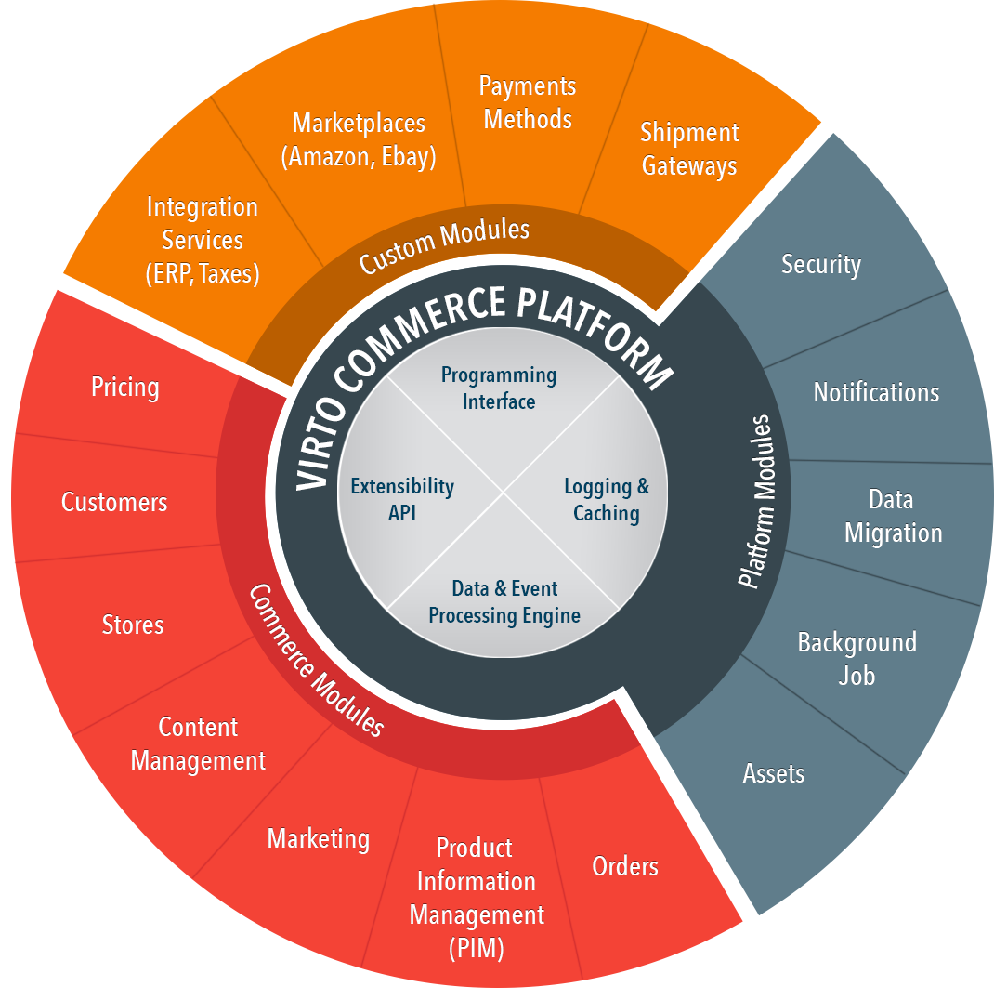

# Virto Commerce - Extensible Ecommerce Applications

Virto Commerce is set of extensible e-commerce applications. Open-Source, .NET Core, API-first, Headless, Cloud Native. 
Designed to build complex digital commerce solutions for B2B, B2C or B2B2C business, marketplaces and derived SaaS commerce platforms.

## Architecture Overview
The following diagram illustrates the high-level architecture and main areas of Virto Commerce solutions.

1. **Commerce Applications** - Extensible e-commerce applications. Like Digital Catalog, Order Management, Marketing, Page Builder, etc. 
1. **Custom Extensions** - Allow to extend API models, Persistent models and business logic in Commerce Applications. 
1. **External Commerce Applications** - 3rd party e-commerce applications and services. 
1. **Touchpoints** - Sell in your products on website, mobile application, chatbot or any through 3rd party services: Marketplace, Drop shipping, or whatever you create.
  Virto Commerce Storefront allows to manage different brands and different stores. Under the same environment and with same features.
1. **Admin SPA** - Extensible Admin SPA for Commerce Applications. Intuitive user interface lets you manage data in Commerce Applications for all channels.
1. **Integration middleware** - for Async integration with Non Real-time and legacy services.
1. **Legacy Software** - Legacy services. 

### Principles
Main principle is help development team to focus on implementation of business features and e-commerce applications and don’t worry about the common tasks, like:

* **CLEAN ARCHITECTURE** - that allows to create, customize, scale and maintain e-commerce applications.
* **SINGLE RESPONSIBILITY** – Every unit should be SIMPLE AS POSSIBLE, SO A NEW DEVELOPER can SUPPORT AND IMPROVE IT.
* **HEADLESS** – All business logic are accessible via API: Rest and GraphQL.
* **SCALABILITY** – the solution should grow up with the business.
* **SECURITY** – as Core functionality of the Platform.
* **PERSONALIZATION** – important part of B2B solutions.

## Technology Stack Used

In our work, we always try to use advanced technologies. Our decision to choose technologies described below was the result of our extensive experience working with Microsoft products.

We decided to use the following stack of technologies:

* ASP.NET Core 3.1.0 as base platform
* EF Core 3.1.0 as primary ORM
* ASP.NET Core Identity 3.1.0 for authentication and authorization
* OpenIddict 2.0.1 for OAuth authorization
* WebPack as primary design/runtime bundler and minifier
* Swashbuckle.AspNetCore.SwaggerGen for Swagger docs and UI
* SignalR Core for push notifications
* AngularJS 1.4 as primary framework for SPA
* HangFire 1.7.8 for run background tasks

## Solution Architecture Principles Overview

<a class="crosslink" href="https://virtocommerce.com/glossary/what-is-b2b-ecommerce" target="_blank">Platform and modules</a> are written using <a href="https://en.wikipedia.org/wiki/Domain-driven_design" rel="nofollow">DDD</a>, <a href="https://en.wikipedia.org/wiki/SOLID_(object-oriented_design)" rel="nofollow">SOLID</a>, <a href="https://en.wikipedia.org/wiki/Test-driven_development" rel="nofollow">Test Driven Development</a> methodologies. For a presentation layer, we use <a href="https://en.wikipedia.org/wiki/Model_View_ViewModel" rel="nofollow">MVVM</a>.

## Introduction to Virto Commerce

These Virto Commerce docs help you learn and use the Virto Commerce platform, from your local solution to optimizing complex enterprise solutions. 

* [Virto Commerce Documentation](https://virtocommerce.com/docs/latest/)
* [View on GitHub](docs/index.md)

## Comparison with 2.x

In the new version, we change primary technology stack to .NET Core for the platform application and all key modules. Eliminate known technical and architecture design issues of 2.x version (Caching, Overloaded core module, Asynchronous code, Platform Complexity, Extensibility, Performance, Authentication and Authorization)
Improve the extensibility and unification of the application. Unified architecture and good architecture practices usage reduce the training time for developers who just start to work with Virto Commerce.

Virto Commerce Platform 3 helps you increase development speed and significantly reduce time to market.

## References

* [What’s new](docs/release-information/whats-new.md)
* Deploy
  * [Deploy on Windows](docs/getting-started/deploy-from-precompiled-binaries-windows.md)
  * [Deploy on Linux](docs/getting-started/deploy-from-precompiled-binaries-linux.md)
  * [Deploy to Azure](docs/getting-started/deploy-from-precompiled-binaries-azure.md) 
  * [Deploy on MacOS](docs/getting-started/deploy-from-precompiled-binaries-MacOS.md) 
  * [Connect Storefront to Platform](docs/getting-started/connect-storefront-to-platform-v3.md)
  * [Deploy Platform 3 from source code](docs/developer-guide/deploy-from-source-code.md)
* [Getting Started](docs/user-guide/getting-started.md)
* [Update VC Platform Module from version 2.x to 3](docs/release-information/update-to-version-3/update-module-from-platform-2.0-to-version-3.md)
* Virto Commerce Documentation: https://www.virtocommerce.com/docs/latest/
* Home: https://virtocommerce.com
* Community: https://www.virtocommerce.org
* [Download Latest Release](https://github.com/VirtoCommerce/vc-platform/releases/latest)

## License

Copyright (c) Virto Solutions LTD.  All rights reserved.

Licensed under the Virto Commerce Open Software License (the "License"); you
may not use this file except in compliance with the License. You may
obtain a copy of the License at

http://virtocommerce.com/opensourcelicense

Unless required by applicable law or agreed to in writing, software
distributed under the License is distributed on an "AS IS" BASIS,
WITHOUT WARRANTIES OR CONDITIONS OF ANY KIND, either express or
implied.
