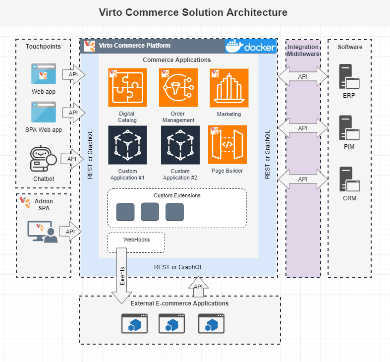

# Virto Commerce B2B Innovation Platform

[](https://virtocommerce.com/)
[](https://virtocommerce.com/interactive-demo)
[](https://docs.virtocommerce.org/)
[](https://www.virtocommerce.org/)
[](https://www.youtube.com/c/virtocommerce)


[](https://sonarcloud.io/dashboard?id=VirtoCommerce_vc-platform)
[](https://sonarcloud.io/dashboard?id=VirtoCommerce_vc-platform)
[](https://sonarcloud.io/dashboard?id=VirtoCommerce_vc-platform)
[](https://sonarcloud.io/dashboard?id=VirtoCommerce_vc-platform)

[](https://github.com/VirtoCommerce/vc-platform/releases/latest) [](https://github.com/VirtoCommerce/vc-platform/releases) [](https://virtocommerce.com/open-source-license)

Virto Commerce is an open-source platform for building extensible ecommerce applications. This includes complex digital commerce solutions for B2B, B2C, or B2B2C businesses, [marketplaces](https://virtocommerce.com/solutions/marketplace), and derived SaaS commerce platforms.

Virto Commerce architecture is based on such principles as Microservices, API-first, Cloud-native, Headless, and Advanced Extensibility.

## Principles
The main principle is to help the development teams focus on the implementation of business features without worrying about **CLEAN ARCHITECTURE**.

* **[Atomic Architecture](https://virtocommerce.com/atomic-architecture)**: Assemble your scalable ecommerce solution by selecting ready-to-use modules that serve all your digital needs.
* **[MICROSERVICES](https://virtocommerce.com/microservices)**: Every application is built from headless microservices (modules). Applications and microservices are not limited to composite applications, they can also be used for building any other application and hence are functionally independent. 
* **[API-FIRST](https://virtocommerce.com/api-ecommerce)**: Ecommerce service with the right API design. All business logic is accessible via API, either Rest or GraphQL. 
* **[CLOUD NATIVE](https://virtocommerce.com/cloud-ecommerce)**: Ecommerce service is delivered in line with the SaaS model. This adds significant benefits for your business: 
    1. *On-demand*: Use the ecommerce service as a whole or its separate components as needed.
    1. *Scalability*: In the cloud, it can be easily scaled to support peak demand and long-term business growth. 
    1. *Reliability*: Leverage a solution deployed across multiple data centres and availability zones to maximize uptime and reduce potential revenue losses.
* **[HEADLESS](https://virtocommerce.com/b2b-headless-ecommerce-solution)**: Allows an enterprise to support omnichannel journeys across traditional and digital touchpoints as well as new business models.
* **EXTENSIBILITY AND [COMPOSABILITY](https://virtocommerce.com/composable-ecommerce)**: API model, persistence model, and business logic can be extended as needed without deploying or re-deploying the solution. This provides superior business agility and keeps you and your service up to date.

## Overview
The following chart illustrates the high-level architecture and main areas of the Virto Commerce solutions:



**[Virto Commerce Platform](https://virtocommerce.com/b2b-ecommerce-platform)**: Launches the ecommerce applications in the public, hybrid, and private [cloud](https://virtocommerce.com/virto-commerce-cloud) environments. 

**Commerce Applications**: API-based, modular and extensible logical set of one or more headless microservices (modules) with a focus on the implementation of the business feature, such as Digital Catalog, Order Management, Content Management, Marketing, etc.

**Custom Extensions**: Virto Commerce Module that enables extending API model, persistent model, business logic, and admin UI within the commerce applications.

**External Commerce Applications**: Third-party ecommerce applications and services. 

**Touchpoints**: Sell your products on the website, through a mobile application, chatbot or any third-party services: marketplace, dropshipping, or any other option you create. Virto Commerce Storefront Kit allows you to manage various brands and stores in the same environment and with the same features.

**Admin SPA**: Virto Commerce has an extensible and intuitive admin user interface, which allows you to manage data within your commerce applications across all channels.

**[Integration](https://virtocommerce.com/integrations/key-ecommerce-integrations) middleware**: Asynchronous integration middleware for declarative integration with non-real-time and legacy services.

## Introduction to Virto Commerce
These Virto Commerce docs will help you learn and use the Virto Commerce platform, from your local solution to optimizing complex enterprise builds: 

* [Quick Start](https://docs.virtocommerce.org/platform/developer-guide/)
* [User Guide](https://docs.virtocommerce.org/platform/user-guide/)
* [News Digest](https://www.virtocommerce.org/c/news-digest/15)

## Technology Stack Used

In our work, we make every effort to always use advanced technologies. We picked the techs below as a result of our extensive experience in working with Microsoft products:

* .NET 10 and ASP.NET Core 10 as base platform
* EF Core as primary ORM
* ASP.NET Core Identity for authentication and authorization
* OpenIddict for OAuth authentication
* WebPack as primary design/runtime bundler and minified
* Swashbuckle.AspNetCore.SwaggerGen for Swagger docs and UI
* SignalR Core for push notifications
* AngularJS as a primary framework for SPA
* HangFire for running background tasks

## 🚀 How to Start

### Step 0. Hello World

>[!TIP]
> AI helps at every step: Ask Virto OZ for documentation-grounded answers, Install Claude Code with Context7 for instant code changes, Add llms.txt to your prompts for zero-install documentation grounding

👨‍💻 [Ai Quick Start](https://docs.virtocommerce.org/platform/developer-guide/latest/Getting-Started/ai-quick-start/)

### Step 1. Run a demo in minutes

Use **[start-local](https://github.com/VirtoCommerce/start-local)** to bring up the full stack (platform, frontend, database, Redis, Elasticsearch, Kibana) on your machine with one PowerShell command.

```powershell
$installSCript = Invoke-WebRequest -Uri "https://raw.githubusercontent.com/VirtoCommerce/start-local/dev/VirtoLocal_create_local_files.ps1" -UseBasicParsing; Set-Content -Path ".\VirtoLocal_create_local_files.ps1" -Value $installSCript.Content; .\VirtoLocal_create_local_files.ps1
```

Or

[](https://portal.azure.com/#create/Microsoft.Template/uri/https%3A%2F%2Fraw.githubusercontent.com%2FVirtoCommerce%2Fvc-platform%2Fdev%2FazureDeployPlatformAndFrontend.json)

### Step 2. Build a Proof of Concept (PoC) — extend, don't fork

Virto Commerce is designed to be extended. Start with [Configure your custom solution](https://docs.virtocommerce.org/platform/developer-guide/latest/Getting-Started/quick-start/#configure-your-custom-solution)

The Extensibility Framework lets you add entities, override services, extend APIs, and add admin UI — all without forking.

### Step 3. Build your own solution — production-ready

📖 [Deploy on Virto Cloud](https://docs.virtocommerce.org/platform/deployment-on-cloud/3.0/deploy-on-virto-cloud/)

## Virto Commerce Release Strategy
Virto Commerce ships as **modules** — independently versioned, independently deployable units. Modules combine into bundles you can pick from based on how you want to balance stability and speed.

| Release Strategy | What it is | Use it for |
|---|---|---|
| **Stable** | Quarterly release; passed full regression, E2E, and load testing | Production, new solution development (default in vc-build) |
| **Hotfix** | Bug fixes for the two most recent stable releases | Maintenance updates between stable cuts |
| **Edge** | Latest features as they land — minimal risk, maximum freshness | Early access to new capabilities, prototyping |

## Release Notes
> [!TIP]
> Open any deck via the links above, or clone the repo and open the `index.html` files directly in your browser. Add a feature to your backlog, then navigate to the Backlog screen and click **Copy as Markdown**. 

| Month | Live deck | Source notes |
| --- | --- | --- |
| **May 2026** | [📊 View deck](https://virtocommerce.github.io/vc-release-notes/2026-05/) | [Notes](https://www.virtocommerce.org/t/virto-s-release-notes-may-2026-comics-edition/849/) |
| **April 2026** | [📊 View deck](https://virtocommerce.github.io/vc-release-notes/2026-04/) | [Notes](https://www.virtocommerce.org/t/virto-s-release-notes-april-2026/847) |
| **March 2026** | [📊 View deck](https://virtocommerce.github.io/vc-release-notes/2026-03/) | [Notes](https://www.virtocommerce.org/t/virto-s-release-notes-march-2026/839) |

[Previuos Releases](https://www.virtocommerce.org/c/news-digest/15) 

## 🤝 Contributing

We welcome contributions — code, docs, bug reports, and feature ideas. The fastest path:

- 🐛 Browse [open issues](https://github.com/search?q=org%3AVirtoCommerce+is%3Aissue+is%3Aopen&type=issues) — issues labelled **good first issue** are best for newcomers.
- 💡 For larger ideas, [open a discussion](https://www.virtocommerce.org/) or an issue *before* coding so maintainers can shape the approach.
- 📝 Code fixes are always welcome and the easiest way to get familiar with [Contribution guide](https://www.virtocommerce.org/t/how-to-contribute-to-virto-commerce/459)

## References
* Documentation: https://docs.virtocommerce.org
* Home: https://virtocommerce.com
* Virto Commerce Frontend: https://docs.virtocommerce.org/storefront/
* Youtube Videos: https://www.youtube.com/c/Virtocommerce/videos
* Community: https://www.virtocommerce.org

## License

Copyright (c) Virto Solutions LTD. All rights reserved.

Licensed under the Virto Commerce Open Software License (the "License"); you
may not use this file except in compliance with the License. You may
obtain a copy of the License at http://virtocommerce.com/open-source-license

Unless required by applicable law or agreed to in written form, the software
distributed under the License is provided on an "AS IS" BASIS,
WITHOUT WARRANTIES OR CONDITIONS OF ANY KIND, either express or
implied.
