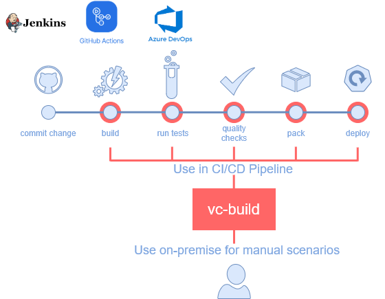

The `vc-build` contains a set of targets  that designed to automate the various build scenarios for solution based on VC and moreover thanks to builder-server agnostic nature and cross-platform support it can be integrated into any exists CI/CD pipeline with different build services, or used for manual dev scenarios.



  
## Compile
```console
vc-build compile -configuration <Debug|Release>
```
Builds .NET Core solution of vc module.

### Parameters:

  - `-configuration <Debug|Release|CONFIGURATION>` - Defines the build configuration. The default configuration for build on build server is `Release`, on the local machine is `Debug`, but you can override the build configuration settings in your project.
  

## Test
```console
vc-build test (with no args)
```
Is used to build the solution and runs all unit tests are discovered from the projects that are located in the solution folder and satisfied by this mask `*.Tests|*.Testing`.

Also, this target produces the test coverage and overall stats report.

### Example:
```console
vc-build test

Starting test execution, please wait...
A total of 1 test files matched the specified pattern.
Passed!  - Failed:     0, Passed:    48, Skipped:     0, Total:    48, Duration: 4 s - VirtoCommerce.CatalogCsvImportModule.Tests.dll (netcoreapp3.1)

Calculating coverage result...
  Generating report 'c:\Projects\VirtoCommerce\V3\Modules\vc-module-catalog-csv-import\.tmp\coverage.xml'
+-------------------------------------------+--------+--------+--------+
| Module                                    | Line   | Branch | Method |
+-------------------------------------------+--------+--------+--------+
| VirtoCommerce.CatalogCsvImportModule.Core | 77,17% | 73,38% | 72,83% |
+-------------------------------------------+--------+--------+--------+
| VirtoCommerce.CatalogCsvImportModule.Data | 56,47% | 52,15% | 56,86% |
+-------------------------------------------+--------+--------+--------+

+---------+--------+--------+--------+
|         | Line   | Branch | Method |
+---------+--------+--------+--------+
| Total   | 65,23% | 60,64% | 66,66% |
+---------+--------+--------+--------+
| Average | 66,81% | 62,76% | 64,84% |
+---------+--------+--------+--------+


═══════════════════════════════════════
Target             Status      Duration
───────────────────────────────────────
Restore            Executed        0:04
Compile            Executed        0:08
Test               Executed        1:09
───────────────────────────────────────
Total                              1:22
═══════════════════════════════════════
```

## Pack

```console
vc-build pack -configuration <Debug|Release> 
```

Builds the module solution and creates NuGet packages for all projects that have the `<IsPackable>` is set to `True` in the `.csproj` file.

The result of this target are NuGet packages that are stored by `artifacts` path of the module's root folder. 
If execute this target for platform solution the version is taken from  `Directory.Build.props`. 
If executes  this target for a module solution, the version is taken from module manifest file.

## PublishPackages

```console
vc-build publishPackages -source <SOURCE> -apiKey <API_KEY>
```
Pushes the NuGet packages are discovered in the `artifacts` folder to the server specified by `-source` parameter and publishes it. 

### Example:
```console
vc-build publishPackages -source C:\local-nuget 
```

### Parameters:

  - `-source <SOURCE>` - Specifies the server URL. NuGet identifies a UNC or local folder source and simply copies the file there instead of pushing it using HTTP. If `-source` is not set the default NuGet server `https://api.nuget.org/v3/index.json` will be used.
  - `-apiKey <API_KEY>` - The API key for the server.


## Compress 

```console
vc-build compress (with no args)
```
Pack module into a distribution bundle zip that ready to be transferred to another platform instances or published. Executing this command in a module root folder, will put resulting zip into the `artifact` folder. 

This target normally checks and excludes from the resulting zip the all files that names are enumerated in these mutiple sources: 

- [global module.ignore](https://raw.githubusercontent.com/VirtoCommerce/vc-platform/dev/module.ignore) file that is managed by VC team
- local `module.ignore` file taken from the root folder of the module
  
### Example:

```console
vc-build compress
```

Console output:

```console
═══════════════════════════════════════
Target             Status      Duration
───────────────────────────────────────
Clean              Executed        0:00
Restore            Executed        0:07
Compile            Executed        0:06
WebPackBuild       Executed        0:00
Test               Executed        0:05
Publish            Executed        0:01
Compress           Executed        0:01
───────────────────────────────────────
Total                              0:23
═══════════════════════════════════════
```