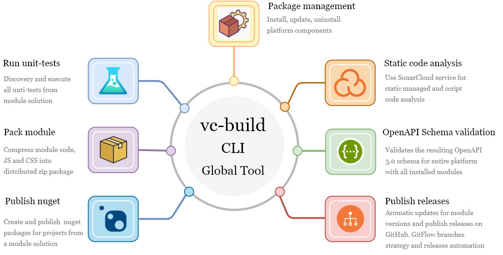

The official CLI [.NET Core GlobalTool](https://docs.microsoft.com/en-us/dotnet/core/tools/global-tools) for building, deploy releases, create and push packages, and package management for projects based on VirtoCommerce. Is powered by [nuke.build](https://nuke.build/) A cross-platform build automation system with C# DSL, that provides an approach to embrace existing IDE tooling and state where everyone in a team can manage and change the build scenarios. This allows writing build scenarios in C# and debugging them in Visual Studio. Also, along with crossplatform support, it was the best choice for us to build our own build automation solution on top of this project.

Check out [the project source code](https://github.com/VirtoCommerce/vc-build) for implementation details.



## The key features:

[Packages management](./package-management.md) 

- install, update, uninstall modules 
- install and update a platform application  

[Build automation](./build-automation.md) 

- build and bundling a module project (both managed and scripted parts)
- discovering and running all the unit tests from the solution
- creating and publishing NuGet packages for projects from your solution, this can be helpful if you intend to re-use a module's logic in another project, you will be able to quickly publish the needed version as a NuGet package. In the private or public NuGet registry
- includes the targets that allow to perform various additional quality checks such as static code analysis (currently we support out-of-the-box integration with SonarCloud )
  
[The platform cold start optimization and data migration (WIP)](./cold-start-and-data-migration.md)

- Platform run optimization (slow run on Azure case)
- Getting Idempotent SQL Scripts for all modules EF migrations


## Installation
Run this command to install `VirtoCommerce.GlobalTool` to your local computer:
```console

dotnet tool install VirtoCommerce.GlobalTool  -g

```

## Updating 
Run this command to update `VirtoCommerce.GlobalTool` to the latest version:

```console

dotnet tool update VirtoCommerce.GlobalTool -g

```

## Getting started
To use `VirtoCommerce.GlobalTool` by invoke the tool using the following command: `vc-build`

To get the all list of targets:
```console

vc-build help

```
Command output

```console
NUKE Execution Engine version 0.24.11 (Windows,.NETCoreApp,Version=v2.1)

Target with name 'help' does not exist. Available targets are:
  - ChangeVersion
  - Clean
  - Compile
  - CompleteHotfix
  - CompleteRelease
  - Compress
  - GetManifestGit
  - GrabMigrator
  - IncremenPatch
  - IncrementMinor
  - MassPullAndBuild
  - Pack
  - Publish
  - PublishManifestGit
  - PublishModuleManifest
  - PublishPackages
  - QuickRelease
  - Release
  - Restore
  - SonarQubeEnd
  - SonarQubeStart
  - StartAnalyzer
  - StartHotfix
  - StartRelease
  - SwaggerValidation
  - Test
  - UpdateManifest
  - ValidateSwaggerSchema
  - WebPackBuild

```
