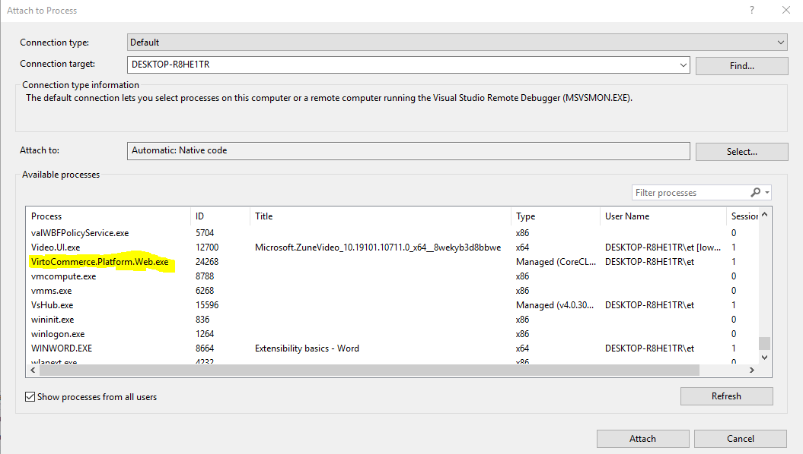

# Deploy Module from source code

[Deploy Platform from source code](deploy-from-source-code.md)

## Installation

To get started locally, follow these instructions:
1. Make fork from the latest module source code from https://github.com/VirtoCommerce/{module-name}.git
1. Clone to your local computer using `git`
1. Make sure that you have All Prerequisites installed

## Building Module
### Build Backend
To make a local build:
1. Open console
```console
cd src/VirtoCommerce.{module-name}.Web
```
2. Build 
```console
dotnet build -c Development
```

Or use Visual Studio:
1. Open VirtoCommerce.{module-name}.sln in Visual Studio 
2. Build Solution

### Build Frontend 
To make a local build:
1. Open console
```console
cd src\VirtoCommerce.{module-name}.Web
```

2. Install the dependencies
```console
npm ci
```

3. Build frontend application

```console
npm run webpack:build
```

4. Watch changes

```console
npm run webpack:watch
```

## Initial Configuration 
Add directory link to VirtoCommerce.Platform.Web\Modules, so the plarform can read module manifest and load it
```console
mklink /d VirtoCommerce.Platform.Web\Modules src\VirtoCommerce.{module-name}.Web
```

## Running
Restart the Platform to load the new module assemblies into the Platform's application process.

## Backend Debugging
* Install and run platform as described in steps above.
* Open the module solution in Visual Studio and attach the debugger to the `VirtoCommerce.Platform.Web.exe` process.



## Frontend Debugging
* Frontend supports debugging in Chrome.
* Open Developer Console
* Open Source Tab
* Navigate to `{module-name}/./Script/`


## Testing 
There is `tests` folder with suites which can be run locally.
