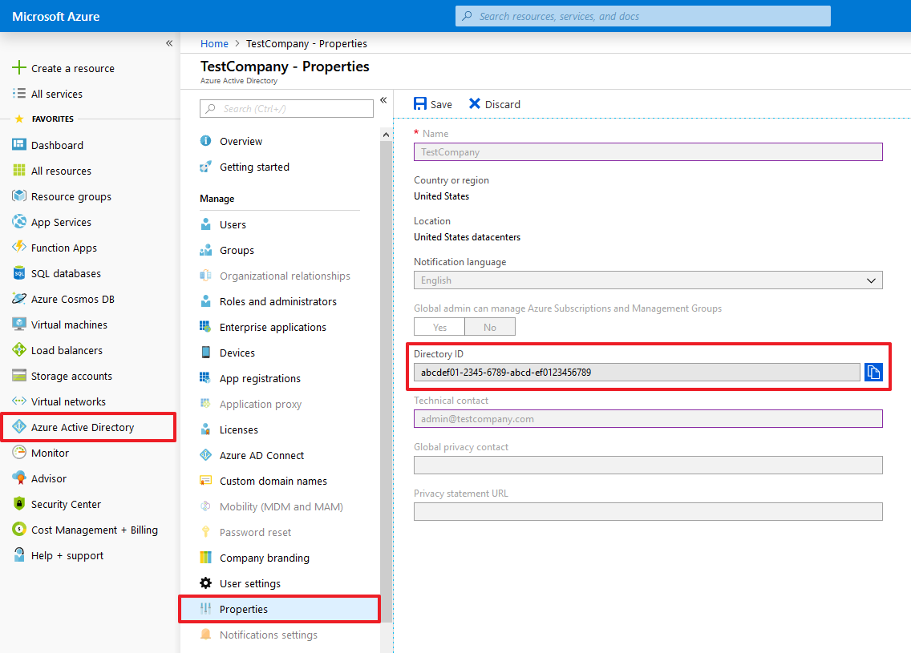
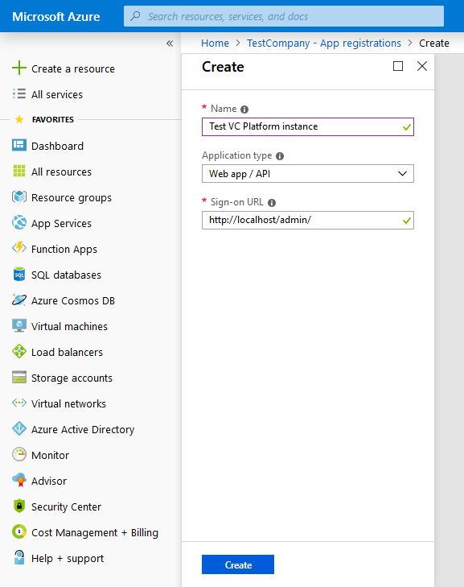
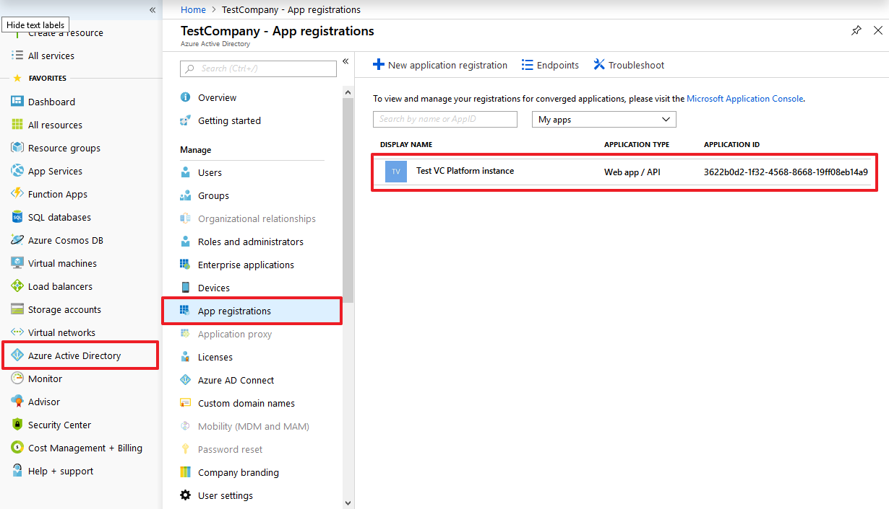
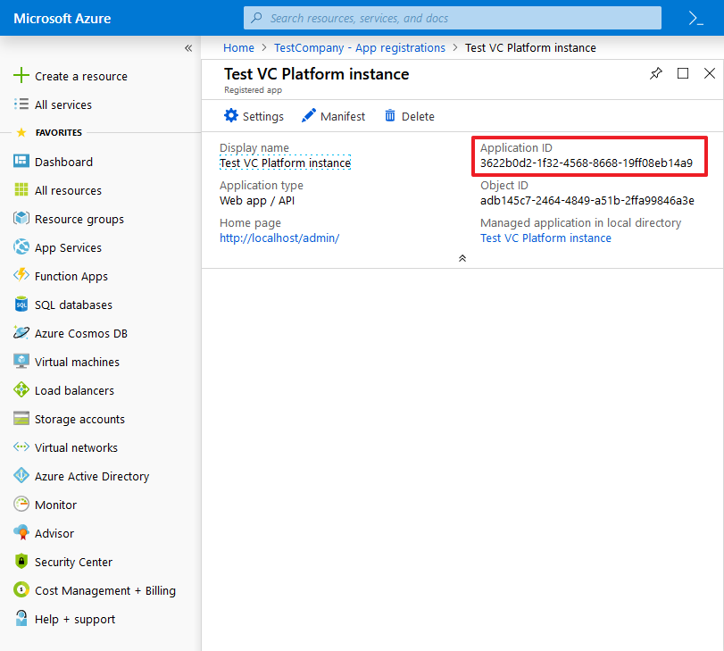
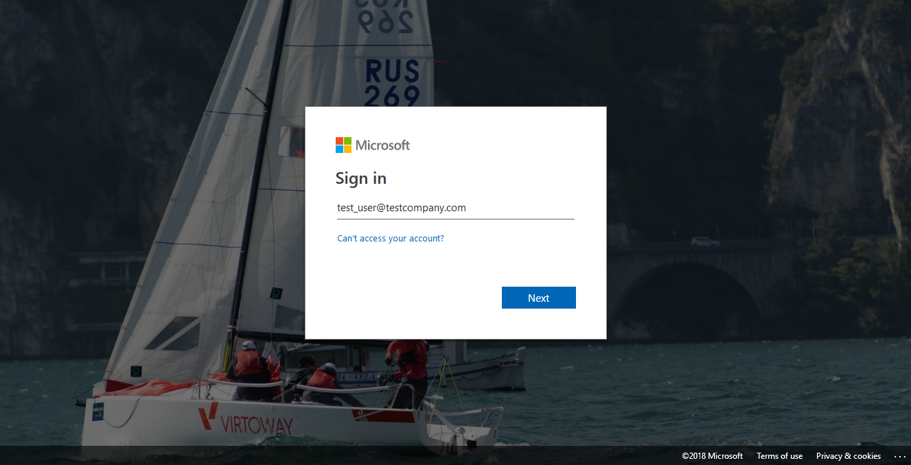
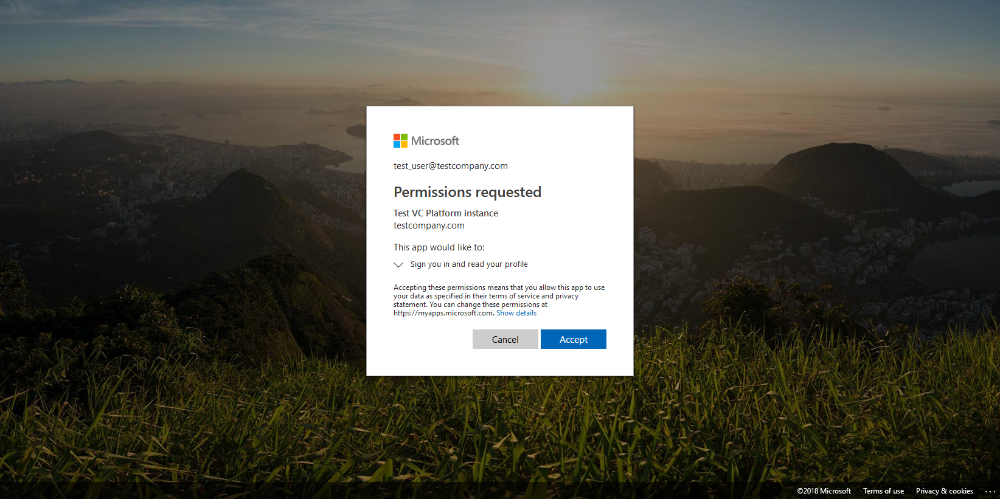
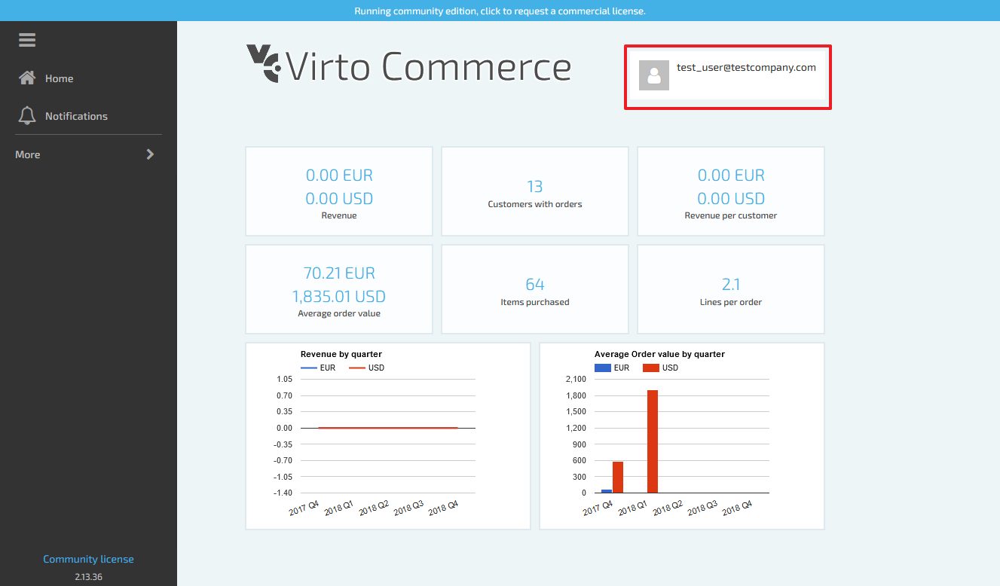
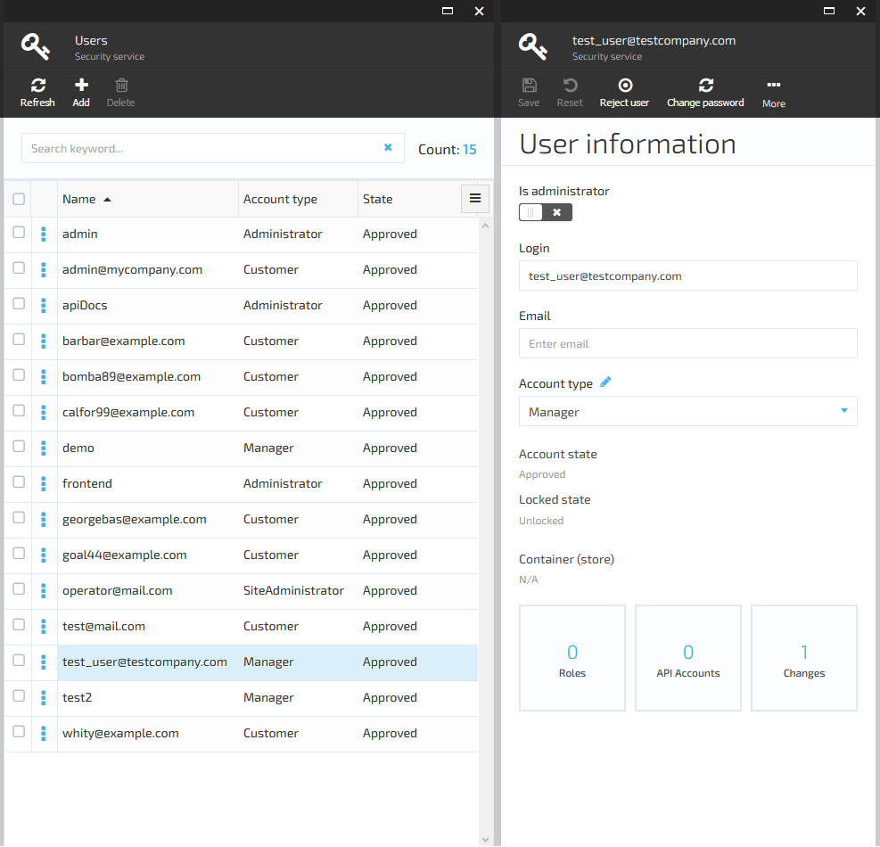

---
date: '2018-10-03'
layout: docs
published: true
title: 'Enabling authentication with Azure Active Directory'
priority: 4
---
## Introduction
By default, Virto Commerce Platform Manager authenticates users by their logins and passwords. This method has some downsides:
- Each Virto Commerce Platform account has to be created manually by administrator;
- Each user has to memorize their login and password and to enter it every time they want to sign in to Virto Commerce Platform Manager.

These issues can be solved by enabling sign-in with Azure Active Directory. This way, Virto Commerce Platform will allow users of given organization to sign in or sign up using their Azure Active Directory account.

Benefits of the authentication with Azure Active Directory:
- Virto Commerce Platform Manager will create a new Virto Commerce Platform account automatically when the owner of that account will sign in for the first time, so Virto Commerce Platform administrator won't have to create it themselves;
- Users won't have to memorize yet another password - they will use their existing Azure Active Directory account;
- Azure Active Directory uses the [single sign-on](https://en.wikipedia.org/wiki/Single_sign-on) flow. So, if the user already uses some Microsoft's services (Office 365, Outlook.com, etc.), they won't need to enter their password to sign in to Virto Commerce Platform Manager.

To implement single sign-on, Virto Commerce Platform uses the [OpenID Connect](https://openid.net/connect/) protocol implemented by the [Microsoft.Owin.Security.OpenIdConnect](https://www.nuget.org/packages/Microsoft.Owin.Security.OpenIdConnect/) library.

## Prerequisites
To enable Azure Active Directory authentication, you'll need to make sure that:
- Your organization has a valid Azure Active Directory tenant. If it doesn't, follow the [quickstart quide](https://docs.microsoft.com/en-us/azure/active-directory/fundamentals/active-directory-access-create-new-tenant) to create one.
- You have an Azure account that belongs to your organization's Azure Active Directory tenant. If you don't have an Azure account yet, you can [start a free Azure subscription](https://azure.microsoft.com/free/);
- You have a working Virto Commerce Platform instance running in Azure or on some physical server (e.g. local IIS on your computer). You'll need to modify its configuration file (**Web.config**), so make sure you have privileges to do that;
- If you want to manage roles and privileges for users signed up using Azure Active Directory, make sure you have an administrator access to Virto Commerce Platform Manager.

## Setup
To set up the Azure Active Directory-based authentication in Virto Commerce Platform Manager, you'll need to perform 4 steps:
- Find the ID of your Azure Active Directory domain;
- Register an Azure Active Directory application for your Virto Commerce Platform instance in your Azure Active Directory domain;
- Configure your Virto Commerce Platform instance to enable Azure Active Directory-based authentication;
- Try it and test if it works well.

### Find your Azure Active Directory domain ID
1. Sign in to the [Azure Portal](https://portal.azure.com/) using your Azure account.
2. Select **Azure Active Directory**. You will see the blade with the overview of your organization's Azure AD tenant.
3. On the Azure Active Directory tenant overview blade, go to **Properties**.
4. You will see the properties of your Azure Active Directory domain:
    
    Please note the **Directory ID** field - you will need its value for Virto Commerce Platform configuration.

### Register VirtoCommerce in Azure Active Directory
1. Sign in to the [Azure Portal](https://portal.azure.com/) using your Azure account.
2. Select **Azure Active Directory**. You will see the blade with the overview of your organization's Azure AD tenant.
3. Select **App registrations**.
4. On the **App registrations** blade, click the **New application registration** button.
    
5. On the App registration creation blade, provide the following information:
  - **Name**: application name for your Virto Commerce Platform instance. Note that Virto Commerce Platform users will see that name on the Azure Active Directory sign-in page.
  - **Application type**: type of your application. You should set it to **Web app / API**.
  - **Sign-on URL**: URL of the main page of your Virto Commerce Platform Manager. Please make sure to include the trailing **/** character.
    
6. Once you've filled these fields and created your application, you'll see the blade with your app registrations.
    
7. Click the application you've just created. This will open the blade with details of your application:
    
    Please note the **Application ID** field - you will need its value on the next step.

### Enable Azure Active Directory authentication for your Virto Commerce Platform instance
1. Open the **Web.config** file for your Virto Commerce Platform instance.
2. Navigate to the **configuration/appSettings** node and find the following text fragment:
```xml
<?xml version="1.0" encoding="utf-8"?>
<configuration>
    <!-- ... some parameters are skipped ... -->
    
    <appSettings>
        <!-- ... some parameters are skipped ... -->
        
        <add key="VirtoCommerce:Authentication:AzureAD.Enabled" value="false" />
        <add key="VirtoCommerce:Authentication:AzureAD.AuthenticationType" value="AzureAD"/>
        <add key="VirtoCommerce:Authentication:AzureAD.Caption" value="Azure Active Directory"/>
        <add key="VirtoCommerce:Authentication:AzureAD.ApplicationId" value="(Replace this with your Azure AD application ID, e.g. 01234567-89ab-cdef-0123-456789abcdef)" />
        <add key="VirtoCommerce:Authentication:AzureAD.TenantId" value="(Replace this with your Azure AD domain ID, e.g. abcdef01-2345-6789-abcd-ef0123456789)" />
        <add key="VirtoCommerce:Authentication:AzureAD.Instance" value="https://login.microsoftonline.com/" />
        <add key="VirtoCommerce:Authentication:AzureAD.DefaultUserType" value="Manager" />
        
        <!-- ... some parameters are skipped ... -->
    </appSettings>
    
    <!-- ... some parameters are skipped ... -->
<configuration>
```
3. Modify these settings:
  - Set the value of the **VirtoCommerce:Authentication:AzureAD.Enabled** parameter to **true**;
  - Paste the value of **Directory ID** for your Azure Active Directory domain to the value of the **VirtoCommerce:Authentication:AzureAD.TenantId** parameter;
  - Paste the value of **Application ID** from your Azure Active Directory application registration to the value of the **VirtoCommerce:Authentication:AzureAD.ApplicationId** parameter.
    
    Modified configuration should look like this:
```xml
<?xml version="1.0" encoding="utf-8"?>
<configuration>
    <!-- ... some parameters are skipped ... -->
    
    <appSettings>
        <!-- ... some parameters are skipped ... -->
        
        <add key="VirtoCommerce:Authentication:AzureAD.Enabled" value="true" />
        <add key="VirtoCommerce:Authentication:AzureAD.AuthenticationType" value="AzureAD"/>
        <add key="VirtoCommerce:Authentication:AzureAD.Caption" value="Azure Active Directory"/>
        <add key="VirtoCommerce:Authentication:AzureAD.ApplicationId" value="3622b0d2-1f32-4568-8668-19ff08eb14a9" />
        <add key="VirtoCommerce:Authentication:AzureAD.TenantId" value="abcdef01-2345-6789-abcd-ef0123456789" />
        <add key="VirtoCommerce:Authentication:AzureAD.Instance" value="https://login.microsoftonline.com/" />
        <add key="VirtoCommerce:Authentication:AzureAD.DefaultUserType" value="Manager" />
        
        <!-- ... some parameters are skipped ... -->
    </appSettings>
    
    <!-- ... some parameters are skipped ... -->
<configuration>
```

4. Restart your Virto Commerce Platform instance, so it could read and apply modified settings.

### Test signing in with Azure Active Directory

1. Navigate to the login page of your Virto Commerce Platform Manager.
    
    Note the **Sign in with Azure Active Directory** link. If the configuration is right, it should appear under the **Remember me** checkbox.
2. Try clicking that link. You will be redirected to the Microsoft sign-in page.
3. You might be asked to sign in with your Microsoft account if you did not sign in with it earlier.
    
    Provide the credentials of your Azure account. Make sure that this account belongs to the same domain where you registered the application.
4. When signing in for the first time, you'll also be asked to grant your application a permission to sign you in and read your account information. Just accept it.
    
5. If everything went well, you will be redirected back to the Virto Commerce Platform Manager.
    

Please note that the account created by signing in using Azure Active Directory is just a regular Virto Commerce Platform account. By default, it has no roles and almost no permissions. You will have to ask your Virto Commerce Platform Manager administrator to adjust permissions and roles for this account.


## Advanced details
As said before, if the user signs in with Azure Active Directory for the first time, Virto Commerce Platform will create a new account for this user. But what will happen if the Virto Commerce Platform account with the same login already exists?

To answer this question, let's dive deeper to the Azure Active Directory authentication in Virto Commerce Platform. So, here are the actions that are performed by Virto Commerce Platform when someone attempts to sign in using Azure Active Directory:
1. VC Platform forces Microsoft.Owin.Security.OpenIdConnect to check user's identity. This action starts a typical OpenID Connect flow and causes redirection to the Azure Active Directory sign-in page and back to the Virto Commerce Platform.
2. When this flow is over, Virto Commerce Platform receives an Azure Active Directory account information for the current user and extracts **upn** claim value from that information.
3. Virto Commerce Platform then attempts to find an existing Virto Commerce Platform account with login that matches that **upn** claim value. There might be 3 possible cases here:
  - The account already exists and is linked with Azure Active Directory account of signed-in user. In this case, no further actions will be performed - Virto Commerce Platform will just authenticate that user using the existing account.
  - The account already exists, but is missing the Azure Active Directory external sign-in information. In this case Virto Commerce Platform will modify that account to add external login information for the Azure Active Directory account. All other account information (including roles, permissions and personal information) will remain untouched.
  - Finally, if such account does not exist yet, VC Platform will create it and link it with Azure Active Directory account.
