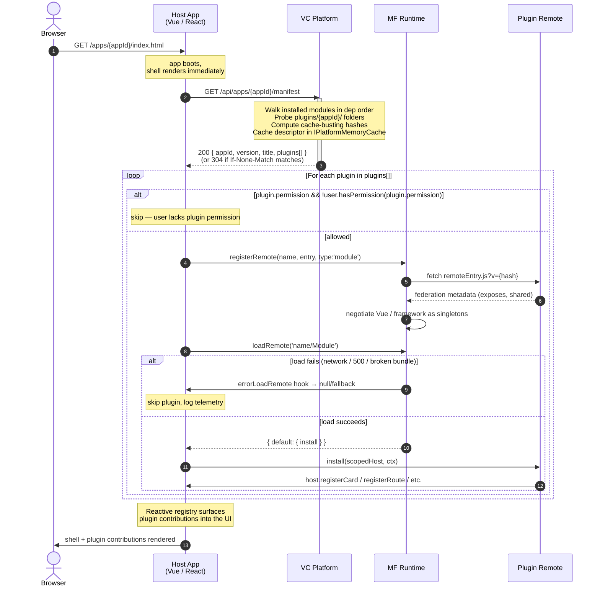
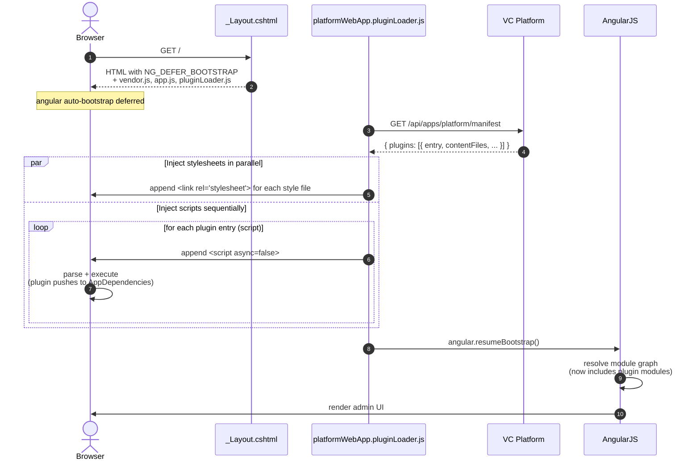

# Virto Commerce Backoffice Modularity

## Overview

The **Backoffice Modularity Framework** unifies UI modularity patterns behind one platform-side contract.
A single endpoint tells any host which plugins to load, in what order, with what cache-busting hashes.
Plugins are discovered through the existing `module.manifest` dependency graph.

Virto Commerce's backoffice has historically come in three flavours:

| Host | Tech | Status |
|---|---|---|
| Platform admin (a.k.a. "Commerce Manager") | AngularJS 1.8 | Mature, in production for years |
| VC-Shell | Vue 3 + Module Federation | Used by Marketplace and other vertical apps |
| Custom standalone SPAs | Anything (System Operations is Vue 3) | One-off pages served via the platform `<apps>` mechanism |

Until now each host had its **own** way of loading "extensions" written by other module authors:

- AngularJS uses an implicit `dist/app.js` bundle convention plus a global `AppDependencies` array for module registration.
- VC-Shell expected an undefined `POST /api/frontend-modules` endpoint that some installations stubbed out-of-tree.
- Custom SPAs were not extensible at all.

The framework treats Module Federation as the default loader for new SPAs and preserves the legacy AngularJS path **untouched** so existing modules (catalog, pricing, marketplace, hundreds of others) keep working with zero changes.

### Principles

- **One contract** — same endpoint, same response shape, regardless of host UI tech.
- **Zero-config discovery** — drop a `remoteEntry.js` in `plugins/{appId}/` inside your module and the platform finds it. No new XML element, no plugin registry, no marketplace ID.
- **Compatibility through existing module versioning** — the platform already validates `<dependency version="...">` declarations at install time. Modularity reuses that mechanism; there is no second compatibility model to learn.
- **Backwards compatible** — every existing AngularJS module works unchanged.
- **Permissioned** — plugins carry a `permission` field that the host SPA evaluates against the current user's claims before loading the remote. The host app itself is gated server-side via the existing `<permission>` element on `<app>`.


## Features

### For host application authors

- A drop-in client-side loader that calls `GET /api/apps/{appId}/manifest`, registers Module Federation remotes, and invokes each plugin's `install(host, ctx)`.
- Reactive plugin registry pattern — host UI re-renders as plugins finish loading; no need to block first paint.
- Per-app "discovery folder" override (default `plugins`) for hosts that want a different directory layout.
- Permission-aware app gating via the existing `<permission>` element on `<app>`.
- ETag-cacheable manifest endpoint — the host gets a `304 Not Modified` until the installed module set, a module version, or the caller's permission set changes.

### For plugin authors

- **No plugin manifest in the common case.** Drop `remoteEntry.js` (and chunks) in `{moduleRoot}/plugins/{appId}/` and you're done. The platform synthesizes the descriptor from convention.
- **No npm semver in `module.manifest`.** Compatibility piggy-backs on the existing `<dependency id="..." version="...">` declarations the platform already validates at install time.
- **One toolchain across hosts** (`@module-federation/vite`). Same build pipeline whether you're shipping a card to System Operations or a blade to VC-Shell.
- **Optional `plugin.json`** for the small set of cases where defaults don't fit (custom entry filename, gating by permission, extra CSS preloads).
- **First-class TypeScript**. Each host publishes a tiny `host-types.ts` snippet plugins can inline; no runtime dependency on the host package.

### For platform operators

- One configuration surface (`module.manifest`) for every kind of extension.
- Server-side ordering — plugins ship in the topologically sorted module-dependency order. Per-plugin permission gating is evaluated client-side by the host SPA (see "Permission-gated plugins"); per-app gating remains server-side via `<permission>` on `<app>`.
- Existing static-file middleware serves plugin assets at `/modules/{moduleId}/plugins/{appId}/...` with no new routes to register.
- Diagnostic endpoint: `GET /api/apps/{appId}/manifest` is the same surface admins can `curl` to introspect what plugins are loaded for any host.

## Architecture

### Building blocks

```
┌──────────────────────────────────────────────────────────────────────┐
│                         vc-platform (.NET)                           │
│                                                                      │
│   module.manifest XML                                                │
│      ├── <id>VirtoCommerce.MyHostApp</id>                            │
│      ├── <apps><app id="my-app">...</app></apps>      ← host module  │
│      └── <dependencies>                                              │
│                                                                      │
│   IAppManifestService                                                │
│      ├── walks GetInstalledModules() in dep order                    │
│      ├── for appId == "platform": probe dist/app.js + dist/style.css │
│      ├── otherwise:probe plugins/{appId}/{remoteEntry.js,plugin.json}│
│      ├── computes cache-busting hash per file (file mtime)           │
│      ├── computes descriptor.Hash = SHA1(appId+version+ordered       │
│      │       plugins[id,version,entry.hash,contentHashes,remote])    │
│      └── caches result in IPlatformMemoryCache for process lifetime  │
│            (invalidate via AppManifestCacheRegion.ExpireRegion())    │
│                                                                      │
│   AppManifestController          ←  GET /api/apps/{appId}/manifest   │
│      ├── ETag = "\"{descriptor.Hash}\""                              │
│      └── 304 / 200 / 401 / 403 / 404                                 │
│                                                                      │
│   Static file middleware (existing) serves /modules/{name}/...       │
└──────────────────────────────────────────────────────────────────────┘
                                  │
                                  │  GET .../manifest
                                  ▼
┌──────────────────────────────────────────────────────────────────────┐
│                          Host Application                            │
│                                                                      │
│   ┌─ AngularJS admin (legacy) ──────────────────────────────────┐    │
│   │  scripts/platformWebApp.pluginLoader.js                     │    │
│   │  fetch manifest → inject <script>/<link> → resumeBootstrap()│    │
│   └─────────────────────────────────────────────────────────────┘    │
│                                                                      │
│   ┌─ VC-Shell (Vue 3) ─────────────────────────────────────────┐     │
│   │  @vc-shell/mf-host                                         │     │
│   │  fetch manifest → @module-federation/runtime →             │     │
│   │  loadRemote(name/Module) → app.use(plugin, { router })     │     │
│   └────────────────────────────────────────────────────────────┘     │
│                                                                      │
│   ┌─ Custom SPA (e.g. System Operations) ──────────────────────┐     │
│   │  app/plugins/{loader.ts, registry.ts, types.ts}            │     │
│   │  fetch manifest → @module-federation/runtime →             │     │
│   │  loadRemote(name/Module) → install(host, ctx)              │     │
│   └────────────────────────────────────────────────────────────┘     │
└──────────────────────────────────────────────────────────────────────┘
                                  │
                                  │  loadRemote / dynamic <script>
                                  ▼
┌──────────────────────────────────────────────────────────────────────┐
│                         Plugin Module (.NET)                         │
│                                                                      │
│   module.manifest                                                    │
│      └── <dependency id="VirtoCommerce.MyHostApp"/>  ← discovery key │
│                                                                      │
│   plugins/{appId}/                                                   │
│      ├── remoteEntry.js          ← MF entry (built by Vite)          │
│      ├── *.js, *.css              ← chunks (hashed)                  │
│      └── plugin.json (optional)  ← override defaults                 │
│                                                                      │
│   src/index.ts:                                                      │
│      export default {                                                │
│        install(host, ctx) {                                          │
│          host.registerCard({ ... })                                  │
│        }                                                             │
│      }                                                               │
└──────────────────────────────────────────────────────────────────────┘
```

### Discovery: dependency graph is the registry

A plugin module declares the existing `<dependency>` on the host's .NET module:

```xml
<!-- vc-module-marketplace-reviews/module.manifest -->
<dependencies>
  <dependency id="VirtoCommerce.MarketplaceVendor" version="3.1000.0" />
</dependencies>
```

The platform's `IAppManifestService` walks the topologically sorted module list (already produced by `ModuleBootstrapper`) and probes each module for plugin descriptors. There's no second registry to keep in sync.

### Per-app discovery rules

| `appId` | Probe path on disk | URL served | Loader |
|---|---|---|---|
| `platform` (legacy AngularJS) | `{moduleRoot}/dist/app.js` + `dist/style.css` (existing convention — unchanged) | `/modules/{moduleId}/dist/app.js` | `legacy` (hardcoded) |
| anything else | `{moduleRoot}/plugins/{appId}/remoteEntry.js` (+ optional `plugin.json`) | `/modules/{moduleId}/plugins/{appId}/remoteEntry.js` | `module-federation` |

The host doesn't need to declare anything to opt in — defaults work. An optional `<pluginsDiscoveryFolder>` override on `<app>` exists only for hosts wanting a different directory:

```xml
<app id="my-app">
  <title>My App</title>
  <permission>my-app:access</permission>
  <pluginsDiscoveryFolder>plugins</pluginsDiscoveryFolder>   <!-- optional -->
</app>
```

### Manifest endpoint contract

```
GET /api/apps/{appId}/manifest
```

```json
{
  "appId": "vc-shell-marketplace",
  "version": "3.1000.0",
  "title": "Marketplace",
  "hash": "8DBA4F3C9E2A...",
  "plugins": [
    {
      "id": "VirtoCommerce.MarketplaceReviews",
      "version": "3.1001.0",
      "permission": null,
      "entry": {
        "type": "script",
        "path": "/modules/$(VirtoCommerce.MarketplaceReviews)/plugins/vc-shell-marketplace/remoteEntry.js",
        "hash": "8DBA4F3C"
      },
      "contentFiles": [],
      "remote": { "name": "VirtoCommerce.MarketplaceReviews", "exposed": "./Module" }
    }
  ]
}
```

**Top-level `hash`** is a strong fingerprint of the entire descriptor — covers `appId`, `version`, and the ordered `plugins[]` (id, version, entry hash, content-file hashes, federation remote coordinates). The platform surfaces it as the response ETag (`ETag: "8DBA4F3C9E2A..."`), so a client with a matching `If-None-Match` gets a `304 Not Modified` without re-sending the body. Per-file `hash` inside each entry is the cache-busting token for that single file (mtime-derived).

Each `entry` and `contentFiles` element shares the same `ContentFile` shape:

- **`type`** — `"script"` or `"style"`. Lets a client-side loader pick `<script>` vs `<link rel="stylesheet">` without parsing extensions.
- **`path`** — absolute URL served by the platform's static-file middleware.
- **`hash`** — cache-busting token. Stable until the file is rebuilt. Append as `?v={hash}`.

For `appId == "platform"`, `remote` is omitted; `entry` points at `dist/app.js` and `contentFiles[0]` at `dist/style.css` when shipped.

**Errors:** `401` unauthenticated, `403` user lacks app permission, `404` unknown `appId`.

A back-compat alias `POST /api/frontend-modules { appName }` is kept permanently for older VC-Shell consumers.

### Plugin descriptor (`plugin.json`) — optional

When the defaults aren't enough:

```ts
interface PluginManifest {
  id?: string;                                 // defaults to owning .NET module id
  version?: string;                            // defaults to parent module version
  entry?: string;                              // defaults to "remoteEntry.js"
  contentFiles?: string[];                     // optional CSS / extra assets
  remote?: { name: string; exposed: string };  // defaults to {name: <id>, exposed: "./Module"}
  permission?: string;                         // gates the whole plugin server-side
}
```

### Two loaders

| Loader | Triggered by | Mechanism |
|---|---|---|
| `module-federation` | Any `appId != "platform"`. Always. | Host registers remote via `@module-federation/runtime`, calls `loadRemote("name/exposed")`, invokes default-export `install`. |
| `legacy` | Hardcoded for `appId == "platform"`. | `<script src="dist/app.js">` + `<link href="dist/style.css">` per module in dep order; bundle pushes onto global `AppDependencies`; AngularJS DI does the rest. |

### Two manifest layers

There are **two separate manifests** in play, and confusing them is a common source of plugin-author bugs:

| Manifest | Owner | What it describes | Where it lives |
|---|---|---|---|
| `/api/apps/{appId}/manifest` (this document) | VC platform backend | Catalogue of *which* plugins are installed for the app, with permissions and file URLs | Generated by `IAppManifestService`, served by `AppManifestController` |
| `mf-manifest.json` | Plugin's Vite build | Internals of *one* plugin's remote: `exposes`, `shared`, `remotes`, type bundle | Sits next to `remoteEntry.js`, generated by `@module-federation/vite` |

The platform manifest answers "what's installed and where to fetch it"; the MF manifest answers "what does this remote expose and what does it share". The host loader uses the platform manifest to pick remotes, then `@module-federation/runtime` pulls each remote's `mf-manifest.json` for shared-dependency negotiation.

You don't normally inspect `mf-manifest.json` by hand — Vite emits it, MF runtime reads it. But it's where Chrome DevTool for MF gets its data from, and where shared-dep mismatches surface.

### Shared dependencies

Module Federation negotiates shared libraries at runtime so host and plugin use the same instance. Misconfiguration here is the most common production bug in MF — two Vue instances on the page, broken reactivity across the boundary.

#### Required singletons (any host)

```ts
// host vite.config.ts → federation({ ... })
shared: {
  vue:           { singleton: true, eager: true,  requiredVersion: "^3.4" },
  "vue-router":  { singleton: true, eager: false, requiredVersion: "^4.0" },
  "vue-i18n":    { singleton: true, eager: false, requiredVersion: "^9.0" },
  pinia:         { singleton: true, eager: false, requiredVersion: "^2.0" },
}
```

| Option | Use when |
|---|---|
| `singleton: true` | Library has runtime state (Vue reactivity, router, i18n, store). Mandatory for these. |
| `eager: true` | Critical for first paint. Loads with the host bundle. Keep eager set small (Vue only). |
| `requiredVersion` | Plugin will be rejected if host's version is incompatible. Pin to majors that MF runtime should accept. |
| `strictVersion: true` | Hard-fail on mismatch instead of warning. Use for libraries that *will* break with version drift. |

Plugins should declare the **same** shared block (so they don't bundle their own copy):

```ts
// plugin vite.config.with-api.mts → federation({ ... })
shared: {
  vue:          { singleton: true, requiredVersion: "^3.4" },
  "vue-router": { singleton: true, requiredVersion: "^4.0" },
}
```

#### Share strategy

MF 2.0 introduces `shareStrategy`:

- **`version-first`** (default) — strict compatibility: plugin uses host's version only if `requiredVersion` matches; otherwise loads its own copy. Safer.
- **`loaded-first`** — first-loaded wins regardless of version. Faster boot. Risky for libraries with breaking changes.

VC-Shell hosts use `version-first` for core libraries and `loaded-first` for utility libs. Keep this choice deliberate; default-by-omission breaks subtly when a plugin pins an incompatible major.

#### Share scopes (advanced)

Named pools for isolating incompatible versions of the same library:

```ts
shared: {
  "@apollo/client": { singleton: true, shareScope: "marketplace" }
}
```

Use only when two plugins need different majors of the same library and both need their own state. Most VC plugins don't need this — but the option is there if a migration forces it.

### Resilience: error handling and retry

A plugin's `remoteEntry.js` can fail to load (network blip, 500 from origin, broken bundle). Without explicit handling, MF rejects the `loadRemote()` promise and your reactive registry may surface a partial state — or, worse, throw and break the shell render.

#### errorLoadRemote hook

```ts
import { init } from "@module-federation/runtime";

init({
  name: "host",
  remotes: [...],
  plugins: [
    {
      name: "telemetry-plugin",
      errorLoadRemote: ({ id, error, lifecycle }) => {
        logToTelemetry({ id, error: error.message, lifecycle });
        return null;            // gracefully skip — host continues without this plugin
      },
    },
  ],
});
```

- Returning `null` from `errorLoadRemote` tells the runtime to silently skip the failed remote; host renders without it.
- Returning a fallback module is also valid (e.g. a shared "plugin unavailable" placeholder).
- `lifecycle` identifies which stage failed (`afterResolve`, `onLoad`, `loadEntry`) so telemetry can break out by phase.

#### Retry plugin

Use the official `@module-federation/retry-plugin` for transient errors:

```ts
import { retryPlugin } from "@module-federation/retry-plugin";

init({
  plugins: [
    retryPlugin({
      retryTimes: 2,
      retryDelay: 1000,
      moduleName: ["VirtoCommerce.MarketplaceReviews"],   // optional whitelist
    }),
  ],
});
```

Combine with `errorLoadRemote` for retries-then-fallback semantics.

#### Recommended baseline

`@vc-shell/mf-host` and the System Operations bootstrap should ship with retry + telemetry + fallback enabled by default; plugin authors get resilience for free.

### TypeScript integration via DTS plugin

Hosts and plugins share a typed contract through MF 2.0's DTS plugin — no manual type-file copying.

#### Host: publish types

```ts
// host vite.config.ts
federation({
  name: "host",
  exposes: { "./HostApi": "./src/host-api.ts" },
  dts: {
    generateTypes:  { compileInChildProcess: true },
    extraOptions:   { extractRemoteTypes: true },
  },
})
```

Build emits `dist/@mf-types.zip` alongside `remoteEntry.js`. Plugins fetch and unzip it transparently at dev / type-check time.

#### Plugin: consume types

```ts
// plugin vite.config.with-api.mts
federation({
  name: "myPlugin",
  remotes: { host: "host@http://.../remoteEntry.js" },
  dts: { consumeTypes: true },
})
```

Then in plugin source:

```ts
import type { HostApi } from "host/HostApi";   // virtual module — types only
```

#### Migration from "inline host-types.ts"

For System Operations and VC-Shell plugins using the inline-types pattern: it continues to work. New plugins should prefer DTS plugin — types auto-update when the host changes, no copy/paste.

### Performance: preloading

For plugins on the critical render path, hint the browser early. The platform manifest already provides absolute URLs with cache-busting hashes; emit `<link rel="preload">` in the host shell HTML for known-critical plugins.

`@module-federation/runtime` exposes `preloadRemote()`:

```ts
import { preloadRemote } from "@module-federation/runtime";

// e.g. during route resolution, before the plugin is needed
preloadRemote([{ nameOrAlias: "VirtoCommerce.MarketplaceReviews" }]);
```

Use sparingly — preload eats network budget; reserve for plugins users will hit within a few seconds of shell load.

### Vite quirk: async boundary

`@module-federation/vite` requires that the host's actual app bootstrap happens in a *separate module*, dynamically imported:

```ts
// host main.ts
import("./bootstrap");        // ← async boundary

// host bootstrap.ts
import { createApp } from "vue";
import App from "./App.vue";
createApp(App).mount("#app");
```

Without this indirection, MF runtime can't initialize shared dependencies before the host code that uses them runs. Symptom: runtime warning "Shared module is not available for eager consumption" — and / or the host bringing its own copy of Vue.

**Hosts only.** Plugins don't need this pattern; they're already dynamically imported by definition.

### Caching strategy

Three layers of caching interact: backend descriptor cache (`IPlatformMemoryCache`), HTTP response cache (`Cache-Control` header), and the per-file URL cache-buster (`?v={hash}`). Each plays a different role per environment.

| Environment | Backend cache | `Cache-Control` | Browser behaviour |
|---|---|---|---|
| **Production** | `IPlatformMemoryCache` for process lifetime | `private, must-revalidate` | First request — full body. Subsequent — 304 Not Modified (microsecond fast path). |
| **Development** | Bypassed entirely | `no-store` | Every request returns 200 with a freshly built body. Plugin rebuild is visible on next reload, no platform restart needed. |
| **After invalidation** | Rebuilt on next call | (unchanged from env) | Browser sends `If-None-Match` with old ETag → server compares against fresh `Hash` → 200 with new body if changed. |

The trigger for development bypass is `IHostEnvironment.IsDevelopment()` (i.e. `ASPNETCORE_ENVIRONMENT=Development`). Both the `AppManifestService` (skip `IPlatformMemoryCache`) and `AppManifestController` (`no-store` header, skip 304 fast path) check it independently — so partial misconfiguration still gets you mostly-fresh data.

#### Why `no-store` and not `no-cache` in dev

`no-cache` allows the browser to use a cached copy if it revalidates first; `no-store` forbids any caching whatsoever. We pick `no-store` to simplify reasoning: in dev there's literally no client-side cache to invalidate, so a plugin rebuild always shows up.

#### Why `private` (not `public`) in production

Per-app permissions (`<app permission>`) gate access at the `403` level. With `private`, only the user's browser caches the manifest — never CDN / shared proxy. The single-cached-manifest property is preserved (one descriptor per appId, all users see the same body when permitted), which makes the backend cache trivially shareable across users without per-user cache fragmentation.

#### Force-invalidate without restart

```http
POST /api/apps/manifest/invalidate
Authorization: Bearer ...   (requires platform:module:manage)
```

Returns `204`. Calls `AppManifestCacheRegion.ExpireRegion()` — the next `GET /api/apps/{appId}/manifest` rebuilds from disk for any appId. Useful for:

- An admin who drop-installed a new module bundle and wants to refresh without a full platform restart.
- An operator deploying plugin updates behind a feature flag.
- Future admin-UI button "Reload plugin manifests".


## Sequence diagram

### Module Federation Host



### Legacy AngularJS Host




## Extended scenarios

### Adding a card to the legacy AngularJS admin

You're a module author shipping a widget that should show up on the product detail blade in the catalog. Today's flow continues to work unchanged:

```javascript
// modules/VirtoCommerce.MyExt/Scripts/myExt.js
var moduleName = "virtoCommerce.myExtModule";
if (AppDependencies != undefined) {
    AppDependencies.push(moduleName);
}
angular.module(moduleName, [])
    .run(['platformWebApp.widgetService', function (widgetService) {
        widgetService.registerWidget({
            controller: 'virtoCommerce.myExtModule.myWidgetController',
            template: 'Modules/$(VirtoCommerce.MyExt)/Scripts/widgets/myWidget.tpl.html',
        }, 'itemDetail');
    }]);
```

Build with the existing webpack config so output lands at `dist/app.js` + `dist/style.css`. Declare in `module.manifest`:

```xml
<dependencies>
  <dependency id="VirtoCommerce.Catalog" version="3.x" />
</dependencies>
```

The platform's manifest endpoint synthesizes a plugin entry from convention. The `pluginLoader.js` injects script + style tags in dep order. Nothing about your module's frontend code changes.

### Adding an MF remote to VC-Shell

You're shipping a Vue 3 admin extension for a vc-shell-based marketplace app:

1. **Module manifest** — declare a dependency on the host module:
   ```xml
   <dependencies>
     <dependency id="VirtoCommerce.MarketplaceVendor" version="3.1000.0" />
   </dependencies>
   ```
2. **npm subpackage** with `vite.config.mts` using `@module-federation/vite`:
   ```ts
   federation({
     name: 'VirtoCommerce.MyMarketplaceExt',
     filename: 'remoteEntry.js',
     exposes: { './Module': './src/index.ts' },
     shared: { vue: { singleton: true } },
     dts: false,
   })
   ```
   Set Vite's `outDir` to `../plugins/vc-shell-marketplace`.
3. **Plugin entry** — default-export an `install`:
   ```ts
   import { defineAppModule } from '@vc-shell/framework';
   import * as blades from './pages';
   import * as locales from './locales';
   export default defineAppModule({ blades, locales });
   ```
4. `npm run build` — emits `plugins/vc-shell-marketplace/remoteEntry.js`.
5. Install on a platform that has the host module. The vc-shell host fetches the manifest, registers the remote, calls `app.use(plugin, { router })`, and your blades are wired in.

No `plugin.json` needed. No npm semver in your `module.manifest` — the existing `<dependency version>` is the compatibility check.

### Adding a tile to System Operations (custom SPA)

System Operations is a self-contained Vue SPA that has been adapted as an MF host. It defines a small `SystemOperationsHost` API and exposes four sections (Maintenance, Data, Diagnostics, Plugins) that plugins can attach cards to.

A reference plugin lives at [`vc-module-system-operations/samples/VirtoCommerce.SystemOperations.SampleExtension`](https://github.com/VirtoCommerce/vc-module-system-operations/tree/main/samples/VirtoCommerce.SystemOperations.SampleExtension). It contributes a "Browser Info" diagnostic card. Copy that folder, change the module id, replace the card body, build, install — done.

The plugin's `install`:

```ts
export default {
  install(host, ctx) {
    host.registerCard({
      section: 'diagnostics',
      component: BrowserInfoCard,
      props: {
        icon: 'fas fa-globe',
        iconColor: 'blue',
        title: 'Browser Info',
        description: 'Shows the current browser environment.',
      },
    });
  },
};
```

### Building your own host SPA

If you're building a brand-new admin app (not VC-Shell, not AngularJS) and want it to be extensible:

1. **Declare it in `module.manifest`:**
   ```xml
   <apps>
     <app id="my-app">
       <title>My App</title>
       <permission>my-app:access</permission>
     </app>
   </apps>
   ```
2. **Build with `@module-federation/vite`** in host mode (no `exposes`, declared `shared`).
3. **At boot, fetch** `/api/apps/my-app/manifest`.
4. **Use `@module-federation/runtime`** to register each plugin's remote.
5. **Define your `HostApi`** — what plugins can do. See the System Operations `SystemOperationsHost` for a minimal example.
6. **Reactive registry pattern** — keep plugin contributions in a `ref()`/`reactive()` so the UI re-renders as plugins finish loading.

The platform side is identical for any custom host. The only thing you implement is the boot logic + your `HostApi` shape.

### Permission-gated plugins

Plugins can declare a permission. The platform exposes the `permission` field on each plugin descriptor; the host SPA evaluates it against the current user's claims before invoking `loadRemote()`.

```json
// {moduleRoot}/plugins/system-operations/plugin.json
{ "permission": "system-operations:advanced" }
```

#### Why client-side and not server-side?

A single cached manifest is shared across all callers — one ETag for one `appId`. This makes the endpoint trivially cacheable both at HTTP/304 level and in the platform's process-lifetime `IPlatformMemoryCache`. Filtering server-side per user would multiply cache entries by user count and regress the 304 fast path that's the whole point of the manifest design.

#### Trade-off

Unauthorized users still see the **URL** of a plugin they can't load (in the manifest JSON). They simply can't usefully execute it — every host SPA loader is required to check `permission` before calling `loadRemote()`, and any plugin worth gating will also enforce its own `[Authorize]` checks server-side on the API endpoints it consumes.

This trade-off is conscious: the manifest catalog is treated like a static resource (cacheable, public-ish), while sensitive operations are gated by the .NET API layer downstream — which is where authorization should live anyway.

#### Host-app permission (unchanged)

The host app itself remains permissioned via the existing `<permission>` element on `<app>`. If the user lacks it, the manifest endpoint returns `403` — the user never receives the plugin list at all. This server-side gate is the right place for "user can't enter this admin UI" decisions; per-plugin gates are for "user is in the UI but doesn't see this card".

### Backwards Compatibility

Legacy AngularJS modules work unchanged.  No code changes, no `module.manifest` changes. The existing `dist/app.js` + `AppDependencies.push` flow is preserved exactly.


## Compatibility & versioning

### How is plugin compatibility enforced?

Through the **existing** `<dependency id="..." version="...">` mechanism in your `module.manifest`. The platform refuses to load a module whose dependency declarations aren't satisfied by the installed module set. There is no separate npm-semver compatibility model.

When you publish a new plugin version, bump your module's `<version>` in the usual way and require a sufficiently-new host module:

```xml
<id>VirtoCommerce.MyExt</id>
<version>3.2000.0</version>
<dependencies>
  <dependency id="VirtoCommerce.SystemOperations" version="3.1001.0" />
</dependencies>
```

If the operator installs your module on a platform with `VirtoCommerce.SystemOperations` 3.0.0, the platform refuses the install and surfaces a clear error before any plugin reaches the host UI.

#### Two compatibility checks at different times

There are actually **two** version-compatibility models running side by side:

| Check | Where declared | Validated when | What it gates |
|---|---|---|---|
| `<dependency id version>` (.NET) | `module.manifest` `<dependencies>` | Module install time | Whether the module is allowed to install at all on this platform |
| `compatibleWith` (frontend) | `module.manifest` `<frontendModules compatibleWith="@vc-shell/framework [2.0.0, 3.0.0)">` | Manifest fetch / plugin load time | Whether the host runtime accepts this plugin's frontend bundle |
| MF `requiredVersion` | Vite `federation({ shared: { vue: { requiredVersion: "^3.4" } } })` | `loadRemote()` shared negotiation | Whether the plugin can use the host's instance of Vue (vs bundling its own) |

The .NET check is **install-blocking** — the plugin won't even reach disk if it's not satisfied. The frontend `compatibleWith` and MF `requiredVersion` are **load-time**: a plugin built against an old framework version can be installed but will be rejected (or load with a warning) at runtime.

Module authors should treat these as different concerns:
- Bump `<dependency version>` when you depend on new C# APIs from another VC module.
- Bump `compatibleWith` when you depend on new frontend framework APIs.
- Adjust `requiredVersion` ranges in shared deps to widen / narrow Vue (etc.) compatibility.

Skipping any of these creates the classic "installs successfully, crashes at runtime" failure mode.

### What about hot reload?

Partial. After installing or updating a plugin:

- **In Development** the manifest endpoint always returns a freshly built descriptor (cache bypass + `Cache-Control: no-store`); a plugin rebuild surfaces on the next host SPA reload without a platform restart. The host SPA itself still needs a manual reload — true HMR through the manifest is not implemented.
- **In Production** the descriptor is cached for the process lifetime; force a refresh via `POST /api/apps/manifest/invalidate` or platform restart.

The MF runtime reserves a `dispose()` API for future use; it is not currently invoked, so plugin code already loaded into the host stays loaded until the host reloads. End-to-end hot reload (in-place plugin swap with state preservation) remains out of scope.

### Are there breaking changes for existing modules?
No. AngularJS modules and old VC-Shell consumers are untouched. The framework adds a new endpoint and a new optional folder convention; it removes nothing.


## FAQ

**Q: Does my module need a .NET assembly to ship a plugin?**
A: No. Frontend-only modules are supported — leave `<assemblyFile>` and `<moduleType>` commented out in `module.manifest`. The platform tolerates modules with no backend.

**Q: Can plugins import host code?**
A: Yes — through Module Federation's `shared` mechanism. Vue and any host-published runtime libraries are negotiated as singletons so plugins use the same instance the host uses. The exact list is host-specific (VC-Shell shares a fixed set documented in `@vc-shell/mf-config`; System Operations shares `vue` only).

**Q: Why no plain ESM (`import()`) loader?**
A: Module Federation gives shared-singleton negotiation for free, which is what makes "use the host's Vue, not your own" actually work. Plain `import()` would force every plugin to bundle its own framework copy, breaking reactivity across the boundary.

**Q: Why no iframe loader?**
A: All plugins are first-party (they ship inside Virto Commerce modules and go through the same install flow as the host). The trust model doesn't justify iframe overhead. If untrusted third-party plugins ever become a use case, this can be revisited.

**Q: How does this relate to the platform's existing `<apps>` element?**
A: `<apps>` declares **host apps** (the SPAs the platform serves at `/apps/{appId}/`). The modularity framework declares **plugins** (extensions to those host apps). They're complementary: a `<dependency>` on a host module + a `plugins/{appId}/` folder = a plugin for that app.

**Q: Can I see what plugins are loaded for a host without booting the UI?**
A: Yes. `curl https://your-platform/api/apps/{appId}/manifest` (with appropriate auth) returns the same JSON the host receives. Useful for smoke tests and operator diagnostics.

**Q: What's the right way to share a TypeScript contract across host and plugins?**
A: Use MF 2.0's DTS plugin (see "TypeScript integration" section). Host emits `@mf-types.zip` alongside `remoteEntry.js`; plugins consume types via the virtual module `import type { HostApi } from "host/HostApi"`. The legacy "inline `host-types.ts` snippet" pattern still works for existing plugins but new code should prefer DTS — types update automatically when the host changes, no copy/paste.

**Q: What happens if a plugin fails to load (network error, 500, broken bundle)?**
A: With the recommended `errorLoadRemote` + retry-plugin setup (see "Resilience" section), the host gracefully skips the failed plugin and renders without it; the failure is logged to telemetry. Without those hooks, the failure surfaces as a rejected promise from `loadRemote()` and may crash the reactive registry. **Always wire at least `errorLoadRemote`** in production hosts.

**Q: How do I debug "my plugin loaded but something's broken"?**
A: Install [Chrome DevTool for Module Federation](https://chromewebstore.google.com/detail/module-federation-devtool/lechgppakkbjlmoiglhleaapjijphmbg). It shows loaded remotes, shared-dependency negotiations (which version actually won), the runtime call graph, and the plugin's `mf-manifest.json`. Most "two Vue instances" / "shared X is missing" bugs are visible in one click.

**Q: Can plugins for one app be written in different frameworks?**
A: In principle yes, via `@module-federation/bridge-react` and `@module-federation/bridge-vue3`. In Virto Commerce today, all hosts and plugins are Vue 3 — Bridge isn't exercised. If you need a React plugin in a Vue host (or vice versa), it's a supported MF 2.0 path but not part of the standard VC plugin template; open an issue first.

**Q: My plugin needs a dependency that conflicts with the host's. What now?**
A: First check whether `singleton: false` (per-plugin copy) is acceptable — not all libraries break with multiple copies. If state-sharing is required, use **share scopes** (named pools — see "Shared dependencies"). If neither works, the dependency belongs in the host's shared list, which means a PR to the host's mf-config.

**Q: I rebuilt my plugin but the host still serves the old version.**
A: Depends on environment.

- **In Development** (`ASPNETCORE_ENVIRONMENT=Development`): the manifest service automatically bypasses the cache and the controller emits `Cache-Control: no-store`. Just `yarn build` → reload host SPA → new URLs → new code. Nothing else to do.
- **In Production**: the manifest descriptor is cached for the process lifetime via `IPlatformMemoryCache` — modules and plugin files are intentionally stable until restart. To force a refresh without restarting:
  - `POST /api/apps/manifest/invalidate` (requires `platform:module:manage`) — calls `AppManifestCacheRegion.ExpireRegion()`. Next manifest fetch rebuilds from disk.
  - Or call `AppManifestCacheRegion.ExpireRegion()` directly from your own admin code.

See the "Caching strategy" section under Architecture for the full table.

**Q: What's the difference between the platform manifest (`/api/apps/{appId}/manifest`) and `mf-manifest.json`?**
A: They're complementary (see "Two manifest layers"). Platform manifest = catalog of *which* plugins exist for the app (backend-generated, permission-aware, cache-busting hashes). `mf-manifest.json` = internals of *one* plugin's remote (Vite-generated, lists `exposes`, `shared`, types). Host loader uses the platform manifest to pick remotes; MF runtime then fetches each plugin's `mf-manifest.json` for shared-dependency negotiation.


## Reference links

### VC docs

- Implementation reference: [`backoffice-modularity-framework.md`](backoffice-modularity-framework.md)
- VC-Shell adapter spec: [`vc-shell-implementation.md`](vc-shell-implementation.md)
- System Operations modularity: [`vc-module-system-operations/README.md`](https://github.com/VirtoCommerce/vc-module-system-operations#plugin-extensibility-module-federation)
- Sample plugin: [`vc-module-system-operations/samples/VirtoCommerce.SystemOperations.SampleExtension/`](https://github.com/VirtoCommerce/vc-module-system-operations/tree/main/samples/VirtoCommerce.SystemOperations.SampleExtension)

### Module Federation 2.0

- Documentation hub: [module-federation.io](https://module-federation.io)
- Runtime: [@module-federation/runtime](https://www.npmjs.com/package/@module-federation/runtime)
- Vite plugin: [@module-federation/vite](https://www.npmjs.com/package/@module-federation/vite)
- DTS plugin (TypeScript): [@module-federation/dts-plugin](https://www.npmjs.com/package/@module-federation/dts-plugin)
- Retry plugin (resilience): [@module-federation/retry-plugin](https://www.npmjs.com/package/@module-federation/retry-plugin)
- Bridge (cross-framework): [@module-federation/bridge-react](https://www.npmjs.com/package/@module-federation/bridge-react), [@module-federation/bridge-vue3](https://www.npmjs.com/package/@module-federation/bridge-vue3)
- Chrome DevTool: [Module Federation DevTool](https://chromewebstore.google.com/detail/module-federation-devtool/lechgppakkbjlmoiglhleaapjijphmbg)
