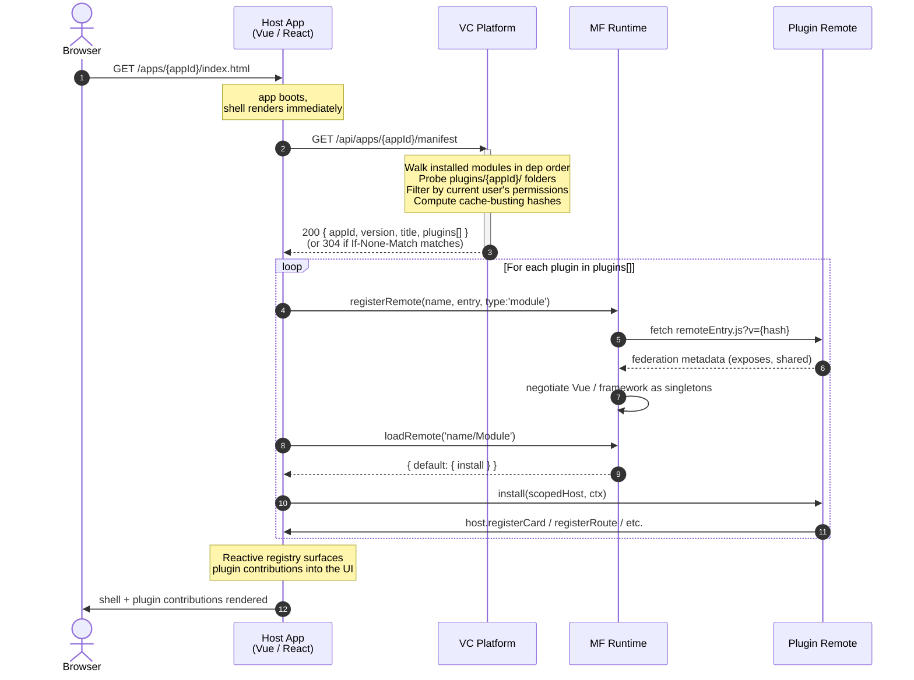
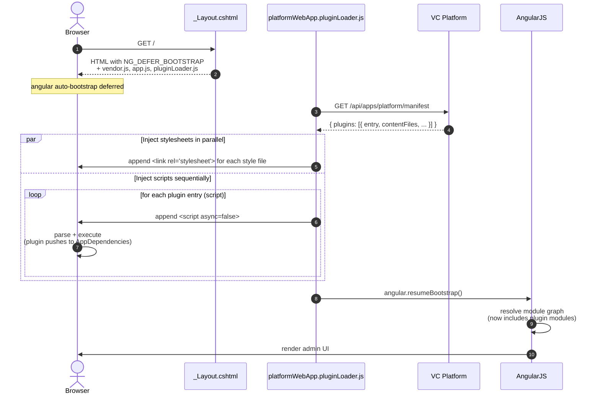

# Virto Commerce Backoffice Modularity

## Overview

The **Backoffice Modularity Framework** unifies UI modularity patterns behind one platform-side contract.
A single endpoint tells any host which plugins to load, in what order, with what cache-busting hashes.
Plugins are discovered through the existing `module.manifest` dependency graph.

Virto Commerce's backoffice has historically come in three flavours:

| Host | Tech | Status |
||||
| Platform admin (a.k.a. "Commerce Manager") | AngularJS 1.8 | Mature, in production for years |
| VC-Shell | Vue 3 + Module Federation | Used by Marketplace and other vertical apps |
| Custom standalone SPAs | Anything (System Operations is Vue 3) | One-off pages served via the platform `<apps>` mechanism |

Until now each host had its **own** way of loading "extensions" written by other module authors:

- AngularJS uses an implicit `dist/app.js` bundle convention plus a global `AppDependencies` array for module registration.
- VC-Shell expected an undefined `POST /api/frontend-modules` endpoint that some installations stubbed out-of-tree.
- Custom SPAs were not extensible at all.

The framework treats Module Federation as the default loader for new SPAs and preserves the legacy AngularJS path **untouched** so existing modules (catalog, pricing, marketplace, hundreds of others) keep working with zero changes.

### Principles

- **One contract** — same endpoint, same response shape, regardless of host UI tech.
- **Zero-config discovery** — drop a `remoteEntry.js` in `plugins/{appId}/` inside your module and the platform finds it. No new XML element, no plugin registry, no marketplace ID.
- **Compatibility through existing module versioning** — the platform already validates `<dependency version="...">` declarations at install time. Modularity reuses that mechanism; there is no second compatibility model to learn.
- **Backwards compatible** — every existing AngularJS module works unchanged.
- **Permissioned** — plugins are filtered server-side by the caller's permissions; an unauthorized user never sees the bytes.


## Features

### For host application authors

- A drop-in client-side loader that calls `GET /api/apps/{appId}/manifest`, registers Module Federation remotes, and invokes each plugin's `install(host, ctx)`.
- Reactive plugin registry pattern — host UI re-renders as plugins finish loading; no need to block first paint.
- Per-app "discovery folder" override (default `plugins`) for hosts that want a different directory layout.
- Permission-aware app gating via the existing `<permission>` element on `<app>`.
- ETag-cacheable manifest endpoint — the host gets a `304 Not Modified` until the installed module set, a module version, or the caller's permission set changes.

### For plugin authors

- **No plugin manifest in the common case.** Drop `remoteEntry.js` (and chunks) in `{moduleRoot}/plugins/{appId}/` and you're done. The platform synthesizes the descriptor from convention.
- **No npm semver in `module.manifest`.** Compatibility piggy-backs on the existing `<dependency id="..." version="...">` declarations the platform already validates at install time.
- **One toolchain across hosts** (`@module-federation/vite`). Same build pipeline whether you're shipping a card to System Operations or a blade to VC-Shell.
- **Optional `plugin.json`** for the small set of cases where defaults don't fit (custom entry filename, gating by permission, extra CSS preloads).
- **First-class TypeScript**. Each host publishes a tiny `host-types.ts` snippet plugins can inline; no runtime dependency on the host package.

### For platform operators

- One configuration surface (`module.manifest`) for every kind of extension.
- Server-side ordering and filtering — clients can't see plugins they don't have permission to use.
- Existing static-file middleware serves plugin assets at `/modules/{moduleId}/plugins/{appId}/...` with no new routes to register.
- Diagnostic endpoint: `GET /api/apps/{appId}/manifest` is the same surface admins can `curl` to introspect what plugins are loaded for any host.

## Architecture

### Building blocks

```
┌──────────────────────────────────────────────────────────────────────┐
│                         vc-platform (.NET)                           │
│                                                                      │
│   module.manifest XML                                                │
│      ├── <id>VirtoCommerce.MyHostApp</id>                            │
│      ├── <apps><app id="my-app">...</app></apps>      ← host module  │
│      └── <dependencies>                                              │
│                                                                      │
│   IAppManifestService                                                │
│      ├── walks GetInstalledModules() in dep order                    │
│      ├── for appId == "platform": probe dist/app.js + dist/style.css │
│      ├── otherwise:probe plugins/{appId}/{remoteEntry.js,plugin.json}│
│      ├── filters plugins by user permissions                         │
│      └── computes cache-busting hash per file                        │
│                                                                      │
│   AppManifestController          ←  GET /api/apps/{appId}/manifest   │
│      ├── ETag = SHA1(modules + permissions + appId)                  │
│      └── 304 / 200 / 401 / 403 / 404                                 │
│                                                                      │
│   Static file middleware (existing) serves /modules/{name}/...       │
└──────────────────────────────────────────────────────────────────────┘
                                  │
                                  │  GET .../manifest
                                  ▼
┌──────────────────────────────────────────────────────────────────────┐
│                          Host Application                            │
│                                                                      │
│   ┌─ AngularJS admin (legacy) ──────────────────────────────────┐    │
│   │  scripts/platformWebApp.pluginLoader.js                     │    │
│   │  fetch manifest → inject <script>/<link> → resumeBootstrap()│    │
│   └─────────────────────────────────────────────────────────────┘    │
│                                                                      │
│   ┌─ VC-Shell (Vue 3) ─────────────────────────────────────────┐     │
│   │  @vc-shell/mf-host                                         │     │
│   │  fetch manifest → @module-federation/runtime →             │     │
│   │  loadRemote(name/Module) → app.use(plugin, { router })     │     │
│   └────────────────────────────────────────────────────────────┘     │
│                                                                      │
│   ┌─ Custom SPA (e.g. System Operations) ──────────────────────┐     │
│   │  app/plugins/{loader.ts, registry.ts, types.ts}            │     │
│   │  fetch manifest → @module-federation/runtime →             │     │
│   │  loadRemote(name/Module) → install(host, ctx)              │     │
│   └────────────────────────────────────────────────────────────┘     │
└──────────────────────────────────────────────────────────────────────┘
                                  │
                                  │  loadRemote / dynamic <script>
                                  ▼
┌──────────────────────────────────────────────────────────────────────┐
│                         Plugin Module (.NET)                         │
│                                                                      │
│   module.manifest                                                    │
│      └── <dependency id="VirtoCommerce.MyHostApp"/>  ← discovery key │
│                                                                      │
│   plugins/{appId}/                                                   │
│      ├── remoteEntry.js          ← MF entry (built by Vite)          │
│      ├── *.js, *.css              ← chunks (hashed)                  │
│      └── plugin.json (optional)  ← override defaults                 │
│                                                                      │
│   src/index.ts:                                                      │
│      export default {                                                │
│        install(host, ctx) {                                          │
│          host.registerCard({ ... })                                  │
│        }                                                             │
│      }                                                               │
└──────────────────────────────────────────────────────────────────────┘
```

### Discovery: dependency graph is the registry

A plugin module declares the existing `<dependency>` on the host's .NET module:

```xml
<!-- vc-module-marketplace-reviews/module.manifest -->
<dependencies>
  <dependency id="VirtoCommerce.MarketplaceVendor" version="3.1000.0" />
</dependencies>
```

The platform's `IAppManifestService` walks the topologically sorted module list (already produced by `ModuleBootstrapper`) and probes each module for plugin descriptors. There's no second registry to keep in sync.

### Per-app discovery rules

| `appId` | Probe path on disk | URL served | Loader |
|||||
| `platform` (legacy AngularJS) | `{moduleRoot}/dist/app.js` + `dist/style.css` (existing convention — unchanged) | `/modules/{moduleId}/dist/app.js` | `legacy` (hardcoded) |
| anything else | `{moduleRoot}/plugins/{appId}/remoteEntry.js` (+ optional `plugin.json`) | `/modules/{moduleId}/plugins/{appId}/remoteEntry.js` | `module-federation` |

The host doesn't need to declare anything to opt in — defaults work. An optional `<pluginsDiscoveryFolder>` override on `<app>` exists only for hosts wanting a different directory:

```xml
<app id="my-app">
  <title>My App</title>
  <permission>my-app:access</permission>
  <pluginsDiscoveryFolder>plugins</pluginsDiscoveryFolder>   <!-- optional -->
</app>
```

### Manifest endpoint contract

```
GET /api/apps/{appId}/manifest
```

```json
{
  "appId": "vc-shell-marketplace",
  "version": "3.1000.0",
  "title": "Marketplace",
  "plugins": [
    {
      "id": "VirtoCommerce.MarketplaceReviews",
      "version": "3.1001.0",
      "entry": {
        "type": "script",
        "path": "/modules/$(VirtoCommerce.MarketplaceReviews)/plugins/vc-shell-marketplace/remoteEntry.js",
        "hash": "8DBA4F3C"
      },
      "contentFiles": [],
      "remote": { "name": "VirtoCommerce.MarketplaceReviews", "exposed": "./Module" }
    }
  ]
}
```

Each `entry` and `contentFiles` element shares the same `ContentFile` shape:

- **`type`** — `"script"` or `"style"`. Lets a client-side loader pick `<script>` vs `<link rel="stylesheet">` without parsing extensions.
- **`path`** — absolute URL served by the platform's static-file middleware.
- **`hash`** — cache-busting token. Stable until the file is rebuilt. Append as `?v={hash}`.

For `appId == "platform"`, `remote` is omitted; `entry` points at `dist/app.js` and `contentFiles[0]` at `dist/style.css` when shipped.

**Errors:** `401` unauthenticated, `403` user lacks app permission, `404` unknown `appId`.

A back-compat alias `POST /api/frontend-modules { appName }` is kept permanently for older VC-Shell consumers.

### Plugin descriptor (`plugin.json`) — optional

When the defaults aren't enough:

```ts
interface PluginManifest {
  id?: string;                                 // defaults to owning .NET module id
  version?: string;                            // defaults to parent module version
  entry?: string;                              // defaults to "remoteEntry.js"
  contentFiles?: string[];                     // optional CSS / extra assets
  remote?: { name: string; exposed: string };  // defaults to {name: <id>, exposed: "./Module"}
  permission?: string;                         // gates the whole plugin server-side
}
```

### Two loaders

| Loader | Triggered by | Mechanism |
||||
| `module-federation` | Any `appId != "platform"`. Always. | Host registers remote via `@module-federation/runtime`, calls `loadRemote("name/exposed")`, invokes default-export `install`. |
| `legacy` | Hardcoded for `appId == "platform"`. | `<script src="dist/app.js">` + `<link href="dist/style.css">` per module in dep order; bundle pushes onto global `AppDependencies`; AngularJS DI does the rest. |


## Sequence diagram

### Module Federation Host



### Legacy AngularJS Host




## Extended scenarios

### Adding a card to the legacy AngularJS admin

You're a module author shipping a widget that should show up on the product detail blade in the catalog. Today's flow continues to work unchanged:

```javascript
// modules/VirtoCommerce.MyExt/Scripts/myExt.js
var moduleName = "virtoCommerce.myExtModule";
if (AppDependencies != undefined) {
    AppDependencies.push(moduleName);
}
angular.module(moduleName, [])
    .run(['platformWebApp.widgetService', function (widgetService) {
        widgetService.registerWidget({
            controller: 'virtoCommerce.myExtModule.myWidgetController',
            template: 'Modules/$(VirtoCommerce.MyExt)/Scripts/widgets/myWidget.tpl.html',
        }, 'itemDetail');
    }]);
```

Build with the existing webpack config so output lands at `dist/app.js` + `dist/style.css`. Declare in `module.manifest`:

```xml
<dependencies>
  <dependency id="VirtoCommerce.Catalog" version="3.x" />
</dependencies>
```

The platform's manifest endpoint synthesizes a plugin entry from convention. The `pluginLoader.js` injects script + style tags in dep order. Nothing about your module's frontend code changes.

### Adding an MF remote to VC-Shell

You're shipping a Vue 3 admin extension for a vc-shell-based marketplace app:

1. **Module manifest** — declare a dependency on the host module:
   ```xml
   <dependencies>
     <dependency id="VirtoCommerce.MarketplaceVendor" version="3.1000.0" />
   </dependencies>
   ```
2. **npm subpackage** with `vite.config.mts` using `@module-federation/vite`:
   ```ts
   federation({
     name: 'VirtoCommerce.MyMarketplaceExt',
     filename: 'remoteEntry.js',
     exposes: { './Module': './src/index.ts' },
     shared: { vue: { singleton: true } },
     dts: false,
   })
   ```
   Set Vite's `outDir` to `../plugins/vc-shell-marketplace`.
3. **Plugin entry** — default-export an `install`:
   ```ts
   import { defineAppModule } from '@vc-shell/framework';
   import * as blades from './pages';
   import * as locales from './locales';
   export default defineAppModule({ blades, locales });
   ```
4. `npm run build` — emits `plugins/vc-shell-marketplace/remoteEntry.js`.
5. Install on a platform that has the host module. The vc-shell host fetches the manifest, registers the remote, calls `app.use(plugin, { router })`, and your blades are wired in.

No `plugin.json` needed. No npm semver in your `module.manifest` — the existing `<dependency version>` is the compatibility check.

### Adding a tile to System Operations (custom SPA)

System Operations is a self-contained Vue SPA that has been adapted as an MF host. It defines a small `SystemOperationsHost` API and exposes four sections (Maintenance, Data, Diagnostics, Plugins) that plugins can attach cards to.

A reference plugin lives at [`vc-module-system-operations/samples/VirtoCommerce.SystemOperations.SampleExtension`](https://github.com/VirtoCommerce/vc-module-system-operations/tree/main/samples/VirtoCommerce.SystemOperations.SampleExtension). It contributes a "Browser Info" diagnostic card. Copy that folder, change the module id, replace the card body, build, install — done.

The plugin's `install`:

```ts
export default {
  install(host, ctx) {
    host.registerCard({
      section: 'diagnostics',
      component: BrowserInfoCard,
      props: {
        icon: 'fas fa-globe',
        iconColor: 'blue',
        title: 'Browser Info',
        description: 'Shows the current browser environment.',
      },
    });
  },
};
```

### Building your own host SPA

If you're building a brand-new admin app (not VC-Shell, not AngularJS) and want it to be extensible:

1. **Declare it in `module.manifest`:**
   ```xml
   <apps>
     <app id="my-app">
       <title>My App</title>
       <permission>my-app:access</permission>
     </app>
   </apps>
   ```
2. **Build with `@module-federation/vite`** in host mode (no `exposes`, declared `shared`).
3. **At boot, fetch** `/api/apps/my-app/manifest`.
4. **Use `@module-federation/runtime`** to register each plugin's remote.
5. **Define your `HostApi`** — what plugins can do. See the System Operations `SystemOperationsHost` for a minimal example.
6. **Reactive registry pattern** — keep plugin contributions in a `ref()`/`reactive()` so the UI re-renders as plugins finish loading.

The platform side is identical for any custom host. The only thing you implement is the boot logic + your `HostApi` shape.

### Permission-gated plugins

Plugins can declare a permission. The platform filters plugins out **server-side** before the JSON is shipped — an unauthorized user never sees the URL of a plugin they can't use.

```json
// {moduleRoot}/plugins/system-operations/plugin.json
{ "permission": "system-operations:advanced" }
```

A user without `system-operations:advanced` calling `GET /api/apps/system-operations/manifest` will see the response without that plugin. No client-side enforcement is needed.

The host app itself can also be permissioned via the existing `<permission>` element on `<app>`. If the user lacks it, the manifest endpoint returns `403`.

### Backwards Compatibility

Legacy AngularJS modules work unchanged.  No code changes, no `module.manifest` changes. The existing `dist/app.js` + `AppDependencies.push` flow is preserved exactly.


## Compatibility & versioning

### How is plugin compatibility enforced?

Through the **existing** `<dependency id="..." version="...">` mechanism in your `module.manifest`. The platform refuses to load a module whose dependency declarations aren't satisfied by the installed module set. There is no separate npm-semver compatibility model.

When you publish a new plugin version, bump your module's `<version>` in the usual way and require a sufficiently-new host module:

```xml
<id>VirtoCommerce.MyExt</id>
<version>3.2000.0</version>
<dependencies>
  <dependency id="VirtoCommerce.SystemOperations" version="3.1001.0" />
</dependencies>
```

If the operator installs your module on a platform with `VirtoCommerce.SystemOperations` 3.0.0, the platform refuses the install and surfaces a clear error before any plugin reaches the host UI.

### What about hot reload?

Out of scope for v1. After installing or updating a plugin, the host app is reloaded and re-fetches the manifest. The MF runtime reserves a `dispose()` API for future use; it is not currently invoked.

### Are there breaking changes for existing modules?
No. AngularJS modules and old VC-Shell consumers are untouched. The framework adds a new endpoint and a new optional folder convention; it removes nothing.


## FAQ

**Q: Does my module need a .NET assembly to ship a plugin?**
A: No. Frontend-only modules are supported — leave `<assemblyFile>` and `<moduleType>` commented out in `module.manifest`. The platform tolerates modules with no backend.

**Q: Can plugins import host code?**
A: Yes — through Module Federation's `shared` mechanism. Vue and any host-published runtime libraries are negotiated as singletons so plugins use the same instance the host uses. The exact list is host-specific (VC-Shell shares a fixed set documented in `@vc-shell/mf-config`; System Operations shares `vue` only).

**Q: Why no plain ESM (`import()`) loader?**
A: Module Federation gives shared-singleton negotiation for free, which is what makes "use the host's Vue, not your own" actually work. Plain `import()` would force every plugin to bundle its own framework copy, breaking reactivity across the boundary.

**Q: Why no iframe loader?**
A: All plugins are first-party (they ship inside Virto Commerce modules and go through the same install flow as the host). The trust model doesn't justify iframe overhead. If untrusted third-party plugins ever become a use case, this can be revisited.

**Q: How does this relate to the platform's existing `<apps>` element?**
A: `<apps>` declares **host apps** (the SPAs the platform serves at `/apps/{appId}/`). The modularity framework declares **plugins** (extensions to those host apps). They're complementary: a `<dependency>` on a host module + a `plugins/{appId}/` folder = a plugin for that app.

**Q: Can I see what plugins are loaded for a host without booting the UI?**
A: Yes. `curl https://your-platform/api/apps/{appId}/manifest` (with appropriate auth) returns the same JSON the host receives. Useful for smoke tests and operator diagnostics.

**Q: What's the right way to share a TypeScript contract across host and plugins?**
A: Today, hosts publish a tiny `host-types.ts` snippet that plugin authors **inline** into their own `src/`. This avoids a runtime npm dependency on the host package. Future versions may publish proper `@vc/system-operations-host-types` etc. for plugins that want strict cross-version typing.


## Reference links

- Implementation reference: [`backoffice-modularity-framework.md`](backoffice-modularity-framework.md)
- VC-Shell adapter spec: [`vc-shell-implementation.md`](vc-shell-implementation.md)
- System Operations modularity: [`vc-module-system-operations/README.md`](https://github.com/VirtoCommerce/vc-module-system-operations#plugin-extensibility-module-federation)
- Sample plugin: [`vc-module-system-operations/samples/VirtoCommerce.SystemOperations.SampleExtension/`](https://github.com/VirtoCommerce/vc-module-system-operations/tree/main/samples/VirtoCommerce.SystemOperations.SampleExtension)
- Module Federation runtime: [@module-federation/runtime](https://www.npmjs.com/package/@module-federation/runtime)
- Module Federation Vite plugin: [@module-federation/vite](https://www.npmjs.com/package/@module-federation/vite)
