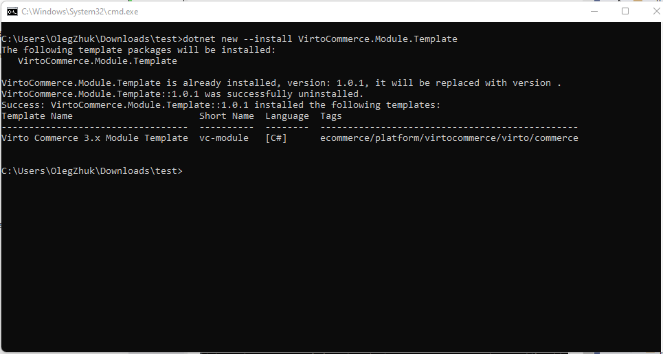
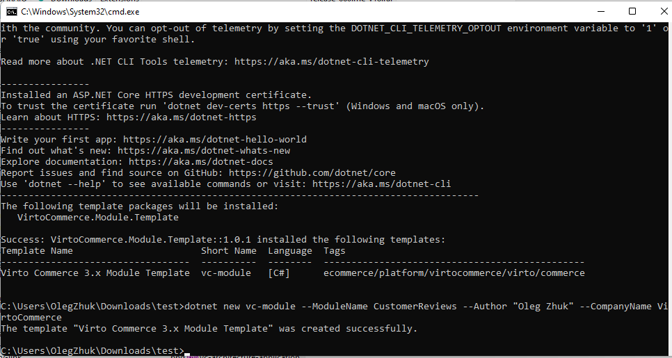
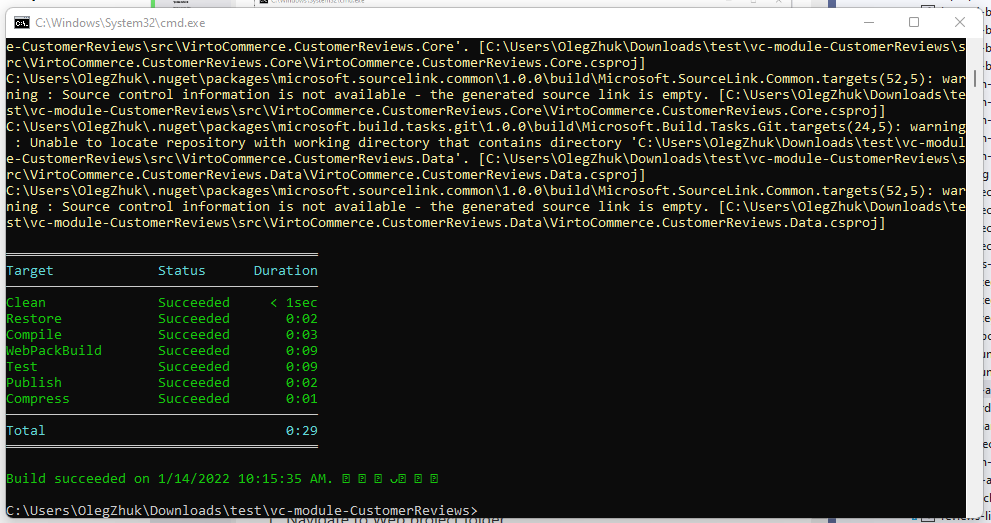

# Create a new module

The section explains how to create a new Virto Commerce module.

## Prerequisites

Virto Commerce uses `dotnet new` command to create a Virto Commerce module project based on a template.

* Open Windows PowerShell CMD 
* Run command to install Virto Commerce template.
    ```console
    dotnet new --install VirtoCommerce.Module.Template
    ```




## Create a new module project

To create a new Virto Commerce module project from template:
* Open Windows PowerShell CMD
* Navigate to your sources folder
* Run command
    ```console
    dotnet new vc-module --ModuleName CustomerReviews --Author "Jon Doe" --CompanyName VirtoCommerce 
    ```

The command calls the template engine to create the artifacts on disk based on the Virto Commerce template and options.




### Arguments 
* --ModuleName your module name and vc-module-**CustomerReviews** folder with module solution will be created
* --Author your name 
* --CompanyName your company name
* **PlatformVersion** and **PatformNuGetPackageVersion** parameters have "3.84.0". "3.84.0" default values respectively. You can skip these parameters if you use default versions.


## Build 
Virto Commerce CLI should be used to build, test and create a module package.
* Open Windows PowerShell CMD
* Navigate to your sources folder. Ex: vc-module-{module-name}.
* Run command
    ```console
    vc-build Compress
    ```



As a result you can find the module package in artifacts folder.

## Installation
The module package can be uploaded and installed to the Virto Commerce Platform.

* Open and sign-in into Virto Commerce Admin Portal.
* Select `Modules` menu and select `Advanced` section.
* Install/update module from file.
* Restart the platform.

if the module is installed properly, you should see the new module in the list of installed modules, Admin UI and Swagger API.

## See also
* [Essential modularity](../fundamentals/essential-modularity.md)
* [Virto Commerce CLI](https://virtocommerce.com/docs/CLI-tools/introduction/)
* [Virto Commerce Module Template on GitHub](https://github.com/VirtoCommerce/vc-cli-module-template)
* [VC-Build problem on .NET 5.0 and .NET 6.0](https://www.virtocommerce.org/t/vc-build-problem-on-net-5-and-net6/276)
