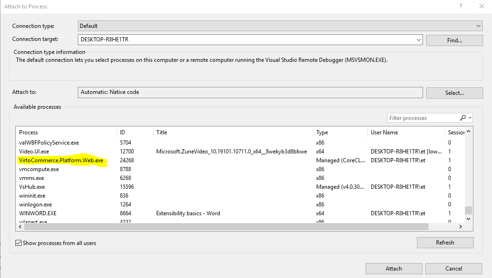
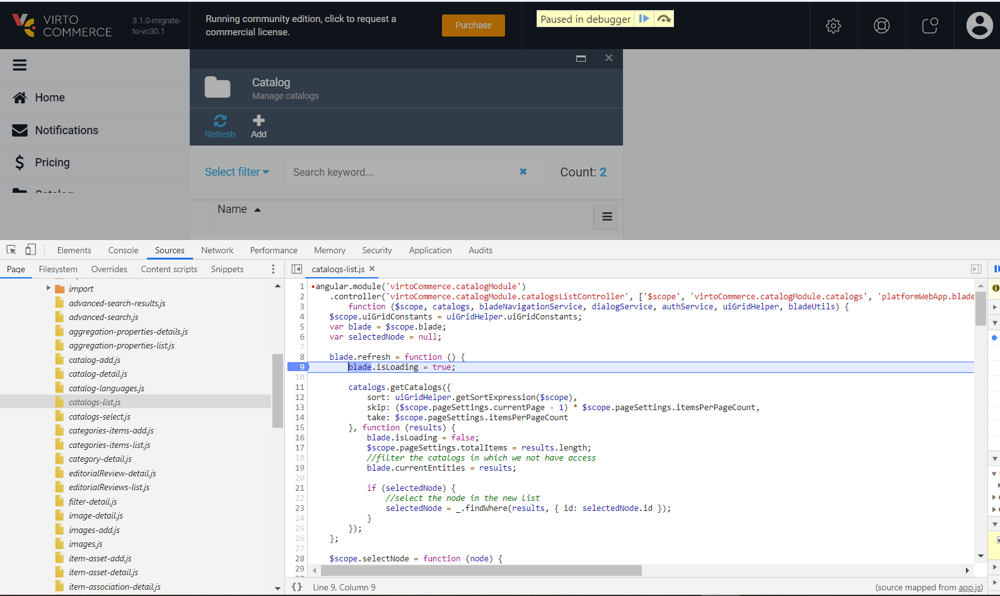

# Deploy from source code

## Installation

To get started locally, follow these instructions:

1. Make sure that you have all [Prerequisites](../getting-started/deploy-from-precompiled-binaries-windows.md#prerequisites) installed
1. Make fork from the latest platform source code from [master branch](https://github.com/VirtoCommerce/vc-platform/tree/master)
1. Clone to your local computer using `git`

```console
git clone https://github.com/VirtoCommerce/vc-platform.git
```

## Building Platform

### Build Backend

To make a local build

1. Open console
    ```console
    cd src/VirtoCommerce.Platform.Web
    ```
1. Build 
    ```console
    dotnet build
    ```

Or use Visual Studio

* Open VirtoCommerce.Platform.sln in Visual Studio
* Build Solution

### Build Frontend 

!!! note
    While building the solution the first time from the Visual Studio, npm references should be installed and webpack should be built automatically. This would be done if Web project have this nuget package added - [VirtoCommerce.BuildWebpack](https://www.nuget.org/packages/VirtoCommerce.BuildWebpack/). It adds webpack build target to the project, which create frontend bundles on initial build._
    In case of changing frontend part, explicit local build would be required to pack style/script bundles._


#### To make a local build:
1. Open console
    ```console
    cd src\VirtoCommerce.Platform.Web
    ```
2. Install the dependencies
    ```console
    npm ci
    ```
3. Build frontend application
    ```console
    npm run webpack:build
    ```
4. Watch changes
    ```console
    npm run webpack:watch
    ```

## Initial Configuration 

Don't edit `appsettings.json`, `appsettings.Development.json` or `Properties/launchSettings.json` to configure your machine. Keep your connection string and other settings in user secrets, and module folders in environment variables, as described in [Run the platform from source in Visual Studio](./run-platform-in-visual-studio.md#2-configure-your-machine-not-the-repository).

## Running

To run platform by dotnet CLI:

1. Open console
    ```console
    cd src\VirtoCommerce.Platform.Web
    ```
2. Run
    ```console
    dotnet run
    ```

`dotnet run` uses the `VirtoCommerce.Platform.Web` launch profile, which sets the `Development` environment and the `http://localhost:10645` URL. Don't pass `--no-launch-profile`: the platform then starts in the `Production` environment and ignores your user secrets and `appsettings.Development.json`.

!!! note
    you can add `--no-build` flag to speed the start, if you have compiled the solution already.

Or run from Visual Studio

* Open `VirtoCommerce.Platform.sln` 
* Set VirtoCommerce.Platform.Web as Startup Project
* Go to Debug > Start Debugging (or Press F5)

## Usage
* Open `http://localhost:10645` in the browser
* On the first request the application will create and initialize database. After that you should see the sign in page. Use the following credentials: `admin/store` to sign in

**Note:** Don't forget to change them after the first sign in.

* Open `http://localhost:10645/health` to check that the database, cache and modules report `Healthy`

## Backend Debugging

* Install and run platform as described in steps above
* Open the module solution in Visual Studio and attach the debugger to the `VirtoCommerce.Platform.Web.exe` process



## Frontend Debugging

* Frontend supports debugging in Chrome.
* Open Chrome Developer Tools (Press F12)
* Open Sources tab
* Navigate to `{module-name}/./Script/`
* Debug code



## Testing 
There is `tests` folder with suites which can be run locally.

## IDE Specific Usage

Some additional tips for developing in specific IDEs.

### Visual Studio

Restart the Platform to load the new module assemblies into the Platform's application process.

Recommend to install [WebPack Task Runner](https://marketplace.visualstudio.com/items?itemName=MadsKristensen.WebPackTaskRunner) and run webpack tasks from Visual Studio. 

To run the platform over HTTPS, trust the ASP.NET Core development certificate:

```console
dotnet dev-certs https --trust
```

Read more about [enforcing HTTPS in ASP.NET Core](https://learn.microsoft.com/aspnet/core/security/enforcing-ssl#trust-the-aspnet-core-https-development-certificate).

## Troubleshooting

See [Run the platform from source in Visual Studio](./run-platform-in-visual-studio.md#troubleshooting).
