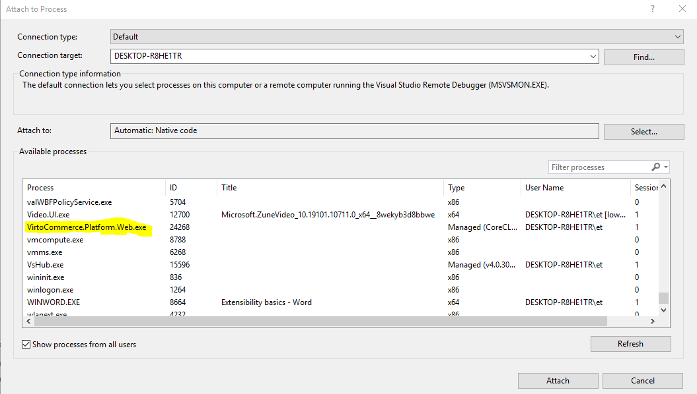
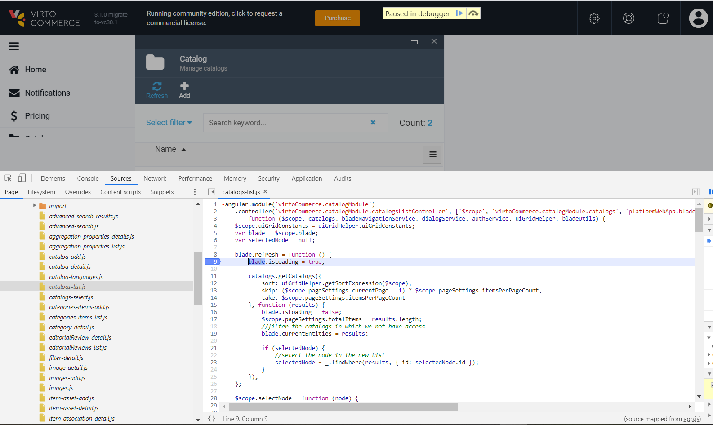

# Deploy module from source code

## Installation

To get started locally, follow these instructions:

1. Make sure that you have Virto Commerce Platform installed
1. Make fork from the latest module source code from https://github.com/VirtoCommerce/{module-name}.git
1. Clone to your local computer using `git` and and switch to the release/3.0.0 branch

```console
git clone https://github.com/VirtoCommerce/{module-name}.git
```

## Building Module

### Build Backend

### Build Backend from CLI

To make a local build:

1. Open console
    ```console
    cd src/VirtoCommerce.{module-name}.Web
    ```
2. Build 
    ```console
    dotnet build -c Development
    ```

### Build Backend from Visual Studio

1. Open VirtoCommerce.{module-name}.sln in Visual Studio 
2. Build Solution

### Build Frontend 

!!! note
    While building the solution the first time from the Visual Studio, npm references should be installed and webpack should be built automatically. This would be done if Web project have this nuget package added - [VirtoCommerce.BuildWebpack](https://www.nuget.org/packages/VirtoCommerce.BuildWebpack/). It adds webpack build target to the project, which create frontend bundles on initial build._
    In case of changing frontend part, explicit local build would be required to pack style/script bundles._

#### To make a local build

1. Open console
    ```console
    cd src\VirtoCommerce.{module-name}.Web
    ```
2. Install the dependencies
    ```console
    npm ci
    ```
3. Build frontend application
    ```console
    npm run webpack:build
    ```
4. Watch changes
    ```console
    npm run webpack:watch
    ```

## Initial Configuration 

Add directory link to VirtoCommerce.Platform.Web\Modules, so the platform can read module manifest and load it:

```console
mklink /d VirtoCommerce.Platform.Web\Modules src\VirtoCommerce.{module-name}.Web
```

## Running

Restart the Platform to load the new module assemblies into the Platform's application process.

## Backend Debugging

* Install and run platform as described in steps above.
* Open the module solution in Visual Studio and attach the debugger to the `VirtoCommerce.Platform.Web.exe` process.



## Frontend Debugging

* Frontend supports debugging in Chrome.
* Open Developer Console
* Open Source Tab
* Navigate to `{module-name}/./Script/`



## Testing 

There is `tests` folder with suites which can be run locally.
