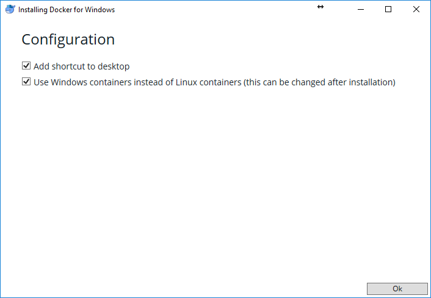
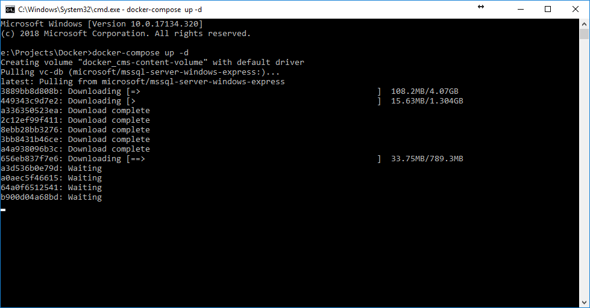

---
date: '2018-09-28'
title: 'Deploy using Docker'
layout: docs
---
## Summary

Use this guide to <a class="crosslink" href="https://virtocommerce.com/ecommerce-hosting" target="_blank">deploy</a> and configure Virto Commerce using Docker.

### Prerequisites
[Install Docker for Windows](https://docs.docker.com/docker-for-windows/install/)

Make sure to setup docker to use Windows Containers:



## Setup

Make sure you have Docker running using Windows Containers (storefront can run in linux environment, however platform still requires windows to run).

Download [docker-compose.yml](https://raw.githubusercontent.com/VirtoCommerce/vc-docker/master/windows/aspnetcore/docker-compose.yml) and save it to any folder on your computer. Then open command line (cmd.exe) and navigate to the folder you saved docker-compose.yml to and run the following command:

```
$ docker-compose up -d
```

This will download all dependencies and start 3 instances (storefront, admin and sql express).



**Note:** make sure to run "docker-compose pull" to get the latest version of the docker images from the registry if you already ran docker before.

Once images are started, open the Backend Administration Console - [http://localhost:8090](http://localhost:8090) and complete installation by following simple wizards (during these steps, platform will download default modules and give you opportunity to configure sample data, make sure to select postpone when asked to generate new API key or storefront won't work correctly).

After backend setup is completed, you can open Storefront - [http://localhost:8080](http://localhost:8080) and browse stores.

Note: you can change mapped addresses inside docker-compose.yml.

### Troubleshooting Docker Instances

To see running instances run `docker ps` 

To connect to specific instance run `docker exec -it vcdocker_vc-platform-web_1 cmd`
