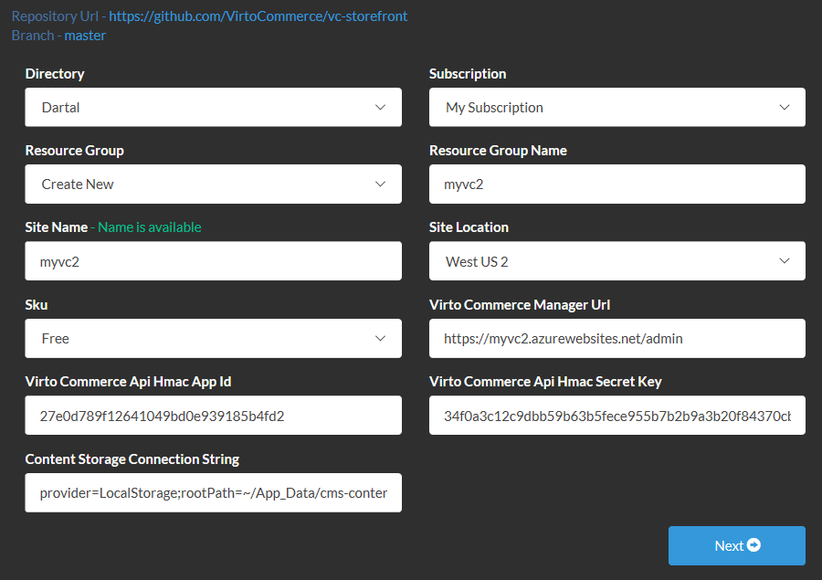
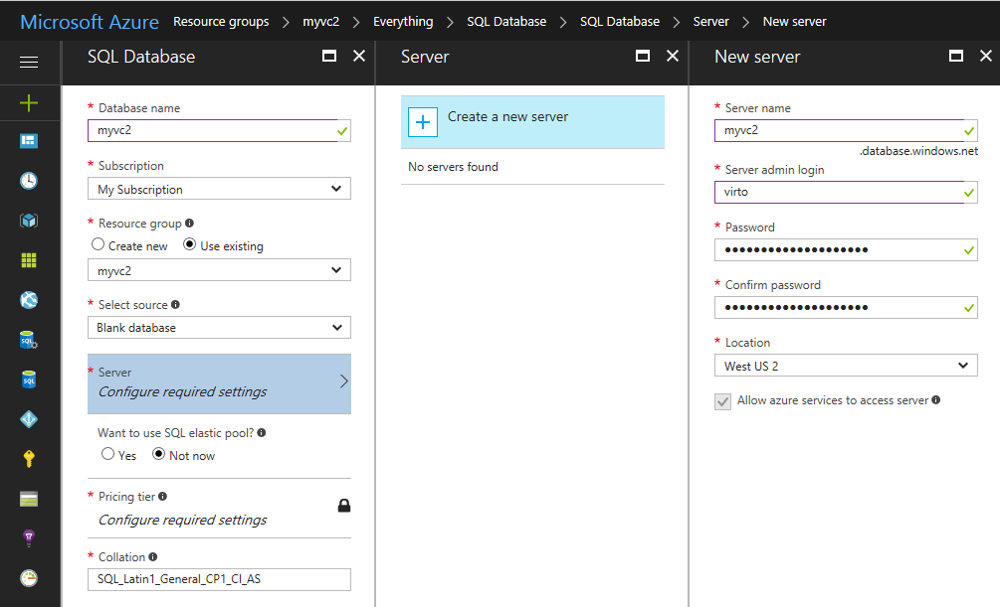
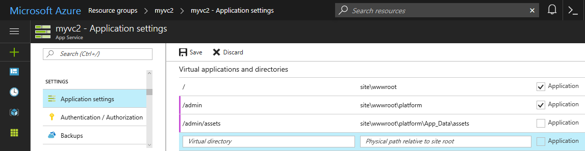

---
title: Deploy platform and storefront as a single Azure application
description: Detailed instructions described how to deploy Virto Commerce platform and storefront as a single Azure application
layout: docs
date: 2017-02-27T14:22:18.390Z
priority: 1
---

## Step-by-step guide
1. Deploy storefront from GitHub to Azure as it is described in [Deploy from GitHub to Microsoft Cloud Azure](/docs/vc2devguide/deployment/storefront-deployment/storefront-microsoft-Azure-getting-started). Use the following values on the first step of the wizard:
   * **Virto Commerce Manager Url**: `https://{{your-storefront-application-name}}.azurewebsites.net/admin`
   * **Content Storage Connection String**: `provider=LocalStorage;rootPath=~/App_Data/cms-content`


2. Open the Azure portal and add a new SQL Server and a new SQL database to the same resource group where the storefront application has been created.


3. Open the database overview in the Azure portal, click **Show database connection strings** and copy ADO.NET connection string value.

4. Download the latest precompiled release of the <a href="https://github.com/VirtoCommerce/vc-platform/releases" target="_blank">Virto Commerce Platform</a> from GitHub to your local disk: '**C:\tmp\VirtoCommerce.Platform.2.12.4.zip**'.

5. Open the Kudu debug console for the storefront Azure app service `https://{{your-storefront-application-name}}.scm.azurewebsites.net/DebugConsole` and navigate to the '**D:\home\site\wwwroot**'

6. Drag and drop your local '**C:\tmp\VirtoCommerce.Platform.2.12.4.zip**' file to the right side of the '**D:\home\site\wwwroot**' folder 

7. Rename the '**VirtoCommerce.Platform.Web**' folder to the '**platform**' with the following command:
```
mv VirtoCommerce.Platform.Web platform
```


8. Open the storefront app service and click **Application settings**

9. Add custom connection string '**CmsContentConnectionString**' with value `provider=LocalStorage;rootPath=~/../App_Data/cms-content` to use shared CMS folder between manager and storefront

10. Add custom connection string '**AssetsConnectionString**' with value `provider=LocalStorage;rootPath=~/App_Data/assets;publicUrl=http://{{your-storefront-application-url}}.azurewebsites.net/admin/assets`

11. Add SQL connection string '**VirtoCommerce**' with previously copied value. Change the server name, database name, user name and password with your values and make sure the **MultipleActiveResultSets** parameter is set to **True**:

    `Server=tcp:{{your-db-server-name}}.database.windows.net,1433;Initial Catalog={{your-db-name}};Persist Security Info=False;User ID={{your-db-user}};Password={{your-db-password}};MultipleActiveResultSets=True;Encrypt=True;TrustServerCertificate=False;Connection Timeout=300;`


12. Add new virtual **application** `/admin` with path `site\wwwroot\platform`

13. Add new virtual **directory** `/admin/assets` with path `site\wwwroot\platform\App_Data\assets`

14. Click **Save** in the toolbar and navigate to the Virto Commerce Manager, which will have the following URL: `https://{{your-storefront-application-url}}.azurewebsites.net/admin`
