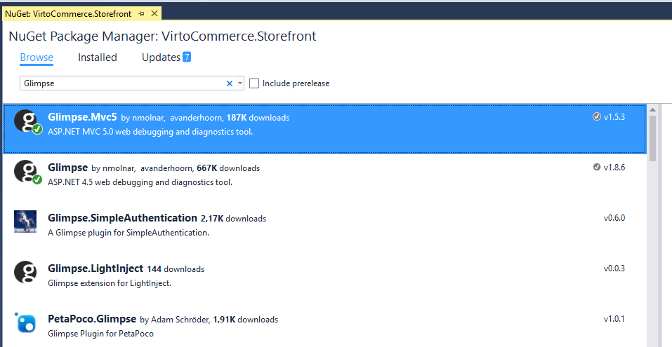
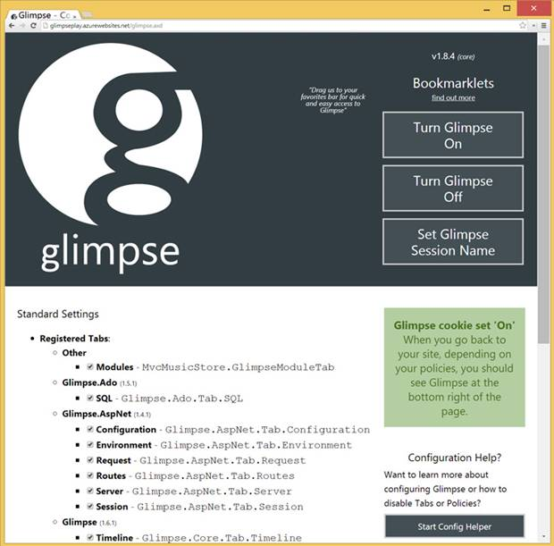
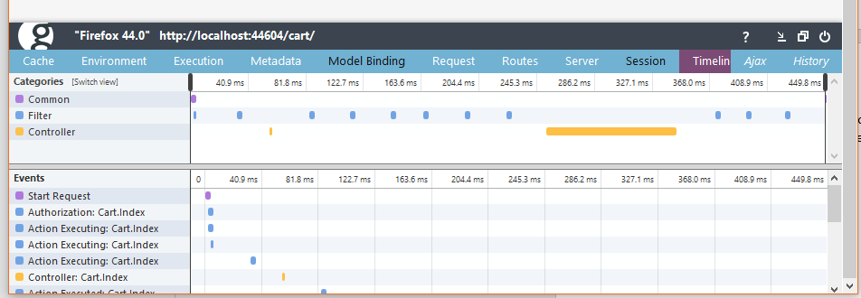
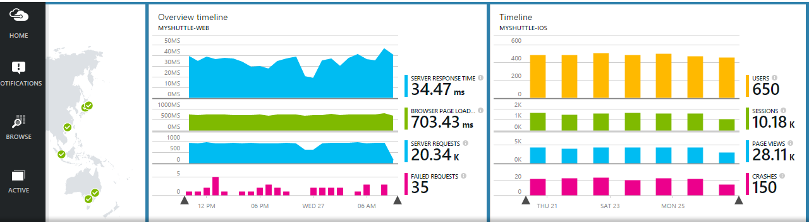

---
title: Performance Diagnostics and Monitoring
description: The article about performance monitoring and diagnostics in Virto Commerce
layout: docs
date: 2016-02-08T20:47:49.087Z
priority: 4
---
## Homepage

<a href="http://getglimpse.com" rel="nofollow">http://getglimpse.com</a>

## What is Glimpse?

Glimpse is the Diagnostics platform of the web. Providing real time diagnostics & insights to the fingertips of hundreds of thousands of developers daily. Glimpse is free, <a href="https://github.com/Glimpse/Glimpse/blob/master/license.txt" rel="nofollow">open source</a> and built by the community.

We highly recommend to use Glimpse if you are developing a custom solution based on Virocommerce Storefront because it provides:

* Visual Profiling
* Transparent Data Access
* View Rendering & Resolution
* Server Configuration
* Route Debugging
* Works For All Requests
* Improved Tracing

### Visual Profiling

Glimpse profiles key server side activities and displays the timing of each in an easy to understand Gantt chart.

### Transparent Data Access

Out of process database calls are expensive. Glimpse lists each of them, so excessive or under-performant queries can be reigned in.

### View Rendering & Resolution

Glimpse provides complete visibility into ASP.NET MVC's view resolution process, including file access paths.

### Server Configuration

Know everything necessary about a request's origin server including: timezone, patch version, process ID and pertinent **web.config** entries.

### Route Debugging

ASP.NET routing is a powerful, and sometimes maddening, feature. Glimpse cracks into the black box and exposes how routes are matched.

### Works For All Requests

Glimpse provides insights for not only the originating request, but also for AJAX requests, historical requests from the past and even requests made from other users.

### Improved Tracing

Glimpse automatically displays trace statements, eliminating the headache of digging through log files. Popular logging frameworks can be integrated with some slight configuration as well!

## Getting Started

### Step1. Download

Use NuGet from Visual Studio to install Glimpse.MVC5 and Glimpse packages to VirtoCommerce.Storefront project.

### Step 2. Enable

Glimpse is designed to be secure by default. This means that unless you tell Glimpse otherwise, you can **only** access Glimpse from *localhost*.

**Note**, this means that you won't be able to access Glimpse remotely with the default runtime policy. See <a href="http://getglimpse.com/Docs/Configuration#configuring-runtime-policy" rel="nofollow">Configuring runtime policy</a> to enable Glimpse for remote access.

Run the VirtoCommerce Storefront, navigate to /glimpse.axd and click Turn Glimpse On.

Once Glimpse is installed, /Glimpse.axd is exposed as an extension to your site. It becomes the point through which you can see how glimpse is configured and provides some helper buttons to work with Glimpse policies.

By clicking the "Turn Glimpse On" button, the page will confirm that Glimpse is now listening to requests.

### Step 3. Using

Navigate around your site and start using Glimpse. Once "Turned on" you will see glimpse appear in the bottom right hand corner of your screen.

From this point, you can mouse over the various sections or open Glimpse up fully by clicking on the Glimpse icon.

### Heads-Up Display (HUD)

The HUD is how Glimpse exposes information on every request, every page. This information is displayed at the bottom of your page.

It brings together information from both the client and server, to provide a complete picture of your request. This rich information can't be provided by browser tools. See <a href="http://getglimpse.com/Docs/Heads-up-Display" rel="nofollow">Heads Up Display</a> for more information.

### Main Panel

From the HUD, you can dive down into another level of information by clicking on the "G" in the lower right corner. When the Main Panel opens you will be presented with a series of tabs which offer a range of insights into your application.

These tabs are easily selectable and your selected tab is remembered between redirects. Additional tabs will be added to your setup when you add <a href="http://getglimpse.com/Extensions/" rel="nofollow">additional packages</a>. For more information see <a href="http://getglimpse.com/Docs/Tabs" rel="nofollow">Tabs</a>.

### Resolution

Coming soon

## Application Insights

### What is Application Insights?

<a href="https://www.visualstudio.com/features/application-insights-vs" rel="nofollow">https://www.visualstudio.com/features/application-insights-vs</a>

Application Insights monitors your web application in production for performance, availability, and usage. It helps you understand what your users do with your app, diagnose failed requests and exceptions, and find performance issues in browser, web server or backend services.

### Availability monitoring

Be the first to know when your site or service goes down. Set up tests and performance thresholds to monitor both uptime and responsiveness. Get real-time email alerts to make sure you’re never out of the loop. Learn how

### Performance management

View response times for requests, dependencies, and other metrics to better understand performance issues. Access to exceptions, events and trace logs make correlating data to find and fix root causes easier. Learn how

### Usage analytics

Understand how your app is being used and where your users are coming from. Add custom instrumentation to see which areas of your app get the most usage, and where you should invest next. Learn how

## Getting Started

### Step 1. Download

Use NuGet from Visual Studio to install AppInsight packages to VirtoCommerce.Storefront project.

### Step 2. Enable

### Step 3. Using
