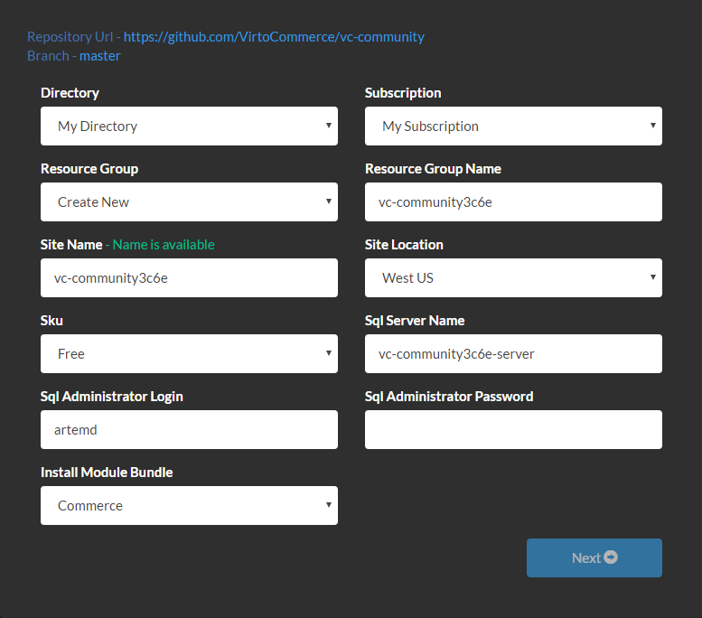
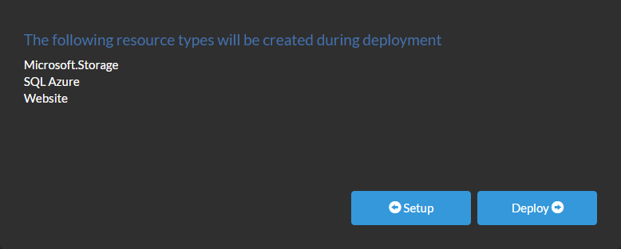
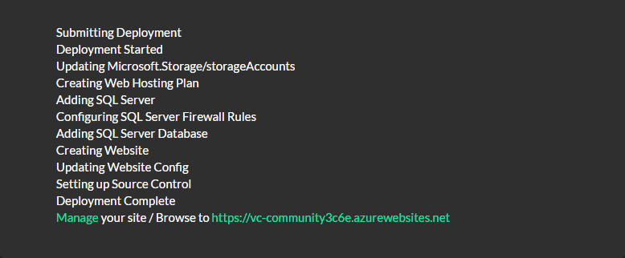
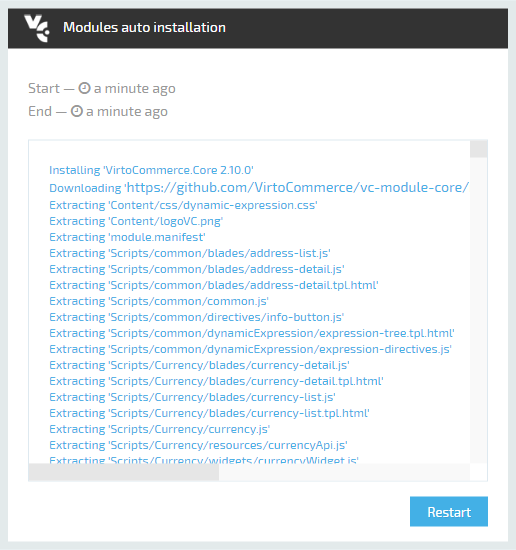
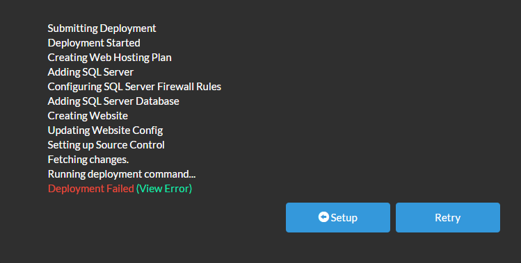

---
aliases:
  - docs/vc2devguide/deployment/platform-deployment/deploy-from-github-to-microsoft-cloud-azure
date: '2017-08-31'
layout: docs
title: 'Deploy Platform from GitHub to Microsoft Azure'

---
## Summary

You can <a class="crosslink" href="https://virtocommerce.com/ecommerce-hosting" target="_blank">deploy</a> the latest version of VirtoCommerce Platform to Azure with just a few clicks.

## Step-by-step guide

* Open the code repository <a href="https://github.com/VirtoCommerce/vc-community" rel="nofollow">https://github.com/VirtoCommerce/vc-community</a>
* Scroll to the end of the page and click the **Deploy to Azure** button
  
  You will see the first page of the deployment wizard:
  
* **Directory** and **Subscription** options define which Azure subscription will be used.
* **Resource group**В option allows you to create a new AzureВ resource group or select an existing one from the list. The new SQL server and the new website will be added to this group.
* **Resource Group Name**В is the name of the new resource group.
* **Site Name** is the part of the new website URL: http://**site-name**.azurewebsites.net. By default, the site name is generated by adding 4 random characters to the Git repository name.
* **Sql Server Name** is the name of the new SQL server.
* **Sql Administrator Login** is the login for the new SQL server administrator.
* **Sql Administrator Password**В is the password for the new SQL server administrator.В Password must be at least 8 characters long and contain characters from three of the following four categories:В     * Latin uppercase letters (A through Z)
  * Latin lowercase letters (a through z)
  * Base 10 digits (0 through 9)
  * Non-alphanumeric characters such as: exclamation point (!), dollar sign ($), number sign (#), or percent (%).
* **Install Module Bundle** option defines which modules to install automatically after deployment.
  * If you select **Commerce**В then all modules required for creating an eCommerce application will be installed.
  * If you select **None** then no modules will be installed automatically and you will get the clean platform.
* Enter the password for SQL Server administrator and click **Next** button.
* On the second page of the deployment wizard click **Deploy** button.
  
  The deployment process will take about 3 minutes.
  
* You can now browse to the VirtoCommerce Platform, the login is: **admin**, and password is **store**.
* If you selected to install the Commerce bundle, it will be installed automatically after you have signed in:
  
* Click **Restart** button to activate installed modules.

## Troubleshooting

Sometimes the deployment process fails while **Running deployment command**:

Clicking the green (View Error) link will not explain anything, you should go to Azure Portal and check the deployment log.

Open Web Apps and select your recenly created web app.Click on **Active Deployment** widget.In the **Deployments** list click on the failed deployment.In the **Deployment Details** click **View Log**.The most frequent error is related to downloading packages from NuGet. This is a temporary issue and in most cases clicking **Redeploy** in Deployment Details blade leads to successful deployment.

## Updating to the latest version

Open Web App settings.OpenВ **Deployment source**.Click **Sync** button in the toolbar.

This operation will download the latest source code from GitHub repository, compile it, copy the result to the wwwroot directory and restart the web site.
