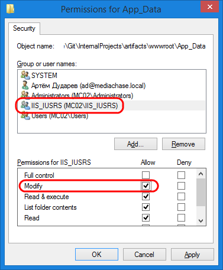
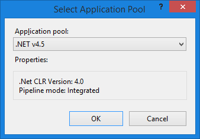

---
aliases:
  - docs/vc2devguide/deployment/platform-deployment/deploy-web-applications-to-dedicated-server
date: '2017-08-31'
layout: docs
title: 'Deploy Platform from precompiled binaries'

---
## Summary

Use this guide to <a class="crosslink" href="https://virtocommerce.com/ecommerce-hosting" target="_blank">deploy</a> and configure precompiled Virto Commerce Platform.

## Prerequisites

* Windows Server 2008 R2 SP1 or later
* Internet Information Services 7 or later
* Microsoft .NET Framework 4.6.1
* Microsoft SQL Server 2008 or later

## Downloading the precomplied binaries

Navigate to the <a href="https://github.com/VirtoCommerce/vc-platform/releases" rel="nofollow">Releases section of Virto Commerce Platform in GitHub.</a>

You will find **VirtoCommerce.Platform.2.x.x.zip** file. In this file the site has already been built and can be run without additional compilation. It does not includes all the source code.

Unpack follow zip to local disk to path **C:\vc-platform**. In result you should get the folder which contains platform precompiled code.

### Upload files to the web server

Upload all data from **C:\vc-platform** folder to the web server in IIS application root directory **C:\inetpub\wwwroot\admin**

## Setup

### Configure connection strings

* Open the **Web.config** file in a text editor.
* In the **connectionStrings** section add or change **add** nodes:
  * **VirtoCommerce**: parameters for  SQL server database. Provided user should have permission to create new database.
    ```
    <add name="VirtoCommerce" connectionString="Data Source={SQL Server URL};Initial Catalog={Database name};Persist Security Info=True;User ID=virto;Password=virto;MultipleActiveResultSets=True;Connect Timeout=420" providerName="System.Data.SqlClient" />
    ```
  * **SearchConnectionString**: type of search engine and its parameters.
    ```
    <add name="SearchConnectionString" connectionString="provider={Provider name};{additional parameters};scope={common name (prefix) of all indexes}" />
    ```
  * **AssetsConnectionString**: type of asset storage and its parameters.
    ```
    <add name="AssetsConnectionString" connectionString="provider={Provider name};rootPath={Path to folder with assets};{additional parameters}" />
    ```
  * **CmsContentConnectionString**: type of CMS content storage and its parameters (**provider=LocalStorage;rootPath=~/App_Data/cms-content** connection string will be used by default)..
    ```
    <add name="CmsContentConnectionString" connectionString="provider={Provider name};rootPath={URL to CMS content location}" />
    ```

### Configure permissions for App_Data folder

Open properties for **C:\inetpub\wwwroot\admin\App_Data** folder and give permission **Modify** to **IIS_IUSRS** user group.



### Configure IIS

* Open the **IIS Manager** and create a new website or new application named **admin** inside an existing website.
* In the **Physical path** field enter the full path to the platform site data folder **C:\inetpub\wwwroot\admin**

* Select application pool which uses **.NET CLR Version 4.0** and **Integrated** pipeline mode:

* Inside the admin application add the new virtual directory with alias **assets** and physical path **C:\inetpub\wwwroot\admin\App_Data\Assets**. If there is no **Assets** directory inside **App_Data**, create it.


## First sign in

* Open the Virto Commerce Platform application in the browser.
* On the first request the application will create and initialize database. After that you should see the sign in page. Use the following credentials:
  * Login: **admin**
  * Password: **store**

### Change administrator password

* In the left menu select **More в†’ Configuration в†’ Security**.
* Select **Users**
* Select the **admin** user.
* Click **Change password**.
* Enter the new password twice and click **OK**.

### Change frontend password

* In the left menu select **More в†’ Configuration в†’ Security**.
* Select **Users**
* Select the **frontend** user.
* Click **Change password**.
* Enter the new password twice and click **OK**.

### Change API credentials for storefront application

* In the left menu select **More в†’ Configuration в†’ Security**.
* Select **Users**
* Select the **frontend** user.
* Click the **API Keys** widget.
* Select the **Frontend Hmac** key
* Click **Generate**, then **OK**, then **Save**.
