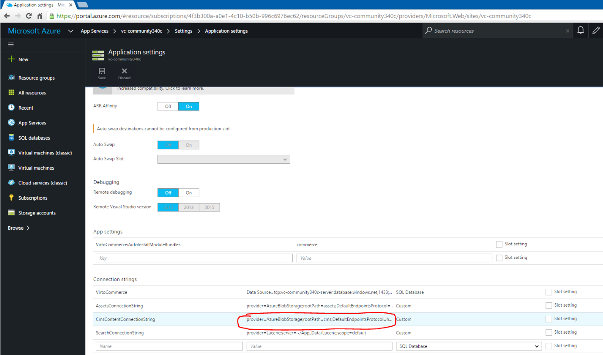

---
aliases:
  - docs/vc2devguide/deployment/storefront-deployment/storefront-microsoft-azure-getting-started
date: '2017-08-31'
layout: docs
title: 'Deploy Storefront from GitHub to Microsoft Azure'

---
Before starting <a class="crosslink" href="https://virtocommerce.com" target="_blank">storefront installation</a> you should have running VC platform application [Deploy from GitHub to Microsoft Cloud Azure](../platform-deployment/deploy-from-github-to-microsoft-azure.md).

## Step-by-step guide

* Open the code repository <a href="https://github.com/VirtoCommerce/vc-storefront-core" rel="nofollow">https://github.com/VirtoCommerce/vc-storefront-core</a>
* Scroll to the end of the page and click the **Deploy to Azure** button
  
  You will see the first page of the deployment wizard:
  
* **Directory** and **Subscription** options define which Azure subscription will be used.
* **Resource group** option allows you to create a new Azure resource group or select an existing one from the list. The new website will be added to this group.
* **Resource Group Name** is the name of the new resource group.
* **Site Name** is the part of the new website URL: http://**site-name**.azurewebsites.net. By default, the site name is generated by adding 4 random characters to the Git repository name.
* **Virto Commerce Manager Url** is the public url where Virto Commerce platform installed. Will be used for API calls.
* **Virto Commerce Api Hmac App Id** is the API client application identifier will used for API calls authentication. (default value: **27e0d789f12641049bd0e939185b4fd2**) you can read more about this parameters here [Working with platform API](../../development-scenarios/working-with-platform-api.md)
* **Virto Commerce Api Hmac App Secret Key** is the Hmac secret key will used for API calls authentication (default value: **34f0a3c12c9dbb59b63b5fece955b7b2b9a3b20f84370cba1524dd5c53503a2e2cb733536ecf7ea1e77319a47084a3a2c9d94d36069a432ecc73b72aeba6ea78**)
* **Content Storage Connection string** is the connection string with have syntax provider=AzureBlobStorage;DefaultEndpointsProtocol=http;AccountName=XXXX;AccountKey=YYYY and should pointed to CMS content blob  storage . You can get it value from your VC 2.11 platform application settings.
  

On the second page of the deployment wizard click **Deploy** button. And wait until deploy process will finished. And click to resulting link in final screen.
