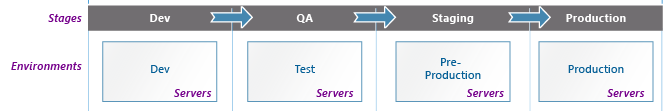

This figure shows the application lifecycle.

In narrative form the nature of the work performed in each environment are the following.

On the development stage developer write code and check it locally first. Then, once it is more or less stable, it can be pushed to development branch in github, which, by default, is set up with automatic deployments on every commit or push.

Once the features are implemented and considered fairly stable, they get merged into the QA branch, and then automatically deployed to the testing environment. During this process, the release manager checks a release notes with the code version, updates and installation notes and perform the necessary changes if required. After completing the deployment process, the release manager notify the QA team. The quality assurance testers start their review and verify that the code works as intended.

After all of the bugs are fixed, the release manager promotes a new version to staging. Code is merged from QA branch into the staging branch and automatically deployed to the staging environment. On this stage QA testers can be both internal staff and external reviewers.

The process of bug fixing continues until the QA team declares the staging version is `okay to release`. The release manager check the release notes and deploy to the production environment.

> Only `release manager` can deploy versions to the next stage. Of course, on some projects, the developer, the release manager, and QA tester can actually be the same person. The important point, though, is that there is always only one person responsible for deploying the new version.
> We recommend always deploying major releases to production at a scheduled time, of which the whole team is aware of.
