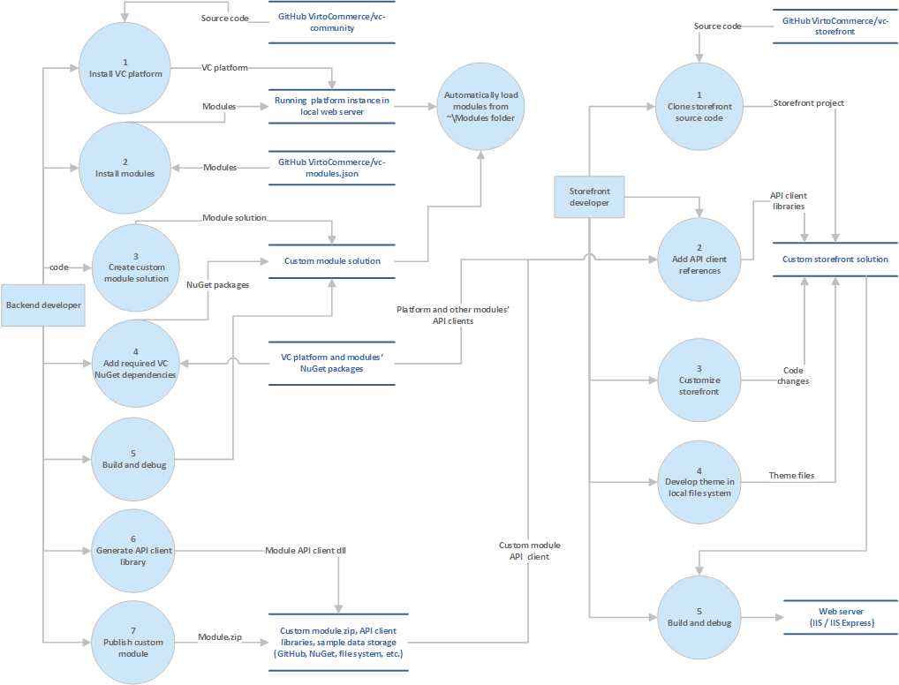
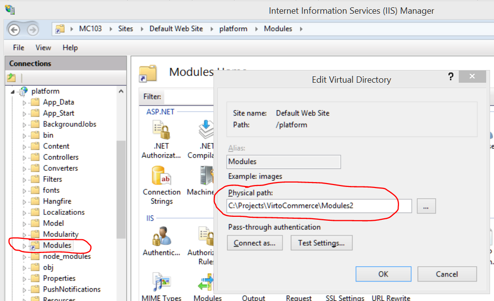

---
title: Developing a custom solution
description: This article describes custom solution development process using Virto Commerce (VC) platform
layout: docs
date: 2016-06-09T15:14:50.933Z
priority: 3
---
This article describes custom solution development process using <a class="crosslink" href="https://virtocommerce.com/b2b-ecommerce-platform" target="_blank">Virto Commerce</a> (VC) platform.

## ProcessВ overview



## Back-end developer tutorial

This section describes the main common steps for extending VC platform with a custom module.

### Step 1. InstallВ VC platform

Follow the steps described in [Source Code Getting Started](docs/vc2devguide/deployment/platform-deployment/source-code-getting-started)В tutorial.

As a result you'll have a clean (without any modules)В VC platform running.

### Step 2. Customize platform environment by installing modules

Clean platform has little business functionality and all its "eCommerce" power lies in external modules. The modules can be retrieved and installed from multiple sources like:

* main public VC modules repository (<a href="https://raw.githubusercontent.com/VirtoCommerce/vc-modules/master/modules.json" rel="nofollow">https://raw.githubusercontent.com/VirtoCommerce/vc-modules/master/modules.json</a>)
* private custom module repositories (hosted on internet or intranet)
* uploadedВ manually

ConfigureВ **Modules Data Sources**В as described inВ [Platform settings](docs/vc2devguide/deployment/platform-settings).

**Install** the required modules as described in [Modules management](docs/vc2userguide/configuration/modules-management)В tutorial.

### Step 3. Create empty custom module project

IfВ some unique functionality (missing in the existing modules) is required, that means you need to create your own extension (a customВ module).

Follow the steps described inВ [Creating new module](docs/vc2devguide/working-with-platform-manager/extending-functionality/creating-new-module)В tutorial. As a result you should have "managed" or "unmanaged" module created.

Note that the project must be located in folder which is mapped to **~/Modules** virtual directoryВ in **IIS** for platform application as on the screen below:



### Step 4. Add dependencies (modules)

If your custom module will use (or extend) some types, UI or other functionality from other VC module(s), you'd need to:
* install it to the platform as described in **Step2. Customize platform environment by installing modules**В above;
* add it asВ reference in module's Visual Studio projectВ (usually from NuGet public repository);
* add it as dependency in module'sВ manifest (module.manifest file).

Version compatibility is required at all times.

If a custom moduleВ exposes any managed codeВ extension point, itВ should be packaged and published as a NuGet package.

### Step 5. Build and debug

* Build the module
* Restart IIS
* Open VC Manager in browser. The new module should be installed and activated automatically during application startup. Check your module's information and status in the installed modules list. In case it's missing in modules list, check the module's location (refer Step 3.).
* You can debug the source code in your preferred way. 
* Repeat from 1. after any updates made.

> <a href="http://shazwazza.com/post/all-about-aspnet-file-change-notification-fcn/" rel="nofollow">ASP.Net File Change Notification</a> feature is disabled in VC Platform app by default. It would be much more convenient to have it enabled **while developing** your new module. In the **VirtoCommerce.Platform.Web** project open **web.config** file. In **system.web** section find the **httpRuntime** node and **fcnMode** attribute. Change its value from **Disabled** to **Default**.
> **platform web.config**
> ```
> <httpRuntime targetFramework="4.6.1" maxRequestLength="512000" fcnMode="Default"/>
> ```
> Set the value back to **Disabled** in production environment or while testing modules installation.

### Step 6. Generate C# client for the API exposed by the module

The custom module could also expose someВ API for other .Net applications. In such case, in order toВ simplify its usage,В C# Rest API client library should beВ generated.В Follow the steps described inВ [How to generate module API C# client](docs/vc2devguide/development-scenarios/how-to-generate-module-api-c-sharp-client)В tutorial andВ generate such library.

> VC platform has an automatic, build-in generation of <a href="http://swagger.io/" rel="nofollow">swagger</a> documents for all installed modules, which have ASP.NET API controllers.

### Step 7. Publish the module

The module is completed. You should generate a VC module package in order to be able toВ distribute it.В Follow the steps described inВ [Creating module packages](docs/vc2devguide/development-scenarios/creating-module-packages)В tutorial andВ generate a package. The resulting packageВ can be installed to other instances of VC platform.

> If you'd like to make your module public, we'd be more than happy to add it to public VC modules repository and share it with VC community. Check for details at [Process of custom module contributing](docs/vc2devguide/development-scenarios/process-of-custom-module-contributing) article.

## Storefront developer tutorial

This section describes the mainВ common steps for VC platform **client application**В (by taking VC Storefront as an example) development. VC platform **client** application communicates with **the platform**В only by API calls. Thus, the client can be implemented in any platform or technology as long as it's capable to use REST.

### Step 1. Setup Storefront

Follow the steps described inВ [Storefront Source Code Getting Started](docs/vc2devguide/deployment/storefront-deployment/storefront-source-code-getting-started)В tutorial.

### Step 2 (optional). Add custom API client libraries

There can be any number of VC modules installed in VC platform depending on the nature of the solution. SomeВ modulesВ expose public API and each of themВ should have generated API client library package (published and available in public NuGet repository).

In order to use APIs from those other modules, referenceВ the appropriate API client libraries in the storefront (client) project.

### Step 3 (optional). Customize storefront (controllers, context, model)В 

### Step 4. Develop or customize storefront Liquid theme templates

### Step 5. Build and debug

## Update Virto Commerce platform and modules

### Platform update

Platform update is a process similar to simplified [Source Code Getting Started](docs/vc2devguide/deployment/storefront-deployment/storefront-source-code-getting-started)В guide:

* update platform source code from <a href="https://github.com/VirtoCommerce/vc-community" rel="nofollow">https://github.com/VirtoCommerce/vc-community</a>
* build the solution in Visual Studio.

## Module update

Module dependency update steps are resembling the onesВ described inВ **Step 4. Add dependencies (modules)**В section above. Just be sure to:
* install the updated version to the platform;
* update the dependencyВ in module's Visual Studio project;
* update theВ dependency in module'sВ manifest.

Version compatibility is required at all times.

### Version compatibility

Virto Commerce platform and modules are developed following <a href="http://semver.org/" rel="nofollow">Semantic Versioning</a> specificationВ 2.0.0 and modules can be installed to the platform only if they are of compatible versions. Version compatibility rules:

* MAJOR versions should have an **exact match**;
* MINORВ versions areВ supposed to be compatible only if the installed version is **equal or higher** than the required by a module beingВ installed;
* PATCHВ versions are ignored during compatibility check.
