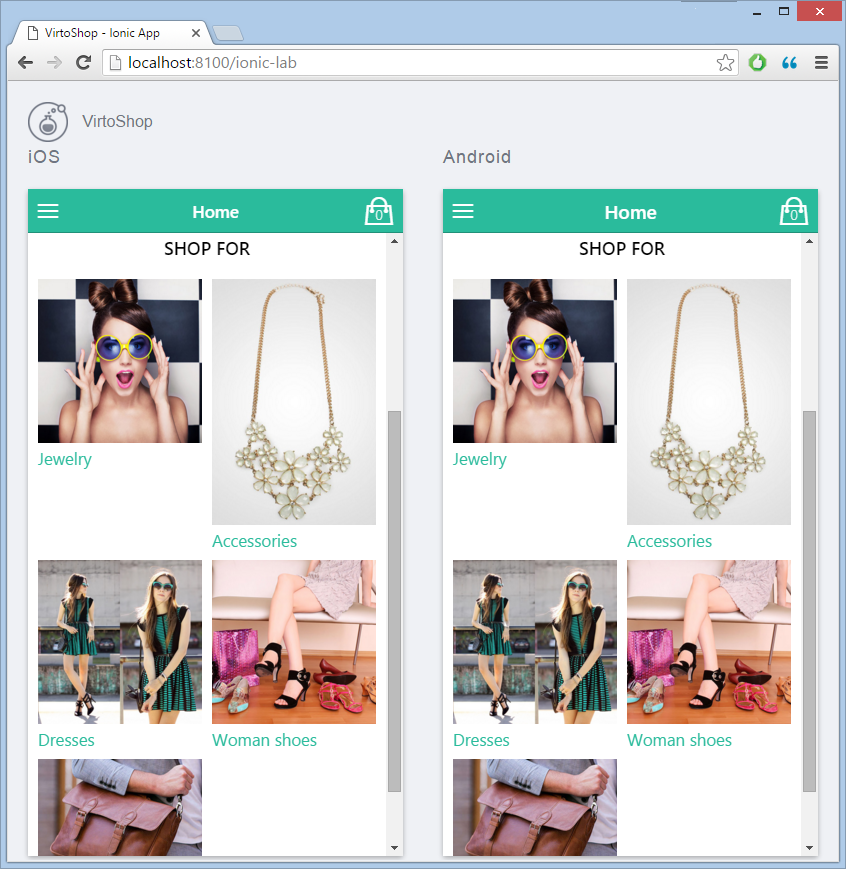

## Summary

Use this guide to setup development environment for Virto Commerce Mobile Starter kit and showcasing it publicly.

## Prerequisites

### Visual Studio 2015 configuration

Required VS2015 compenents are not installed by "typical installation". Run VS2015 installer and make sure **Cross Platform Mobile Development** > **HTML/JavaScript** component is installed.

### Ionic command line utility (CLI)

<a href="http://ionicframework.com/docs/cli/install.html" rel="nofollow">Install the Ionic CLI</a>
```
npm install -g ionic
```

### Getting source code

The <a class="crosslink" href="https://virtocommerce.com/b2b-ecommerce-platform" target="_blank">Virto Commerce</a> Mobile Starter kit source code is currently available to partners and customers only. Contact us for more info on how to get the mobile starter kit: [contact-us](https://virtocommerce.com/contact-us).

### Develop with Starter kit

* Open the **VirtoCommerce.Mobile.sln** solution. (VS2015 should restore the required npm and bower packages in background automatically).
* **Serve** the app for testing: Go to the root directory of Mobile Starter kit source code in command prompt. Type:
	```
	ionic serve --lab
	```
	The site **http://localhost:8100/ionic-lab** opens in browser with iOS and Android devices emulated.

* Check and test the app running:

* Can minimize, but don't close the command prompt.
* Start modifying source code files under www folder. All updates to html and js will be automatically synchronized in browser.  

> The project is preconfigured to use demo data from [https://demo.virtocommerce.com](https://demo.virtocommerce.com). You can switch to any other Virto Commerce Platform data source by changing the <a href="http://ionicframework.com" rel="nofollow">Ionic CLI service proxy</a> in the project file. (Don't forget to point to storefront REST API url like `http://demo.virtocommerce.com/storefrontapi`).

[Setting Virto Commerce Platform](../deployment/platform-deployment/deploy-from-source-code.md) locally.

### Showcase your app to everyone

The simplest and quickest way to showcase your new point of sale app is to publish it on <a href="http://view.ionic.io/" rel="nofollow">Ionic View</a>.
Step-by-step guide on uploading and viewing an app with Ionic View: <a href="http://ionicframework.com/docs/cli/uploading_viewing.html" rel="nofollow">http://ionicframework.com/docs/cli/uploading_viewing.html</a>.

### Check out Mobile Starter kit app in action

A preconfigured Mobile Starter kit app is already available for your testing at Ionic View. Check for instructions at our [Mobile Starter app](/user-guide/introduction-to-virtocommerce/mobile-starter-app.md) page.
