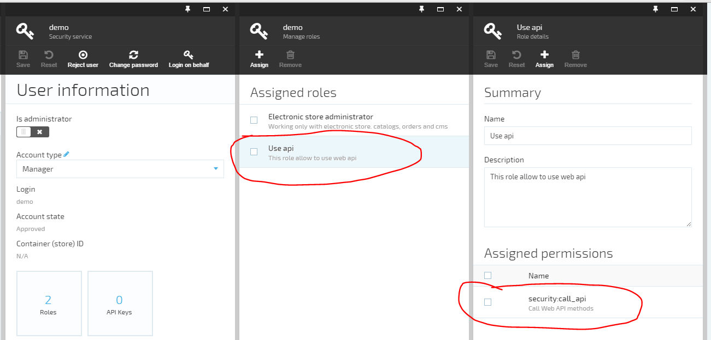
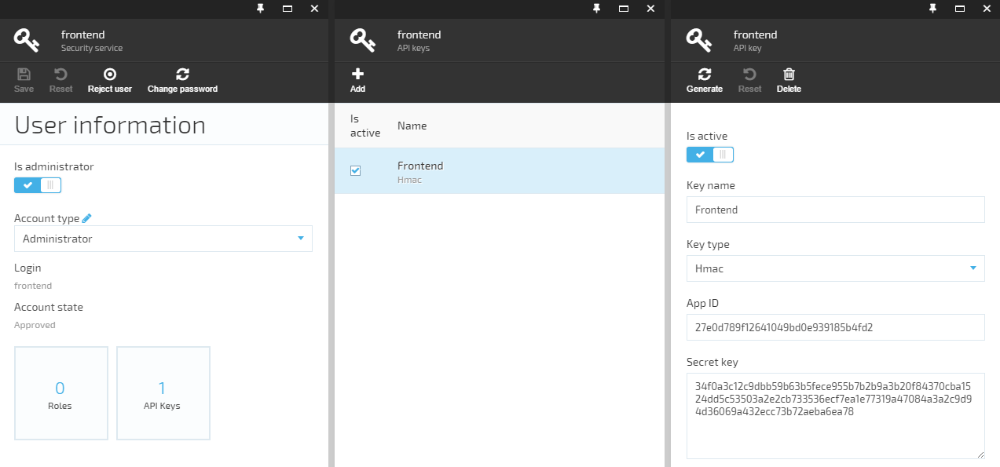

---
title: Working with platform API
description: The list of articles about working with platform Virto Commerce API
layout: docs
date: 2016-05-31T14:56:15.227Z
priority: 6
---
## Platform API authentication configuration 

Virto Commerce platform supports 2 types of authentication for API calls:

* Simple - when user id passed in url for each API request. Example: **http://demo.virtocommerce.com/admin/api/catalog/catalogs?api_key=a348fa7508d342f6a32f8bf6c6681a2a%20**
* HMAC - Hash-based message authentication code (HMAC) is used to identify a client and ensure the request integrity.

In order to enable using platform API, first of all you should create user account in Commerce Manager and generate API key of appropriate type (simple or HMAC).

## Create user

You need to create a new user for impersonating the API requests. Login to Commerce Manager with administrator permissions. Navigate to **Configuration -> Security -> Users**.

Create a new account and assign **Use api** role (comprising of single permission **security:call_api**) to it. More details on permissions: [Working with platform security](docs/vc2devguide/working-with-platform-manager/basic-functions/working-with-platform-security). 



After the permissions has been set, click "Create". The new user will be created and account details blade will open.

## Generate HMAC API key 

1. Open **Configuration > Security > Users**
2. Select a user
3. Click **API Keys** widget
4. Click **Add** button in the toolbar
5. Select **Hmac** as Key type
6. Click **Ok** button in the API key blade
7. Click **Save** button in the User details blade
  

## Generate Simple API key 

1. Repeat 1-5 steps as above
2. Select **Simple** as Key type
3. Click **Ok** button in the API key blade
2. Click **Save** button in the User details blade.

## Using platform API from managed C# code

An API client has to be generated before using API. Refer
[How to generate module API C# client using AutoRest](docs/vc2devguide/development-scenarios/how-to-generate-module-api-c-sharp-client-using-autorest) for instructions.

Next you should install special VirtoCommerce.Platform.Client.Security NuGet package which allows to use both (HMAC and SImple) API authentication protocols.

### Using API with HMAC authentication

```
// HMAC credentials
// that is the App ID generated while creating HMACkey for the user.
var apiAppId = "your API id";

// that is the Secret key generated while creating HMAC key for the user.
var apiSecretKey = "your API secret key";

// Create handler which will add HMAC authorization to each request
var requestHandler = new VirtoCommerceApiRequestHandler(new HmacCredentials(apiAppId, apiSecretKey), new WorkContext())

// Create rest client
var catalogClient = new CatalogModuleApiClient("platform API url", requestHandler, new System.Net.Http.HttpClientHandler
            {
                AutomaticDecompression = DecompressionMethods.GZip | DecompressionMethods.Deflate
            });

//get all catalogs
var catalogs = catalogClient.CatalogModuleCatalogs.GetCatalogs();
```

### Using API with Simple authentication

```
// Simple auth key
// that is the authentication key generated for user
var apiKey = "your API key";

// Create simple headers handler which will add query string ?api_key parameter to each request
var requestHandler = new SimpleKeyRestRequestHandler(apiKey);

// Create rest client
var catalogClient = new CatalogModuleApiClient("platform API url", requestHandler, new System.Net.Http.HttpClientHandler
            {
                AutomaticDecompression = DecompressionMethods.GZip | DecompressionMethods.Deflate
            });

//get all catalogs
var catalogs = catalogClient.CatalogModuleCatalogs.GetCatalogs();
```


## Using platform API from JavaScript 

### Using API with Simple authentication

Nothing special, just add ?api_key='Your API key' to each API request.

[Example](http://demo.virtocommerce.com/admin/api/catalog/catalogs?api_key=a348fa7508d342f6a32f8bf6c6681a2a%20)

### Using API with HMAC authentication

#### Constructing the request

When using HMAC authentication each request to the API should include the following HTTP header:

|Name|Value|
|----|-----|
|Authorization|HMACSHA256 AppId;Timestamp;Signature|

Example:

```
Authorization: HMACSHA256 27e0d789f12641049bd0e939185b4fd2;2016-02-09T13:24:20.837Z;e82bbded532a80bf744f70a86506ddbe94e0e8653304ad67819d8e280e52282f
```

|HMACSHA256|Authorization type|
|----------|------------------|
|AppId|The client ID|
|Timestamp|Date and time when the request has been constructed (in ISO 8601 format)|
|Signature|The HEX string representing the hash of the AppId and Timestamp calculated with HMACSHA256 algorithm|

#### Calculating the signature

Though the following code examples are written in JavaScript, the steps are the same for any language.

Include the HMAC implementation from Google Code:
```
<script src="http://crypto-js.googlecode.com/svn/tags/3.1.2/build/rollups/hmac-sha256.js"></script>
```

* Build the timestamp string by converting current date and time to string in the ISO 8601 format:
```
var timestampString = new Date().toISOString();
```
* Build the message string by concatenating the AppId and timestamp string and separating them with the ampersand character:
```
var message = appId + '&' + timestampString;
```
* Calculate the message hash by using the HMACSHA256 algorithm with your secretKey:
```
var hash = CryptoJS.HmacSHA256(message, CryptoJS.enc.Hex.parse(secretKey));
```
* Build the authorization header value by concatenating the AppId, timestamp and hash and separating them with the semicolon character:
```
var headerValue = 'HMACSHA256 ' + appId + ';' + timestampString + ';' + hash;
```
* Add authorization header to the request:
```
$.ajax({ url: 'http://localhost/admin/api/platform/security/currentuser', headers: { Authorization: headerValue } })
```

#### JavaScript test client

```
<!DOCTYPE html>
<html>
<head>
    <meta charset="utf-8" />
    <title>Using HMAC authentication for Virto Commerce in JavaScript</title>
    <style>
        .label {
            margin-top: 1em;
            font-weight: bold;
        }
 
        .text-input {
            width: 30em;
        }
    </style>
    <script src="https://code.jquery.com/jquery-2.2.0.min.js"></script>
    <script src="http://crypto-js.googlecode.com/svn/tags/3.1.2/build/rollups/hmac-sha256.js"></script>
    <script type="text/javascript">
        $(function () {
            $('#button').click(sendRequest);
 
            var progress = $("#progress");
            progress.hide();
 
            function sendRequest() {
                var appId = $("#app-id");
                var secretKey = $("#secret-key");
                var api = $("#api");
                var header = $("#header");
                var response = $("#response");
 
                var headerValue = generateAuthorizationHeaderValue(appId.val(), secretKey.val());
 
                header.text(headerValue);
                progress.show();
 
                $.ajax({
                    url: api.val(),
                    headers: { Authorization: headerValue }
                }).done(function (data) {
                    response.text(JSON.stringify(data));
                }).fail(function (jqXhr, textStatus, errorThrown) {
                    response.text('ERROR: ' + errorThrown);
                }).always(function () {
                    progress.hide();
                });
            }
 
            function generateAuthorizationHeaderValue(appId, secretKey) {
                var timestampString = new Date().toISOString();
                var message = appId + '&' + timestampString;
                var hash = CryptoJS.HmacSHA256(message, CryptoJS.enc.Hex.parse(secretKey));
                var headerValue = 'HMACSHA256 ' + appId + ';' + timestampString + ';' + hash;
                return headerValue;
            }
        });
    </script>
</head>
<body>
    <div class="label">App ID</div>
    <input id="app-id" class="text-input" type="text" value="27e0d789f12641049bd0e939185b4fd2" />
    <div class="label">Secret Key</div>
    <input id="secret-key" class="text-input" type="text" value="34f0a3c12c9dbb59b63b5fece955b7b2b9a3b20f84370cba1524dd5c53503a2e2cb733536ecf7ea1e77319a47084a3a2c9d94d36069a432ecc73b72aeba6ea78" />
    <div class="label">URL</div>
    <input id="api" class="text-input" type="text" value="http://localhost/admin/api/platform/security/currentuser" />
    <input id="button" type="button" value="Send Request" />
    <span id="progress">Sending request...</span>
    <div class="label">Authorization header value</div>
    <div id="header"></div>
    <div class="label">Response</div>
    <div id="response"></div>
</body>
</html>
```
