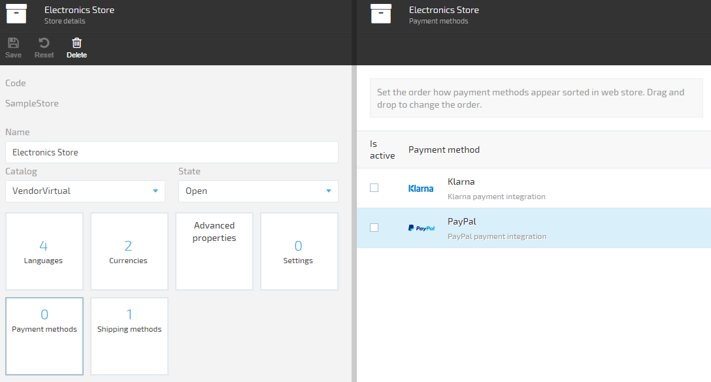
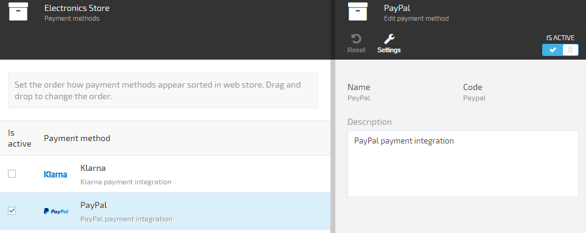

---
title: Creating new payment method
description: The article describes creating new payment method in Virto Commerce
layout: docs
date: 2015-10-16T06:10:30.727Z
priority: 2
---
## Introduction

There are two approaches of working with payment systems:
* Off-site - in this approach customer fills in required payment credentials in payment system;
* On-site - in this approach customer fills in required payment information on seller's system side. After all the required data is filled, the seller's system sends a request to the payment system. In special cases the customer will be asked to enter additional security data to commit the transaction (MasterCard SecureCode).

VirtoCommerce supports both off-site and on-site payment methods implementations.

## Concepts

An off-site payment method implementation activities diagram.


## Implementing new payment method

Each payment method has to be implemented as a separate module. To learn how to create new modules see the followingВ [link](docs/vc2devguide/working-with-platform-manager/extending-functionality/creating-new-module).

To add a new payment method you need to implement an abstract class PaymentMethod.В 

For now, the Virto Commerce platform supports processing (registration in outside payment system) and post-processing (processing results of transaction in outside payment system) methods.

In order to implement payment method you have to override three methods:

```
public abstract ProcessPaymentResult ProcessPayment(ProcessPaymentEvaluationContext context);
```

ProcessPayment method:

* has to implement payment transaction registration in an outside payment system;
* gets ProcessPaymentEvaluationContext as a parameter, which contains all the required information to create a payment transaction in an outside payment system;
* returns ProcessPaymentResult as a result, which includes the OuterId property, that has to be set to PaymentId. That way it associates payment in the Virto Commerce platform with the payment transaction in the outside payment system

Next method:

```
public abstract PostProcessPaymentResult PostProcessPayment(PostProcessPaymentEvaluationContext context);
```

PostProcessPayment method:
* has to implement payment status check in the outside payment system;
* get PostProcessPaymentEvaluationContext as a parameter, which contains all the required information to check payment status in outside payment system;
* returns PostProcessPaymentResult as a result, which includes the payment status result returned by the outside payment system

Last method to implement:

```
public abstract ValidatePostProcessRequestResult ValidatePostProcessRequest(NameValueCollection queryString);
```

ValidatePostProcessRequest method:
* has to impelement querystring request processing. The request comes to **push url** from outside payment system or frontend. The **push url**В is set in account settings of most payment systems or during payment transaction processing in outside payment system (ProcessPayment method).
* as a result of successfully checked (valid) payment the OuterId property of ValidatePostProcessRequestResult has to be set. It identifies payment in VirtoCommerce with the transaction in outside payment system.

**Important**: In order to set url for push notifications as well as other required url links use **Secure Url**В setting of store. In case of the setting returns null use **Store Url** setting. The system uses the only route for payment system requests - **https://{your-secure-url}/admin/api/paymentcallback**

The important property of payment method is PaymentMethodType property. That property defines what actions will be executed by the front end to get a transaction registration result. There are two types of actions defined today. More will be implemented in future.

Redirection – use this type of action if payment method redirects the user to an outside url. In order to do that set that link to RedirectUrl property in the ProcessPaymentResult. The frontend will use it to redirect customer (example of such a behavior would be Paypal Express Checkout payment method). PreparedForm – use this type of action if payment method provides the html form to the user to fill-in required credentials. In order to do that set the HtmlForm property in the ProcessPaymentResult with the Html form that the outside payment system returns or with the generated form in our payment system (example of such a behavior would be Klarna Checkout payment method).

## Registering new payment method in the system

After the payment method is implemented, you have to define settings of the payment method in the module manifest.В To learn how to work with the manifest file see the followingВ [link](docs/vc2devguide/working-with-platform-manager/extending-functionality/managing-module-settings).

**Important:** Settings that should be set by user have to be defined in the manifest file in order to simplify working with them using the VirtoCommerce platform manager.

Next, register the payment method in the payment methods service. After the payment method is registered it will become available in the VirtoCommerce platform manager and storefront.

Payment method registration is made in the Initialize() method of the Module.cs file.

```
public void Initialize()
{
	var settings = _container.Resolve<ISettingsManager>().GetModuleSettings("Paypal.ExpressCheckout");
	Func<PaypalExpressCheckoutPaymentMethod> paypalBankCardsExpressCheckoutPaymentMethodFactory = () =>
	{
		return new PaypalExpressCheckoutPaymentMethod()
		{
			Name = "Paypal Express Checkout",
			Description = "PayPal express checkout integration",
			LogoUrl = "http://www.credit-card-logos.com/images/multiple_credit-card-logos-2/credit_card_paypal_logos_2.gif",
			Settings = settings
		};
	};
	_container.Resolve<IPaymentMethodsService>().RegisterPaymentMethod(paypalBankCardsExpressCheckoutPaymentMethodFactory);
}
```

Next, create the module package of the payment method.В To learn how to create module packages see the followingВ [link](docs/vc2devguide/development-scenarios/creating-module-packages).

Finally, install the created module package in VirtoCommerce platform manager. To learn how to install module packages see [link](docs/vc2userguide/configuration/modules-management).

The payment method module should become available in the VirtoCommerce system.В 

## Working with the payment method

As a result of registering a new payment method module in the platform it becomes available to select in the store's payment methods settings. On the screenshot below the "Payment methods" the widget has 0 value. That means that none of the registered payment methods are assigned to the store and won't be available to select in the storefront.В 



The order the payment methods appear within the store front can be changed simply by re-ordering them in the payment methods blade using drag & drop. Click and hold the payment method you need to re-order and drag it to the desired position and drop.

Click the "Payment method" widget to open the payment methods blade. In the payment methods blade check the payment method(s) you need. As a result the payment method(s) will be assigned to the store and become available in the storefront on the checkout page. Click the selected payment method to change the settings of the payment method. Those settings will be set only for that particular store.В 

The functionality of the user interface can be extended by adding widgets. To learn how to add widgets see [link](docs/vc2devguide/working-with-platform-manager/basic-functions/widgets).

В 

When the check mark appears, the payment method activation is available in the storefront.В 


