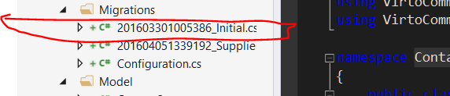
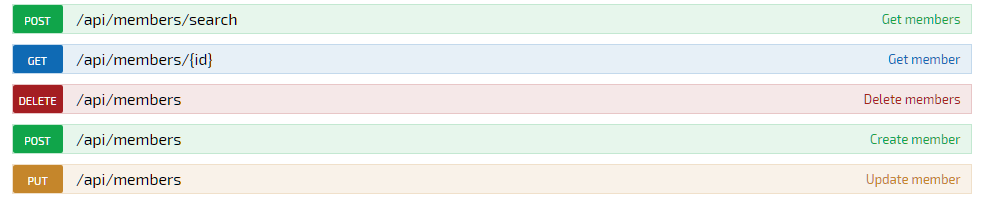

## Introduction

> Full demo module source code can be downloaded here [https://github.com/VirtoCommerce/vc-samples/tree/master/MemberExtensionSampleModule](https://github.com/VirtoCommerce/vc-samples/tree/master/MemberExtensionSampleModule)

VC domain exposes the **VirtoCommerce.Domain.Customer.Model.Member** type that is used as a base for the following domain types: **Customer**, **Organization**, **Vendor** and **Employee**. Each of these types are used in commerce workflow. 

**Contact** and **Organizations** are used in **Customer.Module** as a storefront **CRM** system, **Employee** is used in **Order.Module** for assigning the responsible person for processing customer orders, **Vendors** are used in the catalog system.

In real integrations, these 'standard' member types or fields may not be sufficient, new member types may be needed and you'd need to define new member types.

As VCF is an open source platform you could make changes directly in platform modules, but this could cause serious problems in the future when updating the platform along with its modules.

> We strongly recommend to refrain from making changes in platform and code modules and make changes only in your extension's modules.

In this article we describe how to extend the Members Domain model with newly derived Member types or override existing member types and extend existing management UI from your custom module without changing platform code.

## Creating a new member extension module

In this sample we'll be creating a new **Supplier member** type.

### Create new module

Create new **managed** module first: [creating new module](../working-with-platform-manager/extending-functionality/creating-new-module.md).

Module manifest should contain dependencies to **VirtoCommerce.Core** and **VirtoCommerce.Customer** modules. Check full **module.manifest** content [here](https://github.com/VirtoCommerce/vc-samples/blob/master/MemberExtensionSampleModule/module.manifest).

### Define data, domain models and EF persistency layer

We should define both types for the Supplier - Supplier as a domain type and SupplierDataEntity for EF persistency layer.

Domain Supplier type should be derived from Member:

```
  public class Supplier : Member
    {
        public string ContractNumber { get; set; }
    }
```

Here is code of SupplierDataEntity type used for Supplier member instance persistency in EF repository:

```
    /// <summary>
    /// Represent persistent member type
    /// </summary>
    public class SupplierDataEntity : MemberDataEntity
    {
        [StringLength(128)]
        public string ContractNumber { get; set; }
        /// <summary>
        /// This method used to convert domain Member type instance to data model
        /// </summary>
        public override MemberDataEntity FromMember(Member member, PrimaryKeyResolvingMap pkMap)
        {
			// Here you can write code for custom mapping
			// supplier properties will be mapped in base method implementation by using value injection
            return base.FromMember(member, pkMap);
        }
        /// <summary>
        /// This method used to convert data type instance to domain model
        /// </summary>
        public override Member ToMember(Member member)
        {
           // Here you can write code for custom mapping
		   // supplier properties will be mapped in base method implementation by using value injection
            return base.ToMember(member);
        }
		/// <summary>
        /// This method used to apply changes form other member type instance 
        /// </summary>
        public override void Patch(MemberDataEntity target)
        {
		    // Here you can write code for custom patch
            base.Patch(target);
        }
    }
```

In the next step, we should define the SupplierRepository to serve our Supplier type and inherit it from MemberRepositoryBase base class for all derived custom members repositories.

```
    public class SupplierRepository : MemberRepositoryBase
    {
        public SupplierRepository ()
        {
        }
        public SupplierRepository (string nameOrConnectionString, params IInterceptor[] interceptors)
            : base(nameOrConnectionString, interceptors)
        {
           Configuration.ProxyCreationEnabled = false;
        }
        protected override void OnModelCreating(DbModelBuilder modelBuilder)
        {
            #region Supplier
            modelBuilder.Entity<SupplierDataEntity>().HasKey(x => x.Id)
                .Property(x => x.Id);
            modelBuilder.Entity<SupplierDataEntity>().ToTable("Supplier");
            #endregion
            base.OnModelCreating(modelBuilder);
        }

        public IQueryable<SupplierDataEntity> Suppliers
        {
            get { return GetAsQueryable<SupplierDataEntity>(); }
        }
    }
```

Now we can create EF migration for our new data structure. The following is a detailed description for how to add migration to your code, [Managing Module Database](docs/vc2devguide/working-with-platform-manager/extending-functionality/managing-module-database)

* Open **Tools > NuGet Package Manager > Package Manager Console**
* Select **ContactExtModule.Web** as **Default project**
* Run **Enable-Migrations -StartUpProjectName ContactExtModule.Web** command
* Run **Add-Migration Initial -StartUpProjectName ContactExtModule.Web** command  

After command execution a new folder **Migrations** with initial migration script appears in the project:

 

In the next step, you should manually edit _Initial.cs file to remove the existing tables from MemberRepositoryBase and leave only the **Supplier** table creation script:

```
 public partial class Initial: DbMigration
    {
        public override void Up()
        {
            CreateTable(
                "dbo.Supplier",
                c => new
                    {
                        Id = c.String(nullable: false, maxLength: 128),
                        ContractNumber = c.String(maxLength: 128),
                    })
                .PrimaryKey(t => t.Id)
                .ForeignKey("dbo.Member", t => t.Id)
                .Index(t => t.Id);
		
            //Convert  all exist Contact records to Contact2
            Sql("INSERT INTO dbo.Contact2 (Id) SELECT Id FROM dbo.Contact");
            
        }
        
        public override void Down()
        {
            DropForeignKey("dbo.Supplier", "Id", "dbo.Member");
            DropIndex("dbo.Supplier", new[] { "Id" });
            DropTable("dbo.Supplier");
        }
    }
```

### Define CRUD and search service for custom member type

The next important step concluded in the service definition (which provides CRUD operations for the new Supplier instances). SupplierMemberService should derive from MemberServiceBase base service for all custom members services.

```
  /// <summary>
    ///  Provide CRUD operations for custom member instances.
    /// </summary>
    public class SupplierMemberService : MemberServiceBase
    {
        public SupplierMemberService (Func<ICustomerRepository> repositoryFactory, IDynamicPropertyService dynamicPropertyService, IMemberFactory memberFactory, IEventPublisher<MemberChangingEvent> eventPublisher)
            :base(repositoryFactory, dynamicPropertyService, securityService, memberFactory, eventPublisher)
        {
        }
        //Override this method you can construct you customer data model from domain member type instance
        protected override MemberDataEntity TryCreateDataMember(Member member)
        {
            MemberDataEntity retVal = null;
            var supplier = member as Supplier;
            if(supplier != null)
            {
                retVal = new SupplierDataEntity();
            }
            return retVal;
        }
		//Override this method you can use for search members you custom tables and columns
        protected override Expression<Func<MemberDataEntity, bool>> GetQueryPredicate(MembersSearchCriteria criteria)
        {
            var retVal = base.GetQueryPredicate(criteria);
            if (criteria.Keyword != null)
            {
                var predicate = PredicateBuilder.False<MemberDataEntity>();
 				 //Here we extend search by keyword  to ContractNumber column in Supplier table
                 predicate = predicate.Or(x => x is SupplierDataEntity && (x as SupplierDataEntity).ContractNumber.Contains(criteria.Keyword));
                retVal = retVal.Or(LinqKit.Extensions.Expand(predicate));
            }           
            return retVal;
        }
```

### Register Supplier in platform members type factory

For now we have domain and data model, persistent layer and CRUD and search services for client access to custom Supplier member. The final step is to register Supplier in the platform member type factory.

```
  public override void Initialize()
        {
            Func<SupplierRepository> contact2repositoryFactory = () => new SupplierRepository(_connectionStringName, new EntityPrimaryKeyGeneratorInterceptor(), _container.Resolve<AuditableInterceptor>());
            //Replace original repositories and services to own implementations 
            _container.RegisterInstance<Func<ICustomerRepository>>(contact2repositoryFactory);
            _container.RegisterInstance<Func<IMemberRepository>>(contact2repositoryFactory);

            _container.RegisterType<IMemberService, SupplierMemberService>();
            _container.RegisterType<IMemberSearchService, SupplierMemberService>();

            base.Initialize();

        }

        public override void PostInitialize()
        {
            AbstractTypeFactory<Member>.OverrideType<Contact, Model.Contact2>().MapToType<Contact2DataEntity>();
            AbstractTypeFactory<Member>.RegisterType<Model.Supplier>().MapToType<SupplierDataEntity>();
               
            AbstractTypeFactory<MemberDataEntity>.RegisterType<SupplierDataEntity>();
            AbstractTypeFactory<MemberDataEntity>.OverrideType<ContactDataEntity, Contact2DataEntity>();

            AbstractTypeFactory<MembersSearchCriteria>.RegisterType<Contact2SearchCriteria>();

            base.PostInitialize();
        }
```

### Use generic members API for custom members access

Platform VirtoCommerce.Customer module exposes generic [restful API for members management](http://demo.virtocommerce.com/admin/docs/ui/index#!/Customer_management_module):



Newly created **Supplier** members become available through these API methods automatically, without any code changes.

Because auto-generated C# API SDK doesn't support polymorphic types, this makes it impossible to use this generic members API method and for each custom member type need define special API each for concrete type, and regenerate API SDK.

### Integrate custom member to the existing management UI

Management UI is based on AngularJS. Creating a new module and registering **Supplier** type in the UI:

```
//Call this to register our module to main application
var moduleName = "contactExtMemberModule";
if (AppDependencies != undefined) {
    AppDependencies.push(moduleName);
}
angular.module(moduleName, [])
.run(
  ['$rootScope', 'virtoCommerce.customerModule.memberTypesResolverService', function ($rootScope, memberTypesResolverService) {
    
     // register new Supplier member type
      memberTypesResolverService.registerType({
          memberType: 'Supplier',
          description: 'Supplier description',
          fullTypeName: 'MemberExtensionSampleModule.Web.Model.Supplier',
          icon: 'fa fa-truck',
          detailBlade: {
              template: 'Modules/$(VirtoCommerce.MemberExtensionSampleModule)/Scripts/blades/supplier-detail.tpl.html',
              metaFields: [{
                  name: 'contractNumber',
                  title: "Contract Number",
                  valueType: "ShortText"
              }]
          }
      });
      // registering Supplier as possible child for Organization
      var organizationMetadata = memberTypesResolverService.resolve('Organization');
      organizationMetadata.knownChildrenTypes.push('Supplier');
  }]);
```

The code above not only registers "Suplier", but also defines its description, type name for acquiring dynamic properties, UI icon and details blade information.

## Overriding existing Contact member type

In order to override an already existing member type by a new type without any new persistency infrastructure and overriding CRUD operations, you should define a new type derived from the existing member type. An example of custom Contact2 type:

```
 public class Contact2 : Contact
    {
        public Contact2()
        {
			//this line need to preserve original type name Contact for management UI  and all services for all members with contact type will return new Contact2 type 
            base.MemberType = typeof(Contact).Name;
        }
        public string JobTitle { get; set; }
    }
```

An then existing Contact type should be overridden by Contact2 in the module Module.cs file:

```
 public override void PostInitialize()
        {
		   AbstractTypeFactory<Member>.OverrideType<Contact, Model.Contact2>().MapToType<Contact2DataEntity>();
		   AbstractTypeFactory<MemberDataEntity>.OverrideType<ContactDataEntity, Contact2DataEntity>();
  
        }
```
