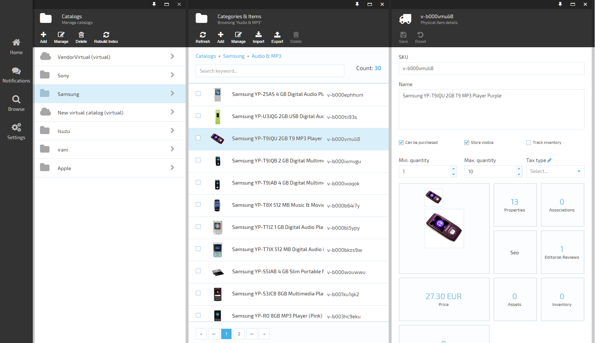
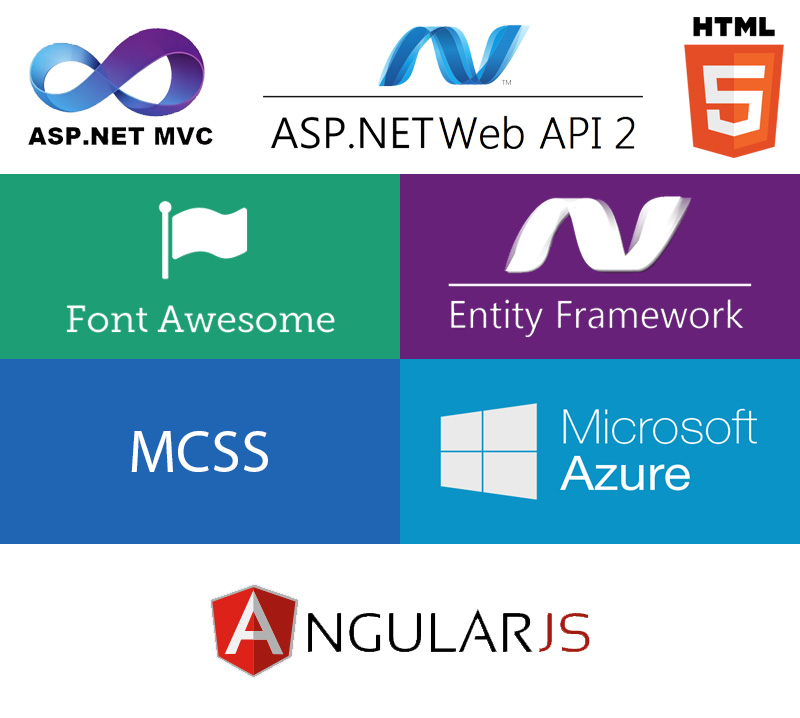
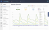
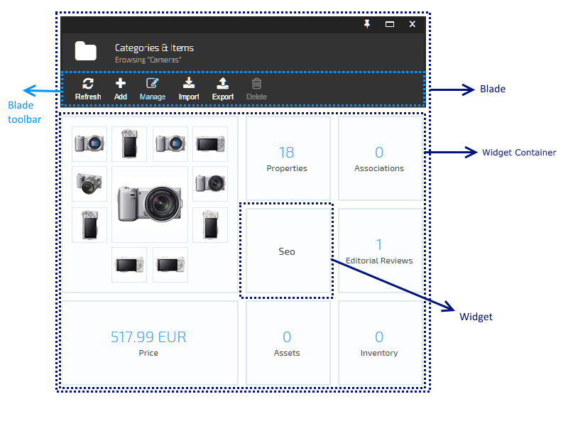
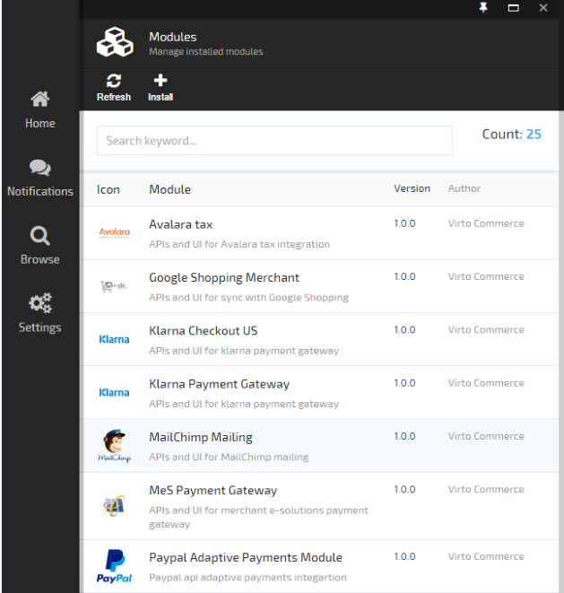
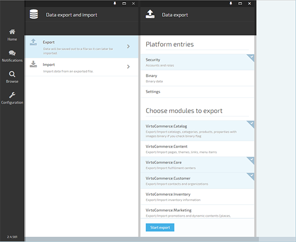

## Overview

<a class="crosslink" href="https://virtocommerce.com/b2b-ecommerce-platform" target="_blank">Virto Commerce 2</a> is a major release and has been in development for over a year. It consists of [Virto Commerce Platform](working-with-platform-manager.md) and Virto Commerce Modules.

## Technology Stack Used

Our decision to use these technologies was the consequence of our extensive experience with Microsoft products.

We decided to use the following stack of technologies:

* **ASP.NET MVC 5** - as a web hosting technology
* **ASP.NET Web API 2** - to implement REST services
* **Entity Framework 6.1** - ORM
* **EF Migrations** - for managing database schema changes and data
* **ASP.NET Identity** - tasks related to authorization and authentication

**AngularJS** - for **SPA** user interface. One of the major decisions for picking it is due to its popularity and quality documentation. We didnt have any prior experience working with AngularJS. Looking back, we never had any regrets with our decision to do so.

## Architecture

<a class="crosslink" href="https://virtocommerce.com/glossary/what-is-b2b-ecommerce" target="_blank">Platform and modules</a> are written using <a href="https://en.wikipedia.org/wiki/Domain-driven_design" rel="nofollow">DDD</a>, <a href="https://en.wikipedia.org/wiki/SOLID_(object-oriented_design)" rel="nofollow">SOLID</a>, <a href="https://en.wikipedia.org/wiki/Test-driven_development" rel="nofollow">Test Driven Development</a> methodologies. For a presentation layer, we use <a href="https://en.wikipedia.org/wiki/Model_View_ViewModel" rel="nofollow">MVVM</a> (thanks to AngularJS - the transition from WPF didnt create any complications).

## Platform Capabilities

Now let's look at a list of core platform capabilities. It is important to understand that this list contains platform capabilities. These platform capabilities are not add-on features developed on top of an ecommerce application.

## Style Guide

We created our own theme for an application using <a href="http://operatino.github.io/MCSS/en/" rel="nofollow">MCSS</a> methodology. We also created a [style guide](working-with-platform-manager/style-guide.md) and [visual constructor](https://virtocommerce.com/guides/blade-constructor) for navigation elements (blades), allowing you to easily create an HTML markup that can then be used in extension modules.

## Navigation

Here, we present a unified navigation concept for user interfaces. We really liked the navigation idea used in the new <a href="http://portal.azure.com" rel="nofollow">portal.azure.com</a> portal with horizontal scrolling, and we decided to take it as a base.

The main navigation elements are:

* **blade** - analog of Windows in classic interface
* **widget container** which contains **widget**
* **main menu** - global navigation menu for all the modules

## Modularity

Platform allows extending system function in runtime by installing extension modules. Considering that each module can provide its own **user interface and REST API services**, the platform can be customized to serve many specific business needs.

Modularity is one of the most difficult problems we encountered. To solve it, we had to adopt <a href="https://compositewpf.codeplex.com/" rel="nofollow">Microsoft PRISM</a> from WPF and make it work in ASP.NET MVC. Modules contain information about versions and dependencies which are used by the system during module initialization and installation.

Besides extending user interface and API, each module can use its own Database Schema with support for data migration during version updates. It can also extend or overwrite functionality from other modules using Unity - IoC and Dependency injection container.

We wont list all the user interface extensibility points, but here are just a few of them: main menu, toolbars, widgets, notifications, etc.

## Import/Export

Platform comes with advanced import/export functionality that allows each module to specify (through API interface) how the data can be imported and exported from that module and platform provides a unified UI to export and import data as shown below.

*View of platform export/import UI:*

This feature can then be used for various scenarios including:

* **Publishing** content from **Staging to Production** environment
* Creating **starter e-commerce stores** with all themes, catalogs, products, properties, promotions, marketing banners etc as preconfigured
