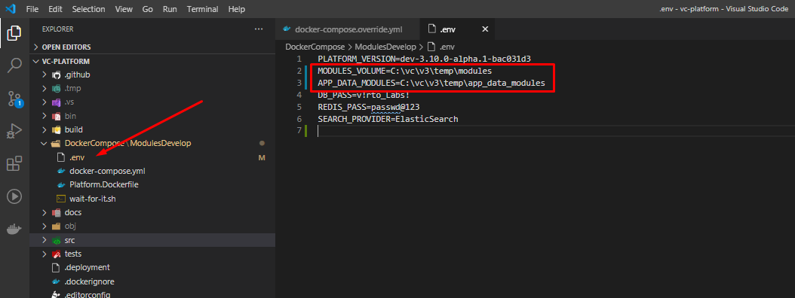
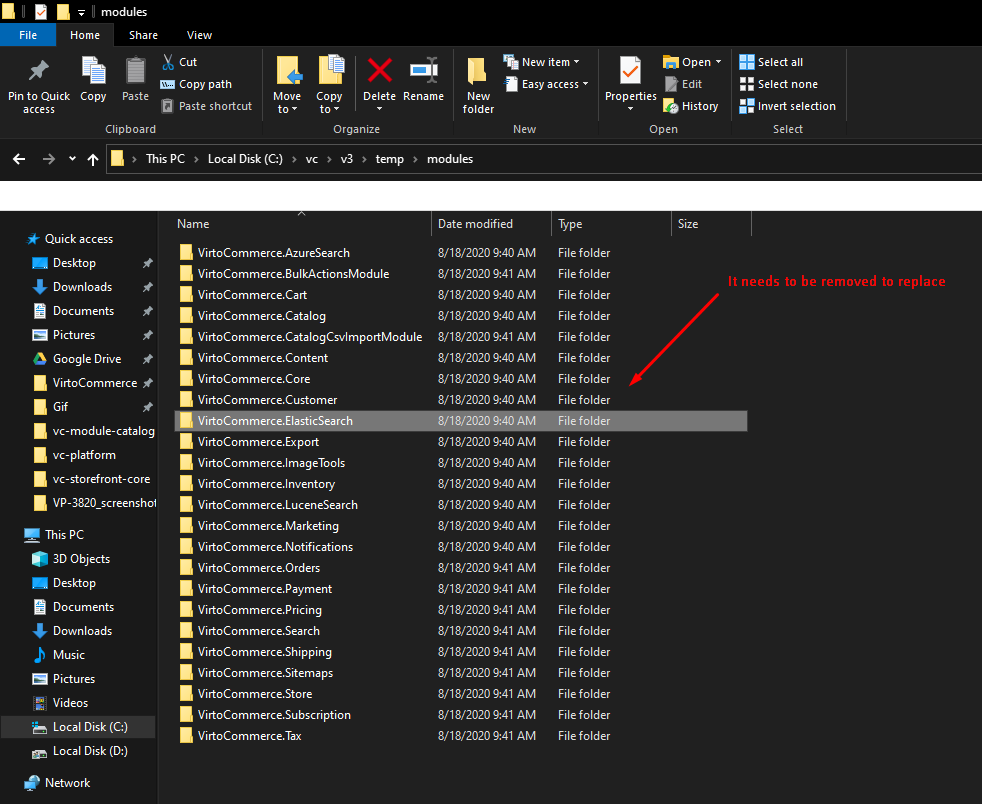
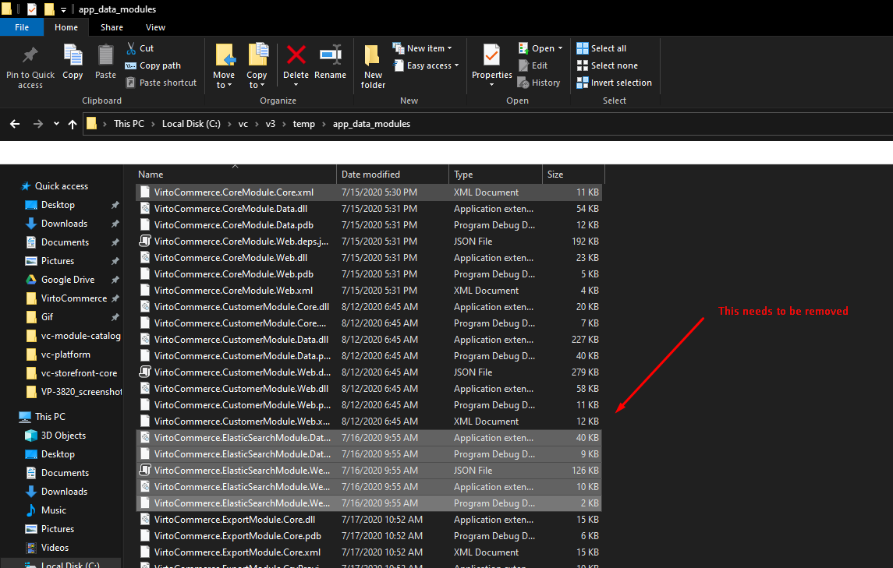
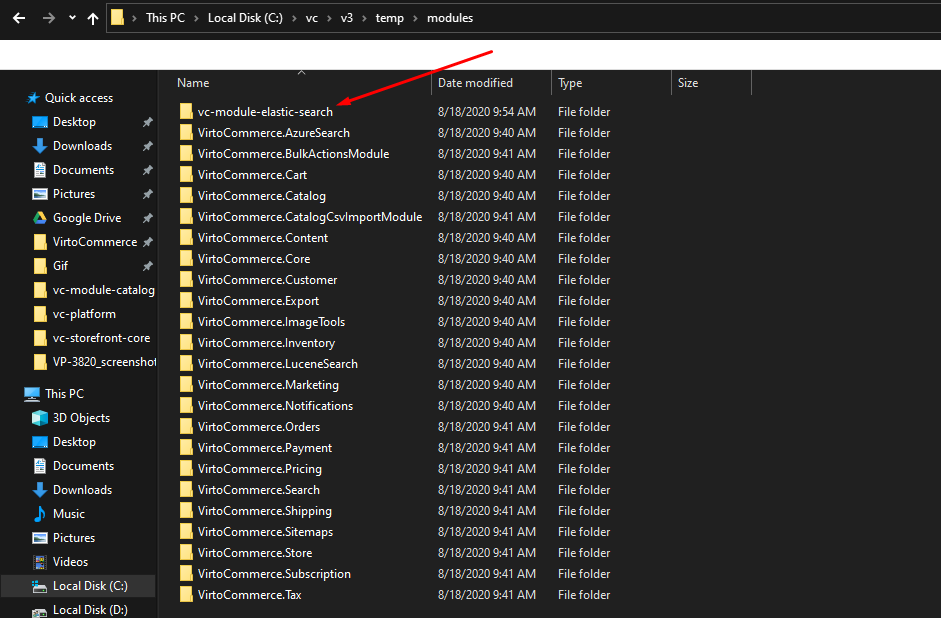
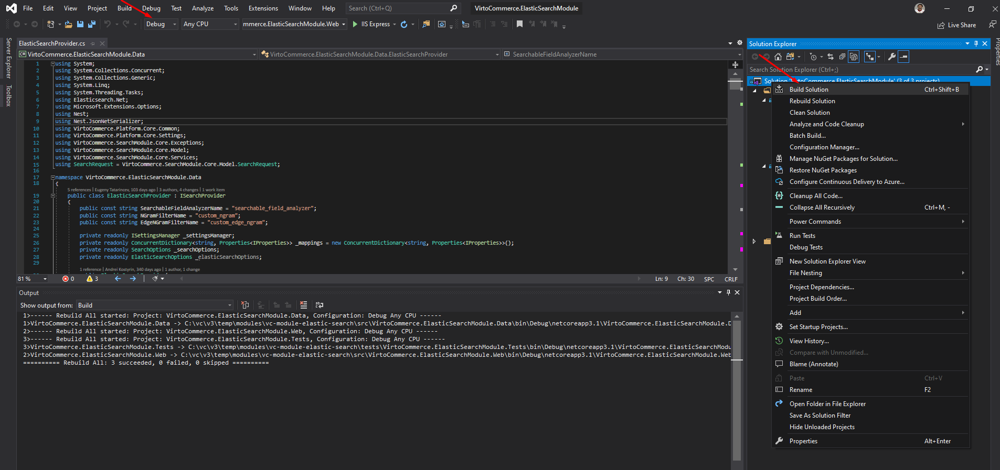
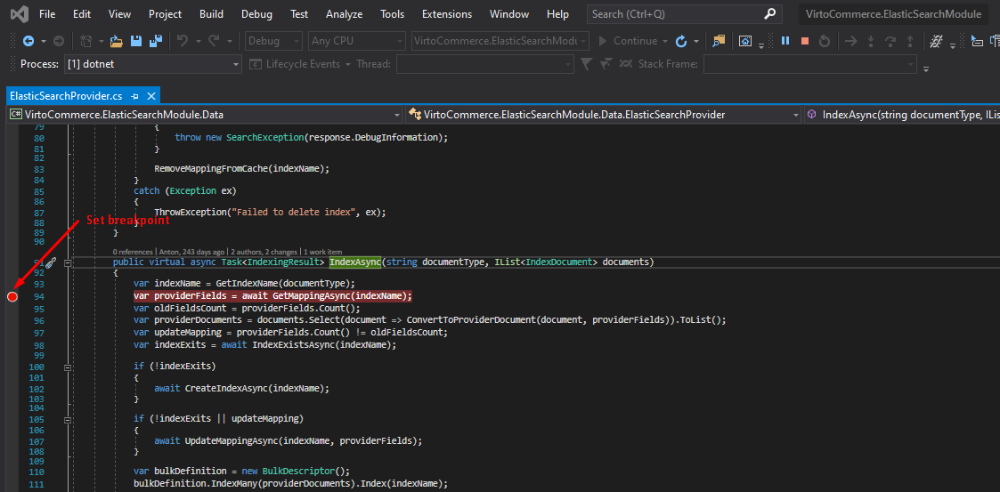
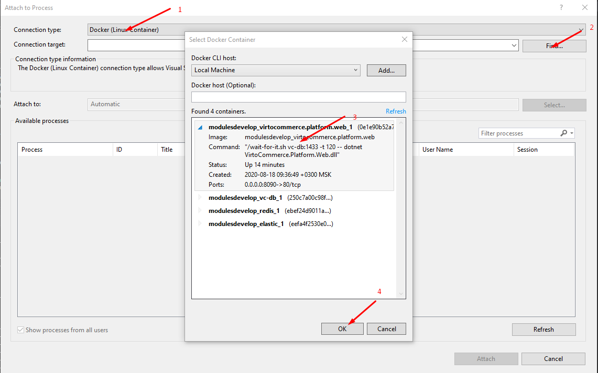
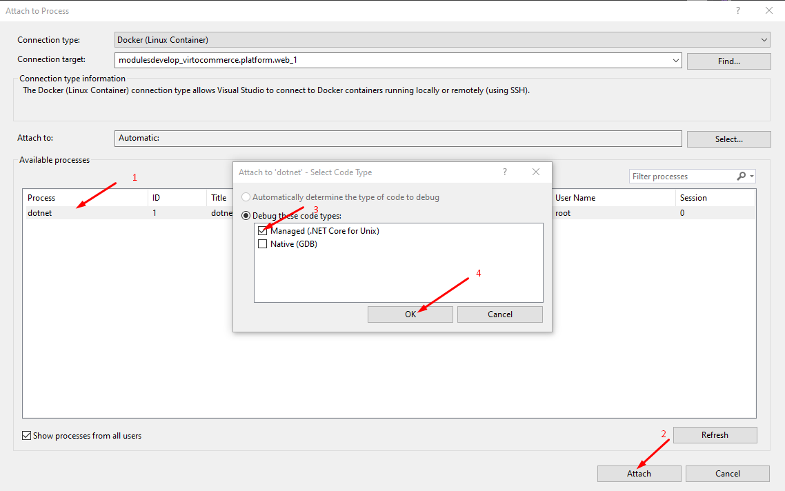
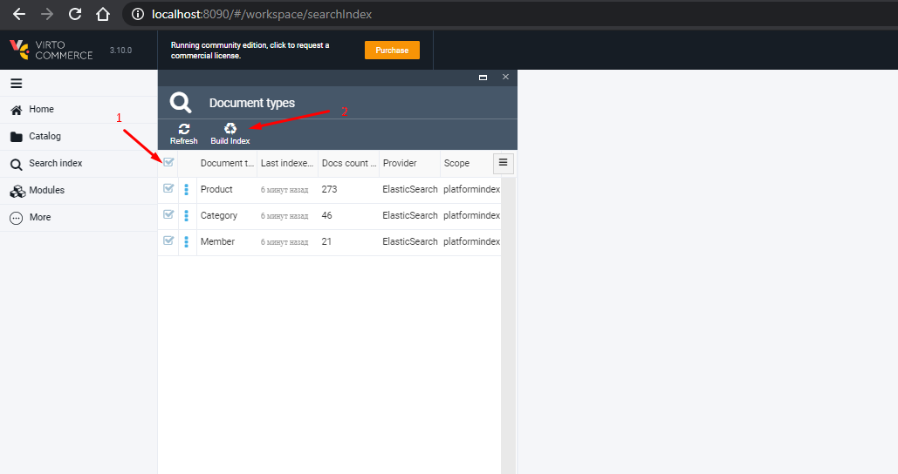
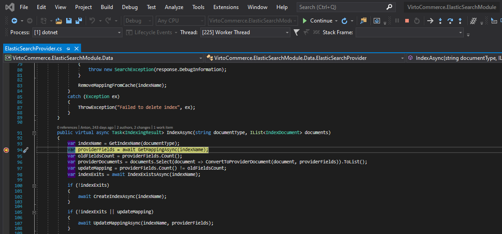

# Modules development via docker

## Launching the solution
Virto Commerce Team created [docker-compose.yml](https://github.com/VirtoCommerce/vc-platform/blob/dev/DockerCompose/ModulesDevelop/docker-compose.yml) to run vc-platform, mssql server, elastic search and redis service in containers

> To use it you need to create an external network for the Docker engine

```
docker network create nat
```

To work with the contents of containers, use the mapping folder

```
...
 volumes:
     - ${MODULES_VOLUME}:/opt/virtocommerce/platform/Modules
     - ${APP_DATA_MODULES}:/opt/virtocommerce/platform/App_Data/Modules
...
```

> You can parameterize these values ​​in the .env file

```
CMS_CONTENT_VOLUME=/Path/to/folder/cms-content
APP_DATA_MODULES=/Path/to/folder/modules
```


> You can also parameterize the platform version and search provider in the .env file

```
PLATFORM_VERSION=dev-3.10.0-alpha.1-bac031d3
...
SEARCH_PROVIDER=ElasticSearch
```

> The solution is launched and built using the command:

```
docker-compose -f docker-compose.yml up --build -d
```

## Installing and debugging the module

After launching the solution, you can install the necessary modules via the web interface of the platform. You need to restart the container with the platform. 

Now you can see that data for modules and applications has appeared in mapping folders.

You need to remove the module from the installed ones via the platform.





Next, you need to add and build the module being developed to the mapping folder "modules" and restart the platform




You can set breakpoint and attach to process






Now you can call the action to trigger the breakpoint and go to debugging


