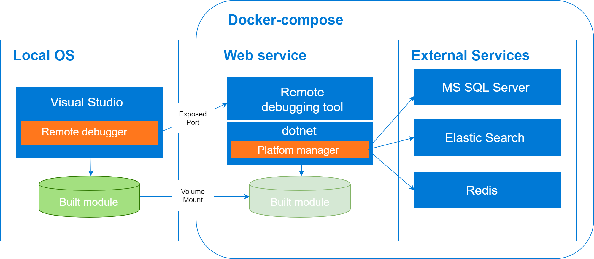
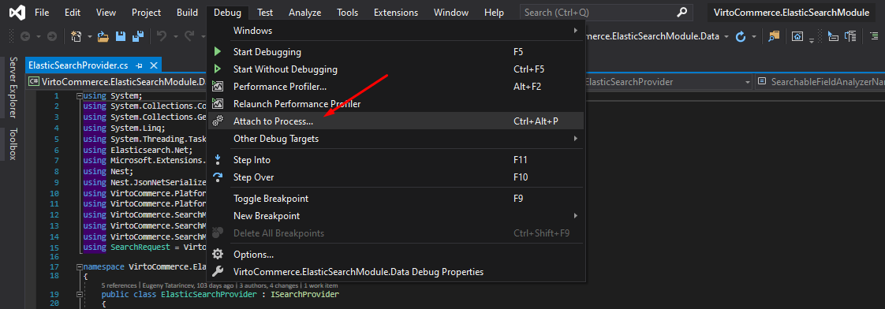

# Modules development via docker

## Overview

The main idea is to simplify the initial setup process for Virto Commerce (VC) module development environment. This will speed up the onboarding process for new engineers who join our team.
Developers would only need to install Docker and Visual Studio, but not external tools / services (VC Platform, SQL Server, Elastic Search, Redis). Coding is done in Visual Studio as usual, and the changes would be tracked and propagated from host to the container.

Read how to [Deploy module from source code](./deploy-from-source-code.md)

## Description

Virto Commerce Team have created [docker-compose.yml](https://github.com/VirtoCommerce/vc-platform/blob/dev/DockerCompose/ModulesDevelop/docker-compose.yml) to run VC Platform 2Manager web app.

VC Platform Manager web app was containerized as several services: Web service (Platform manager), External services for MS SQL Server, Elastic Search and Redis. It's run as a multi-container app and orchestrated by using _Docker Compose_.



> _Storefront_ and _Theme_ are not included in this solution.

Web service container is based on *virtocommerce/platform* latest Linux image.

The Developer writes and builds code for a new module in Visual Studio locally, on host machine. In order to ensure that any code edits on host machine are automatically propagated to the container, `./Modules` and `./App_Data/Modules` folders on host machine is automatically mapped to `/opt/virtocommerce/platform/Modules` and `/opt/virtocommerce/platform/App_Data/Modules` folders in the container. This is only possible through bind mounting. When a path in the host is mounted to a path in the container, the contents of the host directory will completely overwrite whatever is in the container directory, regardless of whether the container directory has files which were not present in the host directory at mount time. The result is that the container directory will be an exact snapshot of the host directory. This makes the development experience feel more natural. This is done by volume mapping in *docker-compose* file.

For the *docker* and *docker-compose* files configuring convenience, all configurable parameters have placed on separate *.env* file. In the *.env* file you can set values for:

* **PLATFORM_VERSION** - tag for required *virtocommerce/platform* image (default value `dev-linux-latest`)
* **MODULES_VOLUME** - path to the `./Modules` folder on host machine
* **APP_DATA_MODULES** - path to the `./App_Data/Modules` folder on host machine
* **DB_PASS** - SQl Server service password
* **REDIS_PASS** - Redis service password (default value `passwd@123`)
* **SEARCH_PROVIDER** - used in VC Platform search provider (default value ElasticSearch)

## Prerequisites

* You need to have some basic understanding of [Docker](https://docs.docker.com/get-started/), [Docker Compose](https://docs.docker.com/compose/gettingstarted/), and the key terms used in the ecosystem
* [Docker Desktop for Windows](https://docs.docker.com/docker-for-windows/install/) installed on your machine
* Create GitHub [personal access token](https://docs.github.com/en/github/authenticating-to-github/creating-a-personal-access-token)
* [Authenticate to GitHub Packages](https://docs.github.com/en/packages/using-github-packages-with-your-projects-ecosystem/configuring-docker-for-use-with-github-packages#authenticating-to-github-packages)

## How to install Docker for Windows

* For Docker installation, first review the information at Docker for Windows: [What to know before you install](https://docs.docker.com/docker-for-windows/install/#what-to-know-before-you-install)
* Install [Docker Desktop for Windows](https://docs.docker.com/docker-for-windows/install/) on your machine
* During installation you'll need to choose Linux as operating system used inside your containers

## How to use

1. Copy [ModulesDevelop](https://github.com/VirtoCommerce/vc-platform/blob/dev/DockerCompose/ModulesDevelop/) folder to local machine
2. Create an external network for the Docker engine

```cmd
docker network create nat
```

3. Parameterize values in the *.env* file.

```cmd
CMS_CONTENT_VOLUME=c:\path\to\folder\cms-content
APP_DATA_MODULES=c:\path\to\folder\modules
```

You can also parameterize the platform version and search provider in the .env file

```cmd
PLATFORM_VERSION=dev-linux-latest
...
SEARCH_PROVIDER=ElasticSearch
```

4. Build and launch `docker-compose` by command:

```cmd
docker-compose -f docker-compose.yml up --build -d
```

5. Run Virto Commerce Platform Manager (configure modules as sample data)
6. [Create new module](./create-new-module.md) as described in the article
7. Write code for new module
8. Build new module
9. Copy built module to `Modules` folder
10. Debug new module

## Run Virto Commerce Platform Manager

Once the containers are started, open VC Platform Manager - http://localhost:8090 . This will launch the application and install default modules. After modules have been installed you need to restart the container with the platform what gives you the opportunity to configure sample data.


## Copy built module to Modules folder

* Navigate to the `Modules` folder on local host
* Create folder for newly created module
* Copy `your_module_project.Web` folder to the created folder

## Debugging the module

* Build solution locally (press F6 in Visual Studio)
* Within Visual Studio, select the **Attach to Process** action in the Debug window:



* Chose **Connection type** **Docker(Linux Container)** (1)
* In opened window and press the **Find** button to find the remote connection(2)
* Select **virtocommerce.platform.web** container (3)
* Press **Ok** button (4)


* Once the container has been selected, then the running process can be attached. For debugging a .Net Core application select `dotnet` process:


If the new module has been rebuilt:

* Overwrite folder for newly created module by `your_module_project.Web`
* Restart the platform - click Setigns->Restart on Platform manager UI:


## Cleanup environment after debugging

When debugging process has finished, stop `docker-compose` by command:

```cmd
docker-compose down
 ```

Don't forget to delete newly created module from the `Modules` and `Modules\AppData` folders.

If you need to recreate platform database for next debug session, remove `db-volume` by command:

```cmd
docker volume rm db-volume
 ```

## How to

### Troubleshooting

* How to diagnose [Docker problems](https://docs.docker.com/docker-for-windows/troubleshoot)
* How to troubleshoot [Visual Studio Docker development](https://docs.microsoft.com/ru-ru/visualstudio/containers/troubleshooting-docker-errors?view=vs-2019)
