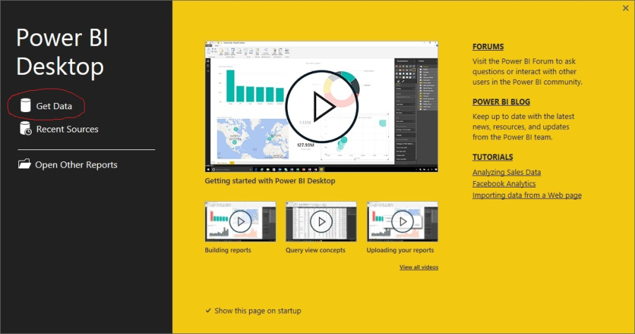
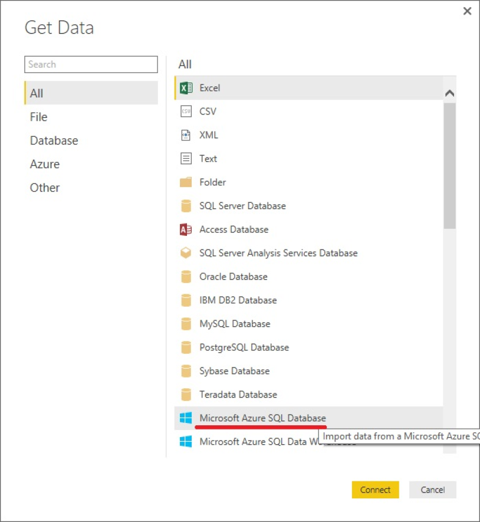
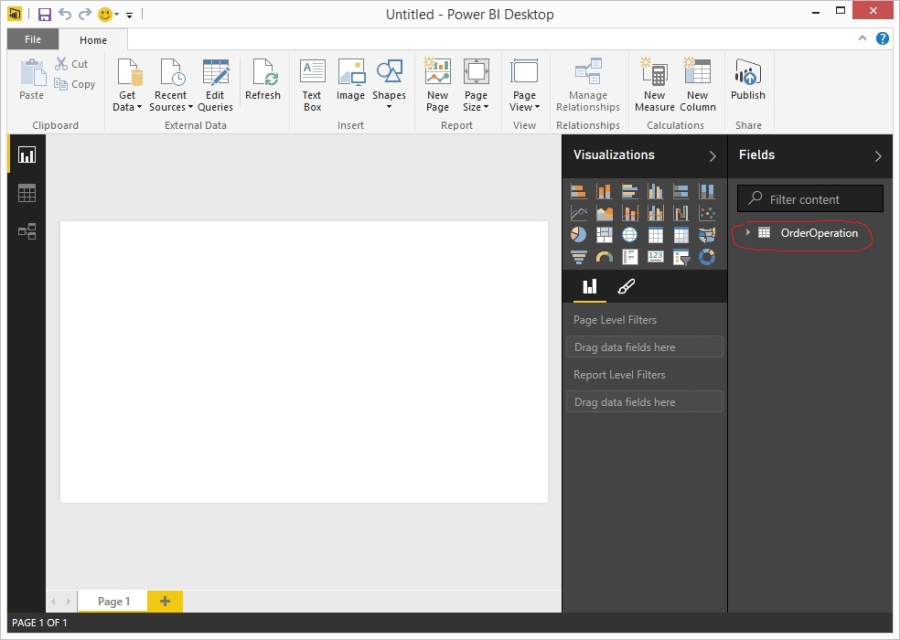
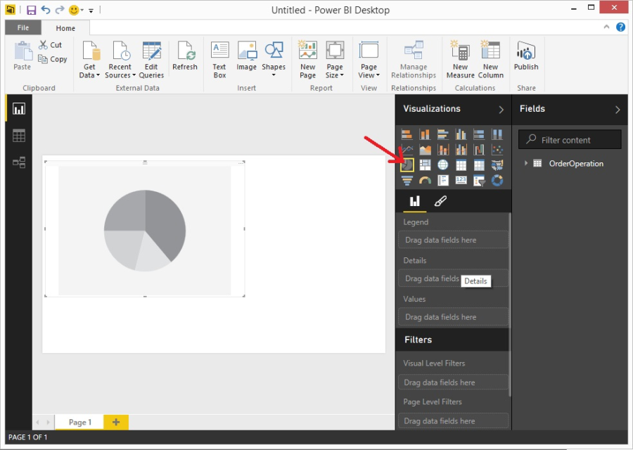
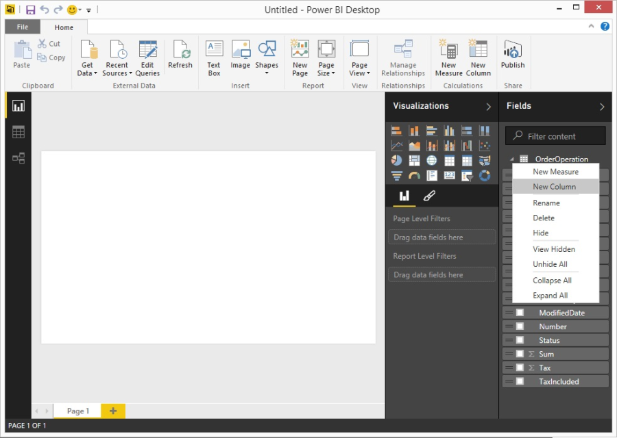
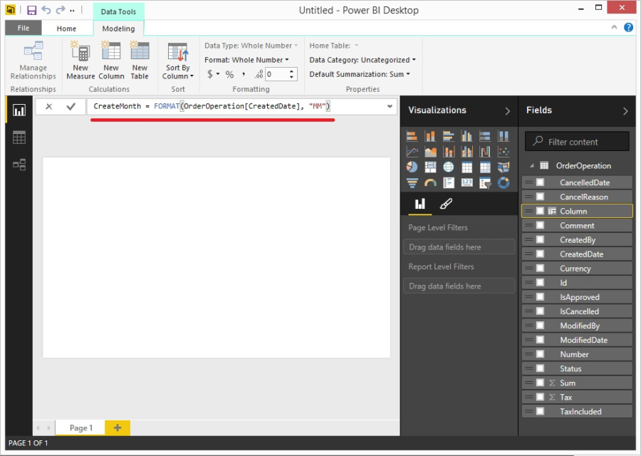
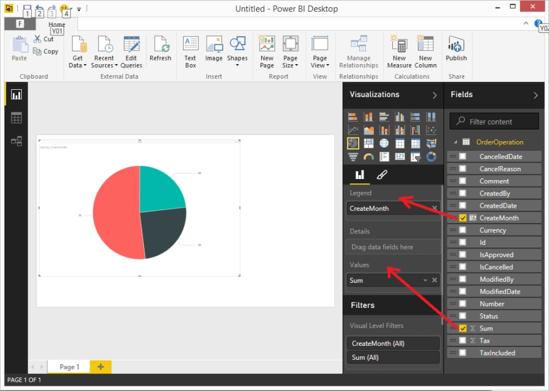

---
title: Microsoft Power BI
description: The article describes reporting in Virto Commerce with Microsoft Power BI
layout: docs
date: 2015-10-21T12:50:50.507Z
priority: 1
---
Product owner <a href="https://powerbi.microsoft.com/" rel="nofollow">Official website</a>

## Power BI desktop

Power BI desktop is a tool for data analysis, report construction and dashboards composing. The application has an intuitive user-interface with many features and provides a connection to popular data sources.

To install Power BI desktop go to <a href="https://powerbi.microsoft.com/en-us/desktop" rel="nofollow">https://powerbi.microsoft.com/en-us/desktop</a>.

  
Power BI desktop

## Connect Power BI desktop to Virto Commerce database

VirtoCommerce uses Microsoft Sql Server as the database server. To connect to a data source click "Get Data".

  
Power BI desktop

To connect to VirtoCommerce database use a standard connector for Microsoft Sql Server. Connection requires to enter Sql server address, username and password in the connection setup window.   
  
Connect to Microsoft SQL server

Setup VirtoCommerce database connection  
  
Define data source

Once connected, you can use a data source for data analysis.  
  
Data source

## Create a sample chart

Let's create an orders pie chart. Orders data is available in the OrderOperation table. To add pie click pie icon.  
  
Add pie chart

Add dimension by month by adding New column.  
  
Add calculated column

Define CreateMonth dimension.   
  
Define calculated column

Drag CreateMonth to Legend and drag Sum to Values   
  
Sample pie chart

We have created a simple pie chart. Learn more about other features provided by Power BI desktop on the <a href="https://powerbi.microsoft.com" rel="nofollow">official website</a>.

## Register Power BI

Use online Power BI for collaborative work. To register it go to <a href="https://powerbi.microsoft.com" rel="nofollow">https://powerbi.microsoft.com</a> and follow instructions.

## Publish to Power BI

If you have access to Power BI you can publish Workbook created in the desktop application. In order to do that click "Home" from the main menu and click submenu "Publish".
