---
title: Tableau
description: The article describes Virto Commerce reporting with Tableau
layout: docs
date: 2015-10-21T12:55:39.160Z
priority: 2
---
Product owner website: <a href="http://www.tableau.com/" rel="nofollow">Tableau Software</a>

## Tableau desktop

Tableau desktop is a tool for data analysis, reporting and dashboards composing. The application has an intuitive user-interface with many features and provides a connection to popular data sources.

To install Tableau desktop go to <a href="https://www.tableau.com/products/desktop" rel="nofollow">https://www.tableau.com/products/desktop</a>

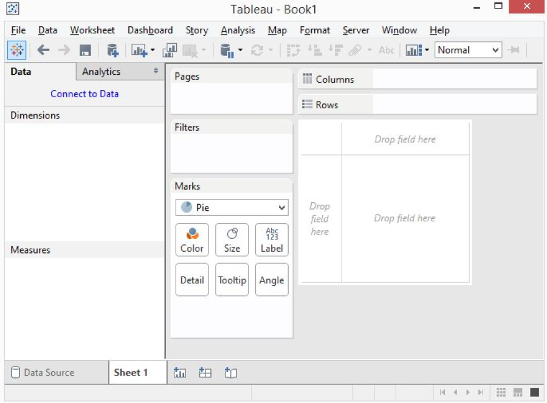
Tableau desktop

## Connect Tableau desktop to Virto Commerce database.

VirtoCommerce uses Microsoft Sql Server as the database server. To connect to a data source, click "Connect to Data".

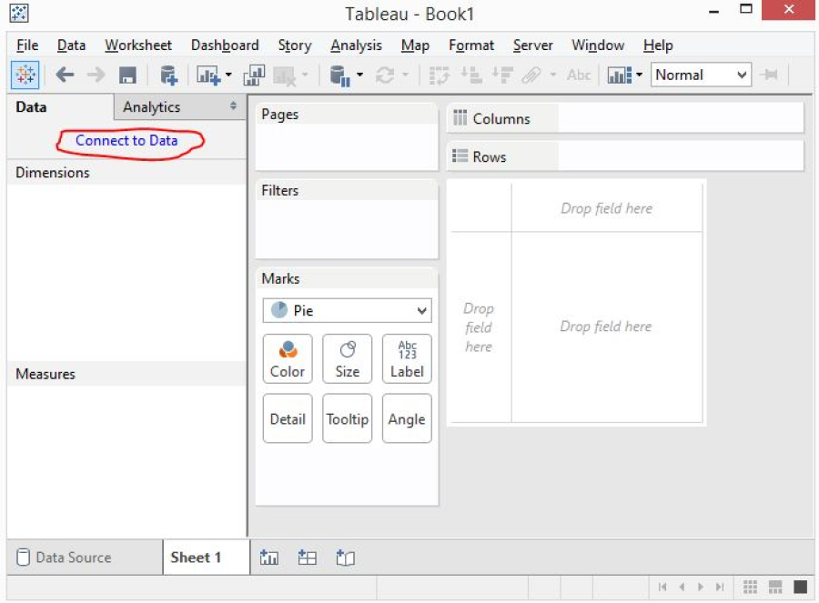  
Tableau desktop
  
To connect to VirtoCommerce database use a standard connector for Microsoft Sql Server. Connection requires to enter Sql server address, username and password in the setup window.

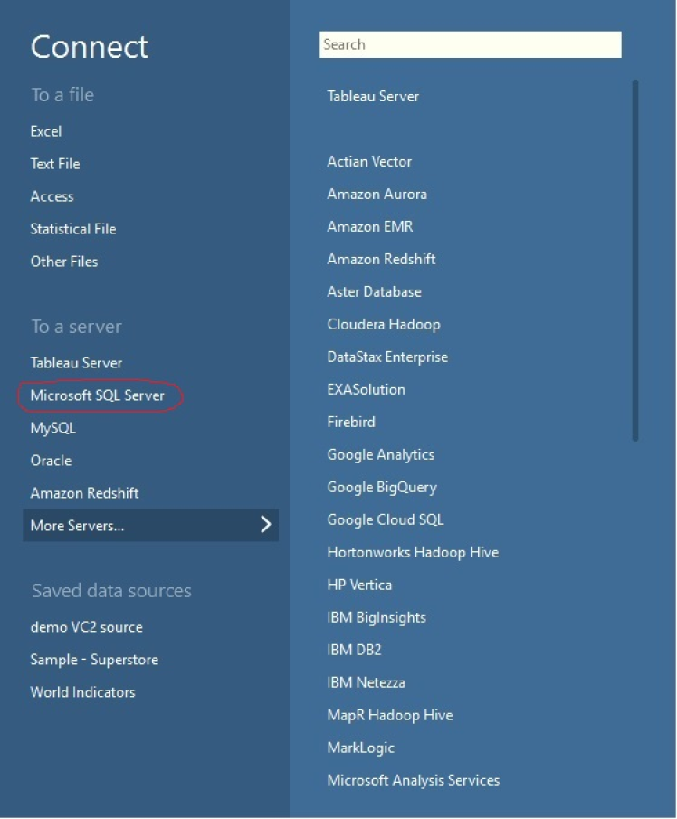  
Connect to Microsoft SQL server
  
Setup Virto Commerce database connection

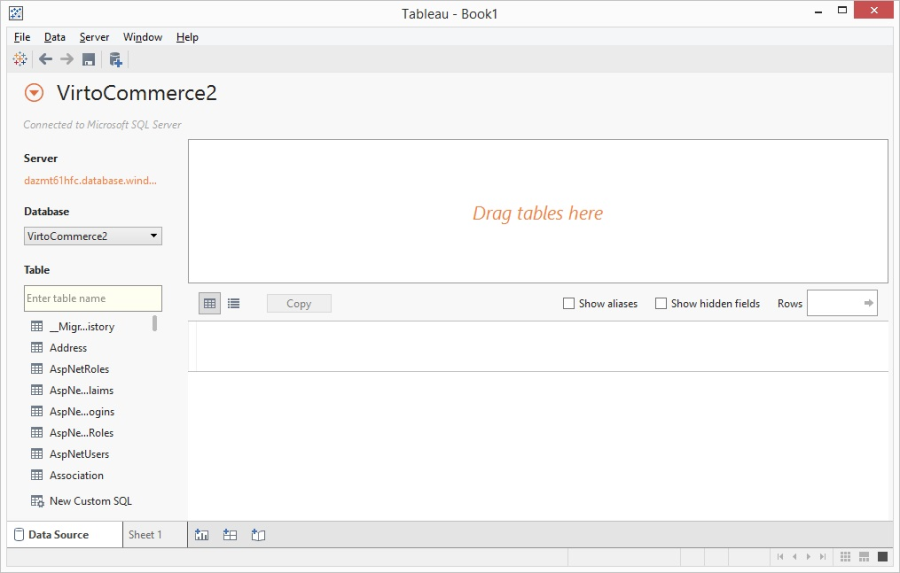  
Virto Commerce database

The Virto Commerce database is connected. The system is ready to get data and analyze by provided definition.

## Create a sample chart

Let's create an orders pie chart. Orders data is available in the OrderOperation table. Add data required for analysis:

Drag table OrderOperation to top placeholder.Set Extract data.Click Update data.

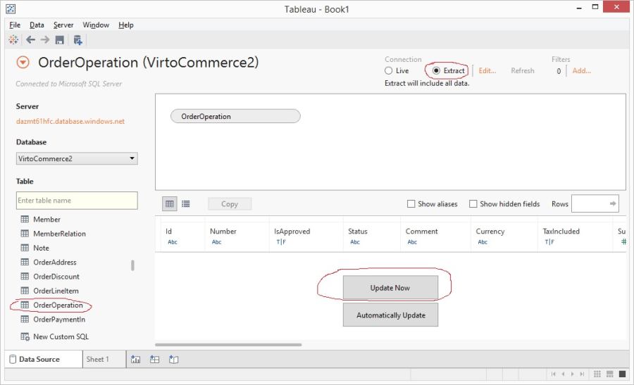  
Add data for analysis
  
To design chart go to Sheet tab.

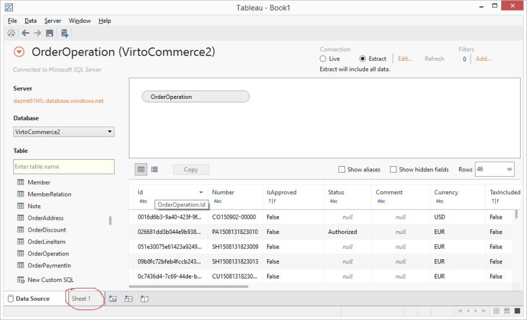  
Switch to Sheet
  
To define dimension drag CreatedDate field to Color widget. Default dimension is year. It is possible to change the dimension in the context menu.

  
Define dimensions

To define measure drag Sum to the pie chart

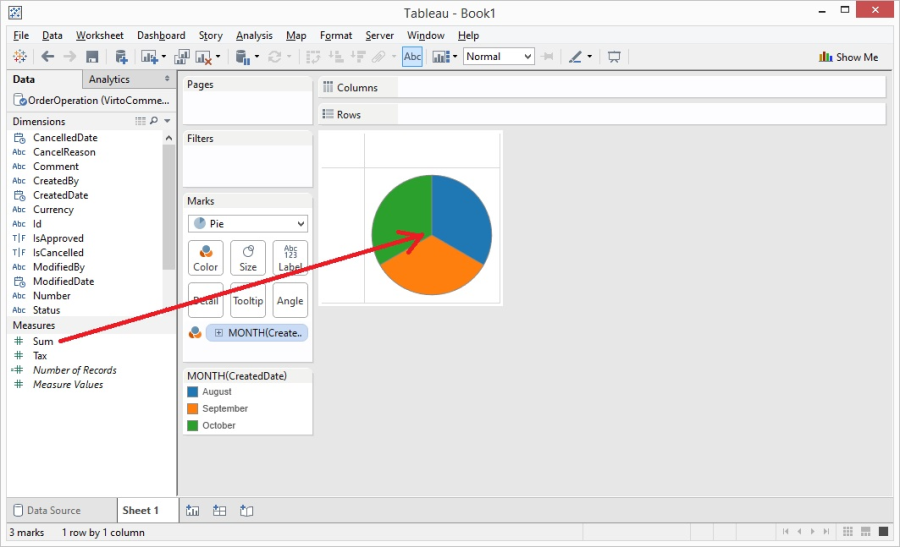  
Define measure

We have created a simple pie chart. Learn more about other features provided by Tableau desktop at the <a href="http://www.tableau.com/" rel="nofollow">official site</a>.

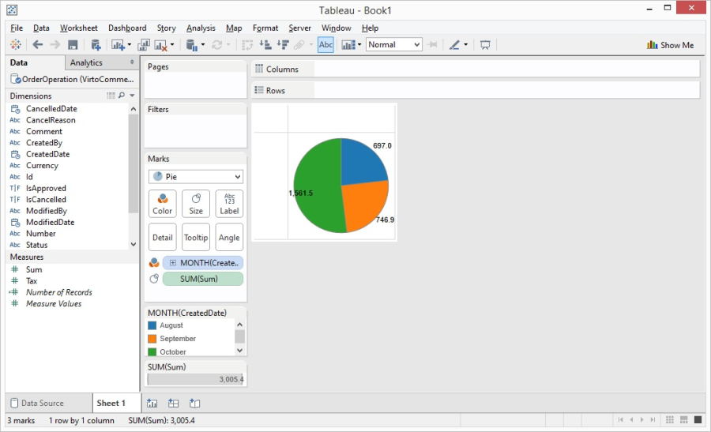  
Sample pie chart

## Tableau online

Tableau Online or Tableau Server are available for collaborative work. Go to Tableau online to register <a href="https://www.tableau.com/products/cloud-bi" rel="nofollow">https://www.tableau.com/products/cloud-bi</a>В and follow instructions.

## Publishing on Tableau online dashboard

If you have access to Tableau Online or Tableau Server you can publish Workbook created in the Tableau desktop application. To do this, click Server from the main menu and select Publish workbook from submenu in the dropdown. In the opened window enter Tableau Online or Tableau Server address and click Connect.

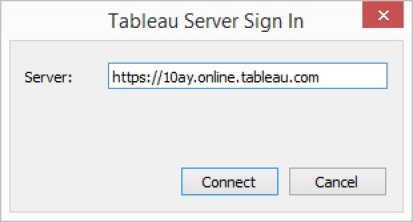  
Connect to Tableau online

In opened window set Project, Workbook Name and Description values and click Publish. You can configure permissions here or edit them later.

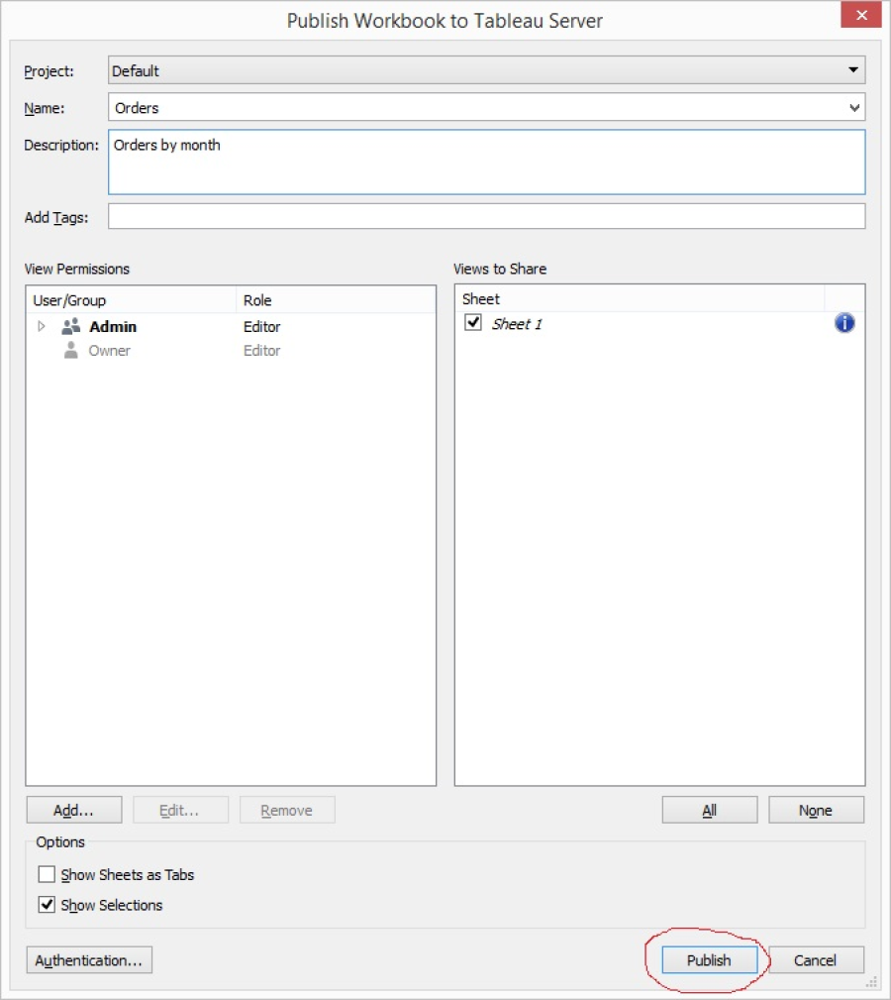  
Sample chart published

After the publication Workbook will be available online.

## Embedding Tableau chart to Virto Commerce admin

Reports and graphs that are published on Tableau Online or Tableau Server can be embedded to a Website, Wordpress, Excel, SharePoint etc. You just need to add a script to a web page. To generate a script of Tableau Online, click Share.   
  
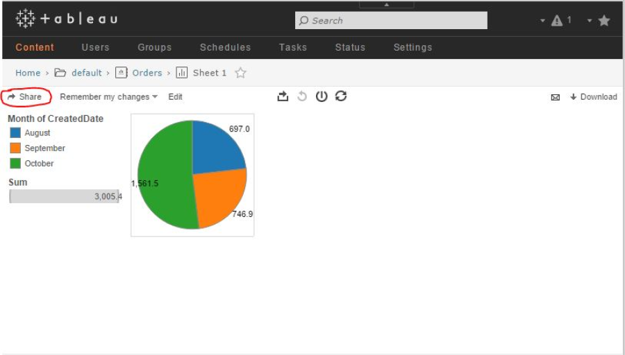  
Tableau online

In the "Share View" view you can set Display options and get the generated script.

  
Embed script

## Conclusion

In the document we showed how easy it is to setup Tableau to connect to VirtoCommerce and compose charts and reports based on the accumulated data. The resulting charts and reports can be shared online or emebedded to the VirtoCommerce admin dashboard.
