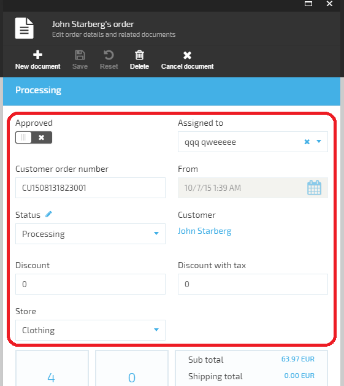

---
title: Metaform
description: The article about Angular JS component - metaform - a placeholder (container)В controlВ that renders UI content based on provided metadata
layout: docs
date: 2019-01-18T10:12:14.553Z
priority: 8
---
## Introduction and glossary

Most of the blades in Virto Commerce platform contain lists or data entry forms. Typically the data entry form is made of static HTML code with AngularJS bindings. This strategy comes with the following drawbacks:
* impossible to add new UI elements without changing the source code
* impossible to update existing UI without changing the source code
* most of the content is produced by copy-pasting HTML codeВ leading to maintenanceВ problems in the future. Data entry forms could potentially loose common "look and feel".

In order to eliminate the above, a new AngularJSВ component - metaform - was developed.

A **metaform** is a placeholder (container)В controlВ that renders UI content based on provided metadata.

AВ **meta-field**В is a JavaScript object defining metadata for a single logical element inside **metaform**В being rendered.

## Using metaform

MetaformВ is implemented as 'vaMetaform' AngularJS directive and has the following features:
* render UI elements in a rectangular area andВ typically should be placed inside a form
* has customizable column count. The rendering takes place from left to right (columns) and from top to bottom
* occupies allВ theВ available width and has auto height
* supports simpleВ inputВ types and customВ templatedВ elements as well.

```
<form>
  ...
  <va-metaform registered-inputs="blade.metaFields" blade="blade" column-count="2"></va-metaform>
  ...
</form>
```

|Parameter|Description|
|---------|-----------|
|registered-inputs|Reference to metadata (meta-fields)|
|blade|Reference to parent blade|
|column-count|Number of columns to arrange the rendered elements (optional)|

## Registering meta-fields

Meta-field registration directly in blade:

```
blade.metaFields = [
{
  name: 'isApproved',
  title: "Is approved",
  valueType: "Boolean",
  isVisibleFn: function (blade) {
    return !blade.isNew;
  }
},
{
  name: 'status',
  templateUrl: 'statusSelector.html'
},
{
  name: 'startDate',
  isReadonly: true,
  title: "Data created",
  valueType: "DateTime"
},
{
  name: 'customerId',
  title: "orders.blades.customerOrder-detail.labels.customer",
  templateUrl: 'customerSelector.html'
}];
```

Meta-field registration can also be done by using Platform-level factory. That way **any module can access and change** the fields displayed inside the metaform:
1. Reference **'platformWebApp.metaFormsService'** (as metaFormsService) in your module's **run** method;
1. Create meta-field definitions and register them using 'metaFormsService.registerMetaFields' method.

```
metaFormsService.registerMetaFields("accountDetails",
                [
                    {
                        name: "isAdministrator",
                        title: "Is admin",
                        valueType: "Boolean"
                    }
                ]);
```

## Meta-field data structure

Single meta-field has the following structure:

|Parameter|Description|
|---------|-----------|
|name|property name to bind to. It's bound to blade.currentEntity.<<name>> under the hood.|
|title|Label value. Can be simple text or a key to localized resource.|
|valueType|Type of auto generated input control. Supported values: ShortText, LongText, Integer, Decimal, DateTime, Boolean, SecureString, Url, Email, Html.|
|isRequired|The *required* property value of auto generated input control. (*false* by default)|
|isReadonly|The flag to disable value changing of auto generated input control. (*false* by default)|
|templateUrl|URL for custom content template. If specified, this template is rendered instead of auto-generated content.|
|isVisibleFn|Function to control meta-field visibility. Meta-field gets rendered only if this function returns *true* or this function is not defined.|

## Samples

Metaform is currently used in [MemberExtensionSample](https://github.com/VirtoCommerce/vc-samples),В [Order](https://github.com/VirtoCommerce/vc-module-order) and other modules.


Sample order details view in Orders module. Content generated using metaform outlined by red rectangle.
