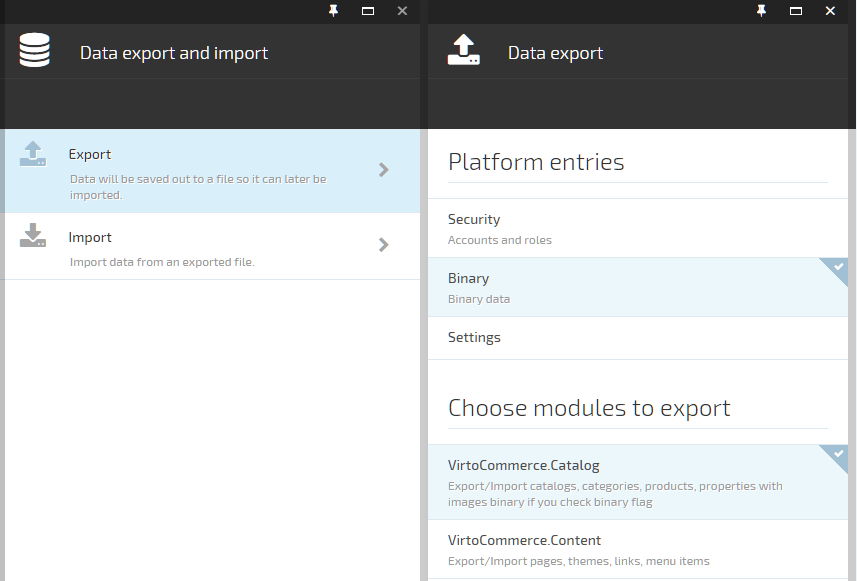
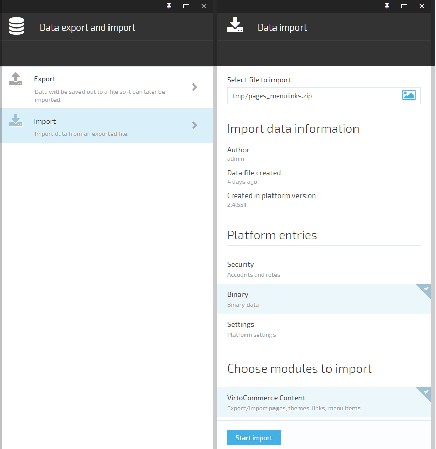

---
title: Platform Export & Import
description: The article about Virto Commerce platform export & import
layout: docs
date: 2015-08-25T07:39:44.677Z
priority: 5
---
**Virto Commerce platform** simplifies the process of data migration by letting you use **platform export & import**. An export is a zip file that contains the platform, modules data and configuration. When you start the **Virto Commerce platform** for the first time, you can select the sample data that best matches the type of store you want to set-up, or, you need to to perform a staging and production installation and migrate data from staging to production; this will also work for export & import.  

Below, is a short list of common use cases for when the platform export & import function may be helpful.
* Initial sample data initialization
* Staging to productions data update 
* Support can be easy when you share your data through a public transport channel (email, ftp, skype)
* Back up tasks (without any infrastructure knowledge)

This article describes how to use platform export & import.

## Platform export & import key principles

### Export & Import data selection:

You manually choose the specific concrete data you want exported or imported, there is a full list of options.
* Security data including platform account and ACL
* Binary data, allows to you to handle binary data for selected modules
* Settings, handle all settings for selected modules
* Modules, you can select a concrete module or modules using dependency information to export or import data

### Structure of export package

**Manifest.json** - service information, such as version, creation date, list of modules, specific data included in this file

**PlatformEntries.json** include platform data 

* Manifest.json - service information like a version, creation date, list of modules with versions and specific data included in this file
* security information - users, ACL (roles, assignments), passwords etc
* platform settings and dynamic properties definition

**Module-id.json** all serialized module data could contain binary data

### Import conflict resolution:

Because each module has a personal import functionality implementation, conflict resolution depends on realization, but for built in platform realization used (source win) conflict resolution, without aggregate objects deletion (this means that only nested objects can be deleted within one object).

That means if you try to import 2 orders (order1, order2 ) to target system with 3 orders (order1, order2, order3) system update only (order1 and order2, order3 will be unchanged).

## UI explanation

Export blade where you can choose export details and start export process



Import blade where you can upload imported package and choose data for import



## Add support platform export & import to your module

To enable export & import feature to module you need to inherit you module class from the **ISupportExportImportModule** interface.

```
public class Module : IModule, ISupportExportImportModule
{
  ....
  #region ISupportExportImportModule Members
  public void DoExport(Stream outStream, PlatformExportManifest manifest, Action<ExportImportProgressInfo> progressCallback)
  {
    //Do some export code here
  }

  public void DoImport(Stream inputStream, PlatformExportManifest manifest, Action<ExportImportProgressInfo> progressCallback)
  {
    //Do some import code here
  }

  public string ExportDescription
  {
    get
    {
      //Module description in export & import UI getting from manifest
      var settingManager = _container.Resolve<ISettingsManager>();
      return settingManager.GetValue("MyModule.ExportImport.Description", String.Empty);
    }
  }
  #endregion
  ....
}
```
