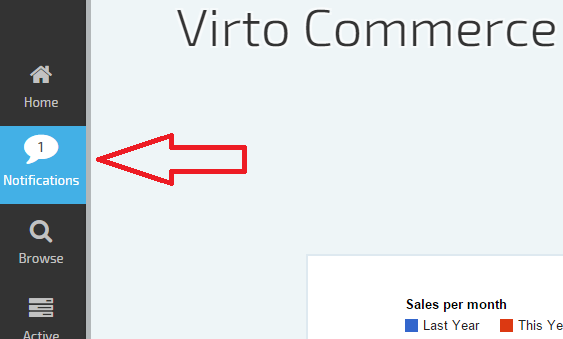
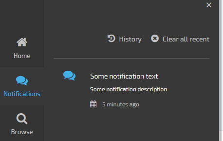
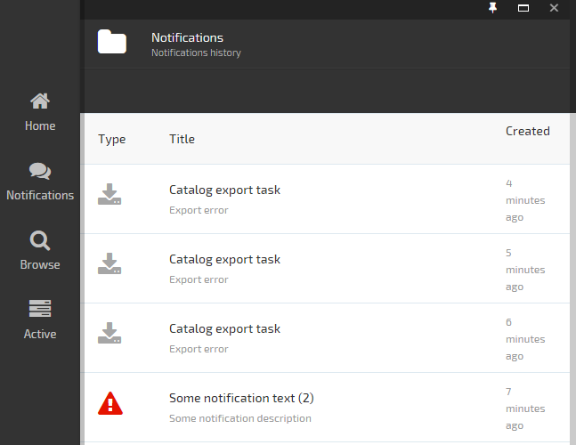
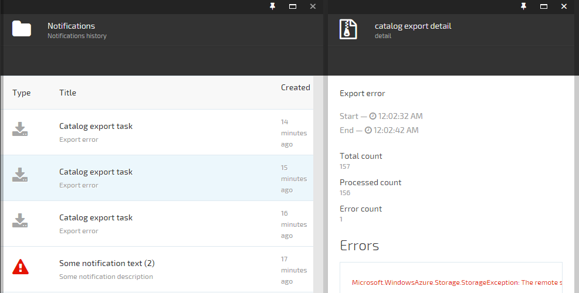

---
title: Push notifications
description: There can be various situations when the system needs to send messages to it's users - even if it's a data export progress report, the data retrieval is taking longer then expected or a popular item in stock is getting low. Or, an important event happened in the system's back-end and it has to be reported directly to the web administration console. This feature is called "push notifications" and we include it as an integral part of the Virto Commerce platform. Push notifications are accessible directly from the administrator UI main menu and every new notification makes the menu to flash
layout: docs
date: 2015-09-09T00:15:34.217Z
priority: 6
---
There can be various situations when the system needs to send messages to it's users: even if it's a data export progress report, the data retrieval is taking longer then expected or a popular item in stock is getting low. Or, an important event happened in the system's back-end and it has to be reported directly to the web administration console. This feature is called "push notifications" and we include it as an integral part of the Virto Commerce platform. Push notifications are accessible directly from the administrator UI main menu and every new notification makes the menu to flash.

We're using [ASP.NET SignalR](http://signalr.net/) library under the hood.

## Push notifications in Web administration console

Notification icon is always visible as it's in the main menu. A bright background indicates that an unread message is awaiting:


Click it to get a quick overview of recent messages:


Note that this also clears the flashy menu. Select a particular message for details or click "History" for a full list:


Viewing message details:


## Custom appearance for push notifications

Virto Commerce platform provides default templates for displaying push notifications. In addition to this, a developer can add custom templates and override these as needed. The notifications list is composed of independent template items.

```
var menuExportTemplate =
{
  priority: 900,
  satisfy: function (notify, place) { return place == 'menu' && notify.notifyType == 'CatalogExport'; },
  template: 'Modules/$(VirtoCommerce.Catalog)/Scripts/blades/export/notifications/menuExport.tpl.html',
  action: function (notify) { $state.go('notificationsHistory', notify) }
};
notificationTemplateResolver.register(menuExportTemplate);
```

Notification engine selects and applies a template for every received notification individually, based on 'satisfy' function and 'priority'. The specific parameters passed to satisfy function:

* **notify**: the received push notification;
* **place**: the targeted location name while resolving which template to apply.

Possible values are **menu** and **history** this means the template is designed for a menu or a full notifications (history) list respectively.

## Responding to received push notification event

Every time when a push notification is received from the server, the platform updates the notifications menu AND broadcasts a **new-notification-event** event. Your custom angularJS code can subscribe to it and react accordingly. 

```
$scope.$on("new-notification-event", function (event, notification) {
  if (blade.notification && notification.id == blade.notification.id) {
    angular.copy(notification, blade.notification);
  }
});
```

## Push notification Web API

Push notification Web API provides methods for inserting/updating (upserting), reading and marking all notifications as read:

```
angular.module('platformWebApp')
.factory('platformWebApp.notifications', ['$resource', function ($resource) {
  return $resource('api/notifications/:id', { id: '@Id' }, {
    markAllAsRead: { method: 'GET', url: 'api/notifications/markAllAsRead' },
    query: { method: 'GET', url: 'api/notifications' },
    upsert: { method: 'POST', url: 'api/notifications' }
  });
}]);
```

Platform uses this API intensively and **platformWebApp.notificationService** factory also provides helper/shortcut methods for upserting a notification:

```
error: function (notification) {
  notification.notifyType = 'error';
  return innerNotification(notification);
},
warning: function (notification) {
  notification.notifyType = 'warning';
  return innerNotification(notification);
},
info: function (notification) {
  notification.notifyType = 'info';
  return innerNotification(notification);
}
```

## Push notification API

Your custom modules can take advantage of the push notifications infrastructure from the managed code as well. Use INotifier interface for notifications management on the server side.

```
public interface INotifier
{
  void Upsert(NotifyEvent notify);
  NotifySearchResult SearchNotifies(string userId, NotifySearchCriteria criteria);
}
```

Just get reference to INotifier instance from Unity IoC and you're ready to go.
