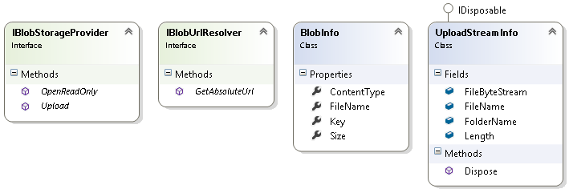

---
title: Storage of files
description: The article describes file storage in Virto Commerce
layout: docs
date: 2015-09-09T00:24:50.250Z
priority: 7
---
Store and manage files. Use asset managing providers to store files in Azure or local file system.

## Introduction

All resources available in Virto Commerce are referred to as assets. The most common asset is image, but it's not limited to that. An asset can be any file, electronic document, multimedia content, etc. They are accessed from storefront and Web Admin as well.В Assets are grouped into folders and form a (logical) hierarchy structure. The physical asset storage medium is not limited and currently Virto Commerce providesВ *file system*В and *Windows Azure Blob Storage* based implementations.

You can upload, download, or view the metadata of the assets by implementing Virto Commerce API interfaces or by using already provided implementations. The API provides an IBlobStorageProviderВ interface for working with assets.

## Asset class diagram

You can see the main entities depicted in the diagram below:
* **BlobInfo**В - asset metadata information;
* **IBlobUrlResolver**В - provides assets full path by its key;
* **IBlobStorageProvider**В - an interface for working with assets. It defines the methods that are available for asset manipulations;
* **UploadStreamInfo**В - a class passed as a parameter to IBlobStorageProvider. Upload method. Contains information about the asset being uploaded together with it's content.



## Asset uploading using code

First you need to create and fill it with data UploadStreamInfo object. Afterwards pass it to the IBlobStorageProvider's Upload implementation.

Asset (file) uploading could be a long running process depending on the file size, connection bandwidth, etc. and it should be done in a separate process:

```
//_blobStorageProvider is IBlobStorageProvider implementation object
...
usingВ (var info =В newВ UploadStreamInfo())
usingВ (var fileStream =В newВ FileStream(fullFileName, FileMode.Open, FileAccess.Read))
{
  info.FileName = fileName;
  info.FileByteStream = fileStream;
  info.Length = fileStream.Length;
  _blobStorageProvider.Upload(info);
}
...
```

fullFileName is a file name with a full path on the local file system of the file being uploaded.fileName is the name the uploaded asset will be assigned.

## Asset downloading using code

Asset content downloading is performed as:

```
var stream = _blobStorageProvider.OpenReadOnly(assetKey);
```

This should be done in a separate process as described in the uploading section.

## Working with asset API

Virto Commerce provides the client API for working with assets. It allows you to upload assets. Below you will find out how to use it.

## Uploading asset using API

Uploading the asset using the Virto Commerce asset API is easy. Use upload POST request to **~/api/assets** passing asset(s) to be uploaded in the request body.

The response to the upload POST request will be an array of BlobInfo objects, this is information that has been successfully uploaded to the storage asset blobs.

POST Response example (json):
Say we uploaded file1.jpg file to the server. The json formatted response would be as presented below:

```
[
  {
    "relativeUrl": "catalog/f8980500-5fd2-4aba-bb47-aa33fbd60197.jpg",
    "url": "http://virtotest.blob.core.windows.net/catalog/f8980500-5fd2-4aba-bb47-aa33fbd60197.jpg",
    "name": "f8980500-5fd2-4aba-bb47-aa33fbd60197.jpg",
    "size": "1 MB",
    "mimeType": "image/jpeg"
  }
]
```

## Asset provider configuration

There are two asset storage providers implemented in Virto Commerce out-of-the box. File system storage provider and Azure blob storage provider.

In order to set up the specific storage provider you need to set storage connection properties, you need to configure AssetsConnectionString connection string.

Asset provider connection string should be set in **connectionStrings.config** configuration file.

There are different properties in the storage provider connection string depending on it’s type.

### Local storage provider’s properties

* **provider**=LocalStorage - constant that sets the storage to File system;
* **rootPath**=~/App_Data/Assets - the local physical path for storing assets;
* **publicUrl**=[http://localhost/admin/Assets](http://localhost/admin/Assets) - public url for assets folder;

Example:

```
<add name="AssetsConnectionString" connectionString="provider=LocalStorage;rootPath=~/App_Data/Assets;publicUrl=[http://localhost/admin/Assets](http://localhost/admin/Assets)" />
```

Make sure the **publicUrl** related to the specified physical directory **rootPath** parameter is accessible through IIS. If it is not accessible you need to create a virtual folder **Asset** in the IIS configuration manager and point to the specified physical directory.

### Azure storage provider’s properties

* **provider**=AzureBlobStorage - constant that states that the storage is Azure blob storage;
* **DefaultEndPointsProtocol**=http - protocol to get to Azure blob storage;
* **AccountName** - Azure blob storage account name (can be found in azure account management portal);
* **AccountKey** - Azure blob storage account key (can be found in azure account management portal);

Example:

```
<add name="AssetsConnectionString" connectionString="provider=AzureBlobStorage;DefaultEndpointsProtocol=http;AccountName=azureAccountName;AccountKey=Abc1deF8g0*******************************************==" />
```
