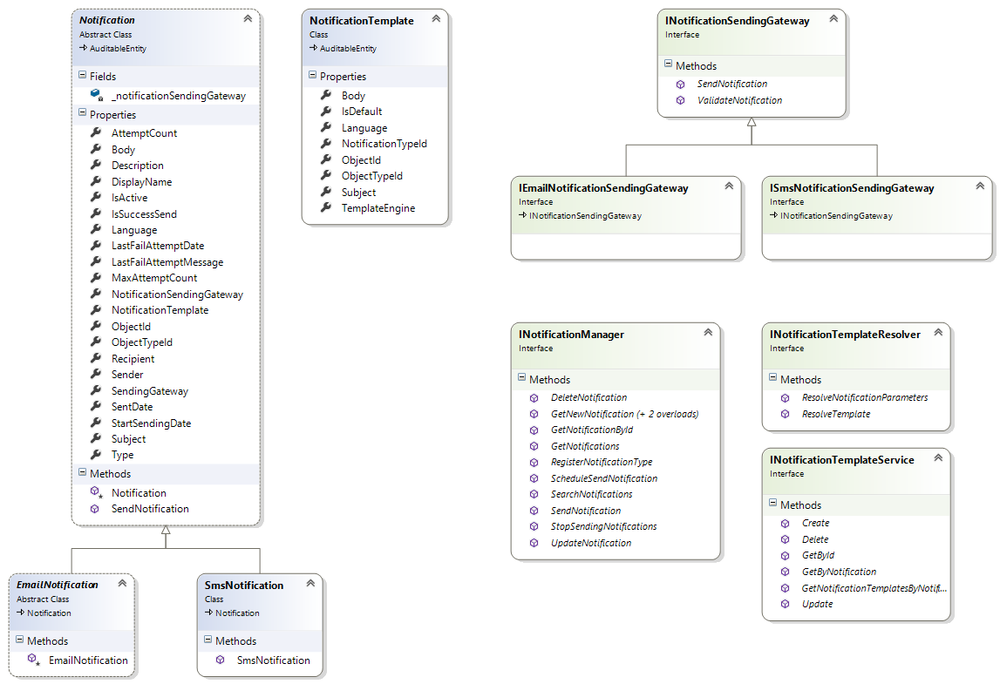
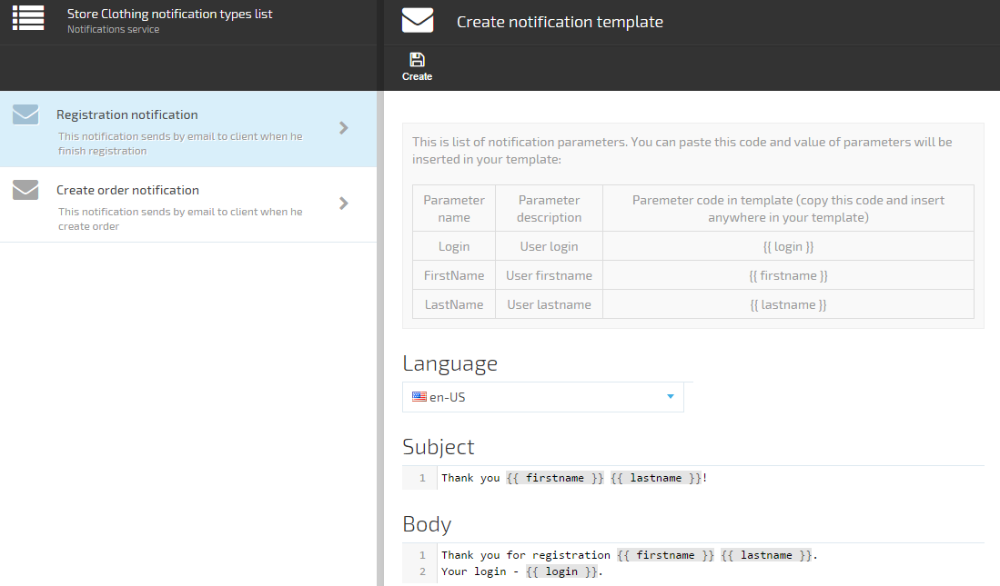
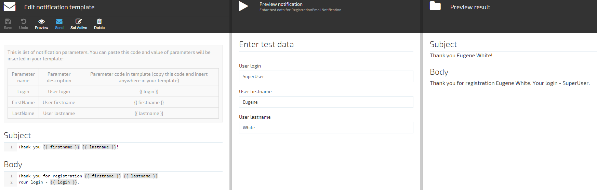

---
author: VirtoCommerce
category: virtocommerce-docs
date: 2017-05-11
excerpt: The developer guide to Virto Commerce notification system
tags: [ docs, commerce, demo, ecommerce, sdk, notifications ]
title: 'Working with notifications'
layout: docs
---
## Introduction

Over the course of any given IT project it is not uncommon that situations arise when users need to be reminded of an event, notified of an abandoned shopping cart or receipt of payment.

The task seems to be simple at a first glance. Simply create an email message and send it to the recipient. But lets take a closer look at the task and see what else we might need:
1. Sending notifications using different transmission channels (email, sms, etc) - wed like to be able to use the customers preferred method of receiving notifications instead of relying exclusively on emails.
1. Send messages in customers native language and depending on the type of the service the notification is for e.g. : business user order notifications vs consumer purchase order notifications.
1. Allow ability to preview how the message will look when customer receives it.
1. Scheduled notifications to be sent according to customer time zones and transport channel (users dont like to receive SMS messages when asleep).

Now a simple task doesnt look that simple anymore and its implementation can take quite an effort and become time consuming.

In this article Ill try to explain the notification system that was created for a Virto Commerce product where we encountered all the issues described above. This implementation can be easily adopted and used in other solutions.

Lets start with a class model diagram.

## Class Model explanation



Here, main abstract class **Notification** is a base class for all types of notifications. In the system each notification is represented by its own type (SmsNotification, EmailNotification) which simplifies using it from the code.

Notification properties marked with **NotificationParameterAttribute** attribute can be used in the render template and will be replaced in runtime with real object values.

The main class for working with notifications is **INotificationManager**. It is used to register new notification types, get the notification list and creating a notification instance. It is also used for immediate or delayed notification sending. One more task that **INotificationManager** solves is access to delivery journal and provides a method to abort notification sending.

**INotificationTemplateService** is used for working with notification templates. It implements standard CRUD and Search operations.

**INotificationTemplateResolver** - responsible for rendering subject and body of notification, it is based on the template and notification object instance.

**INotificationSendingGateway** - responsible for actual sending of the message and validation.

## How to send notification using code

Before notification can be sent, it's fabric needs to be registered in the manager. For example, lets define a new notification **SampleEmailNotification**:

```C#
public class SampleEmailNotification : EmailNotification
{
   public SampleEmailNotification(IEmailNotificationSendingGateway emailNotificationSendingGateway) : base(emailNotificationSendingGateway)
   {
   }

   /// <summary>
   /// Sample property
   /// </summary>
   [NotificationParameter("Sample property")]
   public string SampleProperty { get; set; }
}
```

**NotificationParameter** here defines the parameter name that can be used in the notification template.

Registering notification fabric in **NotificationManager**:

```C#
notificationManager.RegisterNotificationType(() => new SampleEmailNotification (container.Resolve<IEmailNotificationSendingGateway>())
{
    NotificationTemplate = new NotificationTemplate
    {
        Body = "Sample notification body. {{ sample_property }}",
        Subject = "Sample notification subject. {{ sample_property }}"
    }
});
```

After that notification becomes available for use in the code. Notice that the property was converted from Camel notation to lowercase and underscores. This is because of the DotLiquid engine we use in this template and because it uses Ruby notation for all the properties.

To send notification immediately use the method SendNotification from NotificationManager. For example:

```C#
var notification = _notificationManager.GetNewNotification<SampleEmailNotification>();
notification.SampleProperty = "Sample property";
notification.Recipient = "test@example.com";
notification.IsActive = true;
_notificationManager.SendNotification(notification);
```

Method **SheduleSendNotification** in **NotificationManager** allows delayed sending of notification. For that you will need to set the time when the message should be sent like this:

```C#
notification.StartSendingDate = DateTime.UtcNow().AddDay(1);
_notificationManager.ScheduleSendNotification(notification);
```

## Notification templates

Each notification has its own template (**NotificationTemplate**) which is responsible for notification contents and consists of a view template with placeholders.

Different markup languages (Razor, Liquid etc) can be used for view templates. In this implementation we chose to use [liquid](http://liquidmarkup.org) template syntax and templates created with it are processed using a [dotliquid](http://dotliquidmarkup.org) library (a .net library for a popular ruby view engine).

There is also built in support for a separate template per language and instance of the object. For example you can define different template for the same order confirmation notification per shop and language.



Figure 1 - Screen notification template edit

When editing a template, one can preview how the content will look and when it is delivered. For that you will need to set values for notification properties used in the template:



Figure 2 - Notification preview

## Missing features

Currently the template engine doesnt support attachments

