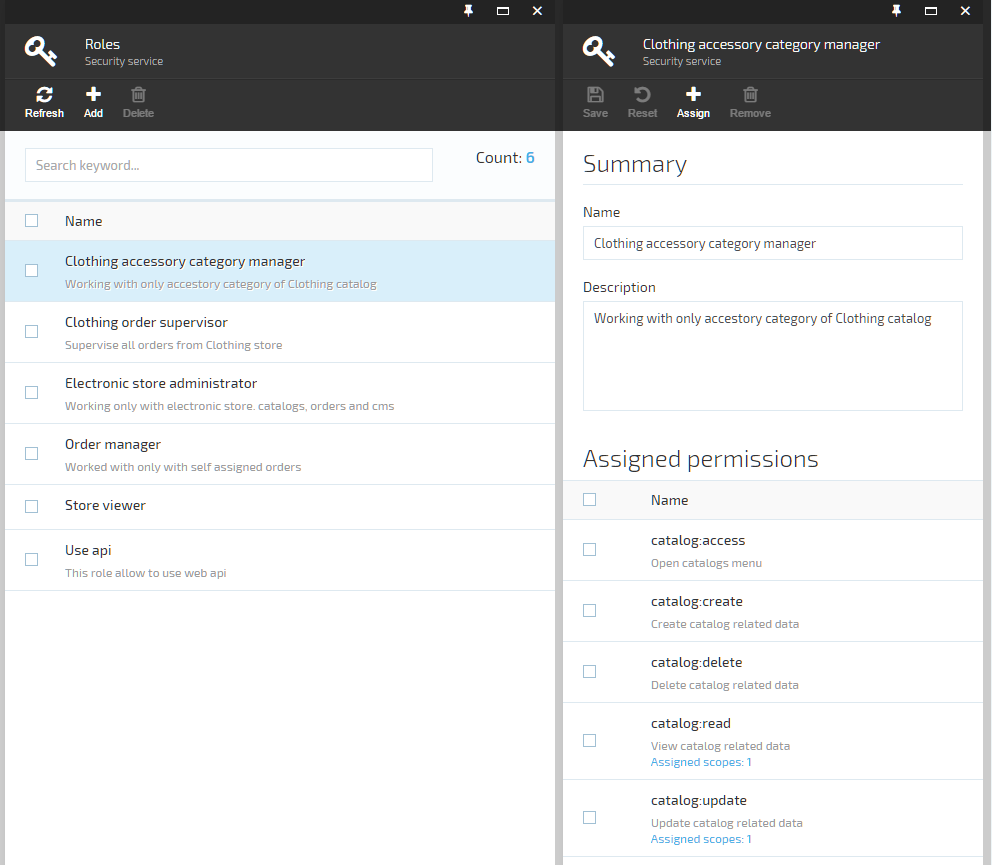
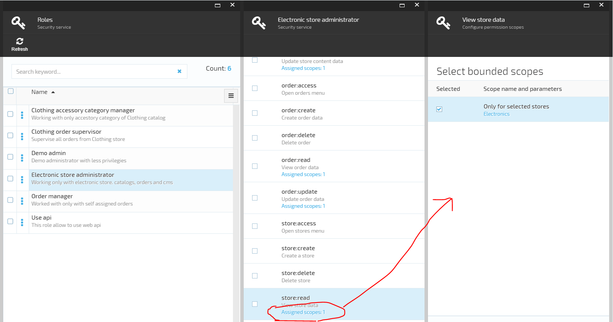

---
title: Working with platform security
description: The developer guide to Virto Commerce platform security
layout: docs
date: 2015-11-16T15:20:18.343Z
priority: 10
---
## Role-based Permissions 

Role-based security allows Virtocommerce administrators to group users into roles for security purposes. Each role can be defined with specific granular permissions to allow access to different functionality within the software. For example, administrators can now establish roles that would allow users access to specific objects or access the **Rebuild index** button, and much more.

Security system composed from three main entities

* **Permissions** is a basic unit in securty system. It describes particular right of action and has a string presentation which is used in permission checks.
* **Roles** are used to collect permissions that define a particular function within the platform, according to a particular scope. Roles can grant permissions to various functions within platform. A roles is basically just a collection of permissions. Users that are assigned to the role will inherit these permissions. 
* **Scopes** are used to restrict permissions to concrete conditions or objects.


Figure 1. Role management and user roles assignemnt UI

## Bounded scopes (scope bounded ACL)

Used in situation when you need to restrict user access to particular objects (manually selected or selected by condition). For example: Restrict access to the specified stores or allow update orders only by responsible users.

Then a 'global' check permission still insufficient necessary context, as context in our system used special formated strings 'scopes' obtained from different objects. That scopes assigned to permissions within role and  will be used in future permission checks.

### Declaring new scope

To start use the scope for bounded permissions in the role management UI  you  should do the following steps

in management code define scope class derived from **PermissionScope** and register in special service **IPermissionScopeService** in UI script code define presentation for new scope, that UI will be used for permission scope management

```
/// <summary>
/// Restricted to permission within selected stores
/// </summary>
public class StoreSelectedScope : PermissionScope
{
  public override bool IsScopeAvailableForPermission(string permission)
  {
    return permission == StorePredefinedPermissions.Read || permission == StorePredefinedPermissions.Update;
  }

  public override IEnumerable<string> GetEntityScopeStrings(object obj)
  {
    if (obj == null)
    {
      throw new ArgumentNullException("obj");
    }
    var store = obj as Store;
    if (store != null)
    {
      return new [] { Type + ":" + store.Id };
    }

    return Enumerable.Empty<string>(); ;
  }
}
```
```
public override void PostInitialize()
{
  //Register bounded security scope types
  var securityScopeService = _container.Resolve<IPermissionScopeService>();
  securityScopeService.RegisterSope(() => new StoreSelectedScope());
}
```
```
//Register permission scopes templates used for scope bounded definition in role management ui
var selectedStoreScope = {
  //scope type name
  type: 'StoreSelectedScope',
  //title wich will be displayed in ui
  title: 'Only for selected stores',
  //function called when user click on scope in permission scops lists (this scope will display all stores registerd in the system and allow the user make selection)
  selectFn: function (blade, callback) {
    var newBlade = {
      id: 'store-pick',
      title: this.title,
      subtitle: 'Select stores',
      currentEntity: this,
      onChangesConfirmedFn: callback,
      dataPromise: stores.query().$promise,
      //use standart control for linear selection
      controller: 'platformWebApp.security.scopeValuePickFromSimpleListController',
      template: '$(Platform)/Scripts/app/security/blades/common/scope-value-pick-from-simple-list.tpl.html'
    };
    bladeNavigationService.showBlade(newBlade, blade);
  }
};
scopeResolver.register(selectedStoreScope);
```


Figure 2. New **StoreSelectedScope** in role management UI

## Working with security permissions

Virto Commerce Platform provides the following infrastructure for permissions:
* Declaring new permissions in the module manifest
* UI for grouping permissions to roles and assigning roles to users
* Service for checking permissions in managed code
* Service for checking permissions in JavaScript

### Declaring new permissions

Each module can introduce new permissions by declaring them in module manifest.

```
<module>
  ...
  <permissions>
    <group name="Search">
      <permission id="MyModule:access" name="access to module ui" description="here may be more detailed description"/>
      <permission id="MyModule:update" name="update my module data"/>
      <permission id="MyModule:read" name="read my module data"/>
    </group>
  </permissions>
</module>
```

|Element|Description|
|-------|-----------|
|**permissions**|The root element for all permissions. Can contain multiple <group> elements.|
|**group name="..."**|Defines a named group of permissions. Can contain multiple <permission> elements.|
|**permission**|Defines a permission|
|**@id**|The system name of the permission. It is used in code to check if a user has this permission.It is recommended to include module ID in permission ID like this: ModuleId.Category:Permission. For Example, VirtoCommerce.Search:Debug.|
|**@name**|The user friendly name of the permission which is shown in UI.|
|**@description**|The description of the permission which is shown in UI.|

## Security checks

Virtocommerce platform has a two level security checks

* API  layer security check
* UI (manager) layer security check

### Check permissions in managed code (API services)

There are two ways to check if a user has a permission: apply **CheckPermissionAttribute** to API controller or it's method or call **IPermissionService** directly.

In the following example a user must have:
* **MyModule:access** permission to call any method of MyApiController (checked with attribute)
* **MyModule:read** permission to call UpdateData method (checked with attribute)
* **MyModule:update** permission to update data (checked by direct call to permission service in specific scope)

If user has no permission which is checked by attribute, they will receive the **401 Unauthorized** response.

```
using VirtoCommerce.Platform.Core.Security;
 
[CheckPermission(Permission = "MyModule:access")]
public class MyApiController : ApiController
{
  private readonly ISecurityService _securityService;
  private readonly IPermissionScopeService _permissionScopeService;

  public MyApiController(ISecurityService securityService, IPermissionScopeService permissionScopeService)
  {
    _permissionService = securityService;
    _permissionScopeService = permissionScopeService;
  }
 
  //this method demonstrate how can filter resulting data using current user security restrictions (user gets only objects which he can read)
  public IHttpActionResult ReadData(string dataId)
  {
    var result = GetDataById(dataId);
    var scopes = _permissionScopeService.GetObjectPermissionScopeStrings(data);
    if (!_securityService.UserHasAnyPermission(User.Identity.Name, scopes, "MyModule:read"))
    {
      throw new HttpResponseException(HttpStatusCode.Unauthorized);
    }
    //Need populate all object scopes strings for future UI permissions checks (UI should also used scopes access resolution)
    result.SecurityScopes = _permissionScopeService.GetObjectPermissionScopeStrings(store).ToArray();
 
    return Ok(result);
  }

  public IHttpActionResult UpdateData(MyData data)
  {
    //Gets object scopes string presentation for future permission checks
    var scopes = _permissionScopeService.GetObjectPermissionScopeStrings(data);
    if (!_securityService.UserHasAnyPermission(User.Identity.Name, scopes, "MyModule:update"))
    {
      throw new HttpResponseException(HttpStatusCode.Unauthorized);
    }
    data = SaveData(data);
    return Ok(data);
  }
}
```

### Check permissions in client scripts

User's permissions checking enables personalized UI: displays additional content or hides it. Both declarative and imperative permission checking methods are supported on administration UI as well. The first approach is used in HTML code, while the latter one is typically applied on the JavaScript side.

A dedicated service is provided for user permission to check in JavaScript. Get reference to 'platformWebApp.authService' in angularJS, call method 'checkPermission(permission, scopes)', where 'permission' is the permission id to check for, scopes - is list of string scopes should returned with object from service. The result is *true* if currently logged in user possesses it. The following code checks if the user possesses either '*catalog:catalogs:manage*' or '*catalog:virtual_catalogs:manage*' permission:

```
if (authService.checkPermission('catalog:catalogs:manage', obj.securityScopes) || authService.checkPermission('catalog:virtual_catalogs:manage', obj.securityScopes)) {
...
}
```

An angularJs directive vaPermission is for permission checking in HTML. Whole **li** element is hidden if '*catalog:catalogs:manage*' permission is missing:

```
<li class="list-item" ng-mouseup="addCatalog()" va-permission="catalog:catalogs:manage" security-scopes="blade.catalog.securityScopes">
  <i class="list-ico fa fa-folder"></i>
  <span class="list-t">Create new Catalog</span>
</li>
```

Displaying or hiding toolbar commands is the most frequent vaPermission use case:

```
<li class="menu-item" ng-class="{'__disabled': !toolbarCommand.canExecuteMethod()}" ng-click='executeCommand(toolbarCommand)' ng-repeat="toolbarCommand in bladeToolbarCommands" va-permission="{{toolbarCommand.permission}}" security-scopes="blade.securityScopes">
  <button class="menu-btn" ng-disabled="!toolbarCommand.canExecuteMethod()">
    <i class="menu-ico" ng-class="toolbarCommand.icon"></i>{{toolbarCommand.name}}
  </button>
</li>
```
