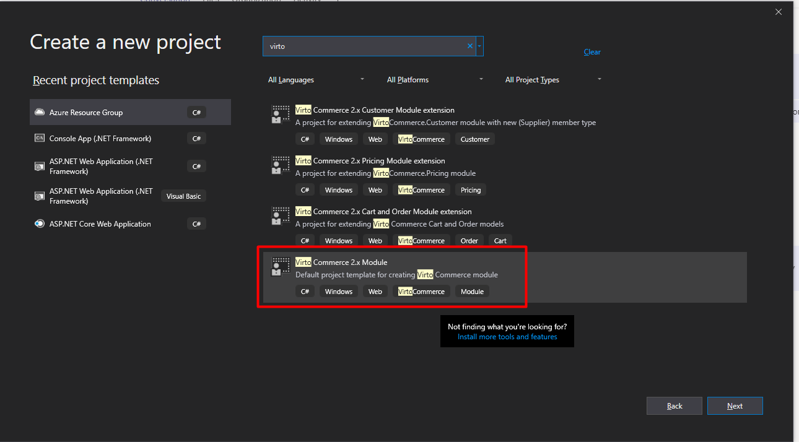
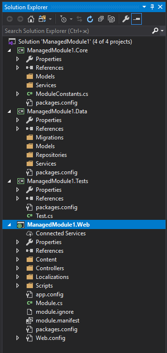
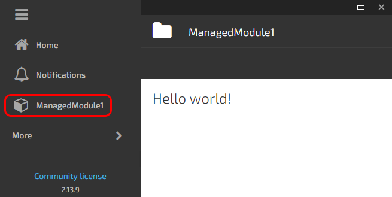
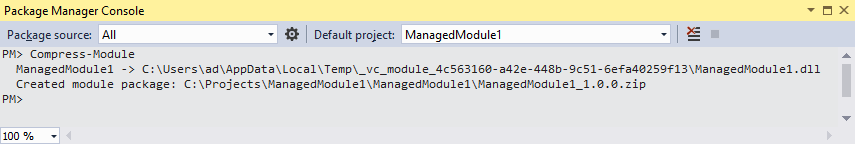
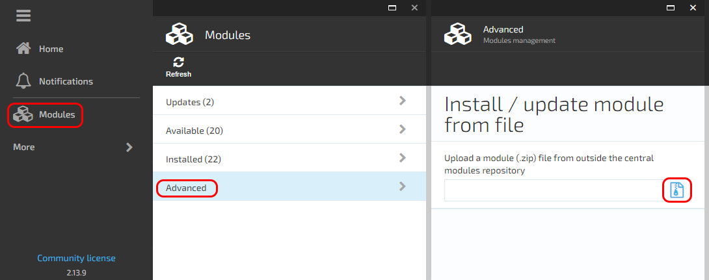
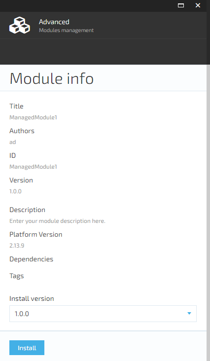
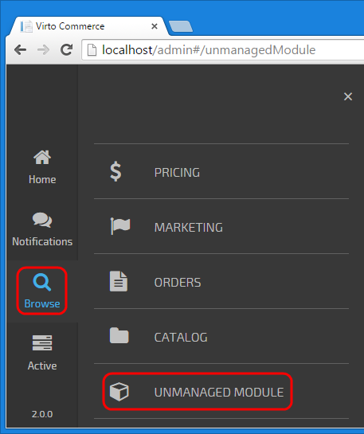

---
title: Creating new module
description: The article describes a process of creating a new module for Virto Commerce
layout: docs
date: 2016-06-02T07:27:54.917Z
priority: 1
---
## Summary

This tutorial will show you the steps required when creating a new module and adding it to the Virto Commerce Manager web application.
You can also 
Download / fork source code for described modules from GitHub [vc-samples repository](https://github.com/VirtoCommerce/vc-samples).

## Overview

Virto Commerce Platform is an ASP.NET MVC and [AngularJS](http://angularjs.org/) Single Page Application with VirtoCommerce modularity extension.

A module in VirtoCommerce is a folder which contains at least **module.manifest** file. It can also contain any other content such as JavaScript files, CSS files, images, .NET assemblies, etc. Some content has a special meaning and should be mentioned in the module manifest. If a module contains .NET assemblies it is called a **managed module**.

Modules can extend the Virto Commerce Platform with JavaScript and/or managed code.

JavaScript allows you to:
* add new items to main menu
* add new widgets to widget containers (on dashboard or in blades)
* add new blades
* add new buttons to existing blade toolbars

Managed code allows you to:
* add new Web API controllers
* add new services
* override existing services
* modify database

As you can see with JavaScript you can extend the UI and with managed code you can extend the backend.

Also new security permissions and new application settings can be added to the module manifest, but they are still used either in JavaScript or in managed code.

In this tutorial you will learn how to create custom modules with and without managed code. Each module will be loaded to the main application and will have its entry in the main menu.

## Module containing server side libraries

In this tutorial part we'll create a module called **ManagedModule1**. It will open a blade and fill it with data returned from WebAPI data service.

A managed module is a module which has a managed assembly with a class **implementing IModule** interface. This class should be declared in the module manifest.

When the application starts, it iterates two times through all managed modules:

1. Methods **SetupDatabase** and **Initialize** are called for each module.

* In SetupDatabase method a module can create or update tables and fill them with data.
* In Initialize method a module can register its services, repositories and other resources in Unity container.

2. Method **PostInitialize** is called for each module. In this method a module can resolve registered resources using Unity container and use them. The two-step initialization allows modules which are initialized later to override implementation of interfaces registered with modules which are initialized earlier.

### Create new module 

Download [Virto Commerce Module template](https://marketplace.visualstudio.com/items?itemName=VirtoCommerce2xModuleProjectTemplate.VirtoCommerce2xModule) from Visual Studio Marketplace, or simply search for "Virto" under online templates.

Create project by using our template as follows:



###  Module project structure and content

After clicking OK button you will have the following project:



* **module.manifest** Contains various attributes describing the module and its content.
* **module.ignore** Contains a list of files which should be excluded from the resulting module package. This is useful if your module depends on some other module and you don't want files which are already included in that module to be duplicated in your module.
* **Module.cs** Contains a class which is responsible for the server side library initialization.
* Content
  * css
    * **ManagedModule1.css** Contains a style sheet for the Hello World blade.
  * **help** This folder contains files required for a help page which is displayed after generating the project from template. You can safely delete this folder.
* Controllers
  * Api
    * **ManagedModule1Controller.cs** Contains a data service for communicating with JavaScript client.
* Scripts
  * **ManagedModule1.js** Contains an AngularJS module definition.
  * blades
    * **helloWorld_blade1.js** Contains an AngularJS controller for the Hello World blade.
    * **helloWorld_blade1.tpl.html** Contains a markup for the Hello World blade.
  * resources
    * **ManagedModule1Api.js** Contains definitions for the resources (services) available inside AngularJS module.

### Running the module

If ManagedModule1 folder is not located under Manager's ~/Modules virtual directory, you should create a directory symbolic link to ManagedModule1 folder:

1. Run Command Prompt as an administrator
2. Navigate to the physical location folder of Manager's ~/Modules virtual directory
3. Run the following command: 
```
mklink /d ManagedModule1 <full_path_to_ManagedModule1_project>
```

Compile your solution, restart IIS and open Manager in browser to check how your new module looks like. You should see a new item in the menu, which opens a Hello World blade:



### Creating and installing a module package

1. Open Tools > NuGet Package Manager > Package Manager Console
2. Run the following command: **Compress-Module**



The output will show the location of the created module package (ManagedModule1_1.0.0.zip).

If **Compress-Module** command is not recognized, restart Visual Studio and repeat the command. Restarting may require to allow Visual Studio to load the package generation script which is installed as NuGet package.

3. Open the Virto Commerce Manager where you want to install this module
4. Navigate to Modules > Advanced
5. Upload your ManagedModule1_1.0.0.zip:





6. Click install

7. Restart the Virto Commerce Manager or IIS

## Pure JavaScript module

In this part of the tutorial we'll create a JavaScript module called **Sample Unmanaged Module** which will add a new item to the main menu and open a new blade when this item is clicked.

The required part of each module is the manifest:

```
<?xml version="1.0" encoding="utf-8" ?>
<module>
  <id>Sample.Unmanaged</id>
  <version>2.0.0</version>
  <platformVersion>2.10</platformVersion>
  <title>Sample Unmanaged Module</title>
  <description>Lorem ipsum dolor sit amet, consectetur adipiscing elit. Aenean vitae sagittis nulla, ac condimentum quam. Maecenas sit amet nibh volutpat, eleifend enim sit amet, cursus erat.</description>
  <authors>
    <author>VirtoCommerce</author>
  </authors>
  <styles>
    <file virtualPath="$/Content/css/UnmanagedModule.css" />
  </styles>
  <scripts>
    <directory virtualPath="$/Scripts" searchPattern="*.js" searchSubdirectories="true" />
  </scripts>
</module>
```

**id**, **version** and **platformVersion** are required elements. This sample module has a single CSS style file and its JavaScript code is placed in the folder called $/Scripts. The $ sign in styles and scripts virtual paths is resolved to the module root folder at runtime by the platform's modularity extension. Title and description are displayed in the installed modules list. That's all what's needed to define a module.

One of the js files, UnmanagedModule.js, contains AngularJS module definition:

```
//Call this to register our module to main application
var moduleTemplateName = "platformWebApp.unmanagedModule";
if (AppDependencies != undefined) {
  AppDependencies.push(moduleTemplateName);
}
angular.module(moduleTemplateName, [
  'unmanagedModule.blades.blade1'
])
...
```

It registers itself as a dependency for the main AngularJS module. Then the module definition follows. As you can see, it also depends on the other module, *unmanagedModule.blades.blade1*.

The navigation between modules is based on $stateProvider and states. We register "workspace.unmanagedModuleTemplate" state in the same js file:

```
.config(
  ['$stateProvider',
    function ($stateProvider) {
      $stateProvider.state('workspace.unmanagedModuleTemplate', {
        url: '/unmanagedModule',
        templateUrl: 'Scripts/common/templates/home.tpl.html',
        controller: [
          '$scope', 'platformWebApp.bladeNavigationService', function ($scope, bladeNavigationService) {
             var blade = {
               id: 'blade1',
               // controller name must be unique in Application. Use prefix like 'um-'.
               controller: 'um-blade1Controller',
               template: 'Modules/$(Sample.Unmanaged)/Scripts/blades/blade1.tpl.html',
               isClosingDisabled: true
             };
             bladeNavigationService.showBlade(blade);
           }
         ]
      });
    }
  ]
)
```

This state has such typical parts as **url**, **templateUrl** and **controller**. What's not typical is that state name must begin with "workspace.*". The controller here is used only for displaying a new blade. All **controller names** of **all installed modules** in the **Platform** have to be **unique**.

The controller **um-blade1Controller** (located in **blade1.js**) and template **blade1.tpl.html** are super simple:

```
angular.module('unmanagedModule.blades.blade1', [])
.controller('um-blade1Controller', ['$scope', function ($scope) {
  var blade = $scope.blade;
  $scope.data = "UnmanagedModule content";
  blade.title = "UnmanagedModule title";
  blade.isLoading = false;
}]);
```
```
<div style="width: 400px;">
  <p>{{data}}</p>
</div>
```

### Referencing content files

The links to files inside the module folder should start with **Modules/$(ModuleId)/** where ModuleId is the ID of the module as declared in module.manifest file.

For instance, **Modules/$(Sample.Unmanaged)/Scripts/home/home.tpl.html**

### Adding new items to application's menu

The registration to the main application's menu:

```
.run(
  ['$rootScope', 'platformWebApp.mainMenuService', '$state', function ($rootScope, mainMenuService, $state) {
    //Register module in main menu
    var menuItem = {
      path: 'browse/unmanaged module',
      icon: 'fa fa-cube',
      title: 'Unmanaged Module',
      priority: 110,
      state: function () { $state.go('workspace.unmanagedModuleTemplate'); },
      permission: 'UnmanagedModulePermission'
    };
    mainMenuService.addMenuItem(menuItem);
  }]);
```

Mind the **priority** property as it defines the menu position relative to the other menu options; **smaller number means higher priority** and such menu item is displayed first.

That's it. Run VirtoCommerce Manager application to check how your new module looks like. It should have its own menu entry in the main menu:


