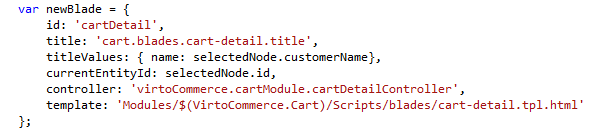
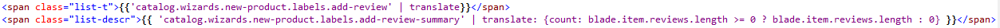
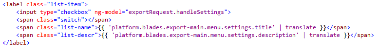
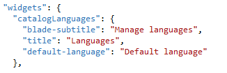
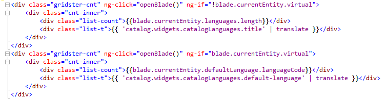
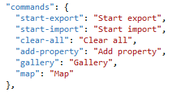
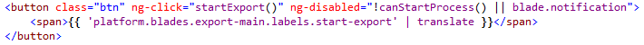
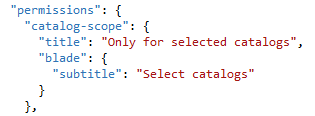
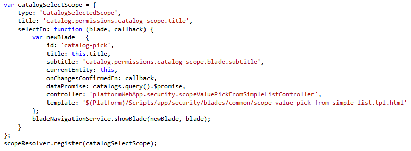

---
title: Localization implementation
description: The developer guide to implement Virto Commerce localization
layout: docs
date: 2016-01-13T19:32:08.947Z
priority: 5
---
## Summary

This article is about Virto Commerce Manager localization implementation. The localization is based on resources (translation files) and translation implementation.

## Basic translation

In order to localize a module content, you need to create a basic translation file for one of the <a class="crosslink" href="https://virtocommerce.com/multi-tenant" target="_blank">languages</a>. The file should be placed in module’s **Localizations** subfolder. Virto Commerce uses English as a default language.

## Additional translations

Additional translation file is a clone of default translation file with translated resources. If some translations are skipped in additional translation then values from default translation would be taken.

There are 2 scenarios to apply additional translation files in Virto Commerce Manager:

**Embedded translation**. In this case additional translation files are placed in *Localizations*В folder of the module and will be accessible right after installing the module into the platform. This option is recommended for stable modules with limited number of languages.

**External translation**. In this case additional translation files should be placed inВ *App_Data\Localizations* subfolder of Commerce Manager web application. The main goal of keeping additional translations outside of a module is to separate out the translation and development processes. You may use git repository or something else for additional translations' management. Notice that specialized translation tools (like [poeditor](https://poeditor.com/), [crowdin](https://crowdin.com/), [getlocalization](http://www.getlocalization.com), etc) may have advanced management features.

Virto Commerce uses the second scenario and keeps additional translations in a dedicated git repository ([vc-localization](https://github.com/VirtoCommerce/vc-localization)).

## Building translations

Virto Commerce Manager takes all available translation files together and merges them by languages in the following sequence:
* Platform translation files;
* Embedded translation files from each module’s *Localizations* subfolder;
* External translation files from *App_Data\Localizations*В in Commerce Manager web application.

Note that if duplicate translation IDs are met, the last of the values would be used. E.g. embedded translation file (from module's *Localizations* folder) has ID:Value:

```
{
  "title": "foo",  
  .... 
} 
```

And external translation file (in Commerce Manager *App_Data\Localizations *subfolder) has the same ID, but another Value:  

```
{
  "title": "bar",  
  .... 
} 
```

After building, according to the sequence of merging, resulting value of the "title" will be "bar".В Therefore, you may override any translation value using the order of merging.

## Components to translate contents

Basically, Virto Commerce Manager uses[В angular-translate module](https://angular-translate.github.io/docs/#/guide)В for localization. Please read its documentation for more details. The main principle is to use IDs from translation files instead of static text.В Sometimes the content might be not static. In such case you should useВ [variable replacement](https://angular-translate.github.io/docs/#/guide/06_variable-replacement).

The preferred way is to use module'sВ [translate filter](https://angular-translate.github.io/docs/#/guide/04_using-translate-filter)В for translation as it adds $watch for each translation ID. Therefore, all resources will be translated automatically upon language switching.В Unlike translate filter,В [$translate service](https://angular-translate.github.io/docs/#/guide/03_using-translate-service)В doesn't track the languageВ change.В Be careful when using translate service.

## Structure of Virto Commerce translation file

The structure of namespaces in translation file looks like a structure of module’s Script folder for convenience. But this rule is **not strong**.

So, the first object is unique module name throughout all Manager’s modules. There are some common objects inside each module:
* blades and wizards;
* dialogs;
* widgets;
* commands;
* permissions;
* main titles.

## Blade and wizard

### Blade and wizard structure

Blades and wizards have the same structure so, all blade translationВ principles fit to a wizard.В Blade object's name corresponds to the name of blade template (html) file:

Usually blade contains localizable parts like:  
* title - Title of the blade;
* subtitle - Subtitle of the blade;
* labels - labels, notes and any static text inside the blade;
* validations - inputВ validation errors' messages;
* placeholders - placeholder texts for inputs.
* menu - menu items' texts.

In this example *cart.blades.cart-detail.title* has **name **as a parameter.

### BladeВ **title**

In order to pass a parameters to the title, specifyВ **titleValues**:


This way you can pass more than one parameter as well.

### BladeВ **labels**

This example shows how to use translate filter and pass parameter from html code:


Of course, *add-review-summary* should contain parameter **count**.

### **Blade placeholders** and **validations**

This example shows how to localize a placeholder and multiple validations on an input field:


### BladeВ **menu**



## Dialogs

### Dialog structure

Dialog object name should describe some action. Standard platform dialog has 2 properties: title and message. 

### DialogВ title and messageВ 

In order to pass the parameter values, use **titleValues** and **messageValues** properties for title and message respectively.В In case of a more complex dialog, just pass more IDs while initializing and use them in the (html) template.

## Widgets

### Widget structure

Widgets might be of various structure, so there's no reglamentation on translations structure.



Simple widget can contain:
* title: В Title of a widget;
* blade-title: Title of the opening blade;
* blade-subtitle: Subtitle of the opening blade.  

### Sample widget template



## Commands

### Commands structure

Blade's commands group contains texts for commands like:


### Command localization sample (html)



## Permissions

### Permissions structure

Permission group contains texts for В permissions. Each object inВ permission group sets its own title and a title/subtitle of the blade for detailed permission configuration:


### Register permission



## Item in the main menu

New items can be added to the main menu in Commerce Manager. The proposed structure for the item's title localization.

Registering the item to the main menu with localized title:


## Common platform resources 

There are lots of common translations predefined in "*{lang}.VirtoCommerce.Common.json"*В translation file (located inВ **Localizations**В folder ofВ VirtoCommerce.Platform.Web project).

Check the file, find and reuse the resources inВ your module. Reusing helps keeping your customВ translation files ofВ minimal size while leaving the Manager UI uniform.
