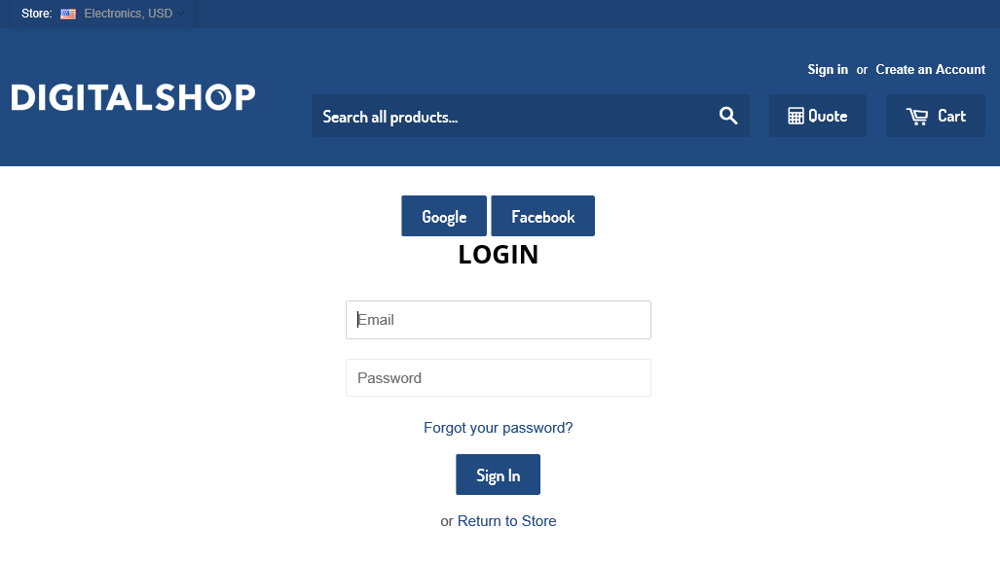

---
title: Enabling login within external providers
description: The article describes enabling login within external providers in Virto Commerce Storefront
layout: docs
date: 2016-03-17T11:00:22.200Z
priority: 5
---
Before enabling login within external providers such as Google or Facebook should be created OAuth applications on corresponding platforms.

Each OAuth application has ApplicationId/ClientId/ApiKey and SecretKey. They should be stored in VirtoCommerce.Storefront web.config file in **appSettings** section with unique names. For example:

```
<appSettings>
  ...
  <add key="OAuth2.Google.Enabled" value="true" />
  <add key="OAuth2.Google.ClientId" value="SECRET" />
  <add key="OAuth2.Google.Secret" value="SECRET" />
        
  <add key="OAuth2.Facebook.Enabled" value="true" />
  <add key="OAuth2.Facebook.AppId" value="SECRET" />
  <add key="OAuth2.Facebook.Secret" value="SECRET" />
  ...
</appSettings>
```

Then all external login providers should be declared in **AuthConfig.cs** in **ConfigureAuth** method. For example:

```
public static void ConfigureAuth(IAppBuilder app, Func<IStorefrontUrlBuilder> urlBuilderFactory)
{
    ...
    if (ConfigurationManager.AppSettings.GetValue("OAuth2.Facebook.Enabled", false))
    {
        var facebookOptions = new FacebookAuthenticationOptions
        {
            AppId = ConfigurationManager.AppSettings["OAuth2.Facebook.AppId"],
            AppSecret = ConfigurationManager.AppSettings["OAuth2.Facebook.Secret"]
        };
        app.UseFacebookAuthentication(facebookOptions);
    }

    if (ConfigurationManager.AppSettings.GetValue("OAuth2.Google.Enabled", false))
    {
        var googleOptions = new GoogleOAuth2AuthenticationOptions
        {
            ClientId = ConfigurationManager.AppSettings["OAuth2.Google.ClientId"],
            ClientSecret = ConfigurationManager.AppSettings["OAuth2.Google.Secret"]
        };
        app.UseGoogleAuthentication(googleOptions);
    }
    ...
}
```

After that on login page of default theme you can see buttons of enabled external login providers.


