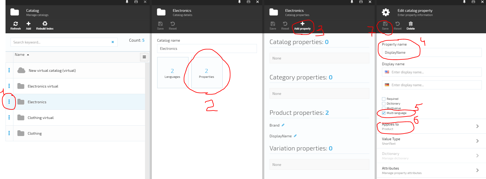
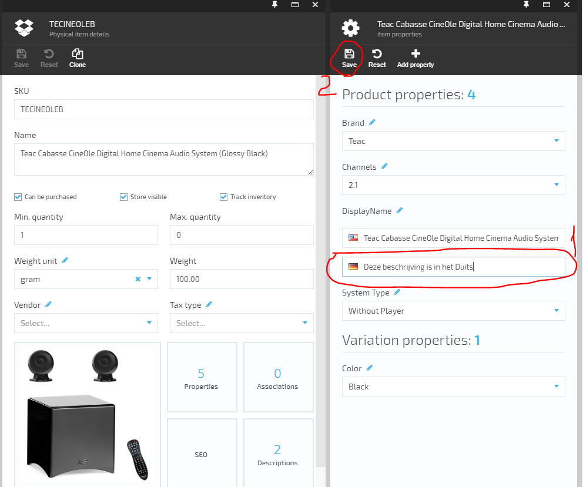
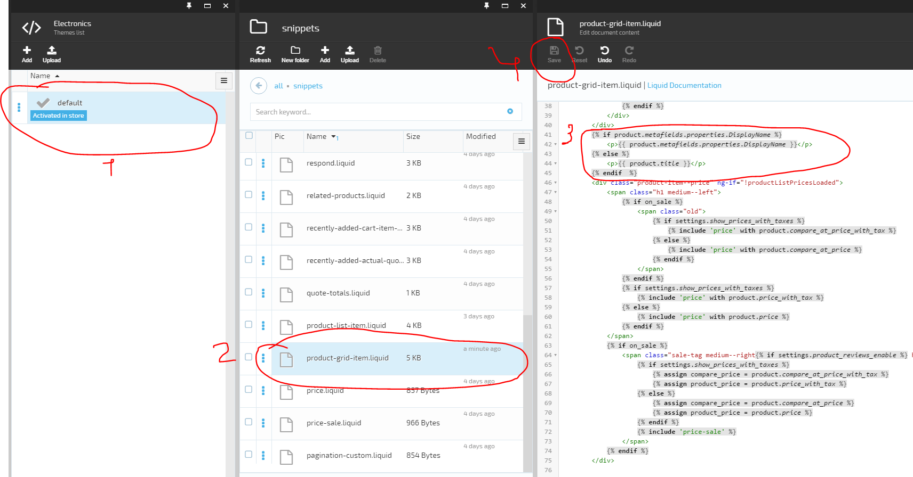
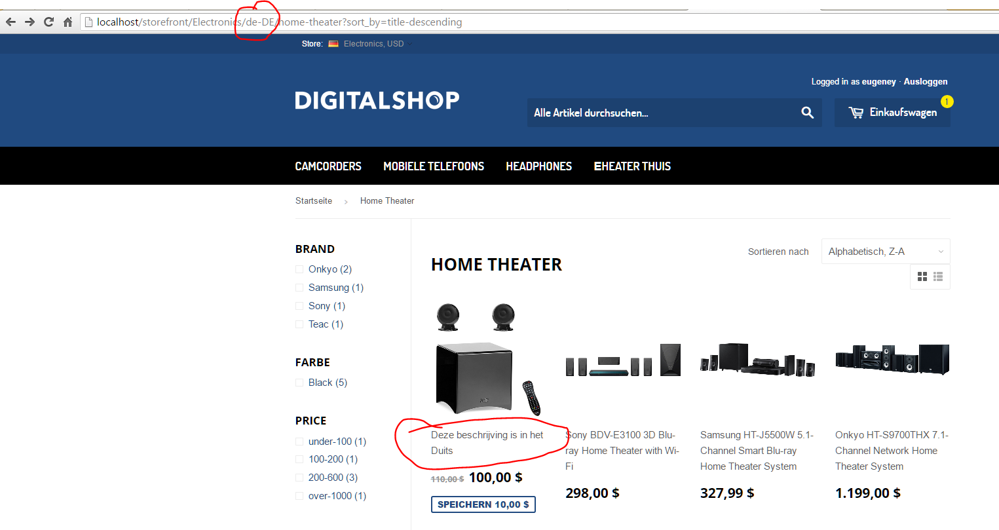

---
title: How to localize catalog product names in storefront
description: The article about localizing catalog product names in Virto Commerce Storefront
layout: docs
date: 2016-05-16T10:49:50.627Z
priority: 6
---
Add Product property 'DisplayName' to whole catalog level.

Set 'DisplayName' property value for each  language in each product  

Change storefront theme template to use as product title localized 'DisplayName' property  

Check result on storefront  

