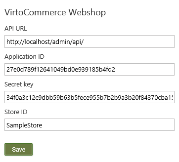
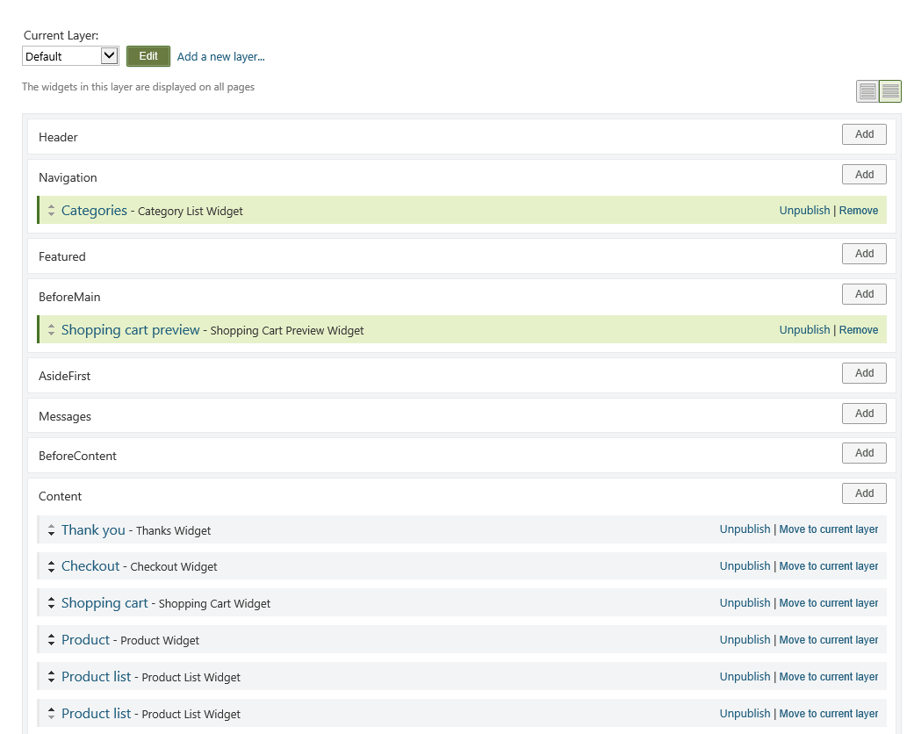

---
title: Orchard CMS Integration
description: This document describes how to setup Orchard CMS to connect to Virto Commerce
layout: docs
date: 2016-02-05T13:05:55.107Z
priority: 4
---
## Introduction

Virto Commerce supports multiple frontends. One supported frontend in particular is a popular ASP.NET MVC based CMS called "Orchard CMS". This document describes how to setup orchard to connect to Virto Commerce. We welcome any contributions to the Orchard module through github. You can download the complete source code from here: [https://github.com/VirtoCommerce/vc-orchards-cms](https://github.com/VirtoCommerce/vc-orchard-cms).

## Module installation guide

> You must install Virto Commerce Manager before you can use Orchard CMS, in the alternative you can connect to our [public demo](try-now) instead.

1. Install module VirtoCommerce.Webshop from Orchard gallery or as single NuGet-file <a href="http://gallery.orchardproject.net/Packages/Orchard.Module.VirtoCommerce.Webshop" rel="nofollow">http://gallery.orchardproject.net/Packages/Orchard.Module.VirtoCommerce.Webshop</a>.
2. Enable installed module. After that you can see it as a new item in Orchard settings: **VirtoCommerce.Webshop**

3. Fill settings for webshop (all fields are required):

4. VirtoCommerce.Webshop module has several widgets: Category List, Product List, Product, Shopping Cart Preview, <a class="crosslink" href="https://virtocommerce.com/shopping-cart" target="_blank">Shopping Cart</a>, Checkout and Thank You. You can place it any zone of your website theme.

