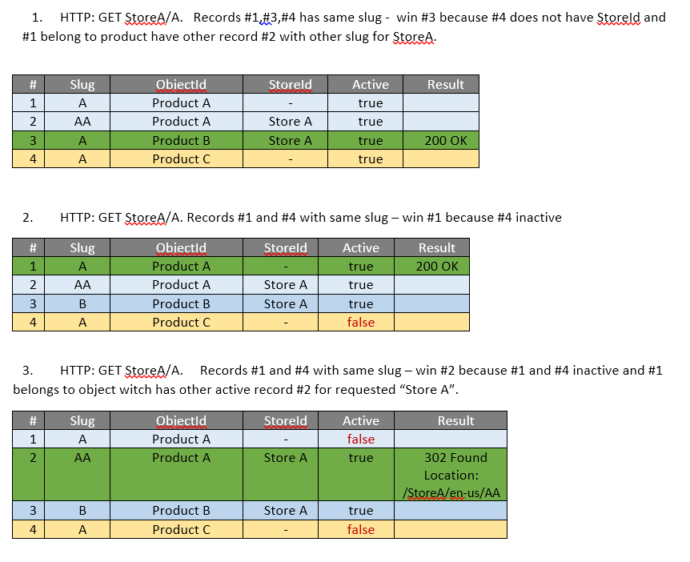

---
title: Storefront SEO routing
description: The article about Virto Commerce Storefront SEO routing
layout: docs
date: 2016-04-28T15:32:52.673Z
priority: 3
---
## Search Engine Optimization (SEO)

### Goals

<a class="crosslink" href="https://virtocommerce.com/ecommerce-marketing" target="_blank">SEO</a> is an important factor in an e-commerce site, marketing managers should be able to configure a site's URLs in a way that both the end user and search engines can understand. It also should support specifying the exact url for different languages.

* create simple URLs that shoppers and search engines can understand
* optimize page metadata to improve search engine page rank
* generate site maps to submit to search engine providers
* each page/product/category should be identifiable by a unique url (even language or store specific one)
* should support filtering SEO (filters should always appear in the same order)
* there should only be one URL for a page, every other URL should be automatically redirected

## Storefront url structure

Each storefront urlВ has the following structure **/{store id?}/{locale?}/{path}** where:
* **{store id?}** - optional parameter can contains В requested <a class="crosslink" href="https://virtocommerce.com/multi-tenant" target="_blank">store id</a>, if not specified default store for this host will be used. Makes sense when one host have multiple stores. `http://localhost/electronics`,В `http://localhost/clothing`.
* **{locale?}** - optional parameter represent <a href="https://msdn.microsoft.com/en-us/library/ee825488(v=cs.20).aspx" rel="nofollow">language culture name</a> (en-us,В it-IT etc). Requested store should support specified language.
* **{path}** - request path witch handled by ASP.NET routing.

## Storefront slug URL resolution rules

## Storefront slug URL generation modes

The each VC store has a special setting which controls behavior how the SEO Slug URLs being generated on the storefront  

Let's assume that we have followed virtual catalog structure

**Physical catalog**: _physical-parent-category/my-cool-category/my-cool-product_ 
**Virtual catalog**:  _virtual-parent-category <- physical-parent-category_ (category link from **Physical catalog**)

So the resulting links on the storefront will be follow depend on active  mode

**Long**: _/virtual-parent-category/physical-parent-category/my-cool-category/my-cool-product_ - which represent full object outline path in hierarhy including virtual categories
**Collapsed**: _/virtual-parent-category/my-cool-category/my-cool-product_ -From URL will be excluded physical category which directly linked to the virtual category (very helpful mode if you want to link all products belongs to one or multiple  physical categories to one virtual  and hide their physical categories from resulting path)
**Short** : _/my-cool-product_ - used only  SEO slug  defined for end object without hierarchy path
**None**: _/product/123_ - doesn't used slug at all, object type and identifiers used instead

