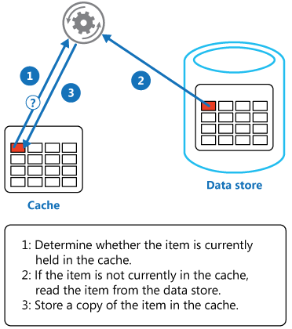

>There are only two hard things in Computer Science: cache invalidation and naming things.
-- Phil Karlton

Caching is one of the most effective ways to improve website performance. VirtoCommerce has tried a few different ways to cache application data to reduce the load on the external services and database and minimize application latency when handle the API requests.
On this article we describe the all technics and best practices that we use for caching in the platform.

# Cache-Aside pattern overview
We had chosen [Cache-Aside](https://docs.microsoft.com/en-us/azure/architecture/patterns/cache-aside) as the main pattern for all caching logic, because of this pattern is very simple and straightforward for implementation and testing.

The pattern enables applications to load data on demand.

 

When we need specific data, we first try to get it from the cache. If the data is not in the cache, we get it from the source, add it to the cache and return it.
Load data on demand into a cache from a data store. 
This can improve performance and also helps to maintain consistency between data held in the cache and data in the underlying data store.

# Challenges
We don't use the distributed cache in the platform code due to reasons to keep the flexibility and simplicity for the platform configuration and try to solve all potential problems with scalability by another ways see the Scalability section below in this article.
There are the other Cons of using distributed cache that  influenced to our decision:

- all cached data must support of serialization and deserialization (it is nor always possible)
- performance always be worst with comparison to use memory cache due to network calls for cache data
- increase complexity of solution for mixed cache modes usage (memory and distributed)

For platform cache we utilized [IMemoryCache](https://docs.microsoft.com/en-us/aspnet/core/performance/caching/memory?view=aspnetcore-3.1) that stored cached data in the memory.

The simple `Cache-Aside` pattern implementation with using `IMemoryCache` is look like this

```C#
public object GetDataById(string objectId)
{
    object data;
    if (!this._memoryCache.TryGetValue($"cache-key-{objectId}", out data))
    {
        data = this.GetObjectFromDatabase(objectId);
        this._memoryCache.Set($"cache-key-{objectId}", data, new TimeSpan(0, 5, 0));
    }
    return data;
}
```

But this code has the few disadvantages:

 - is contains many lines of code and definitely can be simplified
 - manually creating a cache key cannot guarantee the uniqueness of cached keys
 - it isn't guarantee that the factory method when cache miss won't be called several times. For this to become a problem though, your application will require a high concurrent load and costly backend requests or that the backend doesn't handle too many simultaneous requests.
 - we manually control the cached data lifetime, this can very complicated for developers to chose the proper values for cached data lifetime
  
The relatively new `MemoryCache` methods `GetOrCreate/GetOrCreateAsync`  also suffer from these problems and we can't use them as is. The good article fully devoted to description of this problem [ASP.NET Core Memory Cache - Is the GetOrCreate method thread-safe](https://blog.novanet.no/asp-net-core-memory-cache-is-get-or-create-thread-safe/)

# Usage

We defined the own [IMemoryCacheExtensions](https://github.com/VirtoCommerce/vc-platform/blob/master/src/VirtoCommerce.Platform.Core/Caching/MemoryCacheExtensions.cs) this implementation guarantees that the cacheable delegates (cache miss) are only run once without using race conditions, furthermore this extension provides the more short syntax for using from the client code and solve the all issues are described above.

Re-writing my previous example to use this this extension: 
```C#
1   public object GetDataById(string objectId)
2   {
3       object data;
4       var cacheKey = CacheKey.With(GetType(), nameof(GetDataById), id);
5       var data = _memoryCache.GetOrCreateExclusive(cacheKey, cacheEntry =>
6           {
7             cacheEntry.AddExpirationToken(MyCacheRegion.CreateChangeToken()); 
8             return this.GetObjectFromDatabase(objectId);
9           });
10      return data;
11  }
```
All this code lines are required more detailed explanation


# Cache keys generation

In the `line 4`: the special static class `CacheKey` is provides the methods to generate unique string cache key according to passed arguments and information for type and method.
e.g:

```C#

 CacheKey.With(GetType(), nameof(GetDataById), "123"); /* => "TypeName:GetDataById-123" */

```

`CacheKey` is also can be sued for generation the cache keys for objects of complex types. Most of the platform types are derived from `Entity` or `ValueObject` classes, each of these types implement the `ICacheKey` interface that contains `GetCacheKey()` method which can be used for cache key generation. 

The following code shows how we can create a cache key for object of complex types:

```C#
class ComplexValueObject : ValueObject
{
    public string Prop1 { get; set; }
    public string Prop2 { get; set; }
}

var valueObj = new ComplexValueObject { Prop1 = "Prop1Value", Prop2 = "Prop2Value" };
var data = CacheKey.With(valueObj.GetCacheKey());
//cacheKey will take the value "Prop1Value-Prop2Value"

```

# Thread-safe and guarantees that the cacheable delegates (cache miss) only executes once - race condition.

In the `line 5`: the `_memoryCache.GetOrCreateExclusive()` method is called, there is a caching extension is called which is thread-safe and guarantees that the cacheable delegates (cache miss) only executes once with multiple threads race. 
There is also available asynchronous version of this  extension method  `_memoryCache.GetOrCreateExclusiveAsync()`.

The following code demonstrates how this exclusive access to the cacheable delegate work

```C#
        public void GetOrCreateExclusive()
        {
            var sut = new MemoryCache();
            int counter = 0;
            Parallel.ForEach(Enumerable.Range(1, 10), i =>
            {
                var item = sut.GetOrCreateExclusive("test-key", cacheEntry =>
                {
                    cacheEntry.SlidingExpiration = TimeSpan.FromSeconds(10);
                    return Interlocked.Increment(ref counter);
                });
               Console.Write($"{item} ");
            });
        }
```

**Output**

```Console
1 1 1 1 1 1 1 1 1 1
```

# Cache expiration and eviction
In the `line 7`: is created the `CancellationTokenSource` that associated with the cache data and strongly typed cache region that allows multiple cache entries to be evicted as a group, read more: [ASP.NET Core Memory Cache dependencies](https://docs.microsoft.com/en-us/aspnet/core/performance/caching/memory?view=aspnetcore-3.1#cache-dependencies)

> Important: We intentionally disable the inheritance for cached entries expiration tokens and time-based expiration settings: when one cache entry is used to create another, the child copies the parent entry's expiration settings and child isn't expired by manual removal or updating of the parent entry. Because of this leads to unpredictable side-effects and hard to maintain and debug the cache dependencies.

 We strive to do not manually control the lifetime of cache data in the code, the platform has a special option `CachingOptions` it contains the settings that allow manage  the Absolute or Sliding lifetimes for all cache data from one place. 

 Thanks to the `Clean Architecture` and using the `Bounded contexts` where each boundary controls all read and changes operations for all data belong to the domain, we can use this fact to keep the cache always in the actual state and evict the changed data from the cache explicitly.

  
# Strongly typed cache regions

The platform caching supports a construct called strongly typed cache regions which can be used to control a set of cache keys to be able evict from cache some grouped/related date and keep up cache data consistent. To define you own cache region you need to derive it from `CancellableCacheRegion<>`.
The method `ExpireRegion` can be used to remove all keys within one region for example. 

```C#

//Region definition
public static class MyCacheRegion : CancellableCacheRegion<MyCacheRegion>
{    
}

//Usage
cacheEntry.AddExpirationToken(MyCacheRegion.CreateChangeToken()); 

//Expire all data associated with the region
MyCacheRegion.ExpireRegion();

```

There is the special  `GlobalCacheRegion` that you can use to expire all cached data on entire application.

```C#
//Expire all cached data for entire application
GlobalCacheRegion.ExpireRegion();
```

# Caching null values

By default, platform cache will cache the `null` values, but if  `negative caching`  is a design choice, then you can change this behavior by passing `cacheNullValue=false` in the `GetOrCreateExclusive` method call as in the following example:

```C#

 var data = _memoryCache.GetOrCreateExclusive(cacheKey, cacheEntry => {}, cacheNullValue: false);

```

# Cache settings

The default platform caching options can be changed from configuration.

*appsettings.json*
```json
 "Caching": {
        //Set false to disable caching of application data for entire application
        "CacheEnabled": true, 
        //Sets a sliding expiration time for all application cached data that don't have manualy set expiration value
        "CacheSlidingExpiration": "0:15:00", 
        //Sets a absolute  expiration time for all cached data that don't have manualy set expiration
        //"CacheAbsoluteExpiration": "0:15:00"
    }
```

# Scaling

Running multiple instances of platform, all accessing the local cache that must to consistent between cache of other instances, can be tricky. This article explains of how configure  `Redis` service as cache backplane to sync local caches for multiple platform instances. [How to scale out platform on azure](../techniques/how-scale-out-platform-on-azure.md)

# Conclusion

- The  [IMemoryCacheExtensions](https://github.com/VirtoCommerce/vc-platform/blob/master/src/VirtoCommerce.Platform.Core/Caching/MemoryCacheExtensions.cs) contains the sync and async extension methods those represent the compact form of `Cache-Aside` pattern implementation on `ASP.NET Core IMemoryCache` interface and provides exclusive access to the original data with a race condition
- Keep your cached data always in a consistent state using for that the strongly typed `cache regions` to evicting the groups of data from the cache, in order to avoid issues with stale cached data.
- The platform uses the aggressive caching policy for most DAL services even cached the large search result responses,  do not use relative size metrics for cache data it can lead to high memory utilization for some production scenarios. You need to play with these settings  `CacheSlidingExpiration`/`CacheAbsoluteExpiration` values to find an optimal balance of memory consumption and application performance.
