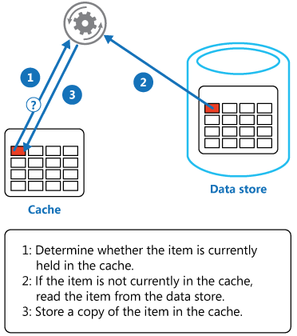

>There are only two hard things in Computer Science: cache invalidation and naming things.
-- Phil Karlton

Caching is one of the most effective ways to improve website performance. VirtoCommerce has tried a few different ways to cache application data to reduce the load on external services and database, and minimize application latency when handling API requests. In this article, we describe the technical details and the best caching practices we employ in our platform.

## Cache-Aside pattern overview
We chose [Cache-Aside](https://docs.microsoft.com/en-us/azure/architecture/patterns/cache-aside) as the main pattern for all caching logic, because it is very simple and straightforward for implementation and testing.

The pattern enables applications to load data on demand:

 

When we need specific data, we first try to get it from the cache. If the data is not in the cache, we get it from the source, add it to the cache and return it. Next time, this data will be returned from the cache. This pattern improves performance and also helps maintain consistency between data held in the cache and data in the underlying data storage.

## Challenges
We don't use the distributed cache in the platform code, because we want to keep the platform configuration flexible and simple, and prefer to solve potential scalability problems by other means (see *Scalability* below).

There are three additional cons of using distributed cache that influenced our decision:

- All cached data must support serialization and deserialization; it is not always possible with distributed cache.
- Decreased performance in comparison to memory cache due to network calls for cached data.
- Increased mixed mode (memory and distributed) complexity.

For platform cache we experimented with the [IMemoryCache](https://docs.microsoft.com/en-us/aspnet/core/performance/caching/memory?view=aspnetcore-3.1) that stores cached data in the memory.

A simple `Cache-Aside` pattern implementation using `IMemoryCache` looks like this:

```C#
public object GetDataById(string objectId)
{
    object data;
    if (!this._memoryCache.TryGetValue($"cache-key-{objectId}", out data))
    {
        data = this.GetObjectFromDatabase(objectId);
        this._memoryCache.Set($"cache-key-{objectId}", data, new TimeSpan(0, 5, 0));
    }
    return data;
}
```

This code has a few disadvantages:

 - It contains too many lines of code and must be simplified.
 - It requires manual creation of the cache key that cannot guarantee its uniqueness.
 - It does not protect against race conditions, when multiple streams will try to access the same cache key simultaneously, which may lead to excess data eviction. This may not be a problem, unless your application has a high concurrent load and costly backend requests, or the backend is not designed to handle simultaneous requests.
 - It supposes manual control of the cached data lifetime. Chosing proper values for the lifetime is complicated and reduces developer's productivity.
  
The relatively new `MemoryCache` methods `GetOrCreate/GetOrCreateAsync` also suffer from these problems, which means we can't use them as they are, too. This article describes the issue in greater detail: [ASP.NET Core Memory Cache - Is the GetOrCreate method thread-safe](https://blog.novanet.no/asp-net-core-memory-cache-is-get-or-create-thread-safe/).

## Solution

To solve the aforementioned issues, we defined our own [IMemoryCacheExtensions](https://github.com/VirtoCommerce/vc-platform/blob/master/src/VirtoCommerce.Platform.Core/Caching/MemoryCacheExtensions.cs). This implementation guarantees that the cacheable delegates (cache misses) are only run once without race conditions. Also, this extension provides more compact syntax for the client code.

Let's rewrite the previous example with the new extension:

```C#
1   public object GetDataById(string objectId)
2   {
3       object data;
4       var cacheKey = CacheKey.With(GetType(), nameof(GetDataById), id);
5       var data = _memoryCache.GetOrCreateExclusive(cacheKey, cacheEntry =>
6           {
7             cacheEntry.AddExpirationToken(MyCacheRegion.CreateChangeToken()); 
8             return this.GetObjectFromDatabase(objectId);
9           });
10      return data;
11  }
```

### Cache keys generation

A special static class `CacheKey` (line `4`) provides a method for unique string cache key generation according to the arguments and type/method information passed.

E.g:

```C#

 CacheKey.With(GetType(), nameof(GetDataById), "123"); /* => "TypeName:GetDataById-123" */

```

`CacheKey` can also be used to generate cache keys for complex types objects. Most of the platform types are derived from `Entity` or `ValueObject` classes, each of these types implement the `ICacheKey` interface that contains `GetCacheKey()` method which can be used for cache key generation. 

In the following code, we create a cache key for a complex type object:

```C#
class ComplexValueObject : ValueObject
{
    public string Prop1 { get; set; }
    public string Prop2 { get; set; }
}

var valueObj = new ComplexValueObject { Prop1 = "Prop1Value", Prop2 = "Prop2Value" };
var data = CacheKey.With(valueObj.GetCacheKey());
//cacheKey will take the value "Prop1Value-Prop2Value"

```

### Thread-safe caching and avoiding race conditions

In line `5`, the `_memoryCache.GetOrCreateExclusive()` method calls a thread-safe caching extension that guarantees that the cacheable delegate (cache miss) only executes once in multiple threads race.

An asynchronous version of this extension method is also available:  `_memoryCache.GetOrCreateExclusiveAsync()`.

The following code demonstrates how this exclusive access to the cacheable delegate work:

```C#
        public void GetOrCreateExclusive()
        {
            var sut = new MemoryCache();
            int counter = 0;
            Parallel.ForEach(Enumerable.Range(1, 10), i =>
            {
                var item = sut.GetOrCreateExclusive("test-key", cacheEntry =>
                {
                    cacheEntry.SlidingExpiration = TimeSpan.FromSeconds(10);
                    return Interlocked.Increment(ref counter);
                });
               Console.Write($"{item} ");
            });
        }
```

**Output**

```Console
1 1 1 1 1 1 1 1 1 1
```

### Cache expiration and eviction

In line `7`, a `CancellationTokenSource` object is created. It is associated with the cache data and a strongly typed cache region, which allows multiple cache entries to be evicted as a group (see [ASP.NET Core Memory Cache dependencies](https://docs.microsoft.com/en-us/aspnet/core/performance/caching/memory?view=aspnetcore-3.1#cache-dependencies)).

> Important: We intentionally disable the inheritance for cached entries expiration tokens and time-based expiration settings. When one cache entry is used to create another, the child copies the parent entry's expiration settings and cannot be expired by manual removal or updating of the parent entry. This leads to unpredictable side-effects, and it is hard to maintain and debug such cache dependencies.

 We avoid manual control of the cached data lifetime in our code. The platform has a special `CachingOptions` object that contains the settings for Absolute **or** Sliding lifetimes for all cached data (see below). 

 Thanks to the `Clean Architecture` and the `Bounded contexts`, where each boundary controls all read/change operations for data belonging to the domain, we can always keep the cache in actual state and evict modified data from it explicitly.

  
### Strongly typed cache regions

The platform supports a construct called strongly typed cache regions that is used to control a set of cache keys and provides the tools to evict from cache grouped/related data to keep cache consistent. To define our own cache region, we need to derive it from `CancellableCacheRegion<>`. Then the `ExpireRegion` method can be used to remove all keys within one region: 

```C#

//Region definition
public static class MyCacheRegion : CancellableCacheRegion<MyCacheRegion>
{    
}

//Usage
cacheEntry.AddExpirationToken(MyCacheRegion.CreateChangeToken()); 

//Expire all data associated with the region
MyCacheRegion.ExpireRegion();

```

There also is the special `GlobalCacheRegion` that can be used to expire all cached data of the entire application:

```C#
//Expire all cached data for entire application
GlobalCacheRegion.ExpireRegion();
```

### Caching null values

By default, the platform caches `null` values. If `negative caching` is the design choice, this default behavior can be changed by passing `false` to `cacheNullValue` in the `GetOrCreateExclusive` method, e.g.:

```C#

 var data = _memoryCache.GetOrCreateExclusive(cacheKey, cacheEntry => {}, cacheNullValue: false);

```

## Cache settings

The default platform caching options can be changed from configuration:

*appsettings.json*
```json
 "Caching": {
        //Set to false to disable caching of application data for the entire application
        "CacheEnabled": true, 
        //Sets a sliding expiration time for all application cached data that doesn't have an expiration value set manually
        "CacheSlidingExpiration": "0:15:00", 
        //Sets an absolute expiration time for all cached data that doesn't have an expiration value set manually
        //"CacheAbsoluteExpiration": "0:15:00"
    }
```

## Cache hit/miss metrics

The `VirtoCommerce.Platform.Caching` meter publishes the `virtocommerce.cache.requests` counter
with `cache.request.type` (`hit` or `miss`) and `cache.name` tags. No consumer changes are required.

| Cache | One measurement | Name |
| --- | --- | --- |
| `PlatformMemoryCache` and its Redis backplane variant | Each `TryGetValue` lookup | Logical model/owner name; `PlatformMemoryCache` for unclassified keys |
| `RequestScopedCache.GetOrAddAsync` | Each call; only the entry reservation winner records a miss | Logical model/owner name, `RequestScopedCache` fallback, or the explicit name |
| `RequestScopedCache.GetOrLoadMapByIdsAsync` | Each nonempty ID lookup; duplicate IDs are additional hits | Logical model/owner name for typed prefixes; otherwise the existing stable `keyPrefix` |

### How `cache.name` is selected

Keys created with `CacheKey.With(Type, ...)` register their stable owner prefix. At lookup time,
`CacheKey.GetCacheName` reads the part before the first `:` and resolves it through the registered
mapping:

- Generic CRUD and search services register their runtime owner type against `TModel`. Their groups
  use the model's type name, such as `CatalogProduct`, `Category`, or `InventoryInfo`.
- Other type-owned keys use the owner type name, such as `SettingsManager`.
- Unclassified memory-cache keys use `PlatformMemoryCache`. Ordinary unnamed request-scoped
  by-key lookups use `RequestScopedCache` when no registered group is found.
- An explicitly named request-scoped by-key lookup uses the supplied name. By-ID lookups use the
  registered group when available, otherwise the caller's stable `keyPrefix`.

For example, after registering `ProductService` against `CatalogProduct`, a key such as
`ProductService:GetAsync-Full-product123` receives `cache.name = CatalogProduct`. The method,
response group, and product ID are not included in the group name. Type names omit namespaces;
generic types use readable names including their type arguments.

This also works for modules compiled against the existing key API; no module rebuild is required.
Unclassified memory-cache strings and object keys keep the fallback name rather than exposing
arbitrary prefixes or request data. No per-key metadata is retained. Explicit names and fallback
by-ID prefixes are supplied by callers and must remain stable, without IDs or request data.

Custom services can associate their type-owned keys with a model by calling
`CacheKey.RegisterCacheName(GetType(), typeof(MyModel))` during construction. Registration only
changes telemetry classification; the generated keys, case normalization and invalidation stay unchanged.

### Counting semantics

These are cache lookups, not HTTP requests or factory invocations. Memory-cache helpers may recheck
the cache under a lock: a cold `GetOrCreateExclusive` or `GetOrCreateExclusiveAsync` normally records
two misses. Batch helpers also perform internal lookups. Redis delegates to the base implementation
and does not add another measurement. Cached nulls, in-flight request-scoped loads and previously
cached load failures are hits. Skipped null/empty IDs produce no measurement.

To name a by-key request-scoped lookup, use the additional overload:

```csharp
await requestCache.GetOrAddAsync(key, "ProductSearch", () => LoadProductsAsync());
```

Names must be stable and have low cardinality. Never put full cache keys, entity IDs or request data
in the name. The name does not change key identity; null/blank names use `RequestScopedCache`.
Existing signatures remain available. Custom implementations of `IRequestScopedCache` inherit a
default overload that delegates to their existing unnamed method; they own any custom instrumentation.

Observe the meter locally without configuring an exporter:

```console
dotnet-counters monitor --process-id <pid> --counters VirtoCommerce.Platform.Caching
```

With the OpenTelemetry module, add the meter to the deployment's existing meter list:

```json
{
  "OpenTelemetry": {
    "Meters": ["VirtoCommerce.Platform.Caching"]
  }
}
```

The platform instrumentation uses .NET meters and HTTP activities without depending on an
Application Insights SDK. Configure the telemetry exporter in the deployment separately.
Use the sum of counter increments for hit rates. The metric is aggregated; request attribution is available on HTTP traces separately.

### Cache lookups per HTTP request

When HTTP tracing records activity data (for example through the OpenTelemetry module), the platform adds these custom attributes to the completed HTTP server span:

- `cache.hits`: total successful cache lookups during this request.
- `cache.misses`: total unsuccessful cache lookups during this request.

The server span also contains one `cache.lookup.summary` event per cache group, with `cache.name`, `cache.hits`, and `cache.misses`. In Aspire, open **Traces**, select the HTTP request and inspect its server span attributes and events. These summaries use the same group names and physical lookup semantics as the aggregate counter. The combined total includes both platform memory cache and request-scoped cache lookups.

Lookups inside awaited child activities and parallel work contribute to the owning HTTP request. Concurrent requests remain isolated. Totals are finalized even if downstream code throws; work that continues after the request middleware has completed cannot change them. Background work outside the request remains in the aggregate metric only. An HTTP trace with no cache lookups receives zero totals.

Tracing does not require subscribing to the cache meter. If the HTTP activity is absent or does not request activity data, request summaries are not allocated. Sampling and exporter limits still apply: an unexported trace cannot be inspected. This uses `System.Diagnostics.Activity` and does not depend on an Application Insights SDK version.

The breakdown is bounded to the first 64 distinct groups in a request. If that limit is exceeded, `cache.groups.truncated=true` indicates an incomplete breakdown; overall hit/miss totals still include every group. Exporter event limits may further restrict the events retained.

No request/trace IDs or full cache keys are added as metric dimensions. A storefront action can issue several HTTP requests, each with its own summary. Counts do not measure elapsed time, saved database calls, cache freshness, or lookups inside unrelated private caches.

## Scaling

Running multiple instances of the platform, all accessing the local cache that must be consistent with cache of other instances, can be tricky. [How to scale out platform on Azure](../techniques/how-scale-out-platform-on-azure.md) explains how to configure `Redis` service as a cache backplane to sync local caches for multiple platform instances.

## Conclusions

- The [IMemoryCacheExtensions](https://github.com/VirtoCommerce/vc-platform/blob/master/src/VirtoCommerce.Platform.Core/Caching/MemoryCacheExtensions.cs) extension contains sync and async extension methods that represent the compact form of `Cache-Aside` pattern implementation on the `ASP.NET Core IMemoryCache` interface and provide exclusive access to the original data in a race condition.
- In order to avoid issues with stale cached data, always keep your cached data in consistent state using the strongly typed `cache regions` that allow evicting groups of data.
- The platform uses an aggressive caching policy for most DAL services, even caching large search results. Do not use relative size metrics for cached data, as it may lead to high memory utilization in some production scenarios. Play with `CacheSlidingExpiration`/`CacheAbsoluteExpiration` values to find an optimal balance of memory consumption and application performance.
