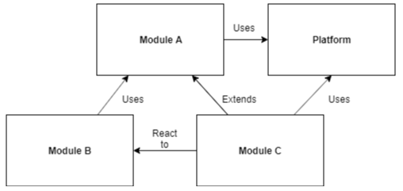

# Essential modularity

Virto Commerce is the modular application that consists of divided into a set of loosely coupled functional units (named modules) that are loaded into the process of platform application. 

A module encapsulates a portion of the application's overall functionality and typically represents a set of related concerns. It can include a collection of related components, such as domain features, including user interface and business logic, or pieces of application infrastructure and Rest API methods. 

Modules are independent of one another but can communicate with each other in a loosely coupled fashion. Either way, it is important to keep the communication between modules to a minimum to avoid dependency issues and keep this design makes it easier for you to develop, test, deploy, and maintain your application.

> You need to guide by the loosely coupled and shared-nothing infrastructure principles when designed your modules.

The following illustration shows an overall design of a Virto platform application with multiple modules.

 

## Typical module solution structure
From a file system perspective, Virto module contains a structured combination of configuration and code files used to build an application from source code. The module solution structure is constructed with using of N-Tier and DDD principle and it is a business unit that  **is able to fully provide a set of desired features** . This kind of design is called  *“Vertical Slices”*  and we group these slices in the module

  

 Typically, Virto module solution is organized in the following way:

**Module.Core** - This project contains all abstractions and domain model definitions and plays the role of program API to access all module functionality and is used in the interaction between other modules.  This project has a class library project type and can be packaged and distributed as **NuGet** package.

* **Events** – folder contains all domain and integration events that current module can be raised by the application
* **Services** – contains all the abstractions and interfaces of all services, which are the programming API to the entire functionality of the module domain
* **Model** – contains a domain model classes
* **ModuleConstants.cs** – contains all module constants such as permissions, settings and string literals

**Module.Data** – This project consists the persistence and business layers and may include repositories and domain services implementations. This project also has a class library project type and can be packaged and distributed as **NuGet** package and be used as a reference from other modules.

* **Caching** – contains a strongly typed cache regions that are used in the module (link to how virto cache works)
* **Handlers** – contains domain and integration event handlers
* **Migrations** – contains the database migrations
* **Model** – Virto use **Data Mapping** pattern to isolate domain model from persistence specific ( **Persistence ignorance** principle) and this folder contains classes that directly mapped to database tables with using EF fluent API.
* **Repositories** – an implementation of repositories that provides a set of methods to access the database. These methods ‘hide’ the code needed to implement the various database features you need.
* **Services** – contains the  domain CRUD services and other business logic implementation

**Module.Web** – is represents an application level of module domain, this project uses all services and domain types in order to implement business scenarios along with initialization and public API and user interface are implemented on this level. This project can’t be used directly from other modules and don’t distribute as **NuGet** package.

* **Content** – Contains a **CSS** styles for module user interface
* **Scripts** – contains the angularJS  javascript files and templates used for module presentation in platform manager application
* **dist** – contains resulting javascript and style  bundles the output of working WebPack bundling process
* **Controllers** – folder contains all ASP.NET MVC Core REST API controllers.
* **Localizations** – contains localization resource files that are used for UI localization
* **Module.cs** - the main module entry point
* **module.manifest** – module manifest file, this required file contains meta-information describing your module with dependencies and versions.

## How the platform load modules in the application process. Module life time.
The module loading process into  Virto platform application process includes the following steps:

* Registering/discovering modules. The modules to be loaded at first run in run-time for a platform application are defined in a discovery folder `~/modules`. The discovery folder contains  the modules folders tree, each module folder contains a special *module.manifest* file and other modules resources such as assemblies,  java-scripts and style bundles, and localization resources.
* Copy modules assemblies into probing folder is necessary because on this step we apply version conflicts resolution

> The current single policy is when the assembly with the latest version or latest date of modification  always wins during copying.

> Copying assemblies into probing folder prevents assembly lock issues that might happen when the same assemblies that are loaded into the application process and same time can be modified during development or other activity. 

> In multiinstance platform configurations only one instance checks/copies assemblies into the probing folder. This achieved by distributed locking between instances thru Redis. First started instance copies the files and the other instances skips.

* Loading modules. The assemblies that contain the modules are loaded into default context `AssemblyLoadContex.Default` of the application process. This phase requires the module assemblies to be retrieved from the probing folder.
* Order by dependency graph – sore all loaded modules in the order of their dependencies for proper initialization order.
* Initializing modules. The modules are then initialized. This means creating instances of the module class and calling the Initialize method on them via the `IModule` interface.

*The following diagram shows the module loading process.*

 

> Virto platform modularity engine supports only the eager loading from local disk for modules.

## Module relationships
Even though modules should have low coupling between each other, it is common for modules to communicate with each other and since all modules are loaded into the process of platform application, they also have access to provides by platform functionality.

A single module can have the following types of relationships with another module and platform:

* **Uses** - module A uses module B if it invokes behavior of module B
* **Extends** - module A extends module B if it modifies the behavior of module B or uses a special extensions points are defined in module B
* **React to** - module A reacts to module B if its behavior is triggered by an integration event in module B without module B knowing about module A

The diagram shows all possible types of relationships between modules and the platform

 

Also, there are several loosely coupled communication patterns, each with their own strengths. Typically, combinations of these patterns are used to create the resulting solution. The following are some of these patterns:

* **Integration events** . A module can broadcast that a certain event has occurred. Other modules can subscribe to those events so they will be notified when the event occurs. Integration events are a lightweight manner of setting up communication between two modules; therefore, they are easily implemented.
* **Program and UI extension point** s. Special extension points that each module can expose for tasks to extend or supplement existing module functionality by a new one.
  * UI widgets and navigations
  * Domain models overriding
  * Persistent layer extensions
* **Shared services.** A shared service is a class that can be accessed through a common interface. Typically, shared services are found in a shared assembly and provide system-wide services, such as authentication, logging, or configuration.

## Modules versioning and dependencies

Virto modules and platform use [SemVer](https://semver.org/) for versioning.

[SemVer](https://semver.org/), short for Semantic Versioning. In its latest incarnation (v2.0.0), it describes its proposed versioning scheme as follows:

Given a version number MAJOR.MINOR.PATCH, increment the:

* MAJOR version when you make incompatible API changes,
* MINOR version when you add functionality in a backwards-compatible manner, and
* PATCH version when you make backwards-compatible bug fixes.

Additional labels for pre-release and build metadata are available as extensions to the 
* MAJOR.MINOR.PATCH format.

Along with release version you might use pre-release versions, use for this prerelease tag. The resulting format of the pre-release version is:

* MAJOR.MINOR.PATCH-<alpha | beta | rc

In modules pre-release tags we generally follow recognized naming conventions:

* alpha: Alpha release, typically used for work-in-progress and experimentation.
* beta: Beta release, typically one that is feature complete for the next planned release, but may contain known bugs.
* rc: Release candidate, typically a release that's potentially final (stable) unless significant bugs emerge.

Each virto module has a version in both places the first place projects assembly version, the second is the module manifest file. 
The assembly version is temporary needs to be changed manually  in `Directory.Build.Props`  (in future it can automatically calculate from current Git branches and tags tanks to [GitVersion](https://gitversion.readthedocs.io/en/latest/) utility) and second place where need to define module version is the *module.manifest* file. 

A module can depend on other modules and cannot function without modules on which it depends,
along with this, each module has a dependency to a specific platform version.

All module and platform dependencies must be described in `module.manifest` file in the `dependencies` element.

*`module.manifest`*
```XML
<?xml version="1.0" encoding="utf-8"?>
<module>
    <id>VirtoCommerce.Catalog</id>
    <version>3.3.0</version>
    <platformVersion>3.0.0</platformVersion>
    <dependencies>
        <dependency id="VirtoCommerce.Core" version="3.0.0" />
        <dependency id="VirtoCommerce.BulkActionsModule" version="3.0.0" />
    </dependencies>
    ...
```

The virto dependency version resolving logic is always interpret all version as  **^major.minor.path** (Next Significant Release [Caret Version Range](https://getcomposer.org/doc/articles/versions.md) operator)  and it will always allow non-breaking updates. It is the best explained by example:

> ^1.2.3 is equivalent to >=1.2.3 <2.0.0 as none of the releases until 2.0 should break backwards compatibility.

## Manage 3rd party dependencies for modules

Due to that fact that each module assemblies are copied in the `probing` folder before loading into the platform application process except self module assemblies the platform modules manager copy all  3rd party dependencies assemblies and apply the same version conflict resolution policy:

> The assembly with the highest version or latest modified - wins

This fact may lead to an unexpected update of third-party dependencies for other modules and the platform application itself when resolving the assembly at run time. And you should always consider this fact when updating dependencies for your custom modules.

## Module install and update process

Virto has two different install and update modes for modules: **Runtime** and  **Design-time** respectively.

**Runtime**  - this mode is used for update and install modules on working system or in first time setup and this process based on request to special resource file modules.json (registry_ that can be on public or internal access and it contains information about all modules and their latest major versions (minor and patch versions history not stored). Path to this file can be set by a special setting in the platform `appsettings.json` file.

*`module.manifest`*
```JSON
...
"ExternalModules": {
         //flag indicates to display and be able to install pre-release versions of modules
        "IncludePrerelease": true,
        //url to json that contains all information about all available virto modules versions
        //This URL can be changed to point into a file with modules versions specific for your solution
        "ModulesManifestUrl": "https://raw.githubusercontent.com/VirtoCommerce/vc-modules/master/modules_v3.json",
        ...
}
...
```
In the real world solutions based on Virto commerce you rather will have a deal with a list of your custom modules that have dependencies to not the latest Virto modules versions, and for this better to define your own version of modules.json file that will contains list of  your custom and Virto modules with specific for you solution versions. Have own modules.json file will pay the same role as package.json  for NPM dependencies but have shared nature and can be used on global organization level.

How this process works for the virto platform modules for both platform major version:

 


**Design time with using CLI** –  this mode is often used during development, when you manage installed versions of modules, install or update them manually on the local computer or in any other public environment. The virto provides the special CLI tool for this, check out [vc-build for packages management](https://github.com/VirtoCommerce/vc-platform/blob/master/docs/CLI-tools/package-management.md) for more info.

Examples:

```console
//Install  the latest version of a particular module 
vc-build install -Module VirtoCommerce.Store

//Update platform and all installed modules to the latest version
vc-build update
```

## Module deployment process

Virto platform  has a build automation tool  [VirtoCommerce.GlobalTool](https://github.com/VirtoCommerce/vc-platform/tree/dev/build)   that helps with  building, packaging  and releasing  modules, you might read more about by this link [vc-build for packages management](https://github.com/VirtoCommerce/vc-platform/blob/dev/docs/CLI-tools/build-automation.md) for more info.

 

## Identify domain-model boundaries for each module and optimal modules quantity for a custom solution

The goal when identifying model boundaries and size for each module isn’t to get to the most granular separation possible, although you should tend toward small module if possible. Instead, your goal should be to get to the most meaningful separation guided by your domain knowledge. The emphasis isn’t on the size, but instead on business capabilities. In addition, if there’s clear cohesion needed for a certain area of the application based on a high number of dependencies, that indicates the need for a single module, too. Cohesion is a way to identify how to break apart or group together modules. Ultimately, while you gain more knowledge about the domain, you should adapt the size of your module, iteratively. 


>**Important:** The Virto module basically represents the unit of compilation and distribution of functionality -  has exactly one deployment unit. Please do not consider the module as a single possible way to the separation of domains and business logic. You might organize a well-designed multiple domains architecture within a single module!

The big quantity of modules that have many dependencies and closely coupled together might significantly affect development team productivity, deployment and maintained processes due to versions hell and cascade releases.

The implement all your custom solution in a single module will be a good choice if your project satisfied of all these requirements:

* has a one development team and single code review and release flow - same dev life-cycle
* most of your business logic based on the core Virto modules and simply extends them
* you do not have strict scale requirement that requires your solution to run some modules independently as standalone services.

 

We can draw parallels between how your code can spread between virto modules and how the same code can be arranged in poly or mono repositories.

The good article explains the advantages of a mono repository without giving away the benefits of poly-repositories - https://blog.upcoding.fr/microservices-in-a-monorepo/
and another very good article for `Modular Monolith`  architecture  - https://www.kamilgrzybek.com/design/modular-monolith-primer

# Additional resources

* [Modular Monolith - Kamil Grzybek](https://www.kamilgrzybek.com/design/modular-monolith-primer/)
* [Vertical Slice Architecture – Jimmy Bogard](https://jimmybogard.com/vertical-slice-architecture/)
* [Software Architecture Patterns by Mark Richards - Microkernel Architecture](https://www.oreilly.com/library/view/software-architecture-patterns/9781491971437/ch03.html)
* [Martin Fowler - BoundedContext ](https://martinfowler.com/bliki/BoundedContext.html)
* [Context mapping pattern](https://www.infoq.com/articles/ddd-contextmapping/)
