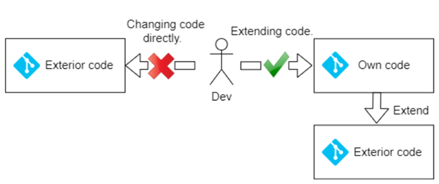

# Extensibility basics

The main philosophy of the VC platform is concluded into provides general possibilities and common things rather than particular solutions. We understand that everyone has different needs and use cases, and it’s impossible to provide a solution that’s ‘*one size fits all*’.  

Our platform is based around a collection of different modules and components that form the backbone of the Virto value proposition — to make each part of our system extendable and usable.

In order to meet the needs of many different use cases, we decided it was important to ensure that these core concepts were as flexible and extensible as possible. The Virto platform provides the **Extension concept** that based on various technics and practices and can significantly reduce implementation and upgrade effort for your custom solution.

**Extension concept - is the backbone of the Virto platform value proposition and have the four main extensible points types:**

To address crucial extension requirements the platform contains various **extensions points** for all of three main parts Platform application, Modules and Storefront that allow performing many customizations without direct code modification. In this article we will try to describe all these important ones.

## Why is important to do not have modification of code that you not own?

Despite that fact Virto platform is open source project you must every possible way to avoid direct modification into source code of modules that are developed by third parties or VC team and always follow to the [The Open-Closed Principle.](https://en.wikipedia.org/wiki/Open%E2%80%93closed_principle) (Open for Extensions and Closed for Modifications).

 

What benefits you will get if you will follow our **Extension concept** and use **Extensible Points** that platform provides for customization on your custom solution:

* Straightforward (no-hassle) updating process.  You will avoid of merging hell during updates if you hadn’t any modification in code that you not own and be able to timely receive the new fixes for bugs and security vulnerabilities along with new functionality even the major updates. The platform team do all the best to simplify updating process and do not introduce any breaking change in new releases.  This is a huge advantage but it's only advantages to you if you take action on the updates.
* Easiest provision of support. Thanks  to the base code immutability, Virto support team can easily reproduce your issues and quick  provide you  the right solutions and answers.

## The list of the main extension points

* Domain and business logic extension
    * [extending domain types](./extensibility/extending-domain-models.md)
    * [extending using domain events](./extensibility/extending-using-events.md)
    * [extending authorization policies](./extensibility/extending-authorization-policies.md)
    * [dynamic properties](./extensibility/using-dynamic-properties.md)
* Platform manager UI extension
    * [extending main menu](./extensibility/extending-main-menu.md)
    * [working with widgets](./extensibility/widgets.md)
    * [metaforms](./extensibility/metaform.md)
    * [extending blade toolbar](./extensibility/blade-toolbar.md)
* Webhooks (TDB)
* Extending commerce logic
    * [new payment method registration](./extensibility/new-payment-method-registration.md)
    * [new shipping method registration](./extensibility/new-shipping-method-registration.md)
    * [new tax provider registration](./extensibility/new-tax-provider-registration.md)

