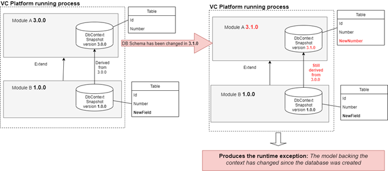

# Extensibility basics

This article is a part of a series about the **concept  of extensibility** that VirtoCommerce platform provides and with which you should be guided when building your custom projects based on the platform.

In this part, we try to give an overview of the Virto extension extensibility concept and describe one of the important types of extension the “The domain model and persistence layer extension.”

[View or download sample code](https://github.com/VirtoCommerce/vc-module-order/tree/dev/samples/VirtoCommerce.OrdersModule2.Web)

## Extensibility overview

The main philosophy of the VC platform is concluded into provides general possibilities and common things rather than particular solutions. We understand that everyone has different needs and use cases, and it’s impossible to provide a solution that’s ‘*one size fits all*’.  

Our platform is based around a collection of different modules and components that form the backbone of the Virto value proposition — to make each part of our system extendable and usable.

In order to meet the needs of many different use cases, we decided it was important to ensure that these core concepts were as flexible and extensible as possible. The Virto platform provides the **Extension concept** that based on various technics and practices and can significantly reduce implementation and upgrade effort for your custom solution.

**Extension concept - is the backbone of the Virto platform value proposition and have the four main extensible points types:**

* **Domain model and persistence layer extension**
* Platform manager UI extension
* Integration and Domain events
* Pluggable designed extensions

To address crucial extension requirements the platform contains various **extensions points** for all of three main parts Platform application, Modules and Storefront that allow performing many customizations without direct code modification. In this article we will try to describe all these important ones.

## Why is important to do not have modification of code that you not own?

Despite that fact Virto platform is open source project you must every possible way to avoid direct modification into source code of modules that are developed by third parties or VC team and always follow to the [The Open-Closed Principle.](https://en.wikipedia.org/wiki/Open%E2%80%93closed_principle) (Open for Extensions and Closed for Modifications).

 

What benefits you will get if you will follow our **Extension concept** and use **Extensible Points** that platform provides for customization on your custom solution:

* Straightforward (no-hassle) updating process.  You will avoid of merging hell during updates if you hadn’t any modification in code that you not own and be able to timely receive the new fixes for bugs and security vulnerabilities along with new functionality even the major updates. The platform team do all the best to simplify updating process and do not introduce any breaking change in new releases.  This is a huge advantage but it's only advantages to you if you take action on the updates.
* Easiest provision of support. Thanks  to the base code immutability, Virto support team can easily reproduce your issues and quick  provide you  the right solutions and answers.

## The extension of domain model

Common domain classes have a fixed structure and are defined in modules. This means that you cannot add additional properties to existing domain types without direct code modification. On of possible way to do this is extend an entity class and add additional properties in the subclass.

Let’s demonstrate how the domain model extension works, extending the `CustomerOrder` type that defined in the **OrderModule** with new properties.

> However, this approach does not work anymore when one domain entity type should be extended from different modules. The extension domain model is based on class inheritance and the .NET does not support multiple class inheritance and, in the result, only one the last registered extension wins. You should consider this limitation.

First step what we should do is define new subclass `CustomerOrder2` derived from original `CustomerOrder` class.

#### **`VirtoCommerce.OrdersModule2.Web/Model/CustomerOrder2.cs`**
```C#
    public class CustomerOrder2 : CustomerOrder
    {
        public CustomerOrder2()
        {
            Invoices = new List<Invoice>();
        }
        public string NewField { get; set; }
        public ICollection<Invoice> Invoices { get; set; }
    }
```

Now, we need to register the newly defined `CustomerOrder2` type in the `AbstractFactory<>` in order to tell the system that `CustomerOrder2` is now overlying (replace) the original `CustomerOrder` class and will be used everywhere instead of it.

#### **`VirtoCommerce.OrdersModule2.Web/Module.cs`**
```C#
    public class Module : IModule
    {
        public void PostInitialize(IApplicationBuilder appBuilder)
        {
            ...
             AbstractTypeFactory<CustomerOrder>.OverrideType<CustomerOrder, CustomerOrder2>()
                                            .WithFactory(() => new CustomerOrder2 { OperationType = "CustomerOrder" }); //need to preserve original order  discriminator value
            ...
        }
    }
```

> **AbstractTypeFactory<>** is the key element in the Virto **extension concept** that response for instantiate a concrete type instance based on internal types mapping table.

Each code which should support domain types extensions must use   

`AbstractTypeFactory<BaseType>.TryCreateInstance()` instead of `new BaseType()`  statement, when you need to override any base type with another derived type you must call   `AbstractTypeFactory<BaseType>.OverrideType<BaseType, DerivedType>()`  after this, each  calls  `AbstractTypeFactory< BaseType>.TryCreateInstance()`  will return your `DerivedType` object instance instead of `BaseType`. 

That’s how the magic with types extension works!

## The schema of  persistent layer extensions.

You just saw how to extend the exists `CustomerOrder`  in class  with a new class `CustomerOrder2` with new  properties. But, how can you actually change the current DB schema and persist these new types into the database through Entity Framework (EF) Core? To solve this task we can also  use the inheritance technics here, and define and derive  the new   `Order2DbContext`  from original `OrderDbContext` along with `OrderRepository2` derived from `OrderRepository`.

#### **`VirtoCommerce.OrdersModule2.Web/Repositories/Order2DbContext.cs`**
```C#
    //Derive custom DB context from the OrderDbContext
    public class Order2DbContext : OrderDbContext
    {
         public Order2DbContext(DbContextOptions<Order2DbContext> builderOptions) : base(builderOptions)
        {
        }
         protected override void OnModelCreating(ModelBuilder modelBuilder)
        {
            //the method code
        }
    }
```

#### **`VirtoCommerce.OrdersModule2.Web/Repositories/OrderRepository2.cs`**
```C#
 public class OrderRepository2 : OrderRepository
    {
        public OrderRepository2(Order2DbContext dbContext, IUnitOfWork unitOfWork = null) : base(dbContext, unitOfWork)
        {
        }
    }
```

In Virto for persistence logic we use **[Data Mapper](https://www.martinfowler.com/eaaCatalog/dataMapper.html)** pattern, it helps to completely isolate your domain from the persistence layer. Usages of this pattern give us more benefits with keeping domain contracts in a more stable state and allows to us change persistence schema without affecting a domain that usually play the role of public contracts.

The each domain type has its own representation in the database, it is the special `DataEntitity` classes that are defined in EF Core `DbContext` through fluent syntax and contains a three methods:

* `ToModel` and `FromModel` – for map object of domain types into persistent and vice versa
* `Patch` for apply changes to only  specified columns. This method is crucial  for implementation of partial update logic.

Now let’s define the new persistence `CustomerOrder2Entity` type that will represent the persistence schema model of the new `CustomerOrder2` class.

#### **`VirtoCommerce.OrdersModule2.Web/Model/CustomerOrder2Entity.cs`**
```C#
    public class CustomerOrder2Entity : CustomerOrderEntity
    {
        public override OrderOperation ToModel(OrderOperation operation)
        {
           //the method code
        }
        public override OperationEntity FromModel(OrderOperation operation, PrimaryKeyResolvingMap pkMap)
        {
           //the method code
        }
    }

```

The next step we need to generate the new Db Migration for our new extended `Order2DbContext`.

We can do that by run this command in *Nuget* package version console in *Visual Studio.*

```Console 
Add-Migration InitialOrder2 -Context VirtoCommerce.OrdersModule2.Web.Repositories. Order2DbContext   -Verbose -OutputDir Migrations -Project VirtoCommerce.OrdersModule2.Web -StartupProject VirtoCommerce.OrdersModule2.Web -Debug
```

The result of this command execution will be `Migrations/XXXXXX_InitialOrder2.cs` file that will also contains the original (extendable) order module DB schema along with a new one. Thus, you need manually edit the resulting `InitialOrder2.cs` file and left only DB schema changes that relevant to your extension.

#### **`VirtoCommerce.OrdersModule2.Web/Migrations/20200324130250_InitialOrders2.cs`** 
```C#
    public partial class InitialOrders2 : Migration
    {
        protected override void Up(MigrationBuilder migrationBuilder)
        {
           //the method code
        }
    }
```

And the final step is to register our derived `OrderRepository2` and `Order2DbContext` in DI container. By registration the new `OrderRepository2` in DI we override the base `OrderRepository`  that is defined in `CustomerOrder.Module`.

#### **`VirtoCommerce.OrdersModule2.Web/Module.cs`**
```C#
    public class Module : IModule
    {
        public void Initialize(IServiceCollection serviceCollection)
        {
            var snapshot = serviceCollection.BuildServiceProvider();
            var configuration = snapshot.GetService<IConfiguration>();
            serviceCollection.AddDbContext<Order2DbContext>(options => options.UseSqlServer(configuration.GetConnectionString("VirtoCommerce")));
            serviceCollection.AddTransient<IOrderRepository, OrderRepository2>();

        }
    }
```

Also is so important to register our new persistent schema representation `CustomerOrder2Entity` in `AbstractTypeFactory<>` and override the base `CustomerOrderEntity` with new type.

#### **`VirtoCommerce.OrdersModule2.Web/Module.cs`**
```C#
    public class Module : IModule
    {
        public void PostInitialize(IApplicationBuilder appBuilder)
        {
            ...

            AbstractTypeFactory<IOperation>.OverrideType<CustomerOrder, CustomerOrder2>();
            AbstractTypeFactory<CustomerOrderEntity>.OverrideType<CustomerOrderEntity, CustomerOrder2Entity>();

            ...
        }
    }
```

## The known problems with updating when you have a schema  of persistent layer extensions.

As a background, a huge limitation of the persistent layer extension technique is the mandatory creation of an empty database migration after each derived module update that has a new migration with schema changes. Without this, you will receive this error

“*The model backing the context has changed since the database was created*” each time when you will update an extendable module that has a persistent schema change and contains a new migration.

The following diagram illustrates the problem described above.
 

Unfortunately, there is only one solution to solve this issue, before each update of the extendable module that contains the DB schema changes it is mandatory to do the following steps with your module:

* Update to the latest version all  NuGet dependencies containing the base `DbContext` class which your custom  `DbContext`  is derived. Usually, this project has suffix Data. E.g `VirtoCommerce.CustomerOrder.Data`.
* Generate a new “empty” migration by this command  
```Console
Add-Migration BumpVersionEmptyMigration -Context {{ full type name with namespace of your DbContext }}   -Verbose -OutputDir Migrations -Project {{ your module project name }} -Debug
```

* Manually edit resulting migration file, delete all generated content and left only empty migration. It is mandatory step because the resulting migration will contain the same changes as original migration in the extendable module. 

* Update the module dependency version in `module.manifest file` of your custom module to point to the actual version of dependency. 

## PolymorphicOperationJsonConverter. How the API understand/deserializes the derived domain types 

In the previous paragraphs, we are considered how to extend the domain types and persistent layer but, in some cases, it is not enough. Especially when your domain types are used as DTO (Data Transfer Object) in public API contacts and can use as result or parameters in the API endpoints. In order to force ASP.NET Core API Json serializer to understand our domain extensions, we use the special `PolymorphicOperationJsonConverter` class. Its primary responsibility is an instantiation of the right “effective” type instance from incoming JSON (deserialization) data. Looking to implementation it uses the `AbstractTypeFactory<>`  and reflection to construct the proper type instance based on base type or discriminator is used from JSON request body.


#### **`VirtoCommerce.OrdersModule.Web/JsonConverters/PolymorphicOperationJsonConverter.cs`**
```C#
    public class PolymorphicOperationJsonConverter : JsonConverter
    {
        ...
        
        public override object ReadJson(JsonReader reader, Type objectType, object existingValue, JsonSerializer serializer)
        {
            object retVal;
            var obj = JObject.Load(reader);

            var tryCreateInstance = typeof(AbstractTypeFactory<>).MakeGenericType(objectType).GetMethods().FirstOrDefault(x => x.Name.EqualsInvariant("TryCreateInstance") && x.GetParameters().Length == 0);
            retVal = tryCreateInstance?.Invoke(null, null);
        }
        ...
    }
```
The many base VirtoCommerce modules have such PolymorphicOperationJsonConverter for their own types that support extensions and register it in their `Module.cs` in this way.

#### **`VirtoCommerce.OrdersModule.Web/Module.cs`**
```C#
    public class Module : IModule
    {
        public void PostInitialize(IApplicationBuilder appBuilder)
        {
            ...

            // enable polymorphic types in API controller methods
            var mvcJsonOptions = appBuilder.ApplicationServices.GetService<IOptions<MvcNewtonsoftJsonOptions>>();
            mvcJsonOptions.Value.SerializerSettings.Converters.Add(appBuilder.ApplicationServices.GetService<PolymorphicOperationJsonConverter>());

            ...

        }
    }
```

