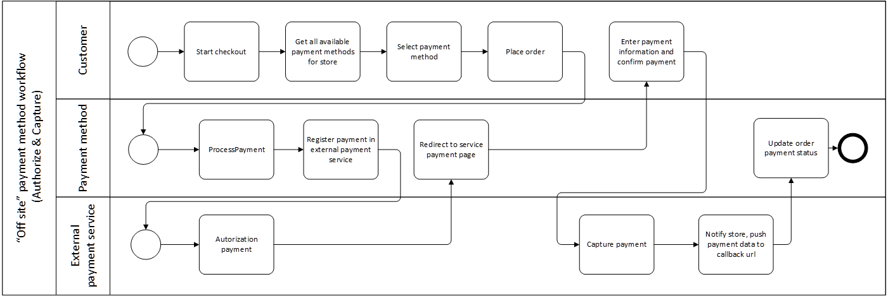

There are two approaches of working with payment systems:

* Off-site - in this approach customer fills in required payment credentials in payment system;
* On-site - in this approach customer fills in required payment information on seller's system side. After all the required data is filled, the seller's system sends a request to the payment system. In special cases the customer will be asked to enter additional security data to commit the transaction (MasterCard SecureCode).
  
VirtoCommerce supports both off-site and on-site payment methods implementations.

[Sample code](https://github.com/VirtoCommerce/vc-module-payment/blob/master/src/VirtoCommerce.Payment.Data/DefaultManualPaymentMethod.cs)

## Concepts

An off-site payment method implementation activities diagram.



## Define new payment method

* Create new module [create new module](../../developer-guide/create-new-module.md)
* Create a class derived from `PaymentMethod` abstract class and override all abstract  methods each of them will be called on the appropriated stage of payment processing workflow
  
```C#
  public class DefaultManualPaymentMethod : PaymentMethod
    {
		//has to implement payment transaction registration in an outside payment system;
		//gets ProcessPaymentEvaluationContext as a parameter, which contains all the required information to create a payment transaction in an outside payment system;
        //returns ProcessPaymentResult as a result, which includes the OuterId property, that has to be set to PaymentId. That way it associates payment in the Virto Commerce platform with the payment transaction in //the outside payment system
        public override ProcessPaymentRequestResult ProcessPayment(ProcessPaymentRequest request) { ... }
		//has to implement payment status check in the outside payment system;
 		//get PostProcessPaymentEvaluationContext as a parameter, which contains all the required information to check payment status in outside payment system;
		//returns PostProcessPaymentResult as a result, which includes the payment status result returned by the outside payment system
		public override PostProcessPaymentRequestResult PostProcessPayment(PostProcessPaymentRequest request) { ... }
		 public override VoidPaymentRequestResult VoidProcessPayment(VoidPaymentRequest request) { ... }
		 public override CapturePaymentRequestResult CaptureProcessPayment(CapturePaymentRequest request) { ... }
		 public override RefundPaymentRequestResult RefundProcessPayment(RefundPaymentRequest request) { ... }
		 //has to impelement querystring request processing. The request comes to `push url` from outside payment system or frontend. The `push url` is set in account settings of most payment systems or during
		//payment transaction processing in outside payment system (ProcessPayment method).
		//as a result of successfully checked (valid) payment the OuterId property of ValidatePostProcessRequestResult has to be set. It identifies payment in VirtoCommerce with the transaction in outside payment system.
		 public override ValidatePostProcessRequestResult ValidatePostProcessRequest(System.Collections.Specialized.NameValueCollection queryString) { ... }
	}
```

* Register your module class in the DI container. This must be done in `PostInitialize` method. You can also associate the settings which will be used in your method and can be changed in the management UI. 
  
```C#
public void PostInitialize(IApplicationBuilder applicationBuilder)
{
  ...
     
	 	var settingsRegistrar = appBuilder.ApplicationServices.GetRequiredService<ISettingsRegistrar>();
        var paymentMethodsRegistrar = appBuilder.ApplicationServices.GetRequiredService<IPaymentMethodsRegistrar>();
        paymentMethodsRegistrar.RegisterPaymentMethod<DefaultManualPaymentMethod>();
		//Associate the settings with the particular payment method
        settingsRegistrar.RegisterSettingsForType(ModuleConstants.Settings.DefaultManualPaymentMethod.AllSettings, typeof(DefaultManualPaymentMethod).Name);
  ...
}
```

The important property of payment method is `PaymentMethodType` property. That property defines what actions will be executed by the front end to get a transaction registration result. There are two types of actions defined today. More will be implemented in future.

*Redirection* – use this type of action if payment method redirects the user to an outside url. In order to do that set that link to `RedirectUrl` property in the ProcessPaymentResult. The frontend will use it to redirect customer (example of such a behavior would be Paypal Express Checkout payment method). 

*PreparedForm* – use this type of action if payment method provides the html form to the user to fill-in required credentials. In order to do that set the `HtmlForm` property in the ProcessPaymentResult with the Html form that the outside payment system returns or with the generated form in our payment system (example of such a behavior would be Klarna Checkout payment method).

## Enable and configure payment method for store

After your module is installed in your target system, all your payment methods should appear and be available for configuration in every store in your system. 
`Store->Payment` methods methods widget. You can configure shipping methods for each store individually:

* enable/disable method for current store
* change priority (to determine in what order they will be displayed in the checkout)
* edit all settings and what you define for the  payment method
* use a custom UI for a more detailed payment method configuration

After you complete the configuration, your shipping method will be appear in the FrontEnd checkout page and the customer may select it as a payment method.

## Management UI customization

If a standard user interface is not enough, then consider implementing your own UI for managing tax providers through the standard UI extension point (widget container with group ”paymentMethodDetail”). You can read more about extending the existing UI with widgets [here](./widgets.md).
