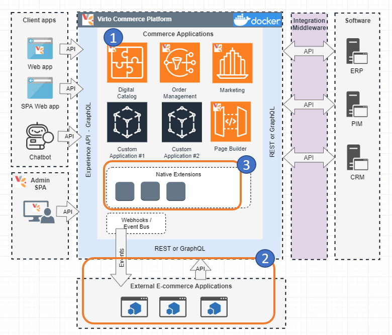
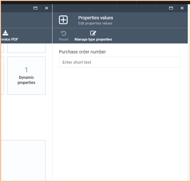
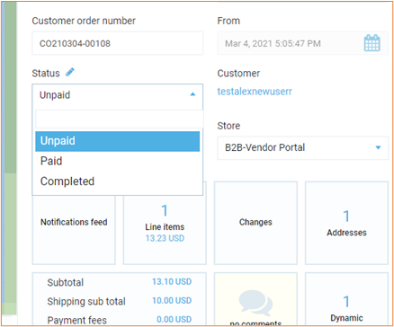
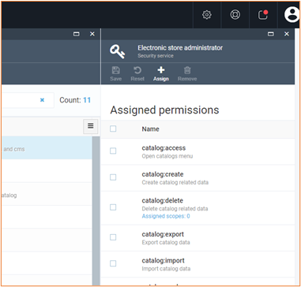
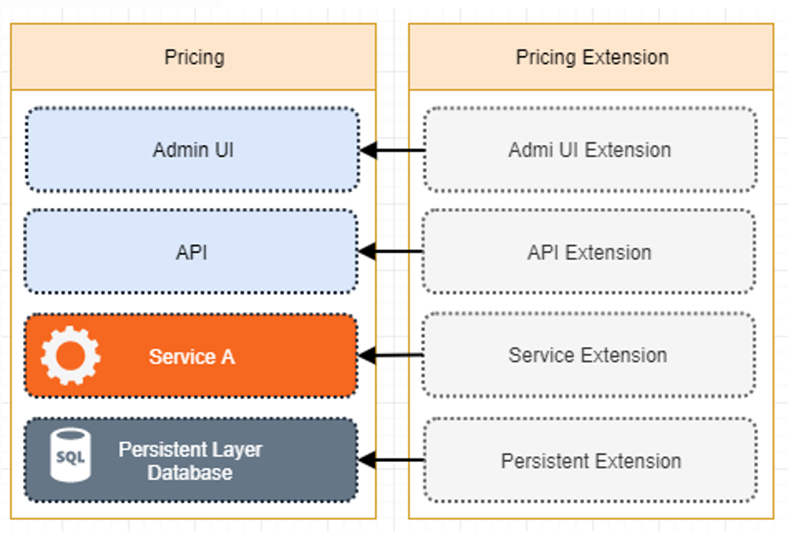
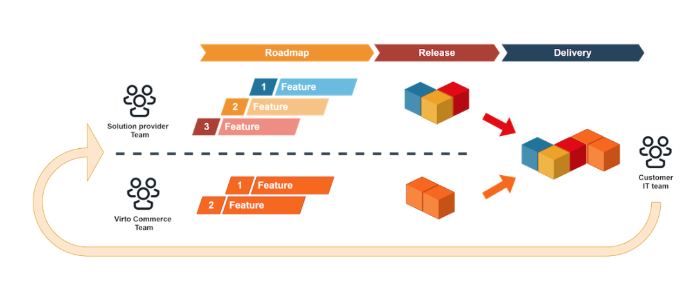
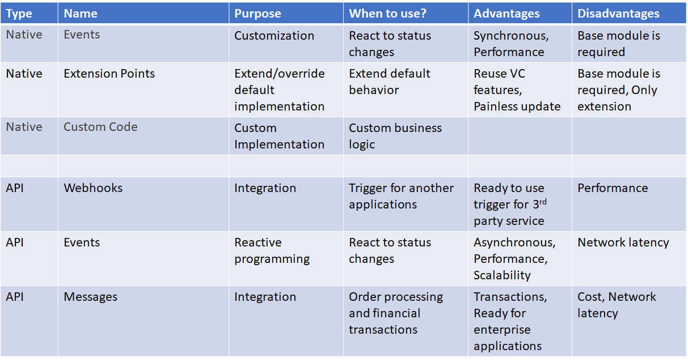

# Overview

Unlimited extensibility is an indisputable advantage of Virto Commerce. This means end-user solution developers can adapt or replace Virto Commerce modules with their own functionality. This adaptation can be done in an elegant and simple way without workarounds.

Three types of vendor-made extensions guarantee “seamless delivery”.  Virto Commerce guarantees that these ways of extensibility are sufficient to build an ecommerce solution of any complexity on top of it.  
 
1. **No-code extensions.** 
 
2. **API-based extensions.** 
 
3. **Native extensions.** 

## No-code extensions

Virto Commerce supports declarative extensions through the admin interface and API to extend the data model, UI, and workflow processing.  

Virto Commerce supports:

* **Dynamic properties.** Extends entities, like Cart, Order, Organization, etc. with new properties.
* **Statuses.** Allows implementing any business process.
* **Role-base security and permissions.** Restrict access for a user (API) based on role. So for example, if you want the user to allow only to able to call Search products API, you can achieve that. Also, for example, you can allow a user to have access to the Orders API for a specific store, only.

## API-based extensions

These are traditional cloud-based extensions based on API calls and Events (Hooks). Developers can use any language and framework for integration and reactive programming. 

Virto Commerce provides several API:

* **REST.** Allows access to module business functionality. So, all CRUD and business logic are accessible via Rest API.
* **GraphQL**. A new generation of Business API for client applications. 

and several Events providers:

* **Webhooks.** Good point for no development integration.
* **Eventbus.** Read for reactive programming and enterprise integrations.

## Native extensions

This is an advanced mode of modular extensions. It is called native because it is a way how Virto Commerce is built internally. 

Virto Commerce creates a unique extension framework based on .NET extension and dependency injection. It allows extending default implementation for the unique needs of each business.

Plus, it simplifies DevOps procedures and provides performance.

!!! note
    Source code is available only for purpose of transparency. Virto doesn’t recommend extending the platform through source code. it will breach the continuous delivery functionality.

With a custom module, you can extend every layer:

* **Admin UI**
* **API**
* **Business Logic**
* **Database**

!!! note
    You can revert back to the original state by uninstalling the extension. 

For example, on this schema Price Extension module extends default Virto Commerce Price module with Recommended price property. And a new property is visible on every layer.

### Why is important to do not have modification of code that you not own?

Despite the fact, Virto platform is an open-source project you must every possible way to avoid direct modification into the source code of modules that are developed by third parties or VC team and always follow The Open-Closed Principle. (Open for Extensions and Closed for Modifications).

 

What benefits you will get if you will follow our **Extension concept** and use **Extensible Points** that platform provides for customization on your custom solution:

* **Seamless delivery.**  You will avoid merging hell during updates if you hadn’t any modification in code that you not own and be able to timely receive the new fixes for bugs and security vulnerabilities along with new functionality even the major updates. The platform team do all the best to simplify updating process and do not introduce any breaking change in new releases.  This is a huge advantage but it's only advantageous to you if you take action on the updates.
* **Easiest provision of support.** Virto support team can easily reproduce your issues and quickly provide you with the right solutions and answers.

### Seamless delivery 

Usually, customization or extensibility means a complex update process. 
If you customize the default implementation, you need to support it by your self.
Getting updates from the vendor and redeveloping them to extended functionality for the client's needs become a time-consuming task.

In Virto Commerce, we design the platform with **Keep up to date** and **Seamless delivery process** principles.

Let's review the seamless delivery strategy in action:

1. Virto Commerce has a flexible Price module. You installed and use it as a binary package.
1. Product owner asked you to display the `Recommended` price as well as the `List` and `Sale` price.
Everything work properly, just need to add a new property.
1. To achieve it, you created a new module **Recommended Price extension**. Extended current domain model, CRUD operation and DB model.
1. Virto Commerce releases a new version of the Price module
1. You can install a new release of the Price module without development in the custom module.

This schema allows to receive updates and extend the default implementation.

!!! caution
    Seamless delivery works properly for all vendor updates. Except when you and Vendor use the same property name.
    Our recommendation, add a custom prefix/suffix for your custom properties, to prevent this problem.
    Ex: AbcStatus, where `Abc` is the abbreviation of your solution. 

### The list of the main extension points

Our platform is based around a collection of different modules and components that form the backbone of the Virto value proposition — to make each part of our system extendable and usable.

In order to meet the needs of many different use cases, we decided it was important to ensure that these core concepts were as flexible and extensible as possible.

The Virto platform provides the **Extension concept** that based on various technics and practices. It can significantly reduce implementation and upgrade effort for your custom solution.

**Extension concept - is the backbone of the Virto platform value proposition and have the four main extensible points types:**

To address crucial extension requirements the platform contains various **extensions points** for all of three main parts Platform application, Modules and Storefront that allow performing many customizations without direct code modification. In this article we will try to describe all these important ones.

* Domain and business logic extension
    * [extending domain types](extending-domain-models.md)
    * [extending using domain events](extending-using-events.md)
    * [extending authorization policies](extending-authorization-policies.md)
    * [dynamic properties](using-dynamic-properties.md)
* Platform manager UI extension
    * [extending main menu](extending-main-menu.md)
    * [working with widgets](widgets.md)
    * [metaforms](metaform.md)
    * [extending blade toolbar](blade-toolbar.md)
* Extending commerce logic
    * [new payment method registration](new-payment-method-registration.md)
    * [new shipping method registration](new-shipping-method-registration.md)
    * [new tax provider registration](new-tax-provider-registration.md)

  
## Type of customization comparison

## Summary
* Virto Commerce provides the best opportunities for customization. 
* The developer can choose the best approach and balance between inside and outside integrations.
* The Native approach simplifies DevOps procedures and Performance, allows to reuse and improve Virto Commerce modules.
* The API approach helps to “glue” Virto Commerce platform into ecommerce ecosystem. 
* Open-Source helps developers to learn the code, fix issues.
* We are open to the contribution.

