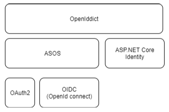
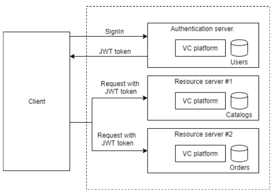
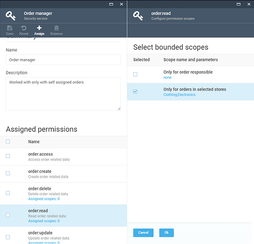

# Make secure Web API

There are so many aspects of security in virto platform and web API that the topic we’ll focus on authentication, authorization and some best practices that would be nice to know.

It has been confusing to differentiate between authentication and authorization. In fact, it is very simple.

* Authentication: Refers to verify who you are, so you need to use username and password for authentication.
* Authorization: Refers to what you can do, for example, access, edit or delete permissions to some documents, and this happens after verification passes.

## Authenticate with ASP.NET Core Identity

Virto platform uses ASP.NET Core Identity as a membership system, using ASP.NET Core Identity enables several scenarios:

* Create new user information using the UserManager type (userManager.CreateAsync).

* Authenticate users using the **SignInManager** type. You can use **signInManager.SignInAsync** to sign in directly, or **signInManager.PasswordSignInAsync** to confirm the user’s password is correct and then sign them in.

* Identify a user based on information stored in a cookie or barrier token so that requests from a browser will include a signed-in user’s identity and claims.

## Issuing JWT tokens with OpenIddict

To enable token authentication, ASP.NET Core supports several options for using OAuth 2.0 and OpenID Connect. We take advantage of some good third-party library and use [OpenIddict](https://openiddict.github.io/openiddict-documentation/guide/index.html)  provides a simple and easy-to-use solution to implement an **OpenID Connect** server in platform application.

 [OpenIddict](https://openiddict.github.io/openiddict-documentation/guide/index.html)  is based on **AspNet.Security.OpenIdConnect.Server** (ASOS) to control the **OpenID Connect** authentication flow and can be used with any membership stack, including ASP.NET Core Identity.  Also, it supports various token formats https://openiddict.github.io/openiddict-documentation/guide/token-formats.html but in Virto platform, we use only JWT token for authorization, because of the following advantages:

* **Stateless**  – The token contains all the information to identify the user, eliminating the need for session state.
* **Reusability**  – A number of separate servers, running on multiple platforms and domains can reuse the same token for authenticating the user. It is easy to build an application that shares permissions with other applications.
* **JWT Security –**  No cookies so no need to protect against cross-site request forgery attacks (CSRF).
* Performance –  no server-side lookup to find and deserialize the session on each request, only need to calculate the HMAC SHA-256 to validate the token and parse its content.

Adding an **OpenID Connect** server to the platform allows us to support token authentication. It also allows you to manage all your users using a local password or an external identity provider (e.g. Azure Active Directory) for all your applications in one central place, with the power to control who can access your API and the information that is exposed to each client.

The stack of technologies on [OpenIddict](https://openiddict.github.io/openiddict-documentation/guide/index.html)  is built

 

Virto platform uses a JWT token authentication and use OAuth2 [Password](https://oauth.net/2/grant-types/password/), [Client Credentials](https://oauth.net/2/grant-types/client-credentials/)  and [Refresh token](https://tools.ietf.org/html/rfc6749#section-1.5) flows to issue and consume  authorization token for clients (see https://openiddict.github.io/openiddict-documentation/guide/token-formats.html)

## Consume security tokens

The Virto platform manager SPA has a built-in implementation of JWT bearer token authorization. And has implementation for storing, refreshing and adding  “authorization” header to each request to platform API. The platform manager application has the special AngularJS [$http interceptor](https://docs.angularjs.org/api/ng/service/$http#interceptors) that performed all these tasks.

 

The platform itself configured to accept the issued JWT tokens and configured in accordance with this guide.
https://openiddict.github.io/openiddict-documentation/configuration/token-setup-and-validation.html#resource-server

# Why we still need to use cookie-based authentication along with JWT in manager

Along with JWT token Virto manager also still uses the cookie-based authentication, this additional check is necessary due to impossibility intercept and inject Authorization header with bearer token for all API calls that are called not through the [$http](https://docs.angularjs.org/api/ng/service/$http) service. These calls can be produced by other third-party JS components and direct http links and cookie-based authorization is used to solve this problem.

When the user authorized in the platform, the system is intersected all user permissions with permissions described in Authorization: LimitedCookiePermissions and add them into cookies along with issue JWT token, and when the user makes a request to the platform, they are challenged against the helper cookie and the authentication token by following rules:

|Recieved with request| JWT Token | Cookies | JWT Token + Cookies |
|---|---|---|---|
|**Is used for auth**| Token | Cookie | Cookies |

You can configure which permissions can be stored in “limited_permissions" cookies by change this setting **Authorization: LimitedCookiePermissions**

#### **VirtoCommerce.Platform.Web/appsetings.json**
```JSON
 "Authorization": {
        ...
        "LimitedCookiePermissions": "security:call_api;platform:asset:read;platform:export;content:read;platform:asset:create;licensing:issue;export:download"
        ...
    },
```

## Configure multiple platform instances with shared token authentication

In some deployment scenarios when they are running multiple platforms instances one of them usually plays an **authentication server** role and has access to user accounts storages.
Other platform instances are play role as **resource servers** that simply need to limit access to those users who have valid security tokens that were provided by an **authentication server**.



Once the token is issued and signed by the authentication server, no database communication is required to verify the token.
Any service that accepts the token will just validate the digital signature of the token.

For that scenario, authentication middleware that handles JWT tokens is available in the `Microsoft.AspNetCore.Authentication.JwtBearer` package.
JWT stands for "JSON Web Token" and is a common security token format (defined by RFC 7519) for communicating security claims

The Virto platform has some  settings that can be used to configure a resource server to consume such tokens


#### **`VirtoCommerce.Platform.Web\Controllers\Api\appsettings.json`**
```JSON
...
 "Auth": {
        //Is the address of the token-issuing authentication server.
        //The JWT bearer authentication middleware uses this URI to get the public key that can be used to validate the token's signature.
        //The middleware also confirms that the iss parameter in the token matches this URI.
        "Authority": "https://authentication-server-url",
        //represents the receiver of the incoming token or the resource that the token grants access to.
        //If the value specified in this parameter does not match the parameter in the token,
        //the token will be rejected.
        "Audience": "resource_server",

        "PublicCertPath": "./Certificates/virtocommerce.crt",
        "PrivateKeyPath": "./Certificates/virtocommerce.pfx",
        "PrivateKeyPassword": "virto"
    }
 ...
```
## Authorization

After authentication, ASP.NET Core Web APIs need to authorize access. This process allows a service to make APIs available to some authenticated users, but not to all. Authorization can be done based on users’ roles or based on custom policy, which might include inspecting claims or other heuristics.

Restricting access to an ASP.NET Core MVC route is as easy as applying an Authorize attribute to the action method (or to the controller’s class if all the controller’s actions require authorization), as shown in the following example
#### **`VirtoCommerce.Platform.Web\Controllers\Api\SecurityController.cs`**
```C#
        [HttpGet]
        [Authorize]
        [Route("currentuser")]
        public async Task<ActionResult<UserDetail>> GetCurrentUser()
        {
            ...
        }

```

By default, adding an **Authorize** attribute without parameters will limit access to authenticated users for that controller or action. To further restrict an API to be available for only specific users, the attribute can be expanded to specify required roles or policies that users must satisfy.

## Permission-based Authorization

Typically, applications require more than just authenticated users. We would like to have users with different sets of permissions. The easiest way to achieve this is with the **role-based** authorization where we allow users to perform certain actions depending on their membership in a role.

For small applications, it might be perfectly fine to use **role-based** authorization, but this has some drawbacks. For instance, it would be difficult to add or remove roles, because we would have to check every **AuthorizeAttribute** with role specified in our code whenever we changed roles.

More flexible authorization could be implemented using permissions claims. Instead of checking role membership, we check if a user has permission to perform a certain action. Permission, in this case, is represented as a claim.

In order to make it easier to manage claims, we can group them in roles. The latest versions of ASP.NET Core makes this possible with role claims.

This solution has the following benefits:

* It allows us to add/remove/delete roles without any changes in code.
* We can re-define a role by changing its permissions.
* Administration UI can be implemented to easily edit roles and permissions.

Virto platform support the two main types of authorization strategy for permission authorization:

* **Global** permissions - the permissions that are checked without taking into account requested resources. To check this sort of permissions you need to operate only permission names e.g Authorize("permission-name").   
* **Scoped** or **Imperative** or **Resource-based** permissions - the permissions  are checked  depends upon the resource being accessed, you need to always use requested. Consider a document that has an author property. Only the author is allowed to update the document. Consequently, the document must be retrieved from the data store before authorization evaluation can occur. Read more [Resource-based authorization in ASP.NET Core](https://docs.microsoft.com/en-us/aspnet/core/security/authorization/resourcebased?view=aspnetcore-3.1)


## Permissions

In VC all permissions are defined on design time (from code)  for each action grouped by a feature area. In this example, we are defining two feature areas with CRUD permissions. We are using constants because we will use these later in attributes, which require constant expressions.
#### **`ModuleConstants.cs`**
```C#
  public class ModuleConstants
    {
        public static class Security
        {
            public static class Permissions
            {
                public const string Read = "order:read";
                public const string Create = "order:create";
                public const string Update = "order:update";
                public const string Access = "order:access";
                public const string Delete = "order:delete";
                public const string ReadPrices = "order:read_prices";

                public static string[] AllPermissions = new[] { Read, Create, Update, Access, Delete, ReadPrices };
            }
        }
```

You have to register the permissions in the system in order to be able to use them in authorization checks and for role assignments in UI.

#### **`module.cs`**
```C#
 public void PostInitialize(IApplicationBuilder appBuilder)
 {
     ...
      var permissionsProvider = appBuilder.ApplicationServices.GetRequiredService<IPermissionsRegistrar>();
            permissionsProvider.RegisterPermissions(ModuleConstants.Security.Permissions.AllPermissions.Select(x =>
                new Permission()
                {
                    GroupName = "Orders",
                    ModuleId = ModuleInfo.Id,
                    Name = x
                }).ToArray());
    ...
 }
```

## Integration with ASP.NET Authorization policies

As the quantity of all permissions that can be defined is not determined, we need to create policies for those permissions. Under the hood, we automated this process by creating a custom policy provider [PermissionAuthorizationPolicyProvider](https://github.com/VirtoCommerce/vc-platform/blob/release/3.0.0/src/VirtoCommerce.Platform.Security/Authorization/PermissionAuthorizationPolicyProvider.cs) that dynamically creates a policy with the appropriate requirement as it's needed during runtime.

The platform code registers the permission policy provider in startup

#### **`Startup.cs`**
```C#
public void ConfigureServices(IServiceCollection services)
{
    ...
     // register the AuthorizationPolicyProvider which dynamically registers authorization policies for each permission defined in module manifest
     services.AddSingleton<IAuthorizationPolicyProvider, PermissionAuthorizationPolicyProvider>();
    ...
}
```

## Global permissions authorization
Global permissions is that permissions that not required any context resources for authorization check, to use such permissions for authorization of your controllers methods you  can use the **AuthorizeAttribute** to check particular permission with just adding Authorize attribute with required permission name as policy:

#### **`VirtoCommerce.OrdersModule.Web/Controllers/Api/OrderModuleController.cs`**
```C#
        [HttpPost]
        [Route("")]
        [Authorize(ModuleConstants.Security.Permissions.Create)]
        public async Task<ActionResult<CustomerOrder>> CreateOrder([FromBody]CustomerOrder customerOrder)
        {
            ...
        }
```

## Imperative (resource-based or scope-based) authorization 
Imperative permissions are permissions that are checked depends on the resource that is being accessed.
Consider an order that has a store property. Only orders belong to a particular store can be viewable for the user. Consequently, the order must be retrieved from the data store before authorization evaluation can occur.

Permission check based on **[Authorize]** attribute evaluation occurs before data binding and before the execution of the API action that loads the order. For these reasons, declarative authorization with an **[Authorize]** attribute doesn't suffice. Instead, you can invoke a custom authorization method—a style known as imperative authorization.

### Define the new permission-scope

Let's see how the resource-based authorization works on one example:

We need to restrict user access to the only orders created in a particular store. In order to do this authorization check-in code and allow to assign this permission for end authorization role we must do the following steps:

Define the new **OrderSelectedStoreScope** class derived from **PermissionScope**, the object of this type will be used  in role management UI and hold a store identifier selected by user and can be used for future authorization check.

#### **`VirtoCommerce.OrdersModule.Web/Authorization/OrderSelectedStoreScope.cs`**
```C#
     /// <summary>
    /// Restricts access rights to orders that belong to a particular store
    /// </summary>
    public sealed class OrderSelectedStoreScope : PermissionScope
    {
        public string StoreId => Scope;
    }
```

Property **StoreId** will contain a store id of selected by the user on the role management UI.

To register the scope and make the “**global**” permission to become “**scope-based**” you need to add the following code to your **Module.cs**

#### **`VirtoCommerce.OrdersModule.Web/Scripts/module.cs`**
```C#
public void PostInitialize(IApplicationBuilder appBuilder)
    {
        ...
        var permissionsProvider = appBuilder.ApplicationServices.GetRequiredService<IPermissionsRegistrar>();
        permissionsProvider.WithAvailabeScopesForPermissions(new[] {
                                                                        "order:read",
                                                                    }, new OrderSelectedStoreScope());
        ...
```
By this code you register the permission `order:read` in system and associate it with `OrderSelectedStoreScope` scope.
The next step is register the presentation template for `OrderSelectedStoreScope` is allows to user configure permission scope setting  in the manager.

#### **`VirtoCommerce.OrdersModule.Web/Scripts/order.js`**
```JS
//Big part of exists code is removed for clarity reasone
angular.module(moduleName, []).run( ['platformWebApp.permissionScopeResolver', 'platformWebApp.bladeNavigationService', function(scopeResolver, bladeNavigationService) {
 //Register permission scopes templates used for scope bounded definition in role management ui
        var orderStoreScope = {
            type: 'OrderSelectedStoreScope',
            title: 'Only for orders in selected stores',
            selectFn: function (blade, callback) {
                var newBlade = {
                    id: 'store-pick',
                    title: this.title,
                    subtitle: 'Select stores',
                    currentEntity: this,
                    onChangesConfirmedFn: callback,
                    dataPromise: stores.query().$promise,
                    controller: 'platformWebApp.security.scopeValuePickFromSimpleListController',
                    template: '$(Platform)/Scripts/app/security/blades/common/scope-value-pick-from-simple-list.tpl.html'
                };
                bladeNavigationService.showBlade(newBlade, blade);
            }
        };
        scopeResolver.register(orderStoreScope);
}] );

```

After these steps, the global  `order:read` permission can be additionally restricted to work only for the selected stores in the role assignment.

 

In this step we understand how to declare a `scope-based` permissions  in the code and how to define a UI templates to configure the additional parameters for these scopes in the manager. In the next paragraph we understand how to use these permissions in authorization checks in the API controllers.

### Use scope-based authorization
Thanks to  Virto security is based on the default ASP.NET Core security mechanics, for any imperative authorization check we can use  [IAuthorizationService](https://docs.microsoft.com/en-us/dotnet/api/microsoft.aspnetcore.authorization.iauthorizationservice) and custom authorization policy handlers.

#### **`VirtoCommerce.OrdersModule.Web/Controllers/Api/OrderModuleController.cs`**
```C#
        [HttpGet]
        [Route("{id}")]
        public async Task<ActionResult<CustomerOrder>> GetById(string id, [FromRoute] string respGroup = null)
        {
            var searchCriteria = new CustomerOrderSearchCriteria
            {
                Ids = new[] { id },
                ResponseGroup = respGroup
            }
            //in this line we are using IAuthorizationService _authorizationService  to check 'order:read' permission for specific resource CustomerOrderSearchCriteria searchCriteria, where the policy handler can modified the given criteria and remove or add some stores that the user has access to.
            var authorizationResult = await _authorizationService.AuthorizeAsync(User, searchCriteria, new OrderAuthorizationRequirement("order:read"));
            if (!authorizationResult.Succeeded)
            {
                return Unauthorized();
            }
            var result = await _searchService.SearchCustomerOrdersAsync(searchCriteria);

            return Ok(result.Results.FirstOrDefault());
        }

```

In the following example, the **CustomerOrderSearchCriteria**  to be secured an **AuthorizeAsync** overload is invoked to determine whether the current user is allowed to query the orders by the provided search criteria. To **AuthorizeAsync** are passed the following tree parameters:

* **User** – currently authenticated  user  with claims
* **Criteria** – as an object that is secured and probably changed inside authorization handler in accordance with user restrictions
* The new instance of **OrderAuthorizationRequirement**  type with permission that needs to be checked 

As a result, the authorization handler will check and change the criteria to return only orders with stores that the current users can view.

### Write a resource-based authorization handler

Writing a handler for resource-based authorization isn't much different than writing a plain requirements handler. Create a custom requirement class, and implement a requirement handler class derived from `PermissionAuthorizationHandlerBase`

#### **`VirtoCommerce.OrdersModule.Web/Authorization/OrderAuthorizationHandler.cs`**
```C#
public sealed class OrderAuthorizationHandler : PermissionAuthorizationHandlerBase<OrderAuthorizationRequirement>
{
    ...

      protected override async Task HandleRequirementAsync(AuthorizationHandlerContext context, OrderAuthorizationRequirement requirement)
        {
            //Call base handler first to check that burent user has a global permission for this action
            await base.HandleRequirementAsync(context, requirement);
            
            if (!context.HasSucceeded)
            {
                //If we are here this means tha user doesn't have a global assigned "oder:read" permission and we need to try to check scope-based permissions
                var userPermission = context.User.FindPermission(requirement.Permission/*order:read*/, _jsonOptions.SerializerSettings);
                if (userPermission != null)
                {
                    //read the scopes from the role assignment
                    var storeSelectedScopes = userPermission.AssignedScopes.OfType<OrderSelectedStoreScope>();   
                    //get all store ids from scopes                
                    var allowedStoreIds = storeSelectedScopes.Select(x => x.StoreId).Distinct().ToArray();

                    if (context.Resource is OrderOperationSearchCriteriaBase criteria)
                    {
                        //enforce the authorization policy by modifying the passed search criteria object with adding the stores' ids are got from role scopes
                        criteria.StoreIds = allowedStoreIds;                       
                        context.Succeed(requirement);                        
                    }
                }
            }
}
```
In this implementation, we load all **StoreSelectedScope** objects that are assigned to the `order:read` permission in the role definition, and then use the stores' identifiers are retrieved from these scopes to change the **CustomerOrderSearchCriteria** for  enforce policy to return only orders for stores that are defined in the permission scopes. 

## Permissions localizations

Virto platform manager support localization resources for text, captions, tips etc. this is also true for permission names. This is achieved by adding into module localization resource file   resources with a special key names

> *‘permissions:’ + permission.name*

See example:

#### **`VirtoCommerce.OrdersModule.Web/Localization/en.VirtoCommerce.Orders.json`** 
```JSON
...
 "permissions": {
    "order:read": "Read order related data",
    "order:create": "Create order related data",
    "order:update": "Update order related data",
    "order:delete": "Delete order related data",
    "order:access": "Access order related data",
    "order:read_prices": "View order prices"
  },
...
```


## Additional Resources

**Understanding OAuth2**
http://www.bubblecode.net/en/2016/01/22/understanding-oauth2/


**ASP.NET Core Authentication**
https://docs.microsoft.com/aspnet/core/security/authentication/identity

**Resource-Based Authentication**
https://docs.microsoft.com/en-us/aspnet/core/security/authorization/resourcebased?view=aspnetcore-3.0

**ASP.NET Core Authorization** 
https://docs.microsoft.com/aspnet/core/security/authorization/introduction

**Role-based Authorization**
https://docs.microsoft.com/aspnet/core/security/authorization/roles

**Custom Policy-Based Authorization** https://docs.microsoft.com/aspnet/core/security/authorization/policies