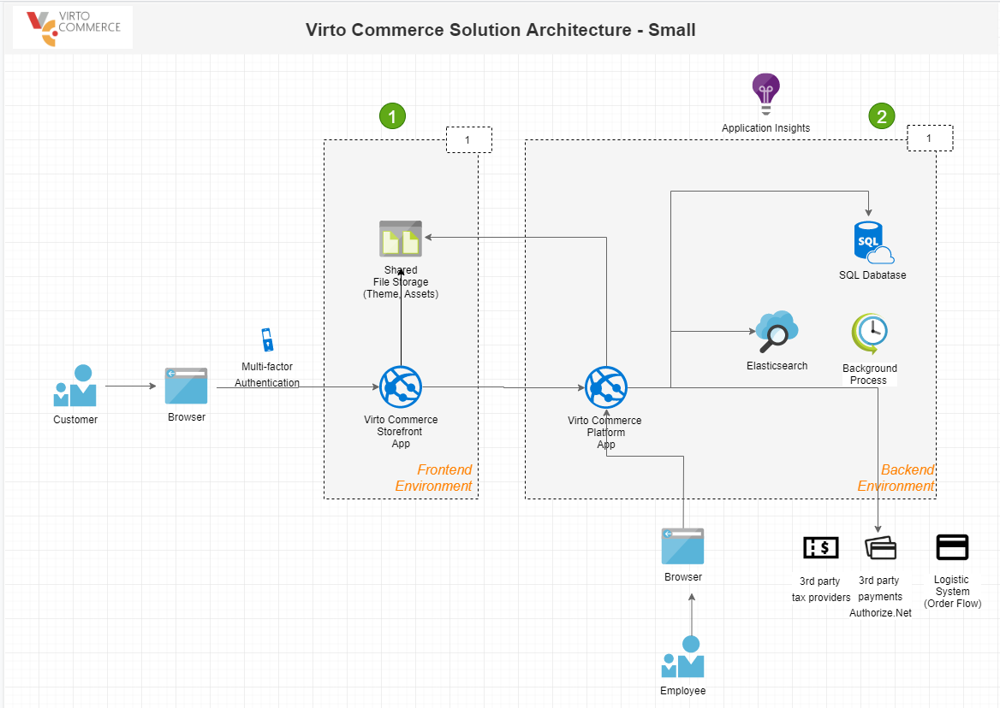
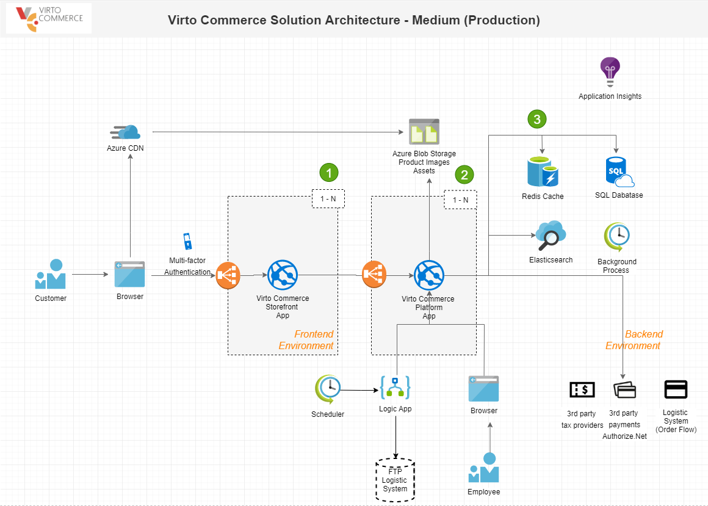
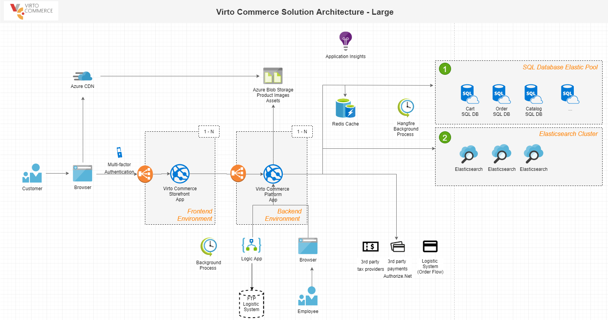
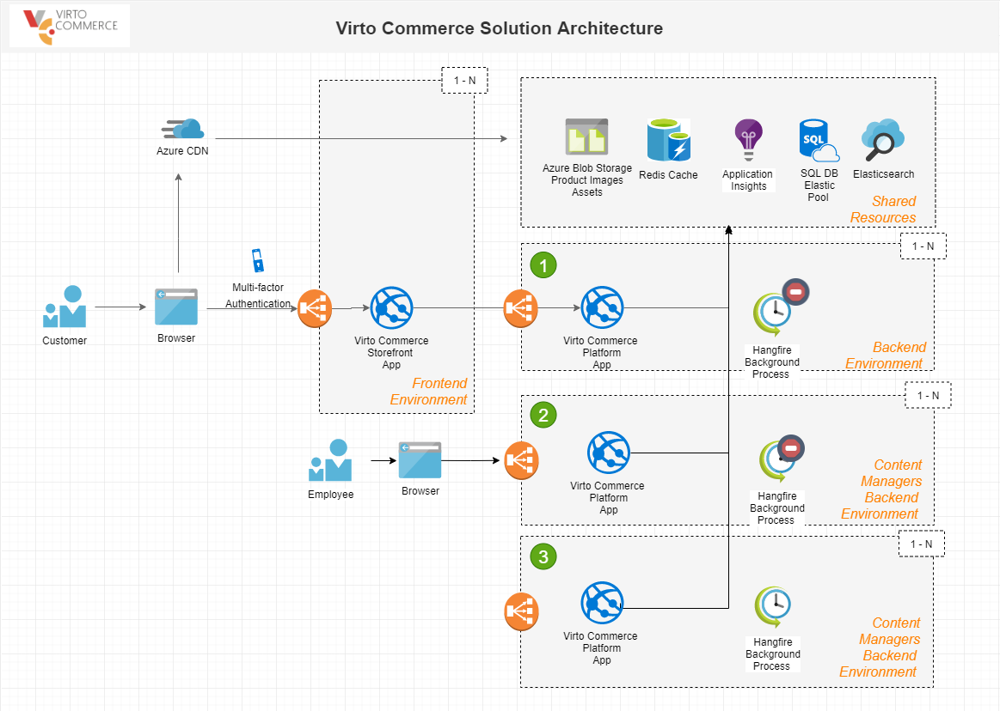

# Scalability

## Overview

Virto Commerce is a scalable e-commerce solution and designed to build large and complex digital commerce solutions for B2B, B2C or B2B2C business, marketplaces and derived SaaS commerce platforms. 

This topic shows the scalability of Virto Commerce Solutions from Smal to Extra Large and helps you choose the right Azure services and price plans.  

## Scalability
This section describes how to scale solution based on Virto Commerce platform and Virto Commerce Storefront Kit.

### S: Small
The small environment is good for simple projects, proof of concept, etc.

 

Key elements:
1.	1x Storefront Instance
2.	1x Backend Instance

### M: Medium
Ready for production and scalability. You can go live with MVP.

 

Key elements:
1.	Multiple Storefront Instances
2.	Multiple Backend Instances
3.	Redis Cache as Distributed Cache Storage

### L: Large

Good for the complex solution and provides ability use benefits of modern Azure service and Virto Commerce.

 

Key elements:
1.	SQL Database Elastic Pool (Split modules by different DB: Cart, Order, Catalog, Customers, etc.)
2.	AzureSearch or Elasticsearch cluster

### XL: Extra Large

You can decrease resource utilization and cost by splitting admin by functional elements. Minimize performance degradations from different processes (Ex: Background Jobs to Storefront and Content Managers). 

**Note:** The environment is very close to multiple regions solutions and helps to achieve high availability and high performance. 

 

1.	VC backend environment for Storefront App (no Background Jobs)
2.	VC backend environment for Content Managers (no Background Jobs)
3.	VC backend environment for Background Jobs (focus on high CPU utilization)

## Sizing and Cost calculator

This section helps you to calculate the cost are required resources.

### Sizing Model

This data based on best practices and feedback from multiple custom e-commerce solutions. The actual result can depend on custom implementation, data and configuration.

|**Size**|**Frontend Requests/sec**|**Cart Changes peak/sec**|**Orders per day**|
| --- | --- | --- | --- |
|**S**|10|1|200|
|**M**|100|5|1500|
|**L**|300|50|15000|
|**XL**||||

|**Size**|**Azure Web Site Price Plane**|**Frontend Azure Web Site Instance Count**|**Backend Azure Web Site Instance Count**|**Azure SQL Price Plane**|**Azure SQL Count**|**Azure Virtual Machine (Elastic Search)**|**ES Cluster**|
| --- | --- | --- | --- | --- | --- | --- | --- |
|**S**|**S2**|**1**|**1**|**S2**|**50 DTU**|**A2**|**No**|
|**M**|**S2**|**2**|**2**|**S3**|**100 DTU**|**A3**|**Yes**|
|**L**|**S3**|**3**|**5**|**P1**|**Several DB /Elastic Pool**|**A4**|**Yes**|
|**XL**|**?**|**?**|**?**|**P2**|**Several DB /Elastic Pool**|**A4**|**Yes**|

## Azure Price Calculator

You configure and estimate the costs for Azure products in [Azure Price Calculator](https://azure.microsoft.com/en-us/pricing/calculator/).

