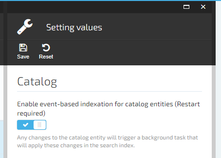

# Search

## Overview
The Catalog Search is a primary tool for customer interaction — and customers expect high-level relevance, suggestions, multiple languages, faceting, and near-instantaneous responses.

Although, the master data is stored in transaction storage (MS SQL), Virto Commerce uses Full-text search engines as a primary source for the search.

Virto Commerce Search architecture is focused to isolate the search engine from documents and provide abilities to add new types of documents. An  **index**  is a persistent store of  **documents**  and other constructs used for filtered and full-text search on a Virto Commerce Search service. Conceptually, a document is a single unit of searchable data in your index.

The Catalog Search has been built above Virto Commerce Search - generic full-text search.

 


### Key Features
1. Document-based full-text search and text analysis for Products and Categories.
1. Search by keyword, filters, aggregations and geo-search.
1. Supports multiple search engines: **Elasticsearch / Elastic Cloud**, **Azure Search** and **Lucence - for local development only**.
1. Functionality, which implements the inherent complexity of information retrieval is exposed through REST API or .NET SDK.
1. The search logic is extendable and customizable by third-party modules. 

### Analysis
*Analysis*  is the process of converting text, like the body of any email, into  *tokens*  or  *terms*  which are added to the inverted index for searching. Analysis is performed by an *analyzer*.

 

#### Index Time Analysis
If the field is searchable, this means the value will undergo analysis during indexing.

Virto Commerce Elasticsearch and Azure Search providers support `Edge NGram (default)` or `NGram` analyzer. Both providers use `Standart` Tokenizer and `LowerCase` filter.

For instance, at index time the built-in `custom_edge_ngram analyzer (min:3,max:5)`  will first convert the sentence:
```
"QUICK fox"
```

In the end, the following terms will be added to the index:
```
[ qui, quic, quick, fox]
```

#### Search Time Analysis
This same analysis process is applied to the query (Keyword) string at search time to convert the text in the query string into terms of the same form as those that are stored in the inverted index. 

Then search engine matches the terms from the document with terms from the query string to search the documents.

#### Standard Tokenizer 
The  `standard`  tokenizer provides grammar based tokenization (based on the Unicode Text Segmentation algorithm, as specified in Unicode Standard Annex and works well for most languages.

Input
```
"The 2 QUICK Brown-Foxes jumped over the lazy dog's bone."
```

Output
```
[ The, 2, QUICK, Brown, Foxes, jumped, over, the, lazy, dog's, bone ]
```

#### NGram Tokenizer 
The  `ngram`  tokenizer treats the initial text as a single token and produces N-grams with minimum length  `1`  and maximum length  `2` :

```
"QUICK fox"
```

In the end, the following terms will be added to the index:
```
[ q, qu, u, ui, i, ic, c, ck, k, f, fo, o, ox, x]
```

#### Edge NGram Tokenizer  (default) 
The  `edge_ngram`  tokenizer first breaks the text down into words whenever it encounters one of a list of specified characters, then it emits **NGrams** of each word where the start of the N-gram is anchored to the beginning of the word.

The  `edge_ngram`  tokenizer treats the initial text as a single token and produces N-grams with minimum length  `1`  and maximum length  `2` :

```
"QUICK fox"
```

In the end, the following terms will be added to the index:
```
[ q, qu, f, fo]
```

Edge N-Grams are useful for  *search-as-you-type*  queries.

When you need  *search-as-you-type*  for text which has a widely known order, such as movie or song titles, the completion suggester is a much more efficient choice than edge N-grams. Edge N-grams have the advantage when trying to autocomplete words that can appear in any order.

### Document Types
Catalog Search defines a schema for two documents: 
1. Product 
1. Category

### Scenarios 
To have full integration, Catalog Search implements all search scenarios:
1. Indexation 
1. Change Tracking
1. Search

For example, the implementation of catalog search can be used as the knowledge base on how to extend your custom module with the full-text search.

### Product Document Schema
When you build index first time,  Virto Commerce Search creates structures based on the schema you provide in a document. For example, if a field in your index is marked as searchable, it creates for that field. Later, when you submit search queries to Virto Commerce Search, you are sending requests to a specific index in your search service.

If you add a new property, Virto Commerce Search will extend the schema.

If you change a property type, complete **Delete + Build** can be required.

#### Field Types
* IsSearchable - a value indicating whether the field is full-text searchable. This means it will undergo analysis during indexing. If you set a searchable field to value like "sunny day", internally it will be split into the list of tokens ["sunny", "day", ...]. If you don't set a searchable field to value like "sunny day", internally it will be kept as "sunny day".  (**Note:** Only **__content** property is searchable by default). 
* IsRetrievable - value indicating whether the field can be returned in a search result.
* IsFilterable - value indicating whether to enable the field to be referenced in filter queries. filterable differs from searchable in how strings are handled.
* IsCollection - value indicating that this property contains a collection of values.

#### Product Document Schema
| Name  | IsSearchable   |  IsRetrievable  | IsFilterable | IsCollection | Example | Description |
|---|---|---|---|---|---|---|
|__content|true|true|true|true|---|Collection of text data which used for full-text search. Mapped with Code, Name, Property Values|
|__type|---|true|true|true|---|Type of the product class. Mapped with product.GetType().Name|
|__object|---|true|---|---|---|Store serialized catalog objects in the index and return them in search results. If **Store serialized catalog objects in the index** settings is true (Default: false) |
|__sort|---|true|true|---|---|product.Name|
|is|---|true|true|true|---|Collection of attributes: hidden,visible, product, variation, product.Code |
|status|---|true|true|---|---|Enum: hidden or visible. Mapped with product.IsActive.|
|code|---|true|true|true|---|Mapped with product.Code|
|name|---|true|true|---|---|Mapped with product.Name|
|startdate|---|true|true|---|---|Mapped with product.StartDate|
|enddate|---|true|true|---|---|Mapped with product.EndDate|
|createddate|---|true|true|---|---|Mapped with product.CreatedDate|
|lastmodifieddate|---|true|true|---|---|Mapped with product.ModifiedDate|
|modifieddate|---|true|true|---|---|Mapped with product.ModifiedDate|
|priority|---|true|true|---|---|Mapped with product.Priority|
|vendor|---|true|true|---|---|Mapped with product.Vendor|
|productType|---|true|true|---|---|Mapped with product.ProductType|
|mainProductId|---|true|true|---|---|Mapped with product.MainProductId|
|$"priority_{link.CatalogId}_{link.CategoryId}"|---|true|true|true|---|Dynamic properties which mapped with collection of Id from product.Links|
|catalog|---|true|true|true|---|Mapped with collection of Id from product.Outlines|
|__outline|---|true|true|true|---|Mapped with collection of product.Outlines|
|**{catalogPropertyName}[0..N]**|---|true|true|true *|---|List of the properties based on collection of catalog.Properties. **IsCollection** is true for Dictionaries.|
|**{categoryPropertyName}[0..N]**|---|true|true|true *|---|List of the properties based on collection of category.Properties, category.Propertis, product.Properties and variation.Properties. **IsCollection** is true for Dictionaries.|
|**{variationPropertyName}[0..N]**|---|true|true|true *|---|List of the properties based on collection of variation.Properties. **IsCollection** is true for Dictionaries.|
|**{productPropertyName}[0..N]**|---|true|true|true *|---|Dynamic properties based on collection of catalog.Properties, category.Propertis, product.Properties and variation.Properties. **IsCollection** is true for Dictionaries.|
|$"priority_{link.CatalogId}_{link.CategoryId}"|---|true|true|true|---|Dynamic properties which mapped with collection of Id from product.Links|
|price|---|true|true|true|---|**Price module extension.** Collection of all product price|
|$"price_{pricelist.Currency}|---|true|true|true|---|**Price module extension.** Collection of all product price in specific currency.|
|$"pirce_{pricelist.Currency}_{pricelist.Currency}|---|true|true|true|---|**Price module extension.** Collection of all product price in specific currency and specific price list.|

[You can look on the latest mapping from CatalogProduct to IndexDocument here](https://github.com/VirtoCommerce/vc-module-catalog/blob/dev/VirtoCommerce.CatalogModule.Data/Search/Indexing/ProductDocumentBuilder.cs#L46)

### Product Indexation Process
When you add or change a product, Virto Commerce Search creates structures based on the schema you provide. For example, if the field in your index is marked as searchable, an inverted index is created for that field. Later, when you submit search queries to Virto Commerce Search, you are sending requests to a specific index in your search service.

You can initiate the indexation process manually.
1. Go to **Search Index** 
1. Select the required document type
1. Then click **Build** button to start the indexation process
   * Build - index for all data without recreating.
   * Delete + Build - Current search index will be deleted and built from scratch. 
1. Control indexation process. It can take time. It depends on the count of the entities.  

 

#### Product ReIndexation Process
Each trigger type has a different interface and inputs that define the trigger's behavior.
* **By Event** - When you change the product. 
* **By Timer** - The background job check and re-index modified objects every N-minutes (5 minutes by default). Disabled by default.
* **Manually** - Can be triggered in **Admin UI** > **Product** > **Search widget** > **Build Index** button  or Rest API.

You can change behaviour in settings (**Settings** > **Catalog** >**Search** ).

 

### View Index Document
You can preview Index Document
1. Open **Product** blade 
1. Click **Search Index** widget
 
1. See **Index Document** in Json format
 

### Aggregations and Filters
Virto Commerce Search supports aggregations and filters, which used to display filter panel with Brands, Colors, Size, etc. Aggregation also returns the count of the products. 

 

The properties which are available for aggregations are configured on **Store** level. 

1. Go to **Stores** 
1. Select Store 
1. Click **Aggregation properties**
1. Pick **Catalog properties** eligible for filtering in this Store

 

Here you can configure additional properties, like:
* Aggregation type - Attribute or Rage.
* Aggregation size - Maximum number of aggregation values in search results. 0 = unlimited. 
* Allowed values - Enter aggregation values allowed in search results. Leave empty to allow any value.

### Search Process 
In Catalog Search, search criteria is a full specification of a round-trip operation. Parameters on the request provide match criteria for finding documents in an index, which fields to include or exclude (Response Groups), execution instructions passed to the engine, and directives for shaping the response. `searchPhrase=*` query runs against all searchable fields as a full-text search operation. 

 

1. **The client** calls **Rest API call** `api/catalog/search/products` endpoint.
1. **Api Controller** calls  **IProductSearchService.SearchAsync**. [ProductSearchService](https://github.com/VirtoCommerce/vc-module-catalog/blob/master/VirtoCommerce.CatalogModule.Data/Search/ProductSearchService.cs) is default implementation of IProductSearchService.
1. **ProductSearchService** creates **SearchRequest** and populates **Search Criterias**, **Filters** and **Aggregations**. 
    * **Aggregations** are loaded from **Selected Store**.
    * **SearchFields** is **__content**
    * Filters and other properties are loaded from ProductSearchCriteria
    * You can use **RawQuery** to send the direct query to the Search Provider.
1. ProductSearchService calls **ISearchProvider.SearchAsync** method. 
1. ProductSearchService converts IndexDocument and Aggregations to CatalogProduct.
   * If **Store serialized catalog objects in the index** is **true**, Products are loaded from the **IndexDocument**, __object property. 
   * If **Store serialized catalog objects in the index** is **false** (default), Products are loaded from **IItemService.GetByIds**.

    ``` csharp
        public virtual async Task<SearchRequest> BuildRequestAsync(SearchCriteriaBase criteria)
        {
            SearchRequest request = null;

            var productSearchCriteria = criteria as ProductIndexedSearchCriteria;
            if (productSearchCriteria != null)
            {
                // Getting filters modifies search phrase
                var allFilters = await GetAllFiltersAsync(productSearchCriteria);

                request = new SearchRequest
                {
                    SearchKeywords = productSearchCriteria.Keyword,
                    SearchFields = new[] { "__content" },
                    Filter = GetFilters(allFilters).And(),
                    Sorting = GetSorting(productSearchCriteria),
                    Skip = criteria.Skip,
                    Take = criteria.Take,
                    Aggregations = _aggregationConverter == null ? null : await _aggregationConverter.GetAggregationRequestsAsync(productSearchCriteria, allFilters),
                    IsFuzzySearch = productSearchCriteria.IsFuzzySearch,
                    //RawQuery = productSearchCriteria.RawQuery
                };
            }

            return request;
        }
    ```
    [Go to source](https://github.com/VirtoCommerce/vc-module-catalog/blob/master/src/VirtoCommerce.CatalogModule.Data/Search/Indexing/ProductSearchRequestBuilder.cs#L25-L50)

### Search Process by Storefront Kit
[Virto Commerce Storefront Kit](https://github.com/VirtoCommerce/vc-storefront-core) is one of the clients and [CatalogSearchController::CategoryBrowsing](https://github.com/VirtoCommerce/vc-storefront-core/blob/master/VirtoCommerce.Storefront/Controllers/CatalogSearchController.cs#L45) can be a good example of using Search API. 

The Storefront Kit uses several steps to initialize catalog search criteria before call Rest API:

1. **Current Language**, **Current Currency**, **Current Store Id**, **Current Store Catalog** and **Current Outline** from the **WorkContext**. [Go to Source](https://github.com/VirtoCommerce/vc-storefront-core/blob/master/VirtoCommerce.Storefront/Domain/Catalog/CatalogWorkContextBuilderExtensions.cs#L20).
1. **List of the properties** from **Query String**. [Go to Source](https://github.com/VirtoCommerce/vc-storefront-core/blob/master/VirtoCommerce.Storefront.Model/Catalog/ProductSearchCriteria.cs#L90).
1. **UserGroups** from **Contact.UserGroup** to limit the visibility of the products by User Groups and support personalization.
1. **Pricelists** from **WorkContext.CurrentPricelists** to support price personalization. [Go to Source](https://github.com/VirtoCommerce/vc-storefront-core/blob/master/VirtoCommerce.Storefront/Domain/Catalog/CatalogConverter.cs#L157)

| Property Name  | Query String Key | Description |
|---|---|---|
| PageNumber  | page | Index of the page. From 1 to N. Default: 1 |
| PageSize | page_size or count | Size of the page for pagination. Default: 20 |
| IsFuzzySearch | page | Enable of using Fuzzy Search. Default: true |
| Keyword | q | Default: Empty |
| SortBy | sort_by | Order the result set of a query by the specified column. Example: **title-ascending**, **price-descending**, etc. |
| ResponseGroup| resp_group| Name of the response group to limit data in the result set. Default: ItemResponseGroup.ItemMedium \| ItemResponseGroup.ItemWithPrices \| ItemResponseGroup.ItemWithVendor \| ItemResponseGroup.ItemAssociations |
| Terms | terms| List of the term to filter the result set. Example: **Color:Black,Bronze** or **Brand:Asus;Color:Black,Bronze** |

### Response Group​
The rendering of the search page might be loading too slowly because of all the  **bulky data**  that have. Only the required information in each particular situation should be loaded.

You can control this by [ItemResponseGroup](https://github.com/VirtoCommerce/vc-module-core/blob/master/VirtoCommerce.Domain/Catalog/Model/ItemResponseGroup.cs).

| Enum Name | Enum Value | Description |
|---|---|---|
| ItemInfo |  1| Only simple product information and properties without meta information|
| ItemAssets |  2| With images and assets|
| ItemProperties |  4| With properties meta information |
| ItemAssociations |  8|  With product associations |
| ItemEditorialReviews |  16| With descriptions |
| Variations |  32| With all product variations |
| Seo |  64| With product SEO information |
| ItemSmall |  83| ItemInfo \| ItemAssets \| ItemEditorialReviews \| Seo |
| Links |  128| With outgoing product links to virtual catalog or categories |
| Inventory |  256| With product inventory information |
| Outlines |  512| With category outlines|
| ReferencedAssociations |  1024| With product referenced associations |
| ItemMedium |  1119| ItemSmall \| ItemAssociations \| ReferencedAssociations \| ItemProperties|
| ItemLarge |  2047 |ItemMedium \| Variations \| Links \| Inventory \| Outline|

#### Return 10 products with Only simple product information:
[Try API on Our Demo Site](https://admin-demo.virtocommerce.com/docs/index.html?urls.primaryName=VirtoCommerce.Catalog)

**Request:**
```
{
"storeId": "Electronics",
"catalogId": "4974648a41df4e6ea67ef2ad76d7bbd4",
"skip": 0,
"take": 10,
"responseGroup": "ItemSmall"
}
```

### Search by Keyword
`searchPhrase` property provides the match criteria, usually text. For example: Search products by 'Home' keyword

The following example is a representative query constructed in the Storefront and [REST API] to search for products by 'Home' keyword.  
```
"searchPhrase": "Home",
```

**Storefront UI:**
https://demo.virtocommerce.com/en-US/search?type=product&q=Home

 

[Try API on Our Demo Site](
https://admin-demo.virtocommerce.com/docs/index.html?urls.primaryName=VirtoCommerce.Catalog)

**Request:**
```
{
"searchPhrase": "Home",
"storeId": "Electronics",
"catalogId": "4974648a41df4e6ea67ef2ad76d7bbd4",
"skip": 0,
"take": 10,
"responseGroup": "ItemInfo",
}
```

**Response:**
```
{
  "totalCount": 5,
  "items": [
    {
      "code": "ONHTS3700",
      "name": "Onkyo HT-S3700 5.1-Channel Network Home Theater System",
      "catalogId": "4974648a41df4e6ea67ef2ad76d7bbd4",
      "categoryId": "b1c093973bb24179bf130886b0477a18",
      "outline": "b1c093973bb24179bf130886b0477a18",
      "path": "Home Theater",
      "isBuyable": true,
      "isActive": true,
      "trackInventory": true,
      "maxQuantity": 0,
      "minQuantity": 1,
      "productType": "Physical",
      "priority": 0,
      "startDate": "2015-08-14T09:52:31.953Z",
...
```

### Filter by​ Terms
Terms property allows returning documents that contain an **exact**  term in a provided field. 

The following examples is a representative query constructed in the [REST API] to 

search for products by `Sony` brand:
```
"terms": ["Brand:Sony"],
```  

search for products by `Sony` **OR** `Panasonic` brands:
```
"terms": ["Brand:Sony,Panasonics"],
```  

search for products by `Sony` brand **AND** `Wi-Fi` features:
```
"terms": ["Brand:Sony", "Features:Wi-Fi"],
```  

**Storefront UI:**
https://demo.virtocommerce.com/search?terms=Brand%3aSony

 

[Try API on Our Demo Site](https://admin-demo.virtocommerce.com/docs/index.html?urls.primaryName=VirtoCommerce.Catalog)

**Request:**
```
{
"terms": ["Brand:Sony"],
"storeId": "Electronics",
"catalogId": "4974648a41df4e6ea67ef2ad76d7bbd4",
"skip": 0,
"take": 10,
"responseGroup": "ItemInfo"
}
```

**Response:**
```
{
  "totalCount": 5,
  "items": [
    {
      "code": "SOHDRPJ540B",
      "name": "Sony 32GB HDR-PJ540 Full HD Handycam Camcorder with Built-in Projector",
      "catalogId": "4974648a41df4e6ea67ef2ad76d7bbd4",
      "categoryId": "53e239451c844442a3b2fe9aa82d95c8",
      "outline": "45d3fc9a913d4610a5c7d0470558c4b2/53e239451c844442a3b2fe9aa82d95c8",
      "path": "Camcorders/Consumer camcorders",
      "isBuyable": true,
      "isActive": true,
      "trackInventory": true,
      "maxQuantity": 0,
      "minQuantity": 1,
      "productType": "Physical",
...
```


### Filter by​ Price
Virto Commerce Catalog supports several price filters: `Pricelists`, `PriceRange` and `Currency`.
 
1. `Pricelists` collections allows returning documents that contain the price in **exact**  pricelist. Storefront Kit uses it for price personalization, when available pricelists are evaluating for a customer.
1. `PriceRange` structure allows returning documents that contain the price in specific range. Can be used as price filter. For example: Returns products with Price less than 25$.
1. `Currency` property defines price currency for PriceRange filters 

The following examples is a representative query constructed in the [REST API] to 

search for products with price in ElectronicUSD pricelist with Id =   `934da94516a74f9ab4ec001343ac928a`:
```
"pricelists": ["934da94516a74f9ab4ec001343ac928a"],
```  

search for products with price betweeb 100$ and 200$:
```
"currency": "USD",
"priceRange": {  
         "lower": 100,
         "upper": 200,
         "includeLower": false,
         "includeUpper": true
},
```  

**Storefront UI:**
https://demo.virtocommerce.com/search?terms=price%3a100-200

 

[Try API on Our Demo Site](https://admin-demo.virtocommerce.com/docs/index.html?urls.primaryName=VirtoCommerce.Catalog)

**Request:**
```
{
"currency": "USD",
"priceRange": {  
         "lower": 100,
         "upper": 200,
         "includeLower": false,
         "includeUpper": true
},
"pricelists": ["934da94516a74f9ab4ec001343ac928a"],
"storeId": "Electronics",
"catalogId": "4974648a41df4e6ea67ef2ad76d7bbd4",
"skip": 0,
"take": 10,
"responseGroup": "ItemInfo"
}
```

**Response:**
```
{
  "totalCount": 3,
  "items": [
    {
      "code": "BLX150QWHT",
      "name": "BLU Win HD LTE X150Q 8GB",
      "catalogId": "4974648a41df4e6ea67ef2ad76d7bbd4",
      "categoryId": "0d4ad9bab9184d69a6e586effdf9c2ea",
      "outline": "0d4ad9bab9184d69a6e586effdf9c2ea",
      "path": "Cell phones",
      "isBuyable": true,
      "isActive": true,
      "trackInventory": true,
      "maxQuantity": 0,
      "minQuantity": 1,
...
```


### Filter by Category
Outline and Outlines properties allow returning documents that relaited one or multiple categories in provided fields. 

The following examples is a representative query constructed in the [REST API] to 

search for products by `cell-phones` category (Category Id: '0d4ad9bab9184d69a6e586effdf9c2ea'):
```
"outline": "0d4ad9bab9184d69a6e586effdf9c2ea",
```  

search for products in `Cell Phones` and `Televisions` categories (Category Id: '0d4ad9bab9184d69a6e586effdf9c2ea', 'c76774f9047d4f18a916b38681c50557'):
```
"outlines": ["0d4ad9bab9184d69a6e586effdf9c2ea","c76774f9047d4f18a916b38681c50557"],
```  

**Storefront UI:**
https://demo.virtocommerce.com/en-US/cell-phones

 

[Try API on Our Demo Site](https://admin-demo.virtocommerce.com/docs/index.html?urls.primaryName=VirtoCommerce.Catalog)

**Request:**
```
{
"outlines": ["0d4ad9bab9184d69a6e586effdf9c2ea"],
"storeId": "Electronics",
"catalogId": "4974648a41df4e6ea67ef2ad76d7bbd4",
"skip": 0,
"take": 10,
"responseGroup": "ItemInfo"
}
```

**Response:**
```
{
  "totalCount": 6,
  "items": [
    {
      "code": "ASZF216GBSL",
      "name": "ASUS ZenFone 2 ZE551ML 16GB Smartphone",
      "catalogId": "4974648a41df4e6ea67ef2ad76d7bbd4",
      "categoryId": "0d4ad9bab9184d69a6e586effdf9c2ea",
      "outline": "0d4ad9bab9184d69a6e586effdf9c2ea",
      "path": "Cell phones",
      "isBuyable": true,
      "isActive": true,
      "trackInventory": true,
      "maxQuantity": 0,
      "minQuantity": 1,
      "productType": "Physical",
...
```

### Geo-search​ - Sort by distance and Filter by radius.
**Notes:** 
1. Only Elasticsearch and Azure Search support Geo-point data-type.'
2. Sort by distance and Filter by radius works with Geo-point properties, only.

GeoDistanceFilter property allows returning documents that include only hits that exists within a specific distance from a geo point. 

The following examples is a representative query constructed in the [REST API] to 

search for products which are located less than 10 km from (40, -70) :
```
"geoDistanceFilter":	{
   "fieldName": "GeoPosition"
   "location": {
      "latitude": 40,
      "longitude": -70
    },
"distance": 10
}
```  

sort products based on distance from from (40, -70):
```
"sort": "GeoPosition(40,-70):asc"
```
 
### Sorting & Paging​
When receiving results for a search query, you can request that Virto Commerce Catalog Search serves the results ordered by values in a specific field. 

By default, Search orders the search results based on the rank of each document's search score. If you want to return your results ordered by a value other than the search score, you can use the  **`sort`**  search parameter. 

Each expression can be followed by  **`asc`**  to indicate that results are requested in ascending order, and  **`desc`**  to indicate that results are requested in descending order. The default ranking ascending order.

sort by Priority field in ascending order
```
"sort": "Priority"
```

sort by Priority field in descending order
```
"sort": "Priority:desc"
```

sort products based on distance from from (40, -70):
```
"sort": "GeoPosition(40,-70):asc"
```

Virto Commerce Catalog Search takes it easy to implement paging of search results. By using the  **`take`**  and  **`skip`**  parameters, you can smoothly issue search requests that allow you to receive the total set of search results in manageable, ordered subsets that easily enable good search UI practices. When receiving these smaller subsets of results, you can also receive the count of documents in the total set of search results.

**Request:**
```
{
"skip": 150,
"take": 50
}
```

**Response:**
```
{
  "totalCount": 1200,
  "items": [
   ...
```

### Aggregations​ - with a count of products for every value
By default, the response contains collections of aggregations which help to build filter panel.  

List of the properties which are visible for aggregations is configured on Store level.

You can include or exclude aggregation fields manually by using `includeAggregations` or `excludeAggregations` properties. Both properties can contain collection of property names.

If  `includeAggregations` is empty collection, the collection of `aggregations` in response will be empty.

https://github.com/VirtoCommerce/vc-platform-core/blob/master/Modules/vc-module-catalog/VirtoCommerce.CatalogModule.Data/Search/BrowseFilters/BrowseFilterService.cs#L45

**Request:**
```
{
"outlines": ["0d4ad9bab9184d69a6e586effdf9c2ea"],
"storeId": "Electronics",
"catalogId": "4974648a41df4e6ea67ef2ad76d7bbd4",
"skip": 0,
"take": 10,
"responseGroup": "ItemInfo"
}
```

**Response:**
```
...
  "aggregations": [
    {
      "aggregationType": "attr",
      "field": "Brand",
      "labels": [
        {
          "language": "de-DE",
          "label": "Marke"
        },
        {
          "language": "en-US",
          "label": "Brand"
        }
      ],
      "items": [
        {
          "value": "Asus",
          "count": 2,
          "isApplied": false,
          "labels": [
            {
              "language": "en-US",
              "label": "Asus"
            }
          ]
        },
        {
          "value": "BLU",
          "count": 1,
          "isApplied": false,
          "labels": [
            {
              "language": "en-US",
              "label": "BLU"
            }
          ]
        },
        {
          "value": "Microsoft",
          "count": 1,
          "isApplied": false,
          "labels": [
            {
              "language": "en-US",
              "label": "Microsoft"
            }
          ]
        },
        {
          "value": "Samsung",
          "count": 2,
          "isApplied": false,
          "labels": [
            {
              "language": "en-US",
              "label": "Samsung"
            }
          ]
        }
      ]
    },
    {
      "aggregationType": "attr",
      "field": "Color",
      "labels": [
        {
          "language": "de-DE",
          "label": "Farber"
        },
        {
          "language": "en-US",
          "label": "Color"
        }
...
```

## Samples
* [DemoSearchApiController  added to demonstrate and test various search aspects, tips and best practices.](https://github.com/VirtoCommerce/vc-storefront-core-samples/tree/vc-samples-DemoSearchModule)
* [How to extend default product indexing and indexed search](https://github.com/VirtoCommerce/vc-samples/tree/master/DemoSearchModule)

## References  
* [Search Engine Architecture Details](https://github.com/VirtoCommerce/vc-module-catalog/blob/dev/docs/search-engine-architecture-details.md)
* [Catalog Search](https://github.com/VirtoCommerce/vc-module-catalog/blob/dev/docs/catalog-search.md)
* [Elastic Search Provider](https://github.com/VirtoCommerce/vc-module-elastic-search)
* [Azure Search Provider](https://github.com/VirtoCommerce/vc-module-azure-search)
* [Lucene Search Provider](https://github.com/VirtoCommerce/vc-module-lucene-search) - is recommended for development purposes only, not for production usage.
* [Search Provider Tests](https://github.com/VirtoCommerce/vc-module-core/blob/dev/VirtoCommerce.CoreModule.Search.Tests/SearchProviderTests.cs)
* [Product Indexing](https://github.com/VirtoCommerce/vc-module-catalog/blob/dev/docs/product-indexing.md)
* [Azure Cognitive Search](https://docs.microsoft.com/en-us/azure/search/)
* [Elasticsearch](https://www.elastic.co/guide/en/elasticsearch/reference/current/elasticsearch-intro.html#elasticsearch-intro)
